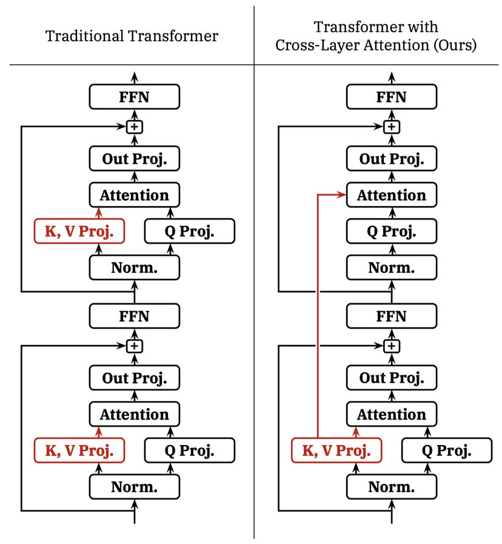

# Reducing Transformer Key-Value Cache Size with Cross-Layer Attention

## 一句话总结

本文提出 Cross-Layer Attention（CLA），通过在相邻层之间共享 Key-Value 激活来减少 Transformer 模型的 KV Cache 内存占用，在 1B 和 3B 参数规模下实现 2× KV Cache 缩减，同时仅带来极小的困惑度（Perplexity）下降。

---

## 摘要翻译

Key-Value（KV）缓存在加速基于 Transformer 的自回归大语言模型（LLM）的解码过程中扮演着至关重要的角色。然而，在长序列长度和大批量大小下，存储 KV 缓存所需的内存可能变得非常昂贵。自 Transformer 发明以来，减少 KV 缓存大小的两种最有效方法分别是 Multi-Query Attention（MQA）及其泛化形式 Grouped-Query Attention（GQA）。MQA 和 GQA 都通过修改注意力块的设计，使得多个查询头可以共享一个单一的 Key/Value 头，从而大幅减少不同 Key/Value 头的数量，同时仅带来极小的精度损失。在本文中，我们展示了可以通过在相邻层之间也共享 Key 和 Value 头来进一步推进 Multi-Query Attention，从而产生一种新的注意力设计，我们称之为 Cross-Layer Attention（CLA）。通过 CLA，我们发现可以在保持与未修改的 MQA 几乎相同精度的同时，将 KV 缓存的大小再减少 2×。在从零训练 1B 和 3B 参数模型的实验中，我们证明 CLA 在传统的 MQA 所能达到的内存/精度权衡上实现了 Pareto 改进，使得推理可以支持更长的序列长度和更大的批量大小。

---

## 研究动机

在大语言模型（LLM）推理服务中，KV 缓存的内存占用是一个关键瓶颈。KV 缓存的大小随序列长度和批量大小成比例增长，这导致在处理长序列时内存开销极大，限制了可支持的批量大小，甚至需要采用代价高昂的卸载（offloading）技术。此外，随着 LLM 应用不断涌现出对更长序列长度的需求，KV 缓存的内存足迹成为高效 Transformer 语言模型设计中日益重要的考量因素。

现有方法主要从以下几个维度降低 KV 缓存的内存占用：
1. **低精度存储**：将 KV 激活以低精度格式存储（如 KVQuant、Coupled Quantization）
2. **重要性驱逐**：在生成过程中仅保留重要的 KV 条目（如 H2O、Scissorhands、FastGen）
3. **注意力头共享**：在注意力机制中跨查询头共享 Key/Value（如 MQA、GQA）

本文提出了一个不同的维度：**跨层共享**，即在不同层之间共享 KV 激活，从而减少模型中唯一 KV 层的数量。这是一种全新的思路，与已有的方法正交，可以与 MQA/GQA 结合使用。

---

## 方法（技术细节）

### 基本原理

Cross-Layer Attention（CLA）的核心思想非常简洁：在 Transformer 的注意力机制中，不是每一层都独立计算自己的 Key 和 Value 激活，而是让某些层直接复用相邻层的 KV 激活。

具体来说：
- **CLA2**（共享因子为 2）：每对相邻层共享一个 KV 投影，即第 0 层和第 1 层共享 KV，第 2 层和第 3 层共享 KV，以此类推。
- **CLA3**（共享因子为 3）：每三个相邻层共享一个 KV 投影。
- 以此类推，CLA 可以定义任意共享因子。

### 与 MQA/GQA 的关系

CLA 与 MQA/GQA 是**正交**的，可以与任意一种结合使用：
- MQA：所有查询头共享一个 KV 头（每个层一个 KV）
- GQA：查询头分组，每组共享一个 KV 头
- CLA：在 MQA/GQA 的基础上，相邻层之间再共享 KV

这意味着 MQA + CLA2 的组合可以在 MQA 的基础上将 KV 缓存再减少 2×。

### 体系结构实现

- CLA 为有 KV 投影的层和无 KV 投影的层使用**独立可学习的 LayerNorm 参数**
- 没有 KV 投影的层直接复用前一层的 KV 激活
- 所有层的 Query 投影和 Output 投影保持独立

### 系统设计影响

| 指标 | 影响 |
|------|------|
| KV Cache 内存 | 大幅减少，降低因子等于共享因子 |
| 训练内存 | 减少中间 KV 激活张量，但通常占比较小 |
| 模型参数 | 略微减少（减少 KV 投影块的数量） |
| FLOPs | 略微减少 |
| 解码延迟 | 间接改善（支持更大的批量和更长的 KV 缓存持久化） |
| 核心注意力延迟 | 无直接改善（共享的 KV 仍需从内存分别读取） |
| 模型并行 | 完全兼容张量并行；流水线并行需将共享 KV 的层放在同一阶段 |

---

## 实验结果

### 实验设置

- **模型规模**：1B 和 3B 参数
- **数据集**：SlimPajama（使用 GPT-NeoX tokenizer，BPE 编码）
- **架构**：Llama 风格，预归一化，SwiGLU 激活，旋转位置编码（RoPE）
- **优化器**：AdamW（β₁=0.9, β₂=0.95, 权重衰减 0.1）
- **训练硬件**：NVIDIA H100 GPU，BF16 混合精度
- **序列长度**：2048 tokens，批量大小 2048
- **训练 token 数**：1B 模型 30B tokens，3B 模型 100B tokens

### 1B 参数规模结果

**设计空间探索**（LR = 3×10⁻⁴）：

| 模型 | d_head | KV 头数 | KV 层数 | KV 字节/token (16-bit) | 验证困惑度 |
|------|--------|---------|---------|----------------------|-----------|
| H128-MHA | 128 | 16 | 20 | 163,840 | 13.15 |
| H128-GQA4 | 128 | 4 | 20 | 40,960 | 13.36 |
| H128-MQA | 128 | 1 | 20 | 10,240 | 13.54 |
| H64-MQA | 64 | 1 | 20 | 5,120 | 13.81 |
| H32-MQA | 32 | 1 | 20 | 2,560 | 14.37 |
| **H128-MQA-CLA2** | 128 | 1 | **10** | **5,120** | **13.60** |
| H90-MQA-CLA2 | 90 | 1 | 10 | 3,600 | 13.73 |
| H64-MQA-CLA2 | 64 | 1 | 10 | 2,560 | 13.89 |

**关键发现**：
- MQA-CLA2 模型（d_head=128）仅需 5,120 字节/token，而 H64-MQA 同样需要 5,120 字节/token，但 CLA2 的困惑度低 0.21 个点
- MQA-CLA2（d_head=256, 512）可以匹配 H128-MQA/GQA2 的 KV 缓存大小，但困惑度更好
- **2× KV Cache 缩减，仅 0.06 个困惑度点的下降**

**学习率调优实验**（最优 LR）：
| 模型 | 最优 LR | 验证困惑度 | Wikitext 困惑度 |
|------|---------|-----------|----------------|
| H128-MQA | 1.5×10⁻³ | 12.39 | 19.30 |
| H128-MQA-CLA2 | 2.25×10⁻³ | 12.43 | 19.29 |
| H64-MQA | 2.25×10⁻³ | 12.74 | 20.00 |

CLA2 模型与 H128-MQA 基线相比仅差 0.04 个困惑度点（2× 更小的 KV 缓存），相比 H64-MQA 基线改善 0.31 个困惑度点（相同 KV 缓存大小）。

### 3B 参数规模结果

**第一组实验**（d_head=128）：
| 模型 | KV 字节/token | 最优 LR | 验证困惑度 | Wikitext 困惑度 |
|------|-------------|---------|-----------|----------------|
| H128-MQA | 16,384 | 6.75×10⁻⁴ | 9.52 | 13.63 |
| **H128-MQA-CLA2** | **8,192** | 2.25×10⁻³ | **9.34** | **13.25** |
| H64-MQA | 8,192 | 1.0×10⁻³ | 9.48 | 13.49 |

**惊喜发现**：在 3B 规模下，CLA2 模型的困惑度不仅没有下降，反而**优于**两个基线模型！这是因为在 3B 规模下，更大的 head dimension + CLA2 的组合带来了更好的表达能力。

**第二组实验**（d_head=64）：
| 模型 | KV 字节/token | 最优 LR | Wikitext 困惑度 |
|------|-------------|---------|----------------|
| H64-MQA | 8,192 | 1.0×10⁻³ | 12.94 |
| **H64-MQA-CLA2** | **4,096** | 1.0×10⁻³ | **12.99** |
| H32-MQA | 4,096 | 1.0×10⁻³ | 13.34 |

CLA2 与 H64-MQA 相比仅 0.05 个困惑度点的下降（2× 更小的 KV 缓存），比 H32-MQA 改善 0.35 个困惑度点（相同的 KV 缓存大小）。

### 下游任务评估

在 Hellaswag、PIQA、WinoGrande、SciQ、OpenBookQA、BoolQ、ARC-E 等基准测试中，三种模型（H128-MQA、H128-MQA-CLA2、H64-MQA）表现相近，差异在 1-5 个百分点以内，没有模型在所有任务上一致获胜或失败。

### 消融实验关键结论

1. **CLA2 > CLA3 > CLA4**：共享因子为 2 的效果最佳
2. **均匀共享 > 非均匀共享**：均匀的 CLA2 优于非均匀的共享模式（如 KeepEnds、DenseFront、DenseBack）
3. **MQA + CLA2** 效果最佳：CLA2 与 MQA 的组合在所有配置中实现了最优的精度/内存权衡
4. **CLA 模型受益于更高的学习率**：CLA 模型的最优学习率通常比非 CLA 基线高 1.5×。

---

## 优势

1. **大幅减少 KV Cache 内存**：通过跨层共享 KV 激活，实现 2× 的 KV 缓存缩减，可扩展到更长的序列和更大的批量
2. **极小的精度损失**：在 1B 规模下仅 0.04-0.06 个困惑度点的下降，在 3B 规模下甚至有所改善
3. **方法简洁优雅**：只需将相邻层的 KV 激活共享，实现简单，易于集成到现有模型架构中
4. **正交于 MQA/GQA/MHA**：可以与任何现有的注意力机制结合使用，不引入额外的依赖
5. **减少参数量和计算量**：由于减少了 KV 投影块的数量，模型参数量和 FLOPs 略有减少
6. **兼容模型并行**：完全兼容张量并行（Tensor Parallelism），对流水线并行有明确的指导
7. **跨规模一致性**：在 1B 和 3B 参数规模下均表现出色，效果一致
8. **无需额外超参数**：只需选择共享因子（推荐 CLA2），不引入复杂的训练超参数

---

## 局限

1. **缺乏端到端推理效率评估**：论文未对长序列和大批量下的实际推理吞吐量和延迟进行评估，这是一个重要的实际部署考量
2. **核心注意力延迟无改善**：CLA 不改变注意力机制的内存带宽消耗，因为共享的 KV 缓存仍需在每个注意力层分别从主内存读取
3. **仅在较小规模验证**：实验仅在 1B 和 3B 参数规模进行，更大规模（如 7B、13B、70B）的效果尚不明确
4. **共享因子 > 2 效果较差**：CLA3 和 CLA4 虽仍优于纯 MQA，但比 CLA2 效果差，说明过度共享会降低精度
5. **非均匀共享效果不佳**：非均匀的共享模式（如集中共享在前/后层）表现更差，限制了设计灵活性
6. **未与 KV Cache 压缩方法组合**：论文未探讨 CLA 与量化（如 KVQuant）或重要性驱逐（如 H2O）等方法的组合效果
7. **学习率调优的额外成本**：CLA 模型可能需要与非 CLA 模型不同的学习率调优策略
8. **依赖于模型规模和架构**：效果可能因具体的模型架构和训练配置而异

---

## 与 EfficientPaper 相关的研究方向

1. **KV Cache 优化**：CLA 是 KV Cache 优化的一个重要方向，与 MQA/GQA/MLA 等方法互补，可进一步研究组合策略
2. **注意力机制设计**：CLA 属于结构设计（structure_design）范畴，与 DeepSeek-V2 的 Multi-Latent Attention、You Only Cache Once 等方法处于同一研究领域
3. **推理效率**：CLA 可以作为高效推理系统的一个组件，与 Flash Attention、FlexGen 等方法结合使用
4. **长序列建模**：CLA 的内存缩减特性使其在长上下文 LLM（如 Landmark Attention、Infini-Attention）中具有潜在应用
5. **模型压缩**：CLA 可与 KV Cache 量化、剪枝等压缩技术结合，实现更进一步的内存优化
6. **大规模预训练**：研究 CLA 在更大规模（如 7B+）模型中的效果，以及与其他高效架构（如 MoE）的交互
7. **持续学习与持久化 KV 缓存**：CLA 减少 KV 缓存大小的特性有利于持久化 KV 缓存的实现，如 AttentionStore 等应用

---

## AI 生成声明

本笔记由 AI Agent（Hermes Agent）基于论文 PDF 文本提取和元数据自动生成。笔记内容涵盖了论文的核心方法、实验结果和分析，但可能存在以下局限：
- 未能完全捕捉论文中所有细微的实验设计细节
- 对某些表格数据的解读可能需要人工校验
- 图表内容未完全纳入笔记

请以论文原文为权威来源。

---

> 论文链接：[arXiv:2405.12981v1](http://arxiv.org/abs/2405.12981v1)
> 代码仓库：[Cross-Layer-Attention](https://github.com/JerryYin777/Cross-Layer-Attention)
> 关键词：structure_design
> 作者：William Brandon, Mayank Mishra, Aniruddha Nrusimha, Rameswar Panda, Jonathan Ragan-Kelley
> 机构：MIT CSAIL, MIT-IBM Watson AI Lab
