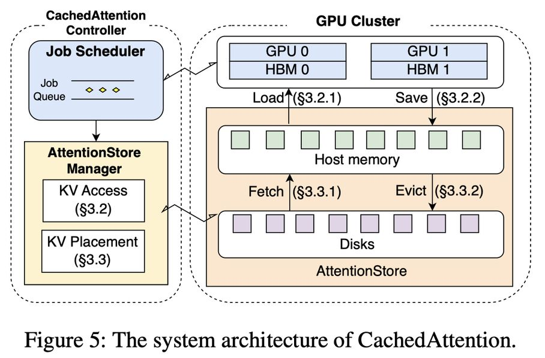

# Cost-Efficient Large Language Model Serving for Multi-turn Conversations with CachedAttention

## 一句话总结

CachedAttention 提出了一种新的注意力机制，通过在多轮对话间复用 KV 缓存，利用层次化存储（主机内存 + 磁盘）和重叠访问技术，将首 token 延迟降低最高 87%，预填充吞吐量提升最高 7.8 倍，端到端推理成本降低最高 70%。

---

## 摘要翻译

与人类进行多轮对话是大语言模型（LLM）的基本功能。然而，现有的 LLM 服务引擎在执行多轮对话时效率低下，因为需要反复计算历史 token 的键值（KV）缓存，导致高昂的服务成本。为解决此问题，本文提出了 CachedAttention，一种新的注意力机制，能够在多轮对话间复用 KV 缓存，显著降低重复计算开销。CachedAttention 维护了一个层次化 KV 缓存系统，利用经济高效的内存/存储介质保存所有请求的 KV 缓存。为减少来自慢速介质的 KV 缓存访问开销，CachedAttention 采用了逐层预加载和异步保存方案，将 KV 缓存访问与 GPU 计算重叠执行。为确保要访问的 KV 缓存位于最快的层次，CachedAttention 采用了调度器感知的获取和驱逐方案，根据推理作业调度器的提示，有意识地将 KV 缓存放置在不同层次中。为避免因上下文窗口溢出导致已保存的 KV 缓存失效，CachedAttention 通过解耦位置编码并有效截断 KV 缓存，使已保存的 KV 缓存保持有效。大量实验结果表明，CachedAttention 将首 token 延迟（TTFT）降低了最高 87%，将多轮对话的提示预填充吞吐量提高了最高 7.8 倍，并将端到端推理成本降低了最高 70%。

---

## 研究动机

### 背景问题

1. **多轮对话的普遍性**：基于 ShareGPT 数据集（从 ChatGPT 收集的超过 90K 条对话）的分析表明，73% 的对话涉及多轮交互，30% 的对话会话超过 4K token。这表明多轮对话是 LLM 应用的核心场景。

2. **KV 缓存的重复计算问题**：在当前的 LLM 服务引擎中，当一个对话会话变为非活跃状态时，GPU 高带宽内存（HBM）中存储的 KV 缓存会被丢弃以腾出空间。当会话重新激活时，系统必须重新计算整个 KV 缓存。随着对话轮数增加，重复计算开销线性增长。基于 ShareGPT 的分析显示，高达 99% 的预填充成本来自 KV 缓存的重复计算。

3. **推理成本高昂**：LLM 推理需要大量 GPU 资源，推理成本的降低对生成式应用至关重要。

### 核心挑战

- **高 KV 缓存访问开销**：KV 缓存需要在 GPU HBM 和外部存储之间传输，传输时间不可忽略（例如 LLaMA-65B 的 2K token KV 缓存加载需要约 192ms，而预填充仅需 360ms）。
- **高存储容量需求**：KV 缓存占用大量存储空间（例如 LLaMA-65B 每 token 生成 2.5MB KV 缓存），HBM 在 14 秒内即被占满。
- **KV 缓存在不同层次间的放置**：磁盘容量大但访问慢，需要智能调度以确保即将访问的 KV 缓存位于主机内存中。
- **上下文窗口溢出导致缓存失效**：截断 token 后位置编码失效，已保存的 KV 缓存无法复用。47% 和 30% 的对话会话分别超过 2K 和 4K token。

---

## 方法（技术细节）

### 3.1 整体架构

CachedAttention 引入了 **AttentionStore** 作为层次化 KV 缓存系统，包含以下核心组件：

- **GPU 集群**（HBM 层）：用于在线推理计算
- **主机内存**（DRAM 层）：作为中速存储层
- **磁盘**（SSD 层）：作为大容量存储层

当对话会话非活跃时，KV 缓存被保存到 AttentionStore；会话重新激活时，从 AttentionStore 加载并复用，仅预填充新输入 token。

### 3.2 重叠 KV 缓存访问

#### 3.2.1 逐层预加载（Layer-wise Pre-loading）

- **原理**：利用 Transformer 模型的多层结构，当 GPU 执行某一层计算时，同步加载后续层所需的 KV 缓存
- **读缓冲区**：预留 HBM 读缓冲区，允许在上一个作业运行时就开始预加载，消除作业间的空隙
- **缓冲区大小公式**：`Sbuf = B × (Tload × Lhist − Tpref × Lnew)`，其中 B 为 PCIe 带宽，Tload 为每 token KV 缓存访问时间，Tpref 为每 token 预填充时间，Lhist 为历史 token 长度，Lnew 为新输入 token 长度
- **效果**：使用 PL-B15（15 层缓冲区）时，预填充时间相比无预加载减少 61%

#### 3.2.2 异步保存（Asynchronous Saving）

- **预填充阶段**：逐层保存 KV 缓存，与解码阶段重叠执行
- **解码阶段**：逐层写回 KV 缓存，与解码同步进行
- **写缓冲区**：预留 HBM 写缓冲区，避免写入未完成时阻塞下一个作业
- **效果**：整体执行时间减少 13%~15%

### 3.3 层次化 KV 缓存放置

#### 3.3.1 调度器感知的预取（Scheduler-aware Fetching）

- 利用推理作业调度器的提示信息，预判未来需要访问的 KV 缓存
- 从磁盘预取到主机内存，确保访问速度最优
- 通过预取窗口（prefetching window）管理预取范围

#### 3.3.2 调度器感知的驱逐（Scheduler-aware Eviction）

- 基于调度器提示识别最不值得保留的 KV 缓存
- 从主机内存驱逐到磁盘或直接丢弃
- 通过驱逐窗口（eviction window）管理驱逐范围
- **优势**：相比 LRU（缓存命中率提升 27%）和 FIFO（提升 31%），CA 实现了更高的缓存命中率（最高 86%），且 99.6% 的命中发生在 DRAM 中

### 3.4 位置编码解耦的 KV 缓存截断

- **问题**：传统方法中位置编码嵌入 KV 缓存，截断后位置信息失效
- **方案**：CachedAttention 在保存 KV 缓存时解耦位置编码（仅用于相对位置编码 RPE 的模型，如 LLaMA、T5、Falcon、Mistral、Mixtral 等）
- **存储时**：在嵌入位置编码之前保存 K/V
- **加载时**：重新嵌入新的位置编码
- **截断处理**：可直接对 KV 缓存进行截断，无需重新计算
- **兼容性**：支持与 KV 缓存压缩技术（如选择性丢弃不重要的 token）结合使用

---

## 实验结果

### 实验设置

- **硬件**：4 × NVIDIA A100 GPU（80GB HBM），128GB DRAM，10TB SSD，PCIe Gen 4 连接
- **模型**：LLaMA-1-65B、LLaMA-2-13B/70B、Falcon-40B、Mistral-7B
- **数据集**：ShareGPT（9K 对话会话，平均 5.75 轮，约 52K 轮）
- **基线**：Recomputation (RE)，即传统的重新计算方式
- **中间激活**：FP16

### 核心实验结果

| 指标 | LLaMA-13B | LLaMA-65B | LLaMA-70B | Falcon-40B |
|------|-----------|-----------|-----------|------------|
| **缓存命中率** | 86% | 71% | 89% | 90% |
| **TTFT 降低** | 85% | 61% | 87% | 86% |
| **预填充吞吐量提升** | 6.8× | 2.6× | 7.8× | 7.2× |
| **GPU 时间加速** | 4.0× | 1.9× | 3.3× | 3.4× |
| **推理成本降低** | 70% | 43% | 66% | 68% |

### 消融实验

1. **重计算 vs CachedAttention**：在不同历史/新 token 比例下，CA 始终优于 RE，且随新 token 比例降低优势更明显
2. **逐层预加载**：无缓冲区可减少 35% 预填充时间，PL-B15 减少 61%
3. **异步保存**：整体执行时间减少 13%~15%
4. **调度器感知策略**：相比 LRU（58% 命中率）和 FIFO（48%），CA 达到 86% 命中率，GPU 时间加速最高 2.7×
5. **位置编码解耦截断**：保持与标准截断相当的 PPL（差异 < 0.02），避免了 naive KV 缓存截断导致的 PPL 飙升（>1000）
6. **缓存容量需求**：当 RCC/CCpUT = 0.25 时，缓存命中率可达 98%
7. **存储介质影响**：仅 HBM 的命中率接近 0%；HBM+DRAM 为 3.4%~19.1%；CA（HBM+DRAM+SSD）达到 86%

### 精度保持

在 MMLU、LongEval、PIQA 基准测试中，CA 与 TT（标准 token 截断）保持相当的准确率：
- MMLU：LLaMA-7B CA 43.7% vs TT 43.4%；LLaMA-13B CA 52.3% vs TT 53.2%
- PPL：CA 与 TT 差异 < 0.02

---

## 优势

1. **显著的性能提升**：TTFT 降低最高 87%，预填充吞吐量提升最高 7.8 倍，端到端推理成本降低最高 70%
2. **层次化存储设计**：巧妙利用 DRAM 和 SSD 扩展存储容量，避免仅依赖 HBM 导致的容量不足
3. **调度器感知策略**：利用作业调度器的提示信息进行智能预取和驱逐，实现 86% 缓存命中率且 99.6% 在 DRAM 中命中
4. **重叠访问技术**：通过逐层预加载和异步保存，将 KV 缓存访问与 GPU 计算重叠，减少关键路径上的延迟
5. **位置编码解耦**：支持 KV 缓存的直接截断，避免上下文溢出导致的缓存失效，同时保持模型精度
6. **兼容性好**：支持 RPE 模型（LLaMA、T5、Falcon、Mistral、Mixtral 等主流 LLM）
7. **可扩展性**：与连续批处理（continuous batching）结合使用，与现有 LLM 服务系统兼容

---

## 局限

1. **仅支持相对位置编码（RPE）模型**：CachedAttention 依赖于 RPE 的位置编码解耦机制，对于使用绝对位置编码（APE）的模型（如 GPT-2）不适用
2. **LLaMA-65B 缓存命中率较低（71%）**：由于 LLaMA-65B 每 token KV 缓存占用 2.5MB，存储空间消耗大，在相同可用空间下能缓存的会话数更少
3. **磁盘访问开销仍存在**：尽管调度器感知预取大幅改善，但当缓存容量不足时，仍有部分 KV 缓存驻留在磁盘，访问性能受限
4. **缺乏与 KV 缓存压缩技术的深度集成**：虽然论文提到可与 KV 缓存压缩技术（如丢弃不重要 token）结合，但实验主要关注复用和截断，未深入探索压缩的协同效果
5. **缺乏与其他 KV 缓存复用方法的对比**：基线仅为传统的重新计算方式（RE），未与 vLLM（PagedAttention）、SGLang 等其他先进 LLM 服务系统进行对比
6. **存储成本**：虽然 GPU 成本显著降低，但 DRAM 和 SSD 的存储成本（约 9%~16.4% 的总成本）不可忽视

---

## 与 EfficientPaper 相关的研究方向

1. **KV 缓存管理**：CachedAttention 属于 KV 缓存管理领域，与 PagedAttention（vLLM）、SGLang、FlexGen 等工作密切相关。关键词 `kv_cache_management` 正是 EfficientPaper 中标注的关键词。

2. **LLM 推理加速**：与 LLM 推理系统优化相关，如 Sarathi（分块预填充）、Orca（连续批处理）、Deja Vu（上下文稀疏性）等。

3. **存储层次化优化**：层次化存储设计（HBM → DRAM → SSD）与 LLM-in-a-Flash、DeepSpeed-Infinity 等工作在存储优化方面有相似理念。

4. **多轮对话优化**：针对多轮对话场景的优化，与 Pensieve（有状态 LLM 服务）、SkipDecode 等工作相关。

5. **位置编码研究**：位置编码解耦技术与 RoPE、Attention Sinks 等位置编码相关研究有交叉。

6. **LLM 部署（Deployment）**：关键词 `deployment` 指向 LLM 系统部署和推理优化，CachedAttention 提供了面向实际部署场景的高效 KV 缓存管理方案。

---

## AI 生成声明

> **声明**：本笔记由 AI Agent（Hermes Agent）基于论文原文和元数据自动生成。笔记内容包括对论文的中文摘要翻译、研究动机、方法细节、实验结果、优缺点分析和相关研究方向的总结，仅供学术参考。AI 生成的内容可能存在不准确或遗漏之处，请以原文为准。生成时间：2026-06-05。
