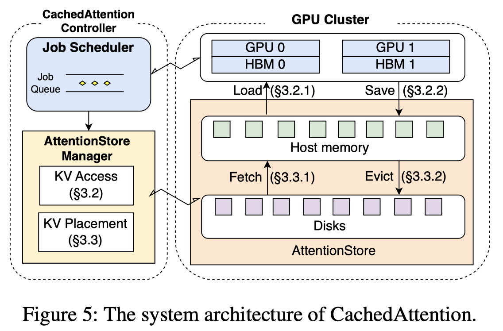

# Cost-Efficient Large Language Model Serving for Multi-turn Conversations with CachedAttention

## Abstract

Interacting with humans through multi-turn conversations is a fundamental
feature of large language models (LLMs). However, existing LLM serving engines
executing multi-turn conversations are inefficient due to the need to
repeatedly compute the key-value (KV) caches of historical tokens, incurring
high serving costs. To address the problem, this paper proposes
CachedAttention, a new attention mechanism that enables reuse of KV caches
across multi-turn conversations, significantly reducing the repetitive
computation overheads. CachedAttention maintains a hierarchical KV caching
system that leverages cost-effective memory/storage mediums to save KV caches
for all requests. To reduce KV cache access overheads from slow mediums,
CachedAttention employs layer-wise pre-loading and asynchronous saving schemes
to overlap the KV cache access with the GPU computation. To ensure that the KV
caches to be accessed are placed in the fastest hierarchy, CachedAttention
employs scheduler-aware fetching and eviction schemes to consciously place the
KV caches in different layers based on the hints from the inference job
scheduler. To avoid the invalidation of the saved KV caches incurred by context
window overflow, CachedAttention enables the saved KV caches to remain valid
via decoupling the positional encoding and effectively truncating the KV
caches. Extensive experimental results demonstrate that CachedAttention
significantly decreases the time to the first token (TTFT) by up to 87%,
improves the prompt prefilling throughput by up to 7.8$\times$ for multi-turn
conversations, and reduces the end-to-end inference cost by up to 70%.
