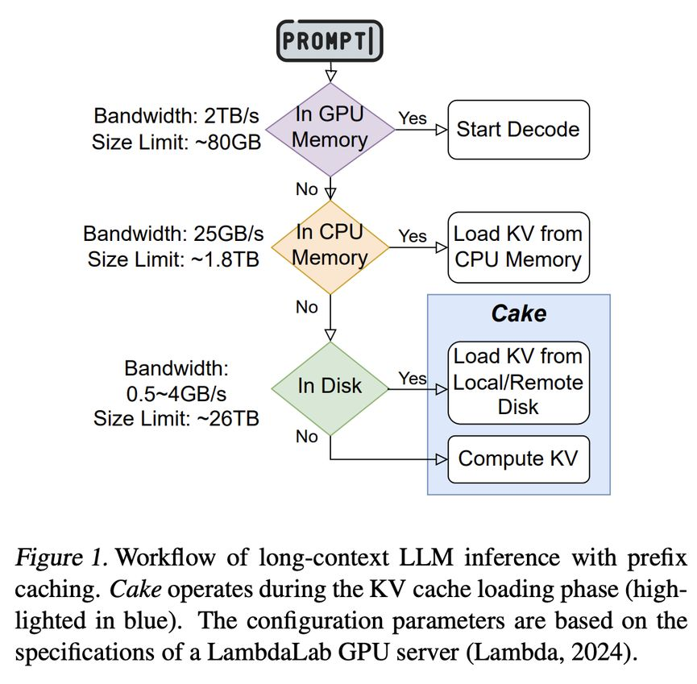

# Compute Or Load KV Cache? Why Not Both?

> Shuowei Jin, Xueshen Liu, Qingzhao Zhang, Z. Morley Mao

## Abstract

Large Language Models (LLMs) are increasingly deployed in large-scale online services, enabling sophisticated applications. However, the computational overhead of generating key-value (KV) caches in the prefill stage presents a major bottleneck, particularly for long-context inputs. Prefix caching mitigates this issue by storing KV caches for reuse, reducing redundant computation. Despite its advantages, prefix caching suffers from high latency due to the limited I/O bandwidth of storage devices, constraining inference efficiency. To address this challenge, we introduce Cake, a novel KV cache loading system that optimally utilizes both computational and I/O resources in parallel. Cake employs a bidirectional scheduling strategy that dynamically balances KV cache computation and loading, ensuring efficient resource utilization. Additionally, Cake incorporates an adaptive scheduling mechanism that seamlessly integrates with non-prefix caching requests, improving system throughput and adapting to fluctuating resource availabilty. Through extensive evaluations across various hardware configurations, datasets, and storage conditions, Cake achieves on average 2.6x reduction in Time to First Token (TTFT) compared to compute-only and I/O-only methods. Our findings highlight Cake as an effective and practical solution for optimizing long-context LLM inference, bridging the gap between computation and I/O efficiency in large-scale AI deployments.

---

*以下总结由 MiMo 生成：*

这篇论文针对大语言模型在长上下文推理中预填充阶段计算开销大和前缀缓存I/O延迟高的问题，提出了一种名为Cake的KV缓存加载系统。Cake采用双向调度策略，动态平衡KV缓存的计算与加载，并结合自适应机制以适应非前缀缓存请求和资源波动。实验表明，Cake在多种硬件和存储条件下，相比纯计算或纯I/O方法，平均减少了2.6倍的首词生成时间，有效提升了长上下文推理的效率。

---

## 论文详细总结

### 1. 研究背景与动机

LLM 在线服务中，预填充阶段生成 KV 缓存的计算开销是主要瓶颈，尤其在长上下文场景。前缀缓存通过存储和复用 KV 缓存减少冗余计算，但受限于存储设备有限的 I/O 带宽，加载延迟较高。如何同时利用计算资源和 I/O 资源成为关键问题。

### 2. Cake 核心思想

**计算与 I/O 并行**的 KV 缓存管理新范式，打破二者互斥的传统思路。系统动态平衡 KV 缓存的计算（compute）与加载（load），确保资源高效利用。

### 3. 关键技术

| 技术 | 说明 |
|------|------|
| **计算与 I/O 并行** | 同时进行计算和加载，最大化吞吐 |
| **双向调度策略** | 动态平衡 compute 和 load 的资源分配 |
| **自适应调度机制** | 与非前缀缓存请求无缝集成，适应资源可用性波动 |

### 4. 实验结果

| 指标 | 结果 |
|------|------|
| TTFT 降低 | **平均 2.6 倍** |
| 适用范围 | 多种硬件配置、数据集和存储条件 |

### 5. 核心贡献

1. 提出计算与 I/O 并行的 KV 缓存管理新范式
2. 设计双向调度和自适应调度两项关键技术
3. 全面实验验证方案在大规模 AI 部署中的有效性和实用性
