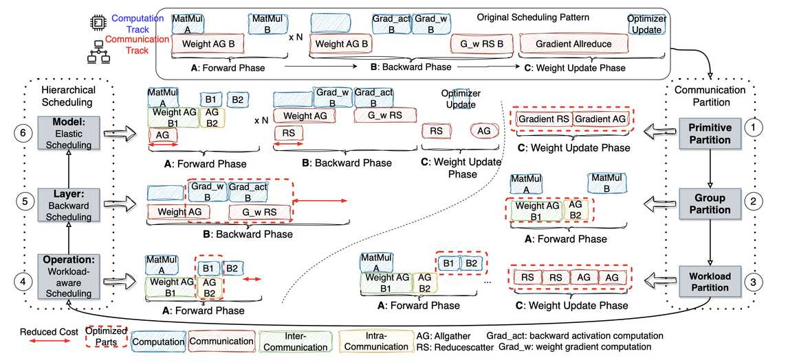

# Centauri



> **论文信息**
> - **标题**: Centauri: Enabling Efficient Scheduling for Communication-Computation Overlap in Large Model Training via Communication Partitioning
> - **作者**: Chang Chen, Xiuhong Li, Qianchao Zhu, Jiangfei Duan, Peng Sun, Xingcheng Zhang, Chao Yang
> - **机构**: 北京大学、香港中文大学、上海人工智能实验室
> - **会议**: ASPLOS 2024
> - **关键词**: overlap, communication partitioning, hierarchical scheduling, LLM training
> - **论文链接**: https://dl.acm.org/doi/10.1145/3620666.3651379

---

## 一句话总结

Centauri 提出了一种基于通信分区（communication partitioning）和分层调度（hierarchical scheduling）的框架，通过在原语（primitive）、组（group）和工作负载（workload）三个维度上对通信操作进行分区，并在操作层、层和模型层三个层级上进行调度，实现了大模型混合并行训练中通信与计算的高效重叠，在多种并行配置下取得了高达 **1.49×** 的加速比。

---

## 摘要翻译

高效训练大语言模型（LLM）需要采用混合并行方法，将多种通信集合操作整合到分布式分区图中。克服通信瓶颈至关重要，通常通过通信与计算的重叠来实现。然而，现有的重叠方法往往倾向于细粒度的内核融合或有限的操作调度，限制了异构训练环境中的性能优化。

本文介绍了 Centauri，一个创新的框架，包含了全面的通信分区和分层调度方案以实现优化的重叠。我们提出了一个由三个固有抽象维度组成的分区空间：**原语替换（primitive substitution）**、**拓扑感知组分区（topology-aware group partitioning）** 和 **工作负载分区（workload partitioning）**。这些维度共同创建了一个全面的优化空间，以实现高效重叠。为了确定通信和计算操作符的高效重叠，我们将混合并行训练中的调度任务分解为三个分层层级：**操作层（operation）**、**层（layer）** 和 **模型层（model）**。通过这些技术，Centauri 有效地隐藏了通信延迟并提高了硬件利用率。评估结果表明，Centauri 在各种并行训练配置中取得了高达 **1.49×** 的加速比。

---

## 研究动机

### 1. LLM 训练的通信瓶颈
大语言模型的训练需要将任务分布在大量 GPU 上，采用多种并行策略（数据并行 DP、张量并行 TP、流水线并行 PP、全分片数据并行 FSDP 等）。这些并行方法引入了多种通信模式，通信开销在端到端执行时间中占据相当大的比例，特别是在异构网络环境中。因此，最小化通信开销对高效扩展 LLM 训练任务至关重要。

### 2. 现有方法的局限性
现有的通信-计算重叠方法存在两大根本性挑战：
- **重叠空间探索不充分**：部分框架（如 Megatron-LM、Torch DDP）仅针对单一并行方法进行调度优化，无法处理混合并行中的复杂重叠挑战。某些策略（如 Better Together）依赖于多 GPU 流的并发通信，但缺乏对更广泛计算重叠空间的探索。图级别的粗粒度重叠（如 Breadth-First Pipeline）可能未充分利用硬件资源。
- **细粒度内核融合的局限**：编译器风格的工作（如 CoCoNet、Dist-Einsum）在操作级别生成融合内核，但可能忽略图级别的调度机会。过于细粒度的内核分区可能因多次小 GPU 内核启动和数据移动开销而抵消重叠的收益。

### 3. 混合并行的调度复杂性
混合并行训练涉及多个并行方法的组合，产生复杂的通信模式。前向和反向传递中，最优的重叠模式可能不同。这需要一种系统性的方法来全面探索重叠空间，并在多个层级上进行高效调度。

---

## 方法（技术细节）

Centauri 的工作流程包含两个核心部分：**通信分区**（Communication Partition）和 **分层调度**（Hierarchical Scheduling）。

### 一、通信分区（三个维度）

通信分区从三个固有维度展开：原语、组和工作负载。

#### 1. 原语替换（Primitive Substitution）
一个集合通信原语可以通过多个子原语替换，保持相同的通信效果。例如：
- **Allreduce** 可以被拆分为 **Reduce-Scatter + AllGather**（可扩展，推荐使用）
- **Reduce-Scatter** 可以被拆分为多个具有不同根的 Reduce 操作
- **AllGather** 可以被视为多个具有不同根的 Broadcast 操作

这种替换允许将集合操作拆分为更细粒度的部分，分别与不同的计算阶段重叠。例如，Allreduce 拆分为 Reduce-Scatter 和 AllGather 后，后者可以通过逐元素优化器操作重新定位，实现 TP 和 DP 向 SP 和 Zero-1,2 的演进。

**关键设计原则**：选择在性能上具有可扩展性的替换方案，避免那些可能导致理论延迟增加的替换（如 Reduce + Scatter 会将延迟翻倍）。

#### 2. 组分区（Group Partition）
集合通信在设备组 G 中进行，可以进一步细分为更小的组 {G₁, G₂, G₃, ...}，以实现更细粒度的通信。设备可以排列成 d 维网格，每个设备获得一个 d 维索引。

**拓扑感知分区**：组分区必须与底层网络的分层拓扑结构对齐。主要考虑因素包括：
- **避免不均衡带宽**：不均衡带宽子组中的低带宽链路瓶颈会抵消高带宽链路的性能优势
- **利用局部性原则**：利用高带宽的本地连接，限制跨节点通信量
- **避免带宽利用不足**：过细的组分区可能破坏节点内设计好的链路拓扑，导致环通道带宽显著降低

#### 3. 工作负载分区（Workload Partition）
工作负载分区将通信操作及其依赖的计算链进行分割。依赖计算链中的操作包括 MatMul、激活函数（GeLU、Dropout）等。

**计算维度类型**：
- **收缩维度（CD）**：如 MatMul 和 Einsum 的收缩维度，分区后需要额外的 Reduce 操作来聚合部分结果
- **不可分割维度（ND）**：如归一化函数的归约维度，不适合分割
- **其他维度（OD）**：如批量维度和 MatMul 的非收缩维度

**兼容性选择**：在链中选择兼容的分区维度组合。例如，沿批量维度分割的 MatMul 输出与沿隐藏维度分割的后续逐元素加法操作不兼容。

### 二、分层调度（三个层级）

分层调度将复杂的混合并行通信调度问题解耦为三个层级。

#### 1. 操作层（Operation Level）
操作层调度旨在高效重叠前向 Transformer 层内的通信和计算操作。核心算法：
- **均匀工作负载分区**：当通信成本低于独立计算成本时，通信可以被完全重叠，无需分区
- **不均匀组工作负载分区**：当涉及组分区时，带宽感知的调度至关重要。正确排序节点内和节点间通信
- **最优粒度选择**：过于精细的工作负载分区可能导致过高的内核启动和数据移动开销

**关键思想**：通过循环式节点内和节点间工作负载调度，在适当粒度下实现通信与计算的最优重叠。

#### 2. 层级（Layer Level）
层级调度关注反向传播层中的最优执行优先级。反向计算包括两个独立部分：激活梯度计算和权重梯度计算。

通过分析两条关键路径：
- **T₁**：激活梯度计算优先（适用于单 TP 场景）
- **T₂**：权重梯度计算优先（适用于 FSDP 场景）

最终调度方案取决于 T₁ 和 T₂ 之间的最小成本，自适应地根据通信模式选择执行优先级。

#### 3. 模型层（Model Level）
模型层重叠旨在隐藏梯度和权重的通信，同时与前向和反向阶段重叠。在 DP + PP 混合训练中，需要选择适当的微批次数来平衡重叠潜力和内存消耗。

**优化问题**：
```
min T = max{C_AG - L₁ * C_fw, 0} + max{C_RS - L₂ * C_bw, 0}
s.t. L₁ * m ≤ M, L₂ * m ≤ M, L₁ + L₂ ≤ mb
```

其中 L₁ 和 L₂ 是前向和反向阶段的微批次数，m 是每次前向执行的内存开销，M 是剩余设备容量。

**弹性调度**：Centauri 弹性地启动所需的微批次数，实现不同配置下的最大 DP 重叠效果。在大批量时直接重叠，在小批量时增加重叠微批次数以确保可接受的内存消耗。

---

## 实验结果

### 实验环境
- **Cluster A**：8×NVIDIA A100-80G，NVSwitch 600GB/s，PCIe 3.0 x16（16GB/s），InfiniBand HDR 200Gb/s（每设备 25Gb/s）
- **Cluster B**：4×InfiniBand HDR 端口（每设备 100Gb/s）
- **软件环境**：CUDA 11.7, NCCL 2.14, PyTorch 2.0.0, Megatron-LM
- **模型**：LLaMA（Small/Medium/Big/Large 四种规格）

### 单并行性能
- **FSDP/Zero3**：在 Cluster A 上，Centauri 在不同模型规格下实现了 **1.15×~1.46×** 的加速（相比 FSDP/Zero3 基线）
- **DP**：在 Cluster A 上，Centauri 在不同模型规格下实现了 **1.12×~1.45×** 的加速（相比 Zero1+2 基线）

### 混合并行性能
- **FSDP+DP**（6 节点，48 GPU）：Centauri 在 FSDP16+DP3 配置下实现了 **1.49×** 的加速（同时对 FSDP 和 DP 进行重叠优化）
- **TP+PP+DP**（6 节点，48 GPU）：Centauri 在 TP2+PP3+DP8 配置下实现了 **1.27×** 的加速（相比 Megatron-LM 基线）

### 可扩展性
- 在 Cluster A（带宽受限环境）中，Centauri 显著提高了 FSDP/Zero3 的吞吐量，使其达到高性能环境（Cluster B）的水平，展示了带宽无关性
- 在 Cluster B 中，Centauri 仍在 256 GPU 上实现了约 5% 的吞吐量提升
- 在 FSDP+DP 配置中，Centauri 在 Cluster A 和 B 上均保持了较高的加速比，在 Cluster B 中实现了 Zero1+2+3 直接重叠的两倍加速率

### 消融研究
- 不同批量大小对性能的影响：小批量时计算开销远小于通信延迟，改进空间有限；大批量时加速效果更显著
- 模型规模越大，改进越显著，展示了良好的弱扩展性
- 通信与计算成本比率（α）的影响：当 α > 0.5 时，计算可以完全被通信重叠；当 α < 0.5 时，通信可以完全被计算重叠

---

## 优势

1. **全面的通信分区抽象**：提出三个维度（原语、组、工作负载）的统一抽象，现有工作的优化空间都是其子集
2. **分层调度解耦**：将复杂调度问题分解为操作、层和模型三个层级，避免了层级间的过度纠缠
3. **混合并行支持**：兼容 DP、FSDP、TP、PP 的多种混合并行组合
4. **显著性能提升**：在各种并行配置下实现了高达 1.49× 的加速比
5. **良好的可扩展性**：在不同网络环境下（带宽受限和高性能）均表现良好，展示了带宽无关性
6. **弹性微批调度**：在模型层调度中，弹性地调整微批次数以平衡重叠潜力和内存消耗
7. **实用性强**：基于 Megatron-LM 实现，可直接应用于 LLM 训练

---

## 局限

1. **计算开销限制**：当批量大小较小时，计算开销远小于通信延迟，重叠效果有限，性能改进空间较小
2. **内核启动开销**：过于精细的工作负载分区可能导致过多的小 GPU 内核启动和数据移动开销，抵消重叠收益
3. **带宽利用不足风险**：过细的组分区可能破坏节点内设计好的链路拓扑，导致环通道带宽显著降低
4. **内存约束**：在 PP+DP 混合并行中，弹性微批调度需要在重叠潜力和内存消耗之间进行权衡
5. **仅针对训练**：论文主要关注 LLM 训练场景，对于推理场景的通信优化（小体积但频繁的通信开销）尚未涉及（作者在结论中提到了未来的研究方向）
6. **硬件依赖**：虽然框架本身是硬件无关的，但分区策略的剪枝依赖于特定的网络拓扑和硬件配置

---

## 与 EfficientPaper 相关的研究方向

1. **通信-计算重叠优化**：这是 EfficientPaper 项目中"overlap"关键词的核心研究方向。Centauri 提供了一个系统性的方法来探索和优化通信与计算的重叠，与项目中的其他重叠方法（如 CoCoNet、Dist-Einsum、Better Together 等）形成对比。
2. **混合并行训练优化**：项目中涵盖多种并行方法（DP、TP、PP、FSDP 等），Centauri 的混合并行支持与这些方法密切相关。
3. **通信原语的分解与组合**：Centauri 的原语替换思想（如 Allreduce → Reduce-Scatter + AllGather）与分布式训练中的通信优化密切相关。
4. **拓扑感知的通信调度**：项目中涉及异构网络环境下的训练优化，Centauri 的拓扑感知组分区策略与之相关。
5. **LLM 训练系统的可扩展性**：Centauri 的分层调度方法为 LLM 训练系统的可扩展性优化提供了新思路。
6. **未来方向 - 推理优化**：作者提到将探索并行推理中的通信挑战，包括合并小体积通信和低频通信模式的并行化，以及与 warp 级计算调度对齐的更细粒度通信调度。

---

## AI 生成声明

本笔记由 AI Agent（Hermes Agent）基于论文 PDF 文本提取和元数据自动生成。笔记内容是对原始论文的总结和翻译，可能包含不完全准确的表述。建议读者阅读原始论文以获取完整准确的信息。

- **生成时间**: 2026-06-05
- **生成工具**: Hermes Agent (Nous Research)
- **PDF 来源**: OpenReview (https://openreview.net/pdf/58de1dd82ec19b52473be7e4af3f6ed777c4a525.pdf)
- **文本提取**: PyMuPDF (fitz)
- **模型**: /softhome/mozhu/models/MiMo-V2.5
