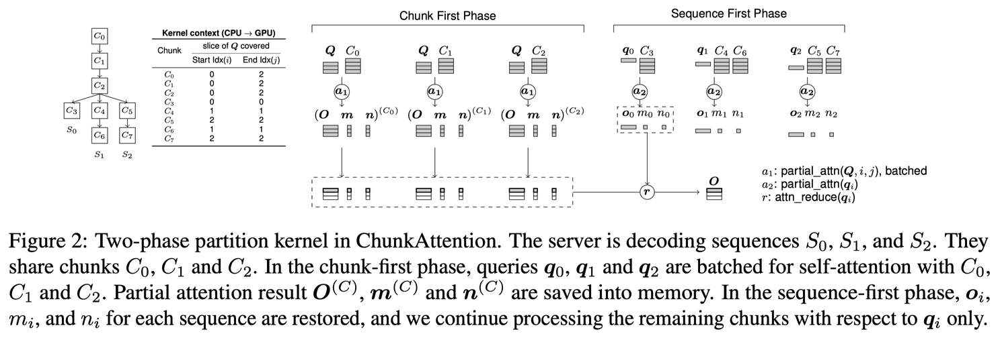

# ChunkAttention: Efficient Self-Attention with Prefix-Aware KV Cache and Two-Phase Partition



## 一句话总结

ChunkAttention 通过前缀感知的 KV 缓存（Prefix-Aware KV Cache）和两阶段分区算法（Two-Phase Partition），在多租户 LLM 推理场景中实现 3.2–4.8× 的 self-attention 加速和 70%–90% 的 KV 缓存内存节省，关键在于利用共享系统提示（system prompt）的前缀特性进行 KV 缓存复用。

## 摘要翻译

Self-attention 是大语言模型（LLM）的核心组件，但在长序列推理中是延迟的重要来源。在多租户 LLM 服务场景中，利用多个 LLM 请求共享系统提示（system prompt）前缀的概率，可以优化 self-attention 的计算和内存操作成本。本文介绍了 ChunkAttention，一种前缀感知的 self-attention 模块，能够检测多个请求之间匹配的提示前缀，并在运行时共享其 key/value 张量以提高 KV 缓存的内存利用率。具体做法是将整体的 key/value 张量切分为更小的块（chunk），并将其组织到辅助前缀树中。基于前缀树结构的 KV 缓存，作者设计了高效的 self-attention 内核，实现了两阶段分区算法以提升共享系统提示存在时 self-attention 计算的数据局部性。实验表明，当系统提示长度在 1024 到 4096 时，ChunkAttention 相比最先进的实现可将 self-attention 内核加速 3.2–4.8×。

## 研究动机

### 1. Self-attention 的性能瓶颈

Self-attention 是 LLM 推理的关键模块，但在推理阶段性能极差。以 Llama2 7B 为例（FP16，A100 80G，2048 上下文长度），self-attention 的算术强度（Arithmetic Intensity = FLOPs/MOPs）仅为 0.99，属于严重的内存受限（memory-bound）操作。在 batch size=32 时，self-attention 的延迟为 687.74µs，远超 QKV 投影和 MLP 的延迟。随着上下文长度的增长（如 GPT-4 支持 32K），性能会进一步恶化。

### 2. KV 缓存的内存压力

KV 缓存的内存占用与上下文长度线性增长，同时限制了批处理大小和系统吞吐量。以 GPT-3 (175B) 为例，使用 FP16 时每个 token 的 KV 缓存需要 4.5MB 内存，8×A100 (80G) 的推理服务器只能存放约 70000 个 token（约 35 个 2K 上下文的序列）。

### 3. 共享系统提示的冗余

在多租户 LLM 部署中，多个请求通常共享相同的系统提示（system prompt）。这些系统提示可以很长（>1K tokens），如 ChatGPT 在激活 6 个插件时系统提示可达 1766 tokens。在线聊天机器人和离线实验中均存在这种共享特征。然而，现有的 KV 缓存管理方案（如 vLLM 的 PagedAttention）并未利用这一特性，导致大量内存冗余和计算浪费。

### 4. 现有方案的局限

vLLM 中的 PagedAttention 仅提出了预配置共享提示的方案，但未实现。该方案存在三大局限：(i) 预定义系统提示是静态的，不适合频繁更新的大规模部署；(ii) 长系统提示和低命中率场景下存在内存浪费；(iii) 未针对共享系统提示优化 self-attention 内核。

## 方法（技术细节）

### 1. 前缀感知 KV 缓存（Prefix-Aware KV Cache, PAKV）

**核心思想**：将 KV 缓存组织为前缀树结构，而非传统的密集张量（dense tensor）。

**传统 KV 缓存**：存储为 b×h×n×d 的密集张量（b=batch size, h=heads, n=sequence length, d=head dimension）。

**PAKV 的前缀树结构**：
- 将整体 key/value 张量沿序列长度维度切分为更小的 chunk（chunk size c=64）
- 每个节点（chunk）存储三个要素：(i) 一段长度为 c 的共享上下文 token；(ii) 对应的 key 张量（b×h×c×d）；(iii) 对应的 value 张量
- 前缀树中的每条路径定义一个序列，多个树（森林）可同时存在
- 共享前缀 token 的 key/value 张量在内存中只有一份物理拷贝

**内存管理**：采用池化内存分配器（pool-based memory allocator），维护已用和空闲 chunk 列表。新 chunk 从空闲列表或操作系统获取，已完成后返回到空闲列表但不释放给操作系统。内存损失上限为 (c-1)/n。

**三种推理场景的前缀树操作**：
- 新序列加入：搜索前缀树并插入新路径
- 序列完成离开：删除路径
- 解码迭代：将新 token 追加到叶 chunk 或生长新 chunk

**共享比**：r = ns/(np+nc)，可处理的序列数增加约 1/(1-r)。

### 2. 两阶段分区算法（Two-Phase Partition, TPP）

TPP 在前缀树 KV 缓存的基础上重新设计 self-attention 内核，分为 chunk-first 和 sequence-first 两个阶段。

#### Chunk-first 阶段（分区 chunks）

**目标**：仅处理多个序列共享的 chunk，最大化批处理效率。

**算法**：遍历前缀树中被多个序列共享的 chunk C₁...Cₖ，对每个 chunk 执行 partial_attn：

```
partial_attn(Q_{i:j,:}, K(C), V(C)):
    W(C) = Q_{i:j,:} K(C)          # (j-i)×c
    m(C) = max(W(C))                # (j-i)
    E(C) = exp(W(C) - m(C)·1ᵀ)     # (j-i)×c
    n(C) = sum(E(C))                # (j-i)
    O(C) = E(C) V(C)               # (j-i)×d
```

- 使用在线 softmax 算法（online softmax），避免分区间的同步需求
- 查询 tensor Q 从向量变为矩阵，允许使用 tensor core 进行高效矩阵乘法
- 共享 KV 缓存的数据局部性得到改善
- 部分注意力结果 (O, m, n)(C) 保存到内存

#### Sequence-first 阶段（分区序列）

**目标**：针对每个序列的独占 chunk 处理，合并部分注意力结果。

**算法**：对每个序列 qᵢ，先加载 chunk-first 阶段的部分结果，再处理独占 chunk：

```
for q ← q₁ to qᵢ:
    加载 (O, m, n)(C₁)...(Cₖ)
    for (O, m, n)(C) in shared chunks:
        attn_reduce(o(C), m(C), n(C), o, m, n)
    for C in exclusive chunks:
        partial_attn(q, K(C), V(C), i, i+1)
        attn_reduce(o(C), m(C), n(C), o, m, n)
```

**attn_reduce 合并公式**：
```
x(C) = exp(m(C) - max(m(C), mᵢ))
y(C) = exp(mᵢ - max(m(C), mᵢ))
O_{i,:} = x(C) o(C) + y(C) O_{i,:}
nᵢ = x(C) n(C) + y(C) nᵢ
mᵢ = max(m(C), mᵢ)
```

最终注意力输出为 O/n 逐元素除法。

**两阶段的平衡**：
- Chunk-first：适合并行化（多个序列批处理到共享 chunk）
- Sequence-first：适合数据局部性（单序列独占 chunk）
- 没有 chunk-first 阶段的结果，sequence-first 需要从 RAM 加载共享 chunk b 次，增加大量内存操作（MOPs）

### 3. 进一步优化

- **延迟隐藏（Latency Hiding）**：CPU 上的上下文生成与 GPU 上的其他内核重叠执行
- **懒上下文拷贝（Lazy Context Copy）**：缓存 GPU 上下文，仅在树结构变化时触发内存拷贝。触发条件包括：chunk 满（每 c 次迭代）、新序列加入、序列完成
- **CPU 设备上的优化**：在 CPU 上可以消除 chunk-first 阶段的临时内存，直接通过 attn_reduce 合并（使用 spin locks 序列化）
- **Prefilling 阶段优化**：执行前缀查找以避免重复计算 KV 投影和位置编码，对不匹配的后缀 token 仍计算 KV，然后使用 FlashAttention 等优化内核

## 实验结果

### 1. Self-attention 微内核评测（Microkernel Evaluation）

**实验环境**：NVIDIA A100 (80G)，CUDA 11.8，head dimension=128，heads=32，chunk size=64，FP16

**基线方法**：
- Naive PyTorch（softmax(QKᵀ/√d)V）
- xformers（内存高效 self-attention）
- FlashAttention（PyTorch 集成）
- PagedAttention（vLLM）
- PagedAttn*（模拟共享内存的 PagedAttention）

**关键结果**：

| np | ns | Naive | xformers | FlashAttn | PagedAttn | ChunkAttn | 加速比 |
|---|---|---|---|---|---|---|---|
| 1024 | 0 | 363µs | 378µs | 1587µs | 356µs | 333µs | 1.1× |
| 1024 | 1024 | 362µs | 379µs | 1587µs | 355µs | **56µs** | **6.6×** |
| 2048 | 0 | 686µs | 816µs | 3175µs | 703µs | 655µs | 1.1× |
| 2048 | 2048 | 688µs | 824µs | 3152µs | 704µs | **110µs** | **6.4×** |
| 4096 | 0 | 1370µs | 1720µs | 6290µs | 1401µs | 1302µs | 1.1× |
| 4096 | 4096 | 1370µs | 1713µs | 6301µs | 1400µs | **206µs** | **6.7×** |

**重要发现**：
- **无共享前缀时（ns=0）**：ChunkAttn 与 PagedAttn* 性能相当，无性能回退
- **共享前缀时**：ChunkAttn vs PagedAttn* 可加速 2.8–3.2×（TPP 的贡献），ChunkAttn vs PagedAttn 可加速 3.2–4.8×（PAKV + TPP 的贡献）
- **PagedAttn* vs PagedAttn**：共享物理内存的 PagedAttn* 比 PagedAttn 快最多 52%（ns=4096），说明硬件缓存对共享 KV 的效果

**吞吐量随解码长度变化**：
- ns=2048，nc=512 时 ChunkAttn 比 PagedAttn 快 3.6×（145K vs 39.8K toks/s）
- nc=2048 时降为 2.3×（70K vs 30K toks/s），随序列分化加速效果递减但仍显著

**吞吐量随 batch size 变化**：
- 对于非共享实现，batch size=16 时吞吐量达到峰值（受内存带宽限制）
- ChunkAttn 在 ns=2048 时，batch size 从 16 到 96 持续增长（155K → 224K toks/s），得益于更好的数据局部性和算术强度提升

### 2. 端到端评测（End-to-end Evaluation）

**模型**：Open Llama2 7B（FP16）
**基线**：vLLM 0.2.7，Huggingface Text Generation Inference (TGI) 1.3.4
**工作负载**：Poisson 到达过程，动态批处理大小（最大 32）
**评测指标**：归一化延迟（ms/tok）和峰值 KV 缓存内存

**关键结果**：

| np | ns | nc | RPS | vLLM 延迟 | ChunkLlama 延迟 | vLLM 内存 | ChunkLlama 内存 |
|---|---|---|---|---|---|---|---|
| 1024 | 0 | 512 | 1.0 | 19.92 ms/tok | 19.11 ms/tok | 14.73 GB | 11.90 GB |
| 1024 | 1024 | 512 | 1.0 | 20.80 ms/tok | **14.07 ms/tok** | 14.79 GB | **3.28 GB** |
| 2048 | 0 | 512 | 0.6 | 21.90 ms/tok | 19.43 ms/tok | 21.70 GB | 22.41 GB |
| 2048 | 2048 | 512 | 0.6 | 21.61 ms/tok | **15.20 ms/tok** | 21.09 GB | **3.40 GB** |
| 4096 | 0 | 512 | 0.4 | 26.23 ms/tok | 26.88 ms/tok | 34.59 GB | 35.13 GB |
| 4096 | 4096 | 512 | 0.4 | 27.62 ms/tok | **17.16 ms/tok** | 35.42 GB | **4.00 GB** |

**重要发现**：
- **无共享前缀时**：ChunkLlama 无性能回退
- **ns=1024**：ChunkLlama 比 vLLM 吞吐量高 1.6×（2.9 vs 1.8 RPS），归一化延迟 <40 ms/tok
- **ns=2048**：ChunkLlama 比 vLLM 吞吐量高 2.3×（2.3 vs 1.0 RPS）
- **KV 缓存内存减少 70%–90%**（如 4096 token 共享时，从 35.42 GB 降至 4.00 GB）
- **峰值 batch size 减少 20%–40%**（因解码更快）

## 优势

1. **显著的性能加速**：在共享系统提示场景下，self-attention 内核加速 3.2–4.8×，端到端推理吞吐量提升 1.6–2.3×
2. **大幅内存节省**：KV 缓存内存减少 70%–90%，特别是在长系统提示场景下
3. **无共享时无回退**：当没有共享前缀时（ns=0），性能与现有高度优化实现相当，无性能损失
4. **运行时自动检测**：通过前缀树结构，无需人工干预即可动态检测和消除 KV 缓存冗余
5. **零内存浪费**：前缀树仅存储当前解码中的序列的 KV 缓存，不存在空闲内存浪费
6. **开箱即用（Out-of-the-box）**：基于前缀树的 KV 缓存设计具有可扩展性和鲁棒性
7. **兼容性**：与 FlashAttention 等现有优化互补，可在其上进一步优化
8. **实用性强**：针对真实多租户部署场景设计，适用于在线聊天机器人和离线实验

## 局限

1. **系统提示位置限制**：为共享 KV 张量，系统提示必须出现在序列的开头。如果应用开发者不将系统提示放在开头（出于性能考虑或无意错误），PAKV 无法节省内存。虽然这是最常见的实践，但不是强制要求。Liu et al. (2023) 发现模型在使用长输入中间部分的信息时性能最低。

2. **微调（Fine-tuning）的替代威胁**：微调是将领域知识注入 LLM 的另一种方式，可能减少对长系统提示的需求，从而降低共享机会。虽然当前尚无成本效益更高的微调和托管方案，但随着硬件和软件的发展，微调可能变得更加实用和流行。

3. **模型和硬件兼容性**：TPP 内核使用低级 CUDA 编程实现，针对常见的 LLM 配置（如 128 head dimension）和硬件（A100、RTX 4090、Intel Xeon CPU）进行调优。对于其他配置和硬件，需要逐个验证和调优，开发成本高。作者认为需要社区努力来推广两阶段分区算法，使其兼容更多模型配置和硬件。

4. **解码长度增长时加速效果递减**：随着解码进行，序列开始分化，ChunkAttn 的加速效果逐渐下降。例如 ns=2048 时，从 nc=512 的 3.6× 降至 nc=2048 的 2.3×。

5. **仅适用于解码阶段**：Prefilling 阶段仍使用 FlashAttention 等现有内核，TPP 的优化仅在迭代解码时生效。

## 与 EfficientPaper 相关的研究方向

1. **KV 缓存优化**：ChunkAttention 是 KV 缓存管理的重要研究方向，与 PagedAttention（vLLM）形成互补，两者从不同角度（分页 vs 前缀树）优化 KV 缓存的内存管理。

2. **多租户 LLM 推理**：该工作直接针对多租户部署场景，通过共享系统提示的 KV 缓存减少内存冗余，提高系统吞吐量和并发能力。

3. **Attention 内核优化**：TPP 算法是对 self-attention 内核的创新设计，与 FlashAttention（训练优化）、PagedAttention（推理优化）等形成互补，适用于推理场景的高效实现。

4. **LLM 推理效率**：该工作属于 LLM 推理加速的核心研究方向，通过减少内存操作和提高数据局部性来提升推理效率，与模型压缩、量化等技术形成互补。

5. **Prefix-aware 缓存设计**：前缀树结构的 KV 缓存管理方案，可扩展到其他场景，如多轮对话、指令微调等，具有潜在的跨领域应用价值。

## AI 生成声明

> **本笔记由 AI Agent 自动生成，基于论文 ChunkAttention 的 PDF 文本提取和元数据信息。内容经过结构化整理和翻译，仅供参考。如需精确理解论文细节，请查阅原文。**
