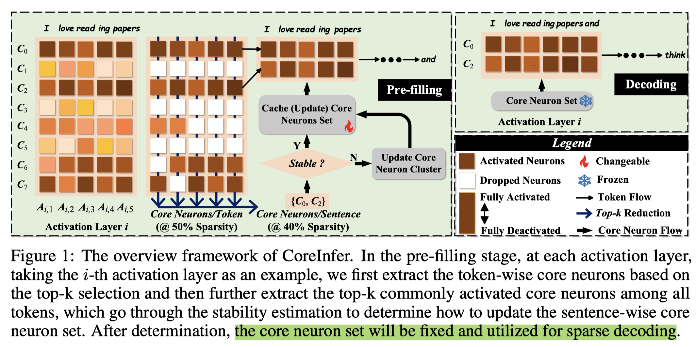
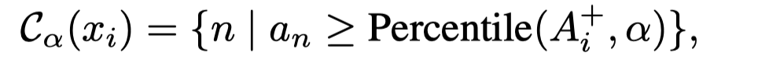

# CoreInfer: Accelerating Large Language Model Inference with Semantics-Inspired Adaptive Sparse Activation

## Abstract

Large language models (LLMs) with billions of parameters have sparked a new
wave of exciting AI applications. However, their high computational costs and
memory demands during inference pose significant challenges. Adaptive sparse
activation inference, which activates only a small number of neurons for each
token, offers a novel way to accelerate model inference without degrading
performance, showing great potential for resource-constrained hardware devices.
Nevertheless, existing methods predict activated neurons based on individual
tokens with additional MLP, which involve frequent changes in activation maps
and resource calls, limiting the acceleration benefits of sparse activation. In
this paper, we introduce CoreInfer, an MLP-free adaptive sparse activation
inference method based on sentence-level prediction. Specifically, we propose
the concept of sentence-wise core neurons, which refers to the subset of
neurons most critical for a given sentence, and empirically demonstrate its
effectiveness. To determine the core neurons, we explore the correlation
between core neurons and the sentence's semantics. Remarkably, we discovered
that core neurons exhibit both stability and similarity in relation to the
sentence's semantics -- an insight overlooked by previous studies. Building on
this finding, we further design two semantic-based methods for predicting core
neurons to fit different input scenarios. In CoreInfer, the core neurons are
determined during the pre-filling stage and fixed during the encoding stage,
enabling zero-cost sparse inference. We evaluated the model generalization and
task generalization of CoreInfer across various models and tasks. Notably, on
an NVIDIA TITAN XP GPU, CoreInfer achieved a 10.33 times and 2.72 times speedup
compared to the Huggingface implementation and PowerInfer, respectively.

之前工作对activation sparse的预测是按照token-wise来做的，这样有几个问题：
- Irregular and frequent resource calls during decoding
- Additional computation costs during decoding; 使用MLP作为predictor带来的计算开销不能忽略

CoreInfer 则提出sentence-wise activation sparsity方式，并且没有MLP的predictor。

定义如下：
- Token-wise Core Neurons.
    - 每个token经过一个layer计算后，对应多个输出（neurons）,取绝对值最大的几个作为Core Neurons。
- Sentence-wise Core Neurons.
  - 一个sentence含有多个token，每个token都可以根据以上一定找到core neurons，通过统计每个neuron作为token-wise core neuron的次数，次数最多的几个作为sentence-wise core neurons。

可以看到分别引入了$\alpha$ $\beta$ 两个超参数，用来控制core neurons的比例。

通过这种选择策略，只用计算少部分的neurons，便可以维持精度。

另外观察，越临近的tokens的core neurons越相似，所以具有语义相似性。

所以，coreinfer根据历史的core neuron来判断未来的core neuron方法如下：
- Stability-guided Prediction，prefill阶段统计，decoding阶段直接使用prefill的统计结果
- Similarity-guided Prediction，coreinfer 统计了training data，并按照语义对其进行了聚类，从而可以根据语义相关性来判断core neuron （有些抽象）

第一种思想和aggregated sparsity很像，LLM in a flash.