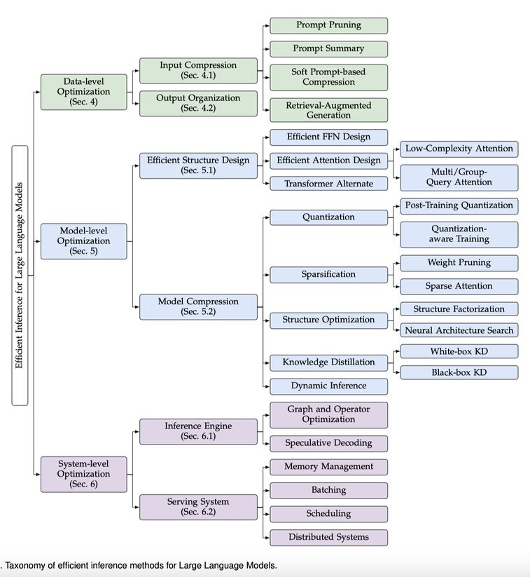

# A Survey on Efficient Inference for Large Language Models

## 一句话总结

本文是一篇全面的综述论文，系统梳理了大语言模型（LLM）高效推理的研究进展，从数据级、模型级和系统级三个层次构建了优化分类体系，并通过实验对比提供了量化见解和实践建议。

## 摘要翻译

大语言模型（LLMs）因其在各类任务上的卓越表现而受到广泛关注。然而，LLM 推理过程中对计算资源和内存的巨大需求，使其在资源受限场景下的部署面临严峻挑战。为应对这一挑战，研究领域一直在开发旨在提升 LLM 推理效率的技术。本文对现有高效 LLM 推理文献进行了全面综述。我们首先分析了 LLM 推理效率低下的主要原因，即模型规模庞大、注意力操作的二次复杂度以及自回归解码方法。随后，我们引入了一个全面的分类体系，将现有文献组织为数据级、模型级和系统级优化。此外，本文还对关键子领域的代表性方法进行了比较实验，以提供定量见解。最后，我们总结了一些关键知识点，并讨论了未来的研究方向。

## 研究动机

LLM 的推理部署面临三大核心效率瓶颈，这构成了本文的研究动机：

1. **模型规模庞大**：主流 LLM 通常包含数十亿甚至万亿参数。例如 LLaMA-70B 模型拥有 700 亿参数，以 FP16 格式存储需要 140GB 显存，至少需要 6 张 RTX 3090Ti GPU（每张 24GB）或 2 张 NVIDIA A100 GPU（每张 80GB）才能进行推理。这直接导致了高昂的计算成本、内存访问成本和内存占用。

2. **注意力操作的二次复杂度**：在预填充阶段，自注意力操作的计算复杂度与输入长度呈二次关系。当处理长序列时，这对内存容量和计算能力提出了极高的要求。随着上下文长度增加，注意力操作的时间占比显著上升。

3. **自回归解码方法**：LLM 采用逐 token 生成的自回归方式，随着序列长度增加，生成过程的时间成本迅速增长。在 A100 GPU 上生成一个 token 约需 100 毫秒，生成数百个 token 的序列需要超过 10 秒。

这些问题严重影响了延迟、吞吐量、功耗和存储等效率指标，给 LLM 在边缘和云端场景中的应用带来了挑战。因此，开发高效推理技术对于 LLM 的实际部署至关重要。

## 方法（技术细节）

本文提出了一个三层分类体系，涵盖高效 LLM 推理的全部研究方向：

### 1. 数据级优化（Data-level Optimization）

数据级优化主要通过优化输入数据来提升推理效率，包括：

- **输入压缩（Input Compression）**：通过减少输入 token 数量来降低计算量，如提示压缩、检索增强生成（RAG）等方法
- **输出组织（Output Organization）**：优化 LLM 的输出格式和结构，如并行生成、结构化输出等
- **KV 缓存管理**：高效管理 KV 缓存以减少内存占用

### 2. 模型级优化（Model-level Optimization）

模型级优化通过修改模型结构或参数来提升效率，主要包括：

#### 2.1 模型结构设计（Model Architecture Design）
- **非 Transformer 架构**：探索如 SSM（State Space Models）等替代架构，如 Mamba、RWKV、RetNet 等，这些架构在推理时具有线性计算复杂度
- **Mixture of Experts（MoE）**：通过专家混合机制在保持模型容量的同时降低计算成本

#### 2.2 模型压缩（Model Compression）

**量化（Quantization）**：将模型权重和激活从高位宽转换为低位宽表示，分为：
- **训练后量化（PTQ）**：无需重新训练，如 GPTQ、AWQ、SmoothQuant、LLM.int8() 等
- **量化感知训练（QAT）**：在训练过程中引入量化，如 LLM-QAT、QLoRA 等
- **仅权重量化（Weight-only Quantization）**：在解码阶段加速内存访问
- **权重量化+激活量化（Weight-Activation Quantization）**：在预填充阶段加速计算

**知识蒸馏（Knowledge Distillation）**：
- **黑盒蒸馏**：从大模型的输出中学习，如 Distilling Step-by-Step、LaMini-LM 等
- **白盒蒸馏**：利用模型内部知识，如 MiniLLM、GKD 等

**结构优化（Structure Optimization）**：
- **神经架构搜索（NAS）**：自动搜索高效的模型结构
- **结构分解（Structure Factorization）**：如 LoRD、TensorGPT、LoSparse 等
- **稀疏化（Sparsification）**：
  - 稀疏注意力（Sparse Attention）：如 StreamingLLM、Longformer、BigBird 等
  - 权重剪枝（Weight Pruning）：如 SparseGPT、Wanda、LLM-Pruner 等

**动态推理（Dynamic Inference）**：
- Token 级别：如 CALM、SkipDecode
- 样本级别：如 FastBERT、PABEE 等早期退出方法

### 3. 系统级优化（System-level Optimization）

系统级优化主要增强模型前向传播过程，包括：

#### 3.1 推理引擎优化
- **注意力算子优化**：FlashAttention 将整个注意力操作融合为单个内存高效算子，通过分块消除完整数据加载；FlashDecoding 引入沿序列维度的并行计算；FlashDecoding++ 通过预计算统计量消除 softmax 同步开销
- **线性算子优化**：FlashDecoding++ 引入 FlatGEMM 操作处理低维度 GEMM，采用细粒度分块和双缓冲技术
- **图级优化**：内核融合（Kernel Fusion）减少内存访问、降低内核启动开销、增强并行性。ByteTransformer 和 DeepSpeed 将残差加法、层归一化和激活函数融合到线性算子中

#### 3.2 推测解码（Speculative Decoding）
- 使用小型草稿模型预测多个后续 token，然后用目标 LLM 并行验证
- 两步流程：草稿构建 + 草稿验证
- 支持贪婪采样和核采样（nucleus sampling）
- 代表性方法：Speculative Sampling、Medusa、Eagle、REST、SpecInfer 等
- 优势：在不降低输出保真度的前提下加速解码

#### 3.3 服务系统优化（Serving System）
- **批处理（Batching）**：连续批处理（Continuous Batching）提高系统利用率
- **调度（Scheduling）**：优化请求调度策略，如 prefill 优先、decode 优先等
- **内存管理**：页式 KV 缓存（Paged KV Cache）提高内存利用率
- **分布式系统**：分离预填充和解码阶段（Disaggregated Inference）

## 实验结果

本文在多个关键子领域进行了实验对比分析：

### 推理引擎性能对比
在单张 NVIDIA A100 80GB GPU 上的 Llama2-7B 推理测试（batch size=1，输入长度 1k，输出长度 128）：
- **FlashDecoding++**：106.636 token/s（最高）
- **TensorRT-LLM**：92.512 token/s
- **vLLM**：90.052 token/s
- **DeepSpeed**：80.947 token/s
- **OpenPPL**：81.169 token/s
- **LightLLM**：73.599 token/s
- **HuggingFace**（基线）：38.963 token/s

### 服务系统吞吐量对比
在 ShareGPT 数据集上的最大吞吐量（单张 A100 80GB）：
- **LightLLM**：10.29 req/s（最高）
- **vLLM**：7.11 req/s
- **DeepSpeed**：6.78 req/s
- **TensorRT-LLM**：5.87 req/s

### 推测解码方法对比
- **Eagle**：接受率 3.47~3.72×，加速 2.77~3.74×（最佳）
- **Medusa-1**：接受率 2.52~2.62×，加速 2.04~2.86×
- **REST**：接受率 2.18~2.31×，加速 1.72~2.27×
- **LADE**：无需额外训练开销，加速 1.12~1.30×
- **Speculative Sampling**：训练开销 275 GPU 小时，加速 1.05~1.77×

### 运行时分析
通过 profiling 发现，注意力算子和线性算子合计占据 75% 以上的推理时间。在 Mixtral 等 MoE 模型中，线性算子占比高达 91.44%，突显了 FFN 层优化的紧迫性。

## 优势

1. **全面性**：本文是目前覆盖最全面的 LLM 高效推理综述，同时涵盖数据级、模型级和系统级三个优化层次，并包含实验对比分析，这在已有综述中独一无二
2. **系统化分类体系**：提出了清晰的层次化分类体系，将现有文献按数据级、模型级和系统级进行组织，有助于研究者快速定位研究方向
3. **实验驱动**：不仅提供文献综述，还在关键子领域（如模型量化、服务系统）进行了定量实验对比，为实践者提供可操作的建议
4. **前瞻性**：讨论了 Agent 和多模型框架、长上下文 LLM、边缘部署、安全-效率协同等前沿应用场景
5. **丰富的文献覆盖**：引用了大量代表性论文（超过 290 篇），涵盖了从基础架构到系统优化的完整技术栈

## 局限

1. **综述性质**：作为综述论文，本文不提出新的算法或方法，其主要贡献在于系统整理和分析现有工作
2. **时效性**：论文发表于 2024 年 4 月，可能未涵盖最新的技术进展（如后续的量化方法、新的推测解码变体等）
3. **实验范围有限**：虽然进行了实验对比，但仅限于特定模型（如 LLaMA-2）和特定硬件（A100 GPU），对其他场景的适用性需要进一步验证
4. **部分技术细节深度不足**：由于涵盖范围广泛，某些子领域的技术细节可能不够深入，对于希望深入了解特定技术的研究者可能需要参考原始论文
5. **非 Transformer 架构的评估不足**：虽然讨论了 Mamba 等非 Transformer 架构，但对其在实际应用中的性能评估和适用场景的分析可能不够充分
6. **安全性与效率的协同优化讨论较浅**：虽然提到了安全-效率协同，但这一方向的讨论仅停留在概述层面，缺乏深入分析

## 与 EfficientPaper 相关的研究方向

1. **模型量化**：量化是 LLM 高效推理最核心的技术之一，涉及 PTQ（如 GPTQ、AWQ、SmoothQuant）和 QAT（如 QLoRA）等方法，是 EfficientPaper 项目的重要研究方向
2. **推测解码**：作为加速自回归解码的关键技术，推测解码方法（如 Medusa、Eagle、REST）值得重点关注，特别是其在实际部署中的性能表现
3. **KV 缓存优化**：KV 缓存管理是 LLM 推理内存优化的核心问题，涉及分页内存管理（如 vLLM 的 PagedAttention）和 KV 缓存压缩等
4. **注意力算子优化**：FlashAttention、FlashDecoding++ 等算子优化对提升推理性能至关重要，是系统级优化的核心方向
5. **模型压缩**：包括量化、剪枝、知识蒸馏和结构优化等技术，是降低 LLM 部署成本的关键
6. **非 Transformer 架构**：Mamba、RWKV 等具有线性复杂度的架构代表了下一代 LLM 的潜在方向
7. **服务系统优化**：连续批处理、调度策略、内存管理和分布式推理是大规模 LLM 服务的基础设施
8. **边缘部署**：将 LLM 部署到资源受限的边缘设备（如手机）是重要的应用场景，涉及模型压缩和系统优化的协同

## AI 生成声明

> 本笔记由 AI Agent（Hermes）自动生成，基于对论文原文的文本提取和分析。笔记内容仅供学习参考，如有不准确之处，请以原文为准。生成时间：2026-06-05。
