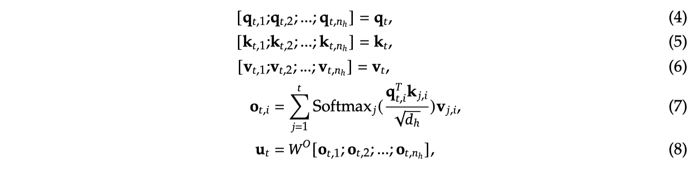

# DeepSeek-V2: A Strong, Economical, and Efficient Mixture-of-Experts Language Model

## Abstract

We present DeepSeek-V2, a strong Mixture-of-Experts (MoE) language model
characterized by economical training and efficient inference. It comprises 236B
total parameters, of which 21B are activated for each token, and supports a
context length of 128K tokens. DeepSeek-V2 adopts innovative architectures
including Multi-head Latent Attention (MLA) and DeepSeekMoE. MLA guarantees
efficient inference through significantly compressing the Key-Value (KV) cache
into a latent vector, while DeepSeekMoE enables training strong models at an
economical cost through sparse computation. Compared with DeepSeek 67B,
DeepSeek-V2 achieves significantly stronger performance, and meanwhile saves
42.5% of training costs, reduces the KV cache by 93.3%, and boosts the maximum
generation throughput to 5.76 times. We pretrain DeepSeek-V2 on a high-quality
and multi-source corpus consisting of 8.1T tokens, and further perform
Supervised Fine-Tuning (SFT) and Reinforcement Learning (RL) to fully unlock
its potential. Evaluation results show that, even with only 21B activated
parameters, DeepSeek-V2 and its chat versions still achieve top-tier
performance among open-source models.

https://spaces.ac.cn/archives/10091/comment-page-1

## Multi-head Latent Attention (MLA)

### Preliminaries: Standard Multi-Head Attention
经典的MHA的计算方式如下：

需要将历史的KV 进行缓存，这里省略了RoPE编码，实际首先对KV进行RoPE编码，然后再保存KV Cache。

### Low-Rank Key-Value Joint Compression
作为对比，使用MLA:

KV的需要经过两次Linear运算才能得到，只保存$C_t^{KV}$，在推理时，首先根据$C_t^{KV}$映射为KV，然后再进行MHA的运算。
另外，也对Q进行了Low-Rank运算，虽然不能减少Cache，但是能减少training中的激活值的Memory。

保存的KV cache对比如下图所示：

### Decoupled Rotary Position Embedding
然而，Low-Rank与RoPE不兼容，