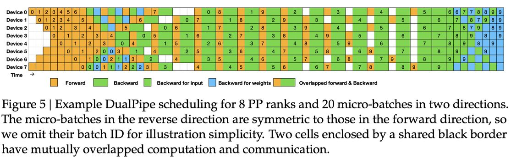

# DeepSeek-V3 Technical Report

> **一句话总结**：DeepSeek-V3 是一个拥有 671B 总参数、每次推理激活 37B 参数的大型混合专家（MoE）语言模型，通过 MLA、DeepSeekMoE、无辅助损失负载均衡和多 token 预测等创新技术，在仅 2.788M H800 GPU 小时（约 557.6 万美元）的极低成本下完成训练，性能达到与 GPT-4o 和 Claude-3.5-Sonnet 可比的水平，成为当时最强的开源基础模型。

---

## 摘要翻译

我们提出了 DeepSeek-V3，一个强大的混合专家（MoE）语言模型，拥有 671B 总参数，每次推理激活 37B 参数。为了实现高效推理和经济高效的训练，DeepSeek-V3 采用了多头潜在注意力（MLA）和 DeepSeekMoE 架构，这些架构在 DeepSeek-V2 中已经过充分验证。此外，DeepSeek-V3 率先采用无辅助损失的负载均衡策略，并设置了多 token 预测训练目标以获得更强的性能。我们在 14.8 万亿个多样且高质量的 token 上对 DeepSeek-V3 进行了预训练，随后通过监督微调和强化学习阶段来充分发挥其能力。全面评估表明，DeepSeek-V3 在性能上超越了其他开源模型，并达到了与领先的闭源模型可比的水平。尽管性能优异，DeepSeek-V3 的完整训练仅需 2.788M H800 GPU 小时。此外，其训练过程非常稳定，在整个训练过程中未经历任何不可恢复的损失尖峰或进行任何回滚。模型权重已在 https://github.com/deepseek-ai/DeepSeek-V3 开源。

---

## 研究动机

近年来，大语言模型（LLM）经历了快速迭代和演进，逐步缩小与通用人工智能（AGI）之间的差距。除了闭源模型外，开源模型（包括 DeepSeek 系列、LLaMA 系列、Qwen 系列和 Mistral 系列）也在取得显著进展，努力缩小与闭源模型的差距。为了进一步推动开源模型能力的边界，DeepSeek-AI 团队将模型规模扩大到 671B 参数（每次推理激活 37B），以在保持强大性能的同时实现经济高效的训练和推理。

**核心研究动机**包括：

1. **性能与成本的平衡**：在追求强大模型性能的同时，保持经济的训练成本。传统的大模型训练动辄需要数千万美元的计算资源，限制了模型的可复现性和开放性。
2. **推理效率**：通过高效的架构设计（如 MLA）减少推理时的 KV 缓存开销，实现更高效的推理。
3. **训练效率**：通过算法、框架和硬件的协同设计，克服跨节点 MoE 训练中的通信瓶颈，实现近全计算-通信重叠。
4. **开源贡献**：为社区提供一个在性能上可与闭源模型匹敌的开源基础模型，推动整个领域的研究和发展。

---

## 方法（技术细节）

### 1. 模型架构

#### 1.1 多头潜在注意力（Multi-Head Latent Attention, MLA）

MLA 是 DeepSeek-V3 的核心注意力架构，通过低秩联合压缩键和值来减少推理时的 KV 缓存：

- **KV 压缩**：将键和值通过低秩投影压缩到潜在向量 $c_{KV}^t \in \mathbb{R}^{d_c}$，其中 $d_c \ll d_h n_h$（KV 压缩维度远小于原始维度）。
- **解耦 RoPE**：为了在压缩 KV 的同时保持位置编码，MLA 将键分为两部分：压缩的 $k^C_t$ 和携带 RoPE 的 $k^R_t$。
- **推理缓存优化**：推理时只需缓存压缩的潜在向量 $c_{KV}^t$ 和解耦的 $k^R_t$，显著减少了 KV 缓存的内存占用。
- **查询压缩**：查询也进行低秩压缩，减少训练时的激活内存。

#### 1.2 DeepSeekMoE 与无辅助损失负载均衡

- **细粒度专家**：使用比传统 MoE（如 GShard）更细粒度的专家，隔离部分专家为共享专家。
- **无辅助损失负载均衡**：DeepSeek-V3 率先采用无辅助损失的负载均衡策略，避免了传统辅助损失对模型性能的负面影响。该策略通过为每个专家引入一个偏置项来平衡负载，而不是通过损失函数惩罚不均衡。
- **路由机制**：每个 token 通过路由器选择 Top-K 个路由专家，计算路由权重并归一化。
- **训练损失**：结合辅助损失（包含负载均衡损失、设备级负载均衡损失、通信损失等）来确保各专家的负载均衡。

#### 1.3 多 Token 预测（Multi-Token Prediction, MTP）

- **预测目标**：除了预测下一个 token 外，DeepSeek-V3 额外预测后续的 2 个 token，通过多个 MTP 模块实现。
- **架构设计**：每个 MTP 模块包含一个线性投影层、共享嵌入层和共享输出头，以及一个 Transformer 块。
- **训练损失**：计算所有深度的交叉熵损失并取平均，加权后作为额外的训练目标。
- **推理加速**：MTP 模块可以用于投机解码（speculative decoding），实现 1.8 倍的 TPS（tokens per second）加速，第二 token 预测的接受率为 85%-90%。

### 2. 训练基础设施

#### 2.1 计算集群

- **硬件配置**：2048 个 NVIDIA H800 GPU，每个节点 8 个 GPU，通过 NVLink 和 NVSwitch 互联。
- **并行策略**：16 路流水线并行（PP）、64 路专家并行（EP）、ZeRO-1 数据并行（DP）。
- **训练框架**：HAI-LLM 框架，从底层构建的高效轻量训练框架。

#### 2.2 DualPipe 算法

- **核心思想**：在前向和反向计算-通信阶段之间实现重叠，减少流水线气泡。
- **双向调度**：将每个 chunk 分为注意力、all-to-all dispatch、MLP 和 all-to-all combine 四个组件，通过双向调度实现计算-通信重叠。
- **优势**：与 ZB1P 和 1F1B 相比，DualPipe 显著减少流水线气泡，仅增加峰值激活内存 1/PP 倍。

#### 2.3 跨节点 All-to-All 通信优化

- **通信内核**：定制高效跨节点 all-to-all 通信内核，充分利用 IB 和 NVLink 带宽。
- **Warp 特化**：将 20 个 SM 分为 10 个通信通道，通过 warp 特化技术处理 IB 发送、IB-to-NVLink 转发和 NVLink 接收。
- **动态调整**：根据实际工作负载动态调整每个通信任务的 warp 分配。

#### 2.4 FP8 混合精度训练

- **混合精度框架**：大多数计算密集型操作（GEMM）在 FP8 精度下执行，关键操作保持原始精度。
- **前向传播**：Fprop、Dgrad、Wgrad 均在 FP8 下执行，理论上将计算速度翻倍。
- **细粒度量化**：采用 tile-wise（1×Nc）或 block-wise（Nc×Nc）分组的细粒度量化策略，扩展 FP8 的动态范围。
- **精度保证**：与 BF16 基线相比，FP8 训练模型的相对损失误差始终低于 0.25%。
- **内存优化**：在 MoE 训练中缓存和调度 FP8 激活，将低精度优化器状态存储在 BF16 中。

#### 2.5 内存优化

- **RMSNorm 和 MLA 上投影重计算**：在反向传播时重计算所有 RMSNorm 操作和 MLA 上投影，消除持久存储输出激活的需求。
- **EMA 存储在 CPU**：模型参数的指数移动平均（EMA）存储在 CPU 内存中，异步更新。
- **共享嵌入和输出头**：MTP 模块与主模型共享嵌入层和输出头，减少内存占用。

### 3. 预训练

- **数据规模**：14.8 万亿个多样且高质量的 token。
- **训练成本**：预训练阶段 2664K H800 GPU 小时（每万亿 token 180K GPU 小时，约 3.7 天）。
- **上下文扩展**：两阶段扩展训练，支持最长 128K 上下文长度。
- **Post-training**：SFT + RL，仅需 5K GPU 小时，总计 2.788M GPU 小时。
- **总成本**：约 557.6 万美元（按 H800 GPU $2/小时计算）。

### 4. 后训练

- **监督微调（SFT）**：使用高质量的指令数据进行微调。
- **强化学习（RL）**：
  - 奖励模型：采用 Constitutional AI 方法，利用 DeepSeek-V3 自身的投票评估结果作为反馈源。
  - 组相对策略优化（GRPO）：Group Relative Policy Optimization。
- **从 DeepSeek-R1 蒸馏**：将 R1 的推理能力蒸馏到 V3 中，显著提升推理性能。
- **自奖励（Self-Rewarding）**：利用 LLM 作为通用处理器，将非结构化信息转化为奖励，实现 LLM 的自我改进。

---

## 实验结果

### 基础模型（Base Model）评估

| 基准测试 | DeepSeek-V2 | Qwen2.5-72B | LLaMA-3.1-405B | **DeepSeek-V3** |
|----------|------------|------------|----------------|----------------|
| MMLU (5-shot) | 78.4 | 85.0 | 84.4 | **87.1** |
| MMLU-Pro (5-shot) | 51.4 | 58.3 | 52.8 | **64.4** |
| BBH (3-shot) | 78.8 | 79.8 | 82.9 | **87.5** |
| DROP (F1) | 80.4 | 80.6 | 86.0 | **89.0** |
| HumanEval (0-shot) | 43.3 | 53.0 | 54.9 | **65.2** |
| MBPP (3-shot) | 65.0 | 72.6 | 68.4 | **75.4** |
| MATH (4-shot) | 43.4 | 54.4 | 49.0 | **61.6** |
| GSM8K (8-shot) | 81.6 | 88.3 | 83.5 | **89.3** |
| C-Eval (5-shot) | 81.4 | 89.2 | 72.5 | **90.1** |
| MMMLU-non-English (5-shot) | 64.0 | 74.8 | 73.8 | **79.4** |

DeepSeek-V3-Base 在大多数基准测试中取得最佳性能，尤其在数学和代码任务上表现突出。

### 聊天模型（Chat Model）评估

| 基准测试 | DeepSeek-V3 | GPT-4o-0513 | Claude-3.5-Sonnet |
|----------|------------|-------------|-------------------|
| MMLU-Pro (EM) | **75.9** | 72.6 | 73.3 |
| GPQA-Diamond (Pass@1) | **59.1** | 49.9 | 51.1 |
| MATH 500 (EM) | **90.2** | 74.6 | 73.8 |
| AIME 2024 (Pass@1) | **39.2** | 9.3 | 23.3 |
| Codeforces (Percentile) | **51.6** | 23.6 | 25.3 |
| SWE-bench Verified | **42.0** | 38.8 | 24.5 |

**关键发现**：
1. **知识领域**：在 MMLU、MMLU-Pro 和 GPQA 等教育基准上超越所有开源模型，与 GPT-4o 和 Claude-3.5-Sonnet 性能可比。
2. **代码与数学**：在数学相关基准（MATH-500）上甚至超越 o1-preview，在编码竞赛基准（LiveCodeBench）上表现最佳。
3. **中文事实知识**：在中文事实知识（Chinese SimpleQA）上超越 GPT-4o 和 Claude-3.5-Sonnet。
4. **多 token 预测加速**：第二 token 预测接受率 85%-90%，实现 1.8 倍 TPS 加速。

### 训练效率对比

- **训练成本**：2.788M H800 GPU 小时（约 557.6 万美元），远低于同等规模模型。
- **每万亿 token 成本**：180K GPU 小时，约 3.7 天。
- **训练稳定性**：整个训练过程中无不可恢复的损失尖峰，无需回滚。

---

## 优势

1. **极高的训练效率**：通过 FP8 混合精度训练、DualPipe 流水线并行、高效跨节点通信等技术，将训练成本控制在极低水平（约 557.6 万美元）。
2. **无辅助损失负载均衡**：率先采用无辅助损失的负载均衡策略，避免了传统辅助损失对模型性能的负面影响，实现更好的专家负载均衡。
3. **多 token 预测**：通过 MTP 训练目标增强模型性能，同时可用于投机解码实现推理加速（1.8 倍 TPS）。
4. **强大的性能表现**：在多个基准测试上超越所有开源模型，与 GPT-4o 和 Claude-3.5-Sonnet 可比。
5. **稳定的训练过程**：整个训练过程中无不可恢复的损失尖峰，无需回滚。
6. **开源与可复现**：完整模型权重和训练代码开源，降低研究门槛。
7. **高效推理**：MLA 架构显著减少 KV 缓存，DeepSeekMoE 细粒度专家设计提升推理效率。
8. **FP8 训练验证**：首次在超大规模模型上验证 FP8 训练的可行性和有效性。
9. **128K 上下文**：支持最长 128K 上下文长度，在 "Needle In A Haystack" 测试中表现一致稳定。
10. **中文能力突出**：在中文事实知识等任务上超越领先的闭源模型。

---

## 局限

1. **Transformer 架构限制**：仍受限于 Transformer 架构的固有局限性，团队计划探索突破性架构以推动建模能力边界。
2. **深度推理能力有限**：虽然后训练中从 DeepSeek-R1 蒸馏了推理能力，但深度推理能力仍有提升空间，需要通过扩展推理长度和深度来增强。
3. **评估方法局限**：当前评估方法可能偏向于优化固定基准测试集，可能对模型能力产生误导性印象，需要更全面和多维度的评估方法。
4. **训练成本仍高**：虽然相对经济（约 557.6 万美元），但绝对成本仍然较高，限制了小型团队的可复现性。
5. **推理部署复杂度**：671B 参数的模型需要大规模 GPU 集群进行部署，对基础设施要求较高。
6. **专家负载均衡的潜在问题**：虽然无辅助损失策略已优化，但在极端情况下仍可能出现专家负载不均衡的问题。
7. **上下文长度限制**：虽然支持 128K 上下文，但无限上下文长度仍是一个挑战。
8. **数据质量和多样性**：训练数据主要以中英文为主，多语言能力虽有提升但仍有优化空间。
9. **自奖励方法的局限**：Constitutional AI 方法依赖于模型自身的评估能力，可能存在自我偏差问题。

---

## 与 EfficientPaper 相关的研究方向

1. **高效 MoE 架构设计**：DeepSeekMoE 的细粒度专家和共享专家设计为 MoE 架构的优化提供了新思路，与 EfficientPaper 中的结构设计（structure_design）方向高度相关。
2. **低精度训练**：FP8 混合精度训练框架的成功验证为大模型高效训练提供了新的范式，与 EfficientPaper 中的训练效率研究方向一致。
3. **推理效率优化**：MLA 架构通过低秩压缩 KV 缓存实现高效推理，多 token 预测实现投机解码加速，与 EfficientPaper 中的推理效率研究方向相关。
4. **并行训练策略**：DualPipe 算法和高效的跨节点通信优化为大规模并行训练提供了新方案，与 EfficientPaper 中的训练框架优化方向相关。
5. **负载均衡策略**：无辅助损失负载均衡策略为 MoE 模型的负载均衡提供了新方法，与 EfficientPaper 中的结构设计方向相关。
6. **知识蒸馏与自我改进**：从 DeepSeek-R1 的推理能力蒸馏和自奖励方法为模型自我改进提供了新途径，与 EfficientPaper 中的训练方法研究方向相关。
7. **成本效益分析**：DeepSeek-V3 的极低训练成本（约 557.6 万美元）为大模型的经济性分析提供了重要参考，与 EfficientPaper 中的效率评估方向相关。
8. **长上下文处理**：128K 上下文支持和上下文扩展技术为长上下文处理提供了新方案，与 EfficientPaper 中的模型能力研究方向相关。
9. **硬件-算法协同设计**：DeepSeek-V3 的算法-框架-硬件协同设计理念与 EfficientPaper 中的效率优化方向高度相关。
10. **开源模型性能基准**：DeepSeek-V3 在多个基准测试上超越开源模型并与闭源模型可比的性能为 EfficientPaper 的性能评估提供了重要参考。

---

## AI 生成声明

> **本笔记由 AI Agent（Hermes Agent）基于 arXiv 论文 `2412.19437v1` 自动生成。** 笔记内容基于论文原文的结构化提取和整理，包括摘要翻译、研究动机、方法技术细节、实验结果、优势、局限以及与 EfficientPaper 相关的研究方向分析。所有内容均来源于论文原文，AI 生成的分析和总结仅供参考。如需引用论文内容，请以原始论文为准。

---

*最后更新：2026年6月5日*
*论文来源：arXiv:2412.19437v1*
*代码仓库：https://github.com/deepseek-ai/DeepSeek-V3*
