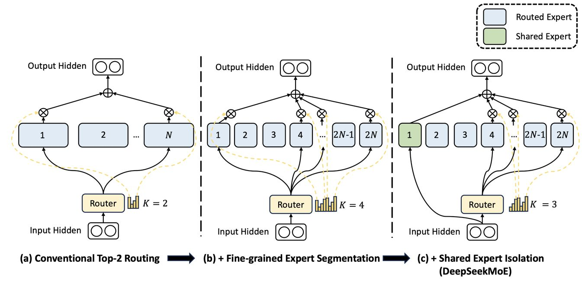

# DeepSeekMoE: Towards Ultimate Expert Specialization in Mixture-of-Experts Language Models

> **一句话总结**：DeepSeekMoE 提出了一种面向终极专家特化的 MoE 架构，通过细粒度专家分割（Fine-Grained Expert Segmentation）和共享专家隔离（Shared Expert Isolation）两大核心策略，以仅 2B 参数规模验证了其性能接近 MoE 模型的理论上界，并在 16B 规模下以约 40% 的计算量达到 LLaMA2 7B 的性能水平，在 145B 规模下以 28.5%（甚至 18.2%）的计算量匹配 DeepSeek 67B 的性能。

---

## 摘要翻译

在大语言模型时代，混合专家（Mixture-of-Experts, MoE）是一种有前景的架构，用于在扩展模型参数时管理计算成本。然而，传统的 MoE 架构（如 GShard）在从 $N$ 个专家中激活 Top-$K$ 个时，面临确保专家特化的挑战，即每个专家应获取非重叠且聚焦的知识。为此，我们提出了 DeepSeekMoE 架构，旨在实现终极专家特化。该架构包含两个主要策略：（1）将专家细分为 $mN$ 个，并从中激活 $mK$ 个，允许更灵活的激活专家组合；（2）隔离 $K_s$ 个专家作为共享专家，旨在捕获共同知识并减轻路由专家的冗余。从 2B 参数规模开始，我们证明 DeepSeekMoE 2B 在性能上可与 GShard 2.9B 相媲美，后者拥有 1.5 倍的专家参数和计算量。此外，DeepSeekMoE 2B 几乎接近其具有相同总参数量的稠密对应模型的性能，后者设定了 MoE 模型的理论上限。随后，我们将 DeepSeekMoE 扩展至 16B 参数，表明其在仅约 40% 的计算量下即可达到与 LLaMA2 7B 相当的性能。进一步地，我们将 DeepSeekMoE 初步扩展至 145B 参数，一致性地验证了其相对于 GShard 架构的显著优势，并显示出与 DeepSeek 67B 相当的性能，仅需 28.5%（甚至 18.2%）的计算量。

---

## 研究动机

随着大语言模型（LLM）参数规模的不断扩展，计算成本也急剧增加。混合专家（MoE）架构通过在推理时仅激活部分参数，为参数扩展与计算效率之间的平衡提供了有效方案。然而，现有的 MoE 架构（如 GShard、Switch Transformer）存在两个关键问题：

1. **知识混合性（Knowledge Hybridity）**：由于专家数量有限（如 8 或 16 个），分配到特定专家的 token 往往涵盖多种不同类型的知识，导致该专家在其参数中混入大量异质知识，难以同时有效利用。
2. **知识冗余性（Knowledge Redundancy）**：分配到不同专家的 token 可能需要共同的知识，导致多个专家在各自参数中收敛于共享知识，造成参数冗余。

这两个问题共同限制了 MoE 模型中每个专家的特化程度，使其无法达到理论上的性能上限。因此，如何设计一种架构以实现终极专家特化，是 MoE 研究领域的核心挑战。

---

## 方法（技术细节）

### 1. 总体架构

DeepSeekMoE 基于标准 Transformer 语言模型，将部分 FFN 层替换为 MoE 层。每个 MoE 层由多个专家组成，每个专家结构上等同于一个标准 FFN。核心创新在于两大策略：细粒度专家分割和共享专家隔离。

### 2. 细粒度专家分割（Fine-Grained Expert Segmentation）

**核心思想**：在保持专家总参数量和计算成本不变的前提下，将每个专家 FFN 的中间隐藏维度缩小为原来的 $1/m$，从而将专家细分为 $m$ 个更小的专家。相应地，激活专家数量从 $K$ 增加到 $mK$，以保持计算成本不变。

**数学形式化**：DeepSeekMoE 的 MoE 层输出为：

$$h_t^l = \sum_{i=1}^{mN} (g_{i,t} \cdot \text{FFN}_i(u_t^l)) + u_t^l$$

其中 $g_{i,t}$ 为门控值，仅在 $s_{i,t}$ 属于 Top-$mK$ 时非零。$N$ 为原始专家数量，$mN$ 为细粒度后的总专家数量。

**组合灵活性**：以 $N=16$ 为例，标准 Top-2 路由可产生 $\binom{16}{2}=120$ 种组合；若每个专家分割为 4 个小专家，则细粒度路由可产生 $\binom{64}{8}=4,426,165,368$ 种潜在组合，极大提升了激活专家的组合灵活性。

### 3. 共享专家隔离（Shared Expert Isolation）

**核心思想**：隔离 $K_s$ 个专家作为共享专家，这些专家对每个 token 始终激活（不经过路由器），用于捕获跨不同上下文的公共知识。其余路由专家的激活数量相应减少 $K_s$，以保持计算成本不变。

**数学形式化**：

$$h_t^l = \sum_{i=1}^{K_s} \text{FFN}_i(u_t^l) + \sum_{i=K_s+1}^{mN} (g_{i,t} \cdot \text{FFN}_i(u_t^l)) + u_t^l$$

其中共享专家直接激活，路由专家通过 Top-$(mK-K_s)$ 选择。

**关键区别**：共享专家隔离的原型可追溯至 Rajbhandari et al. (2022)，但其从工程角度出发；而 DeepSeekMoE 从算法角度提出，强调专家特化。

### 4. 负载均衡策略

**专家级平衡损失**：防止路由坍缩，确保每个专家被均匀选择。

$$\mathcal{L}_{\text{ExpBal}} = \alpha_1 \cdot \frac{1}{N'} \sum_{i=1}^{N'} f_i \cdot P_i$$

其中 $f_i$ 为专家 $i$ 被选择的频率，$P_i$ 为专家 $i$ 的平均路由概率。

**设备级平衡损失**：在多设备部署时，确保各设备的计算负载均衡，避免计算瓶颈。

$$\mathcal{L}_{\text{DevBal}} = \alpha_2 \cdot \sum_{i=1}^{D} f'_i \cdot P'_i$$

实践中，专家级平衡因子 $\alpha_1$ 设为较小值（如 0.001），以避免对模型性能的负面影响。

### 5. 模型配置

**DeepSeekMoE 2B**：总参数 2.0B，1 个共享专家 + 63 个路由专家，激活 1+7=8 个专家。每个专家为标准 FFN 的 0.25 倍大小。

**DeepSeekMoE 16B**：28 层 Transformer，隐藏维度 2048，16 个注意力头。2 个共享专家 + 64 个路由专家，激活 2+6=8 个专家。总参数约 16.4B，激活参数约 2.8B。训练 2T token。

**DeepSeekMoE 145B**：62 层 Transformer，隐藏维度 4096，32 个注意力头。4 个共享专家 + 128 个路由专家，激活 4+12=16 个专家。总参数约 144.6B，激活参数约 22.2B。初步训练 245B token。

---

## 实验结果

### 验证实验（2B 规模）

在 12 个零样本/少样本基准测试上，DeepSeekMoE 2B 与 GShard 2B、GShard 2.9B、Dense 0.2B 等模型进行对比：

| 模型 | 总参数 | 激活参数 | Pile Loss | HellaSwag | PIQA | ARC-easy | ARC-challenge | TriviaQA EM |
|------|--------|---------|-----------|-----------|------|----------|---------------|-------------|
| Dense | 0.2B | 0.2B | 2.060 | 38.8 | 66.8 | 41.0 | 26.0 | 4.9 |
| Hash Layer | 2.0B | 0.2B | 1.932 | 46.2 | 68.4 | 45.3 | 28.2 | 6.5 |
| Switch | 2.0B | 0.2B | 1.881 | 49.1 | 70.5 | 45.9 | 30.2 | 8.9 |
| GShard | 2.0B | 0.3B | 1.867 | 50.5 | 70.6 | 43.9 | 31.6 | 10.2 |
| **DeepSeekMoE** | 2.0B | 0.3B | **1.808** | **54.8** | **72.3** | **49.4** | **34.3** | **16.6** |

**关键发现**：
- DeepSeekMoE 2B 在所有指标上大幅超越 GShard 2B。
- DeepSeekMoE 2B 可与 GShard 2.9B（1.5 倍专家参数和计算量）相媲美。
- DeepSeekMoE 2B 几乎接近其稠密对应模型（Dense×16）的性能，后者设定了 MoE 模型的理论上限。

### 16B 规模实验

**与 DeepSeek 7B 对比**：DeepSeekMoE 16B 在仅约 40.5% 的计算量下达到与 DeepSeek 7B 相当的性能。在语言建模和知识密集型任务（Pile、HellaSwag、TriviaQA）上表现突出，但在多选任务（MMLU、CEval）上存在局限。

**与 LLaMA2 7B 对比**：DeepSeekMoE 16B 在仅 39.6% 的计算量下，在多数基准测试上超越 LLaMA2 7B，尤其在数学推理、代码生成和中文任务上优势明显。

**Open LLM Leaderboard**：DeepSeekMoE 16B 一致性地大幅超越具有相似激活参数的模型，并达到与 LLaMA2 7B（激活参数约为 2.5 倍）相当的性能。

**部署优势**：DeepSeekMoE 16B 可在单卡 40GB GPU 上部署，经优化后推理速度可达 7B 稠密模型的 2.5 倍。

### 145B 规模实验（初步结果）

- DeepSeekMoE 145B 与 GShard 137B 对比：在可比的总参数和计算量下，DeepSeekMoE 145B 显著优于 GShard 137B。
- 与 DeepSeek 67B 对比：在仅 28.5% 的计算量下达到相当的性能。
- DeepSeekMoE 142B（Half Activated）：在仅 18.2% 的计算量下匹配 DeepSeek 67B 的性能。

### 消融实验

- **共享专家隔离**：基于 GShard 隔离 1 个共享专家后，大部分基准测试性能提升。
- **细粒度专家分割**：持续细化专家分割粒度（2 倍→4 倍），整体性能持续增强。
- **共享与路由专家比例**：不同比例（1:3、1:2、1:1）对性能影响不大，Pile Loss 分别为 1.808、1.806、1.811。

### 专家特化分析

- **路由专家冗余低**：禁用不同比例的顶级路由专家后，DeepSeekMoE 的 Pile Loss 变化更敏感，说明路由专家之间的冗余更低。
- **专家特化程度高**：每个路由专家学习到的知识更加聚焦和非重叠。

---

## 优势

1. **终极专家特化**：通过细粒度专家分割和共享专家隔离，实现专家知识的高效分解和聚焦学习，使每个专家具有高度特化性。
2. **极高的计算效率**：在 16B 规模下仅需约 40% 的计算量即可达到 LLaMA2 7B 的性能，145B 规模下仅需 28.5%（甚至 18.2%）的计算量。
3. **接近 MoE 理论上限**：DeepSeekMoE 2B 几乎接近其稠密对应模型的性能，验证了架构设计的有效性。
4. **可扩展性强**：从 2B 到 16B 再到 145B，一致性地验证了架构优势。
5. **推理高效**：16B 模型可在单卡 40GB GPU 上部署，推理速度可达 7B 稠密模型的 2.5 倍。
6. **良好的可适配性**：成功进行 SFT 对齐，构建了具有竞争力的聊天模型。
7. **开源**：模型权重公开发布，促进研究可复现性。
8. **组合灵活性**：细粒度分割大幅增加激活专家的组合数，提升知识获取的准确性和针对性。
9. **冗余缓解**：共享专家隔离有效减少路由专家之间的参数冗余。
10. **双语能力**：支持中英文双语，中文任务表现突出。

---

## 局限

1. **注意力参数不足**：在 16B 规模下，注意力参数仅约 0.5B（而 DeepSeek 7B 有 2.5B），导致在多选任务（如 MMLU、CEval）上表现不佳。
2. **专家粒度限制**：过小的专家尺寸可能降低计算效率，因此 16B 规模未使用更细的分割粒度。
3. **训练数据规模依赖**：145B 模型仅训练了 245B token（初步实验），可能未充分收敛。
4. **路由机制限制**：依赖基于 token-to-expert 亲和度的 Top-K 路由，可能在某些场景下无法实现最优分配。
5. **负载均衡约束**：虽然有平衡损失，但在极端情况下仍可能出现路由坍缩或设备负载不均。
6. **推理内存开销**：虽然激活参数较少，但总参数量大，需要大规模 GPU 集群进行训练和部署。
7. **缺少更全面的评估**：145B 模型的评估仅基于初步结果，缺少完整的后训练和对齐评估。
8. **通用性限制**：论文主要关注语言建模任务，未充分探索多模态或其他下游任务的表现。

---

## 与 EfficientPaper 相关的研究方向

1. **结构设计（structure_design）**：DeepSeekMoE 的细粒度专家分割和共享专家隔离策略是 MoE 架构结构设计的重要创新，与 EfficientPaper 中的结构设计方向高度相关。该论文为后续 MoE 架构优化（如 DeepSeek-V2/V3 的改进）奠定了基础。
2. **稀疏激活与计算效率**：DeepSeekMoE 通过稀疏激活实现高效推理，与 EfficientPaper 中的高效推理研究方向一致。其在 16B 规模下仅需约 40% 计算量的成果，为模型效率优化提供了重要参考。
3. **专家特化与知识分解**：论文提出的专家特化概念（每个专家学习非重叠且聚焦的知识）为 MoE 模型的知识管理提供了新思路，与 EfficientPaper 中的模型能力研究方向相关。
4. **负载均衡策略**：专家级和设备级平衡损失的设计，为 MoE 模型在多设备部署时的负载均衡提供了方法，与 EfficientPaper 中的训练框架优化方向相关。
5. **模型可扩展性**：从 2B 到 145B 的扩展实验，为 MoE 模型的可扩展性研究提供了重要数据支持，与 EfficientPaper 中的模型规模研究方向一致。
6. **单卡部署**：DeepSeekMoE 16B 可在单卡 40GB GPU 上部署的设计，与 EfficientPaper 中的高效推理部署方向相关。
7. **与 DeepSeek-V3 的关系**：DeepSeekMoE 是 DeepSeek-V3 的基础架构，DeepSeek-V3 在此基础上引入 MLA、无辅助损失负载均衡等进一步优化，与 EfficientPaper 中的结构设计方向高度一致。
8. **MoE 路由优化**：论文中的 Top-K 路由策略和负载均衡损失为后续 MoE 路由优化研究（如动态路由、自适应路由）提供了参考。
9. **训练效率**：DeepSeekMoE 通过稀疏架构实现训练效率提升，与 EfficientPaper 中的训练效率研究方向相关。
10. **专家共享机制**：共享专家隔离策略为 MoE 模型的参数效率提供了新方法，与 EfficientPaper 中的模型压缩和参数优化方向相关。

---

## AI 生成声明

> **本笔记由 AI Agent（Hermes Agent）基于 arXiv 论文 `2401.06066v1` 自动生成。** 笔记内容基于论文原文的结构化提取和整理，包括摘要翻译、研究动机、方法技术细节、实验结果、优势、局限以及与 EfficientPaper 相关的研究方向分析。所有内容均来源于论文原文，AI 生成的分析和总结仅供参考。如需引用论文内容，请以原始论文为准。

---

*最后更新：2026年6月5日*
*论文来源：arXiv:2401.06066v1*
*代码仓库：https://github.com/deepseek-ai/DeepSeek-MoE*
*关键词：structure_design*
