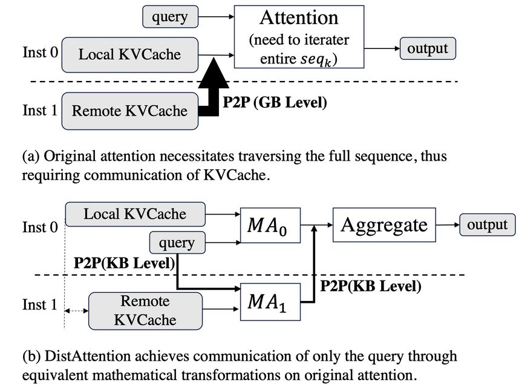

# Infinite-LLM: Efficient LLM Service for Long Context with DistAttention and Distributed KVCache

## 一句话总结

Infinite-LLM 提出了一种基于 DistAttention 的分布式注意力解耦机制，将注意力层从 LLM 推理过程中分离，实现集群级 KVCache 调度和弹性资源管理，在 32 块 A100 GPU 集群上支持最长 2000K tokens 的上下文，吞吐量相比现有最优方法提升 1.35-3.4 倍。

## 摘要翻译

大型语言模型（LLM）通过请求服务在众多领域展现出巨大潜力。然而，随着上下文长度不断扩展，LLM 的自回归特性导致注意力层行为高度动态，其计算特征和内存需求与非注意力层存在显著差异。这给服务系统中的资源管理和性能优化带来了巨大挑战。现有的静态模型并行和资源分配策略在应对这种动态性时表现不足。为解决此问题，我们提出 Infinite-LLM，一种专为有效处理动态上下文长度而设计的新型 LLM 服务系统。Infinite-LLM 将注意力层从 LLM 的推理过程中解耦，实现灵活独立的资源调度，以联合优化计算性能和内存利用率。通过利用集群范围内的 GPU 内存池化策略，Infinite-LLM 不仅显著提升了系统吞吐量，还支持超长上下文长度。在 32 块 A100 GPU 集群上，使用上下文长度从几 tokens 到 2000K tokens 的数据集进行评估，Infinite-LLM 相比现有最优方法实现了 1.35-3.4 倍的吞吐量提升，实现了高效且弹性的 LLM 部署。

## 研究动机

### LLM 服务的动态性挑战

当前 LLM 服务采用自回归机制逐个生成输出 token 和中间上下文（KVCache）。自回归特性导致生成的 token 序列具有不可预测性——生成过程持续到产生 EOS token 为止。因此，LLM 服务所需的内存和计算资源会动态变化，其生命周期和上下文长度均无法预先得知。随着 LLM 的快速发展，支持的上下文长度不断扩展（如 ChatGPT 128K、Gemini 1000K、LongRoPE 2000K），这使得资源需求的动态性更加突出。

### 两个核心问题

**1. 实例内部的低效模型并行**

传统 LLM 服务系统采用固定模型并行策略，每个实例分配固定数量的 GPU。这种固定分配使得灵活支持短上下文和长上下文变得困难。例如，在 Llama-7B 模型上处理 1K token 上下文仅需约 15GB 内存（单块 A100 GPU 即可），而 1000K token 上下文则需要超过 500GB（约 7 块 A100 GPU）。为长请求配置高并行度会导致短请求的模型切片过度，严重影响性能。

**2. 跨实例的低效资源管理**

由于请求长度的动态变化，调度器难以找到最优的请求放置方案来同时饱和内存和计算利用率。当某个实例上的请求过长时，其 KVCache 会消耗过多内存，导致批处理大小和计算利用率下降；而短请求实例的闲置内存也无法被长请求利用，整体集群吞吐量受限。

### 根因分析

通过深入分析 LLM 模型的计算特征，作者发现挑战的根源在于注意力层与非注意力层的显著差异：非注意力层在序列长度变化时表现出静态行为且对批处理大小敏感；而注意力层表现出动态行为且不受批处理大小影响。这一发现为 DistAttention 的设计提供了核心洞察。

## 方法（技术细节）

### DistAttention 分布式注意力机制

DistAttention 是 Infinite-LLM 的核心技术创新，它通过数学等价变换将注意力计算沿序列维度分片，使得注意力层可以高效地跨 GPU 分布式计算，同时避免了 KVCache 在解码时的大量传输。

#### 数学原理

原始注意力计算公式为：

$$m_g = \max(QK^T_1, ..., QK^T_{seq})$$
$$Attention(Q,K,V) = \sum_{i=1}^{seq} \frac{\exp(QK^T_i - m_g)}{\sum_{j=1}^{seq} \exp(QK^T_j - m_g)} V_i$$

直接对 KVCache 进行分片会导致每次注意力计算都需要将远程 KVCache 传输回本地实例（GB 级通信），严重影响分布式注意力计算的效率。

DistAttention 借鉴 Online Softmax 的思想，对原始注意力进行等价数学变换。它允许每个实例在部分序列长度 $seq_p$ 上局部执行 max 和求和操作：

$$m_j = \max(QK^T_1, ..., QK^T_{seq_p}), e_j = \sum_{i=1}^{seq_p} \exp(QK^T_i - m_j)$$
$$MA_j(Q,K,V) = \sum_{i=1}^{seq_p} (\exp(QK^T_i - m_j)V_i)$$

$$m_g = \max(m_1, ..., m_b), e_g = \sum_{j=1}^{b} e_j \exp(m_j - m_g)$$
$$Attention(Q,K,V) = \sum_{j=1}^{b} \frac{MA_j \exp(m_j - m_g)}{e_g}$$

这样，远程实例只需传输查询向量和两个浮点值（$e_j$ 和 $m_j$），而聚合计算的 FLOPs 不到总 MA 计算负载的 1%，开销几乎可以忽略不计。通信量从 GB 级降低到 KB 级，相比传输 KVCache，通信开销降低了约 20 倍。

#### 关键特性

- **数学等价性**：DistAttention 与原始注意力在数学上完全等价，不损失模型精度
- **灵活性**：沿序列维度切分，支持任意大小的序列长度分片
- **低通信开销**：仅需传输 query 向量（KB 级），而非 KVCache（GB 级）
- **兼容性**：适用于多头注意力（MHA）、多查询注意力（MQA）和分组查询注意力（GQA）

### 集群级吞吐量优化

DistAttention 使 Infinite-LLM 能够将单个请求的 KVCache 调度到多个实例上，实现了比现有系统更细粒度的调度（子块级别），从而更好地平衡各实例的 KVCache 和批处理大小，同时最大化内存和计算利用率。

#### 债务人与债权人机制

Infinite-LLM 引入了"债务人（Debtor）"和"债权人（Creditor）"概念：
- **债务人**：需要从其他实例借入内存空间来存储部分 KVCache 的实例
- **债权人**：有空闲内存空间可以借给债务人的实例

债务人通过卸载部分注意力计算和 KVCache 给债权人，释放本地内存空间以增加批处理大小，从而提升吞吐量。同时，Infinite-LLM 采用主动放置策略（而非被动等待），在长请求的 KVCache 超出实例容量前，就主动将更多子块放置到空闲实例上，以平衡批处理大小，提高集群整体吞吐量。

#### 通信重叠优化

- **查询传输与 MicroAttention 计算重叠**：限制远程实例的 KVCache 大小，使得远程计算和传输可以被本地计算完全覆盖
- **KVCache 传输与模型推理重叠**：将 KVCache 传输与本地模型推理重叠，最小化对 LLM 推理性能的影响

#### 贪心调度算法

Infinite-LLM 基于性能模型提出了贪心算法来近似最大化集群吞吐量：

**性能模型**：将单个 Transformer 层的计算时间建模为：
$$T_{lyr}(\beta, S) = \frac{W(\beta)}{f(\beta)} + \sum_{r=1}^{\beta} \frac{S_r}{g(S)}$$

其中 $W(\beta)$ 为非注意力层的计算负载（主要受批处理大小 $\beta$ 影响），$f(\beta)$ 为 GPU 实际性能（与批处理大小相关），$g(S)$ 为注意力层的 GPU 性能（与请求长度 $S$ 相关，对批处理大小不敏感）。

**贪心算法流程**：
1. 收集批处理大小低于阈值的实例作为债务人，按批处理大小升序排序
2. 收集内存利用率低于阈值的实例作为债权人，按内存利用率升序排序
3. 对每个债务人，选择最长请求，与最大可用内存的债权人配对
4. 利用性能模型评估迁移不同数量 MA 块的集群吞吐量增益
5. 执行迁移后更新债权人排序，循环直到无性能增益

### 系统架构

#### gManager 和 rManager

- **gManager**：集中式全局管理器，维护所有实例的全局状态视图，追踪每个请求在不同实例上的 KVCache 放置情况（请求放置映射表），基于此进行请求和 KVCache 放置决策
- **rManager**：分布式本地管理器，与实例共置，通过心跳信号向 gManager 报告本地 KVCache 内存使用情况，执行 gManager 下发的 KVCache 迁移指令

#### 协议设计

- rManager 通过心跳 API 报告本地状态（仅发送变化的条目）
- gManager 通过 move_kvcache API 下发迁移指令
- 提供 try_move_kvcache API 进行空间预检查，避免因全局视图过时导致的迁移失败
- 目标实例采用先到先得策略处理多个并发迁移请求

## 实验结果

### 实验环境
- 集群：4 节点，32 块 NVIDIA A100 (80GB) GPU
- 节点内通信：NVLink (600GB/s)，跨节点：以太网 (125MB/s)
- 模型：LLaMA2-7B (MHA), LLaMA2-13B (MHA), LLaMA2-70B (GQA)
- 9 种不同上下文长度范围的 trace（3 种短上下文，6 种长上下文）

### 上下文长度性能

Infinite-LLM 在短上下文和长上下文上均实现了最佳性能：
- 相比 vLLM-multi，支持更长的上下文（2x-19x），同时在短序列上实现可比吞吐量
- 相比 vLLM-single，短上下文吞吐量高 1.4x-5.3x，同时支持类似的最长上下文长度

### 端到端服务性能

**与多个小实例（vLLM-M）对比**：
- 使用 Traces 0-2（短上下文），Infinite-LLM 吞吐量提升约 1.35x-1.73x
- 性能增益随上下文长度分布的标准差（方差越大增益越大）和实例数量增加而增长

**与单个大实例（vLLM-S）对比**：
- 使用 Traces 3-8（长上下文），Infinite-LLM 吞吐量增益 1.4x-3.4x
- 性能增益随上下文长度范围扩大而增长

### 微基准测试

**与其他分布式注意力方法对比**：
- DistAttention 比 TP（按头数分区）快 1%-25%（因通信开销更低）
- DistAttention 比 RingAttention 快 7.7x-19.8x（因 RingAttention 需要传输大量 KVCache）

**KVCache 迁移开销**：
- 每步移动 32 token 时，实例吞吐量下降 8.6%
- 每步移动 16 token 时，通信可以完全与计算重叠，不影响实例性能

## 优势

1. **数学等价性**：DistAttention 与原始注意力完全等价，不损失模型精度
2. **极低通信开销**：仅传输 KB 级 query 数据，而非 GB 级 KVCache，通信开销降低约 20 倍
3. **灵活的资源调度**：将注意力层与非注意力层解耦，实现独立的并行策略和资源调度
4. **集群级内存池化**：利用整个集群的 GPU 内存，支持超越单实例内存限制的超长上下文
5. **显著吞吐量提升**：相比现有最优方法提升 1.35-3.4 倍
6. **弹性部署**：支持从几 tokens 到 2000K tokens 的广泛上下文长度范围
7. **细粒度调度**：支持子块级别的 KVCache 调度，实现更优的资源利用率
8. **系统可扩展性**：gManager/rManager 分布式架构支持容错和可扩展性

## 局限

1. **单点故障风险**：gManager 作为集中式控制器存在单点故障风险（虽然系统设计了容错机制）
2. **跨节点通信瓶颈**：跨节点通信使用以太网（125MB/s），相比节点内 NVLink（600GB/s）带宽差距较大，可能限制跨节点 KVCache 迁移性能
3. **调度算法的近似性**：贪心调度算法无法保证找到全局最优解，设计空间极其复杂（搜索空间为 $(N+1)^{\sum Y_i} \cdot \prod Y_i!$）
4. **全局视图过时问题**：周期性心跳机制可能导致全局状态视图与实际状态存在偏差
5. **模型验证范围有限**：实验仅在 LLaMA2 系列模型（7B、13B、70B）上验证，未覆盖更广泛的模型架构
6. **非注意力层效率未充分利用**：虽然 DistAttention 解耦了注意力层，但非注意力层仍受限于固定并行策略
7. **缺乏对多模态长上下文的支持**：主要针对文本 LLM 服务，未考虑多模态场景

## 与 EfficientPaper 相关的研究方向

本论文涉及以下 EfficientPaper 项目相关研究方向：

1. **KV 缓存管理（KV Cache Management）**：Infinite-LLM 的核心贡献之一是集群级 KVCache 管理，通过 DistAttention 实现 KVCache 的分布式存储和调度，这一方向直接对应 EfficientPaper 的 KV 缓存管理关键词
2. **部署与系统优化（Deployment）**：作为 LLM 服务系统，Infinite-LLM 解决了高效部署中的资源调度和并行策略问题，对应 EfficientPaper 的部署关键词
3. **推理加速与吞吐量优化**：通过注意力层解耦和集群级资源池化提升系统吞吐量，属于高效推理优化的重要方向
4. **长上下文处理**：支持超长上下文（2000K tokens）的高效服务，是长上下文 LLM 服务的关键技术
5. **动态资源调度**：解决了 LLM 服务中动态上下文长度带来的资源管理挑战，为动态负载下的高效服务提供了新范式
6. **分布式注意力机制**：DistAttention 提出了一种新的分布式注意力计算方式，与 RingAttention、TP 等方法形成对比

## 参考信息

- **论文标题**: Infinite-LLM: Efficient LLM Service for Long Context with DistAttention and Distributed KVCache
- **作者**: Bin Lin, Chen Zhang, Tao Peng, Hanyu Zhao, Wencong Xiao, Minmin Sun, Anmin Liu, Zhipeng Zhang, Lanbo Li, Xiafei Qiu, Shen Li, Zhigang Ji, Tao Xie, Yong Li, Wei Lin
- **机构**: Alibaba Group, Shanghai Jiao Tong University, Peking University
- **发表**: arXiv 2024
- **链接**: http://arxiv.org/abs/2401.02669v2
- **关键词**: kv_cache_management, deployment

---

> **AI 生成声明**: 本笔记由 AI Agent (Hermes Agent, Nous Research) 自动生成，基于对论文 PDF 的全文提取与分析。笔记内容仅供参考，建议结合原文进行深入理解。生成日期：2026年6月。
