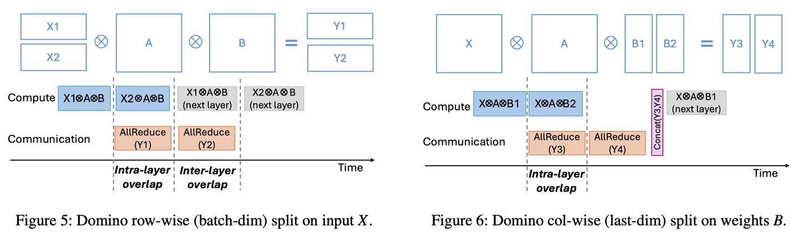

# Domino: Eliminating Communication in LLM Training via Generic Tensor Slicing and Overlapping

> Guanhua Wang, Chengming Zhang, Zheyu Shen, Ang Li, Olatunji Ruwase

## 一句话总结

Domino 通过通用的张量切片和流水线化策略，将 LLM 训练中张量并行（TP）的通信开销隐藏在计算背后，在 Nvidia DGX-H100 上相比 Megatron-LM 实现了最高 1.3 倍的训练加速。

---

## 摘要翻译

鉴于生成式 AI 的流行，大语言模型（LLM）通常需要消耗数百甚至数千个 GPU 来并行化和加速训练过程。在大规模训练 LLM 时，通信开销变得更加显著。为了消除分布式 LLM 训练中的通信开销，我们提出了 Domino，它提供了一种通用的方案，将通信隐藏在计算背后。通过将单批次训练的数据依赖分解为更小的独立片段，Domino 对这些独立片段进行流水线化训练，并提供了细粒度的通信与计算重叠的通用策略。大量实验结果表明，与 Megatron-LM 相比，Domino 在 Nvidia DGX-H100 GPU 上的 LLM 训练最高实现了 1.3 倍的加速。

---

## 研究动机

1. **LLM 规模扩大带来通信瓶颈**：LLM 参数量通常在数百亿到数千亿，远超单 GPU 的内存和计算能力，需要数百到数千 GPU 分布式训练。通信开销在大规模训练中日益显著。

2. **张量并行（TP）的通信瓶颈**：TP 是单节点多 GPU 训练的标准方案，在高带宽互联（NVLink/NVSwitch）下具有较好的系统效率。但每个 transformer 层需要在前向和反向传播中各执行两次 AllReduce，导致每个 transformer 块需要 4 次 AllReduce 通信，这些通信位于执行的关键路径上。

3. **现有重叠策略的局限性**：
   - 数据并行（DP）和流水线并行（PP）可以通过简单的调度实现通信重叠（如权重预取、跨批次处理）
   - 但 TP 的通信位于关键路径，难以用通用方法隐藏
   - 现有 GeMM+NCCL 融合方法（如 T3、Flux）仅将通信与单个 GeMM 重叠，重叠范围有限
   - 当通信时间远大于单个 GeMM 计算时间时，大部分通信时间仍然成为主要训练开销

4. **通信开销测量**：在 DGX-H100 上，即使使用 400GB/s InfiniBand，通信仍然占据 GPT-3-13B 训练迭代时间的 17%-43%，且随节点数增加而增长。

5. **TP 趋势**：随着 Nvidia 推动跨节点与节点内带宽差距的缩小（如 DGX-H100 节点间 IB 带宽 400GB/s，接近节点内 NVSwitch 900GB/s），TP 在多节点场景中的应用成为可能，且 PyTorch 和 vLLM 社区都在向 TP 方向发展。

---

## 方法（技术细节）

### 3.1 总体架构

Domino 将 self-attention 层和 MLP 层的计算抽象为 $X \otimes A \otimes B = Y$，其中：
- $A$：注意力权重（Wq, Wk, Wv）或 MLP 的线性权重
- $B$：第二组线性权重
- $X$：输入数据

标准 TP 将 $A$ 按列切分、$B$ 按行切分到各个 GPU，然后通过 AllReduce 恢复完整结果。

Domino 在原有 TP 切分基础上，增加两个维度的通用张量切分：
1. **对输入 $X$ 按行（batch 维度）切分**（§3.2）
2. **对权重 $B$ 按列（最后一维）切分**（§3.3）
3. **混合切分**（§3.4）

### 3.2 输入行切分（Row Split on Inputs）

- **切分方式**：将输入 $X$ 沿 batch 维度切分为 N 个微批次（µ-batch）
- **等价性证明**：
  - 对 MLP：$(X_1, X_2) \otimes A = X \otimes A$（按 batch 维度独立）
  - 对 self-attention：softmax(f(X)) 和 g(X) 在 batch 维度上完全独立，因此等价
- **通信量**：与原始 baseline 相同（避免了列切分导致的 $N^2$ 通信量爆炸）
- **数据依赖**：无跨层数据依赖，可实现 **层内（intra-layer）** 和 **层间（inter-layer）** 通信重叠
- **实现细节**：
  - 前向传播：执行 µ-batch 0 的计算后，异步启动其 AllReduce，同时执行 µ-batch 1 的计算
  - 将 dropout、residual、layerNorm 分组，为 AllReduce 提供重叠空间
  - 反向传播：通过自定义 no-operation 模块精确控制通信的开始/结束时间，与 torch.autograd() 无缝集成
  - 可实现接近 100% 的通信隐藏

### 3.3 权重列切分（Column Split on Weights）

- **切分方式**：将权重 $B$ 沿列维度切分为 N 个分区
- **等价性证明**：$(XA) \otimes B = (XA) \otimes [B_1, B_2]$（GeMM 操作可分离）
- **通信量**：与原始 baseline 相同
- **数据依赖**：
  - 可实现 **层内（intra-layer）** 通信重叠
  - 但需在层末同步（Concat 操作），无法实现层间重叠
- **实现细节**：
  - 执行 $X \otimes A \otimes B_1$ 后异步 AllReduce，同时执行 $X \otimes A \otimes B_2$
  - 通过预分配大 buffer 避免 torch.cat() 的额外内存开销
- **性能**：可实现 50%-70% 的通信隐藏
- **适用场景**：batch-split 单独使用时可能导致张量形状过窄，影响核计算效率，因此需要与 column-split 配合使用

### 3.4 混合切分（Hybrid Split）

- **切分方式**：同时对 $X$ 按行切分和对 $B$ 按列切分
- **适用场景**：超大 LLM，避免窄形状张量影响计算效率
- **数据依赖**：
  - 列方向需同步（Concat）
  - 行方向无阻塞
  - 只能实现 **层内（intra-layer）** 通信重叠

### 3.5 内核优化（§4.3）

1. **MultiStream（CUDA 多流）**：
   - 初始化固定数量的全局 CUDA stream，通过索引获取特定 stream
   - 避免从 CUDA stream pool 频繁获取导致的切换开销
   - 并行执行独立操作，提高 GPU 利用率

2. **CudaGraph + torch.compile**：
   - `torch.compile()` 通过 JIT 编译 PyTorch 操作为优化核
   - CudaGraph 消除相邻操作之间的间隙（bubble time）
   - 注意：设备端随机数生成器（RNG）与 CudaGraph 不兼容，需使用固定种子
   - 小 batch 时 CudaGraph 有益（减少 10-15% 迭代时间），大 batch 时可能增加 5-10% 开销

---

## 实验结果

### 实验环境
- **硬件**：Nvidia DGX-H100（8×H100 GPU/节点），使用 1-4 节点（8-32 GPU）
- **网络**：400 GB/s InfiniBand 节点间通信
- **软件**：NCCL 2.18，CUDA 12.2
- **模型**：GPT-3（2.7B、6.7B、13B、30B）和 Llama-2（7B、13B）
- **序列长度**：512 和 1024
- **基线**：Megatron-LM（sync）和 Megatron-LM（async）

### GPT-3 结果

**单节点（8 H100）**：
- GPT-3 2.7B：1.14x - 1.26x 加速
- GPT-3 6.7B：1.15x - 1.3x 加速（最高加速比）
- GPT-3 13B：1.12x - 1.23x 加速
- 总体：达到最优（无通信）吞吐量的 90% 以上，部分情况甚至超过最优设置

**多节点（16 H100，2 节点）**：
- GPT-3 6.7B、30B：约 1.2x 加速
- GPT-3 13B：最高 1.3x 加速（1k 序列长度，最佳点）
- 原因：计算核仍保持高效 + 跨节点通信可被大部分重叠

**多节点（32 H100，4 节点）**：
- 1.14x - 1.2x 加速
- 性能增益低于 2 节点情况，因跨节点通信无法完美重叠
- 模拟预测：若使用 ConnectX-8（800GB/s），可实现最高 1.5x 加速

### Llama-2 结果

**单节点（8 H100）**：
- Llama-2 7B：约 1.16x 加速
- Llama-2 13B：1.1x - 1.15x 加速
- 达到最优吞吐量的 90%+，比 Megatron 好 10%

**多节点（16 H100，2 节点）**：
- 约 1.15x 加速

**多节点（32 H100，4 节点）**：
- 1.08x - 1.17x 加速
- 达到最优吞吐量的 60-80%，比 Megatron 好 10-20%

**Llama-2 性能不如 GPT-3 的原因**：Llama-2 的旋转嵌入（Rotary Embedding）在 batch 维度切分后产生额外数据依赖

### Megatron-LM async 效果
- 仅提供 2%-5% 的吞吐量提升（粗粒度重叠）

---

## 优势

1. **通用性强**：Domino 是第一个为 TP-only 训练提供端到端通用通信-计算重叠方案的工作，同时适用于单节点和多节点场景
2. **重叠范围广**：与 GeMM+NCCL 融合不同，Domino 可以将 AllReduce 与 LayerNorm、Dropout、GeMM 等多种计算核重叠，重叠范围更广
3. **与现有优化正交**：可与内核融合、torch.compile、CudaGraph 等优化技术结合使用
4. **数学等价性**：Domino 在数学上等价于原始 TP（损失曲线匹配），不影响训练收敛
5. **高吞吐量**：达到最优（无通信）吞吐量的 90%+，部分情况甚至超越最优设置
6. **开源**：作为 Microsoft DeepSpeed 的一部分开源
7. **可移植性**：通过替换 NCCL 为 RCCL 可在 AMD GPU 上运行
8. **延迟初始化友好**：CudaGraph 可选择性启用，小 batch 时有益，大 batch 时关闭

---

## 局限

1. **旋转嵌入（RoPE）限制**：Llama-2 的旋转嵌入在 batch 维度切分后产生额外数据依赖，导致性能增益不如 GPT-3
2. **小 batch 性能增益有限**：batch size 较小时，Domino 的内核启动开销更明显，加速比降低
3. **多节点通信重叠不完美**：当节点数增加（如 4 节点），跨节点 IB 带宽（400GB/s）低于节点内 NVLink/NVSwitch（900GB/s），单个 NCCL 集合操作可能长于 Domino 可重叠的最大计算核范围
4. **内存开销**：列切分需要预分配大 buffer，且 torch.cat() 的替代方案可能增加额外 MemCpy 开销
5. **CudaGraph 兼容性**：RNG 与 CudaGraph 不兼容，需使用固定种子，可能影响训练随机性
6. **批次大小限制**：微批次大小最小为 4（行切分），1 和 2 被排除
7. **仅针对密集模型**：未考虑 MoE（混合专家）模型，与 Lancet 等 MoE 方案正交

---

## 与 EfficientPaper 相关的研究方向

1. **计算-通信重叠**：Domino 是该方向的重要工作，通过张量切片实现细粒度重叠，与 T3、Flux、CoCoNet 等内核融合方法互补
2. **张量并行（TP）优化**：随着 TP 在多节点场景中的普及，Domino 提供了统一的 TP 解决方案，与 Megatron-LM、Alpa、Centauri 等工作相关
3. **分布式训练系统**：Domino 的设计思想（切分-流水线-重叠）可推广到其他分布式训练场景
4. **高效 LLM 训练**：作为 DeepSpeed 的一部分，Domino 是 LLM 训练效率优化的重要组件
5. **内核优化**：CudaGraph、torch.compile、MultiStream 等技术与高效 AI 系统设计密切相关
6. **通信优化**：Domino 与 NCCL、MSCCL、Blink 等通信库的优化正交，可进一步组合

---

> ⚠️ **生成声明**：本 note 由 AI Agent（Hermes Agent）自动生成，基于论文全文阅读和分析。生成时间：2026年6月。如有错误，请以原始论文为准。
