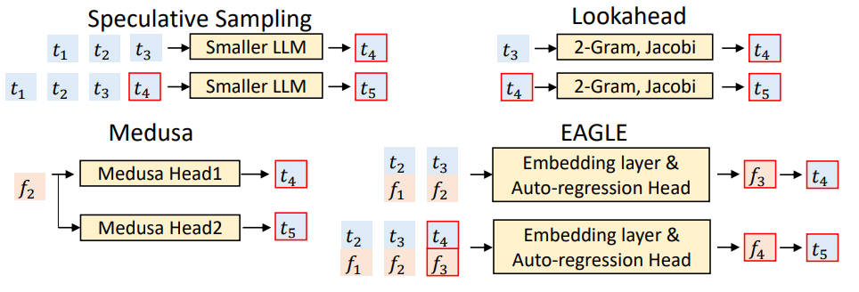

# EAGLE: Speculative Sampling Requires Rethinking Feature Uncertainty

## 一句话总结

EAGLE 提出了一种基于特征级自回归的投机采样框架，通过引入前一时间步的 token 序列来解决特征预测的不确定性问题，在不改变生成文本分布的前提下，实现了 LLaMA2-Chat 70B 模型 2.7x-3.5x 的延迟加速和两倍吞吐量提升。

## 摘要翻译

自回归解码使大语言模型（LLM）的推理过程耗时较长。本文重新审视了投机采样（speculative sampling）方法，并得出两个关键观察：首先，在特征（倒数第二层）级别进行自回归比在 token 级别更直接；其次，特征级别自回归的内在不确定性限制了其性能。基于这些洞察，我们引入了 EAGLE（Extrapolation Algorithm for Greater Language-model Efficiency），一个简单而高效的投机采样框架。通过引入前移一个时间步的 token 序列，EAGLE 有效解决了不确定性问题，以最小的开销实现精确的倒数第二层特征预测。我们在 Vicuna 和 LLaMA2-Chat 全系列模型、MoE 模型 Mixtral 8x7B Instruct 以及对话、代码生成、数学推理和指令跟随等多种任务上进行了全面评估。对于 LLaMA2-Chat 70B，EAGLE 实现了 2.7x-3.5x 的延迟加速比、两倍吞吐量提升，同时保持了生成文本的分布不变。

## 研究动机

自回归解码是大语言模型的默认解码方式，但由于逐 token 生成的特点，推理速度缓慢且成本高昂。投机采样（Speculative Sampling）通过将过程分为低成本的草稿生成阶段和并行化验证阶段，使多个 token 在单次 LLM 前向传递中得到验证，从而加速生成。然而，现有的投机采样方法面临以下关键问题：

1. **草稿模型选择困难**：传统方法依赖于同系列的低参数模型作为草稿模型，但对于较小的模型（如 7B），很难找到合适的草稿模型；使用较大的草稿模型（如 7B 作为 13B 的草稿）则开销过高，加速效果有限。

2. **草稿准确率不足**：Lookahead 使用 n-gram 和 Jacobi 迭代，Medusa 使用 MLP 预测 token，但草稿准确率分别较低（Medusa 约 0.6，Lookahead 更低），限制了加速效果。

3. **特征级预测的不确定性**：在特征级别进行自回归时，由于采样过程引入了随机性，不同的 token 选择会导致不同的特征序列，造成歧义（如图3所示，token "I" 后可能跟 "always" 或 "am"），严重影响预测性能。

4. **分布保持问题**：Medusa 和 Lookahead 等方法要么仅适用于贪心设置，要么不能保证输出分布不变，而 EAGLE 理论保证了在贪心和非贪心设置下输出分布不变。

## 方法（技术细节）

EAGLE 的核心创新在于基于特征级别的自回归预测和不确定性消解机制，包含草稿阶段（Drafting Phase）和验证阶段（Verification Phase）。

### 草稿模型架构

EAGLE 的草稿模型由三个模块组成：
- **Embedding Layer**：使用目标 LLM 的参数，将 token 序列转换为嵌入表示
- **LM Head**：使用目标 LLM 的参数，将特征映射为 token 分布
- **Autoregression Head**：由一个全连接层（FC layer）和一个 Transformer 解码器层（Decoder Layer）组成

草稿模型的输入包括：
- 形状为 (bs, seq_len, hidden_dim) 的特征序列
- 形状为 (bs, seq_len) 的前移一个时间步的 token 序列

工作流程：将 token 序列转换为 token 嵌入序列，与特征序列拼接成形状 (bs, seq_len, 2×hidden_dim) 的融合序列。FC 层将维度降至 (bs, seq_len, hidden_dim)，Decoder Layer 预测下一个特征，LM Head 计算分布并采样下一个 token。

### 关键创新：不确定性消解

EAGLE 通过输入前移一个时间步的 token 序列（即包含采样结果的序列）来解决特征级自回归的不确定性问题。具体来说：
- 草稿模型不仅输入特征序列，还输入 token 序列
- token 序列比目标 LLM 的输入前移一步，包含了采样结果
- 例如：基于特征 f_I 和 token t_always 预测 f_always，基于 f_I 和 t_am 预测 f_am
- 这种方式将速度提升从 1.9x 提高到 2.8x（去除不确定性后）

### 树结构草稿

EAGLE 使用树注意力（Tree Attention）创建树结构草稿，通过 m 次前向传递生成深度为 m、包含超过 m 个 token 的草稿树。例如，通过 3 次前向传递生成 10 个 token 的草稿树。

### 训练

- **损失函数**：组合回归损失和分类损失
  - 回归损失：Smooth L1 loss，用于预测下一个特征
  - 分类损失：Cross Entropy loss，用于优化 token 预测
  - L = L_reg + w_cls × L_cls，其中 w_cls = 0.1
- **训练数据**：使用 ShareGPT 数据集，约 68,000 条对话
- **优化器**：AdamW，β₁=0.9，β₂=0.95，梯度裁剪 0.5
- **学习率**：3e-5
- **可训练参数**：7B/13B/33B/70B 分别为 0.24B/0.37B/0.56B/0.99B
- **训练时间**：7B-33B 模型在 RTX 3090 上 1-2 天，70B 在 4×A100(40G) 上 1-2 天
- **数据增强**：在训练时向特征添加随机噪声 U(-0.1, 0.1)，以缓解误差累积

### 验证阶段

使用树注意力，目标 LLM 通过单次前向传递计算草稿树中每个 token 的概率。在草稿树的每个节点递归应用投机采样算法，确保输出文本分布与目标 LLM 一致。

## 实验结果

### 主要结果（MT-bench，greedy 设置，temperature=0）

| 模型 | EAGLE 加速比 |
|------|------------|
| Vicuna 7B | 2.90x |
| Vicuna 13B | 3.07x |
| Vicuna 33B | 2.95x |
| LLaMA2-Chat 7B | 2.78x |
| LLaMA2-Chat 13B | 3.03x |
| LLaMA2-Chat 70B | 3.01x |

### 多任务评估（T=0，平均接受长度 τ）

| 模型 | HumanEval (加速) | GSM8K (加速) | Alpaca (加速) |
|------|-----------------|-------------|--------------|
| Vicuna 7B | 3.33x (τ=4.29) | 3.01x (τ=4.00) | 2.79x (τ=3.86) |
| Vicuna 13B | 3.58x (τ=4.39) | 3.08x (τ=3.97) | 3.03x (τ=3.95) |
| Vicuna 33B | 3.67x (τ=4.28) | 3.25x (τ=3.94) | 2.97x (τ=3.61) |
| LLaMA2-Chat 7B | 3.17x (τ=4.24) | 2.91x (τ=3.82) | 2.78x (τ=3.71) |
| LLaMA2-Chat 13B | 3.76x (τ=4.52) | 3.20x (τ=4.03) | 3.01x (τ=3.83) |
| LLaMA2-Chat 70B | 3.52x (τ=4.42) | 3.03x (τ=3.93) | 2.97x (τ=3.77) |

### 非贪心设置（T=1）

在 T=1 设置下，EAGLE 仍能实现显著加速（2.1x-2.9x），但加速比略低于贪心设置。LLaMA2-Chat 13B 在 T=1 时仍能达到 2.89x 加速。

### 与基线方法对比

- **vs Lookahead**：EAGLE 快 1.70x-2.08x
- **vs Medusa**：EAGLE 快 1.47x-1.60x
- **vs Speculative Sampling**：传统方法在 7B 模型上无法加速，13B 模型无改善，33B/70B 仅 1.12x/1.88x
- **vs DistillSpec**：DistillSpec 的加速提升有限，因为蒸馏只能提高草稿接受率，而瓶颈在于草稿模型的高开销

### 吞吐量提升

EAGLE 在批量大小 > 1 时也能实现吞吐量提升，LLaMA2-Chat 70B 实现约 2x 吞吐量提升。在 Vicuna 7B 和 LLaMA2-Chat 70B 上，最大 batch size 分别为 7 和 4（相比 vanilla 的 8 和 5），虽然略低但整体吞吐量更高。

### 与 gpt-fast 结合

将 EAGLE 与 gpt-fast（使用量化和编译加速）结合，在单张 RTX 3090 上实现 LLaMA2-Chat 7B 160.4 tokens/s 的生成速度。

### Mixtral 8x7B Instruct

EAGLE 在 MoE 模型 Mixtral 8x7B Instruct 上实现了 1.5x 加速，加速效果相对较低的原因是平均接受长度较短（3.25）以及 MoE 模型在投机采样验证阶段需要访问更多专家权重的复杂性。

## 优势

1. **高效加速**：在多种模型和任务上实现 2.1x-3.8x 的延迟加速，显著优于 Lookahead 和 Medusa 等现有方法。

2. **分布保持**：理论保证在贪心和非贪心设置下输出分布不变，这是投机采样的重要性质，与 Medusa 和 Lookahead 不同。

3. **低训练成本**：仅需 0.24B-0.99B 可训练参数，训练时间 1-2 天（7B-33B 在 RTX 3090，70B 在 4×A100），使用固定数据集避免了目标 LLM 生成训练数据的高成本。

4. **通用性**：适用于任何自回归 LLM，已验证在 Vicuna、LLaMA2-Chat、Mixtral 8x7B Instruct 上有效，且在零样本/少样本设置下使用同一权重，无需针对评估数据集额外训练。

5. **简单易部署**：仅添加一个轻量级插件（单个 Transformer 解码器层），可轻松部署到生产环境。

6. **鲁棒性**：对特征错误具有良好的鲁棒性，即使预测特征存在误差，速度提升也仅略有下降（1-α 到 4-α 之间变化较小）。

7. **与其他加速技术兼容**：可与量化（如 gpt-fast 的 int4）、编译等技术结合，进一步降低 LLM 系统的运行成本。

## 局限

1. **MoE 模型加速有限**：在 Mixtral 8x7B Instruct 上仅实现 1.5x 加速，因为 MoE 模型在投机采样验证阶段需要访问更多专家权重，加速效果受限。

2. **批量大小对加速的影响**：随着批量大小增加，加速比逐渐下降（bs=4 时比 bs=1 降低约 0.5x），在高吞吐量场景下加速效果不如低吞吐量场景。

3. **特征级自回归的误差累积**：虽然 EAGLE 通过数据增强（添加随机噪声）缓解了误差累积，但特征预测的误差仍会导致接受率下降（0-α > 1-α > ... > 4-α）。

4. **训练数据依赖性**：虽然 EAGLE 对训练数据不敏感（使用固定数据集与使用目标 LLM 生成数据的性能差异仅为 0.1x），但训练数据的质量仍会影响性能。

5. **需要额外的训练**：虽然训练成本较低，但仍需要为每个模型训练一个草稿模型，增加了部署复杂度。

6. **非贪心设置加速比降低**：在 temperature=1 的非贪心设置下，加速比略低于贪心设置（2.1x-2.9x vs 2.7x-3.5x），因为不确定性增加。

## 与 EfficientPaper 相关的研究方向

EAGLE 属于投机采样（Speculative Sampling）和 LLM 推理加速领域，与以下研究方向密切相关：

1. **投机采样与解码优化**：EAGLE 是投机采样方法的重要改进，与 Speculative Sampling、Lookahead、Medusa、SpecInfer 等方法构成研究谱系，是理解投机采样演进的重要参考。

2. **LLM 推理效率**：EAGLE 通过特征级自回归和不确定性消解，为 LLM 推理加速提供了新思路，与量化（Quantization）、剪枝（Pruning）、蒸馏（Distillation）等方法互补。

3. **特征级表示学习**：EAGLE 的核心洞察——在特征级别进行自回归比在 token 级别更直接——为 LLM 内部表示的学习和利用提供了新方向。

4. **MoE 模型加速**：EAGLE 在 Mixtral 8x7B 上的实验揭示了 MoE 模型在投机采样中的特殊挑战，为 MoE 模型的加速研究提供了参考。

5. **树结构推理**：EAGLE 使用树注意力生成树结构草稿，与 SpecInfer 等方法共同探索了树结构推理的优势。

6. **分布保持的无损加速**：EAGLE 理论保证输出分布不变，是无损加速的重要研究方向，与有损加速方法（如 Medusa、Lookahead）形成对比。

## AI 生成声明

本文档由 AI Agent（Hermes Agent）自动生成，基于论文 EAGLE: Speculative Sampling Requires Rethinking Feature Uncertainty 的 PDF 文本提取和元数据整理。内容仅供参考，可能存在理解偏差或信息遗漏，请以原文为准。生成时间：2026年6月。
