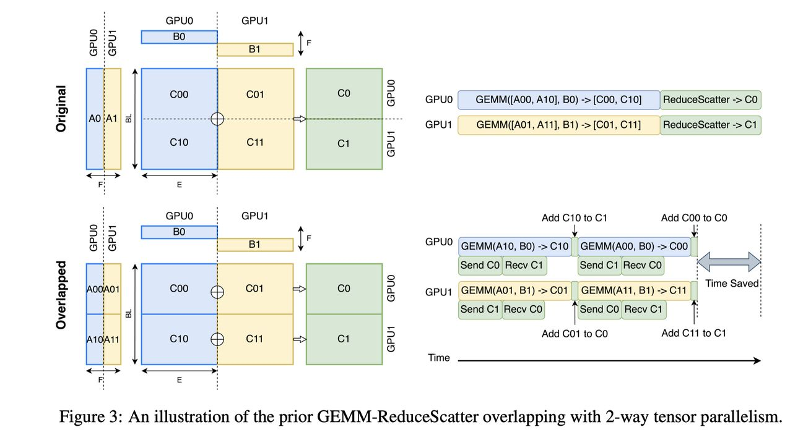

# FLUX: Fast Software-based Communication Overlap On GPUs Through Kernel Fusion

> Li-Wen Chang, Wenlei Bao, Qi Hou, Chengquan Jiang, Ningxin Zheng, Yinmin Zhong, Xuanrun Zhang, Zuquan Song, Chengji Yao, Ziheng Jiang, Haibin Lin, Xin Jin, Xin Liu

## 一句话总结

FLUX 通过将通信和计算操作进行超细粒度分解并融合为单一核函数（kernel fusion），在 GPU 上实现了高效的张量并行通信重叠，相比传统方法可将通信重叠率提升至最高 96%，训练加速最高达 1.24x，推理加速最高达 1.66x。

## 摘要翻译

大规模深度学习模型在众多应用领域展现出强大的能力。这些模型通常需要分布式训练和推理。张量并行（Tensor Parallelism）是一种常见技术，通过将计算划分到多个设备上来克服单处理器的内存容量限制，并加速计算以满足延迟要求。然而，这种并行性引入了额外的通信开销，可能占总运行时间的很大比例，从而限制了该技术在具有高速互连的设备组（如节点内 NVLink 连接的 GPU）中的可扩展性。

本文提出了一种新方法——FLUX，通过将通信和计算操作进行超细粒度分解，并将其融合为更大的核函数，显著隐藏 GPU 上的通信延迟。FLUX 可以将通信重叠率提升至最高 96%。总体而言，在 128 GPU 集群上，FLUX 相比 Megatron-LM 训练速度提升最高达 1.24x；在 8 GPU 集群上，推理预填充（prefill）和解码（decoding）阶段分别比 vLLM 快 1.66x 和 1.30x。

## 研究动机

### 问题背景
- 大规模深度学习模型（如 GPT-3 175B、Llama-2 70B）需要分布式训练和推理
- **张量并行（Tensor Parallelism）** 是常用的模型并行技术，可将层的计算划分到多个设备上执行
- 张量并行引入额外通信，通信时间可占总运行时间的显著比例（图 1 显示不同 GPU 互连和负载下通信占比较高）

### 现有方法的局限
- **中粒度分解方法**（如 TransformerEngine、Megatron-LM）将操作分解为与设备数相同数量的块
- **GPU 上的执行时序控制不精确**：使用 CUDA streams 无法精确控制执行时机，导致通信和计算重叠效率低
- **数据依赖限制并发执行**：ReduceScatter 重叠需要在 GEMM 之间执行额外的 add 操作，阻碍多个 GEMM 并发执行
- **GPU 利用率低**：将大 GEMM 分割成多个小 GEMM 会导致 GPU SM 利用率下降，尤其在张量并行度增大时
- 实验表明，传统方法在某些情况下甚至比不重叠的基线更慢（负重叠效率）

## 方法（技术细节）

### 核心思想：细粒度通信重叠（Fine-grained Communication Overlapping）
FLUX 将通信和计算操作进行**超细粒度分解**（fine-grained decomposition），远比现有中粒度方法更细，并将其融合为单一的大核函数，从而有效隐藏通信而不牺牲核函数效率。

### 3.1 ReduceScatter 重叠
- **实现方式**：将 ReduceScatter 通信融合到 GEMM 的 **epilogue（尾部处理）** 中
- **算法细节**（Algorithm 1）：
  - 每个线程块（thread block）被映射到一个计算和通信 tile
  - 输出矩阵指针数量等于张量并行设备数（N_TP）
  - 每个线程块的输出坐标 (m, n) 通过 `TileCoord` 函数基于线程块索引和本地 rank 计算
  - `GetOutput` 根据输出坐标和设备数选择正确的输出指针
  - 减规约（reduction）可以融合到 GEMM 核函数中（通过原子操作或 warp/thread block 专业化）
  - AlltoAll 通信（Write 分支）融合到 epilogue 中，减规约（Reduce 分支）提供边际性能提升

### 3.2 AllGather 重叠
- **实现方式**：将 AllGather 信号检查融合到 GEMM 的 **prologue（前置处理）** 中
- **算法细节**（Algorithm 2 & 3）：
  - **核函数侧**：GEMM tile 计算被 `WaitSignal` 函数阻塞，直到对应信号为 true
  - **主机侧**（Host Side）：异步执行分块通信操作（DataTransfer）并设置相应信号（SetSignal）
  - 支持两种传输模式：
    - **Pull-based**：从远程设备拉取 tile
    - **Push-based**：将 tile 推送到远程设备
  - 两种模式的选择作为调优参数（autotuning）
  - 通信 tile 大小与 GEMM 计算 tile 解耦，可独立调优
  - 通信顺序（Communication order）与 tile coordinate swizzling 对齐，基于网络拓扑选择以最小化延迟

### 4. 优化与实现细节

#### 4.1 Tile Coordinate Swizzling
- **目的**：最小化内存控制器的写请求冲突和等待时间
- **ReduceScatter**：tile 坐标根据设备 rank 索引进行偏移，避免不同设备上运行的核函数的写请求冲突
- **AllGather**：tile 坐标 swizzling 与信号到达顺序对齐，由通信顺序决定（基于网络拓扑）

#### 4.2 ReduceScatter 实现细节
- **Write**：通过 `st` 指令（包括向量版本）将数据从寄存器写入全局内存，或通过 `cp.async.bulk` / TMA 指令（Hopper GPU）写入
- 跨节点写入使用 NVSHMEM 的 `put` API
- **Reduce**：使用原子指令（red/atomic）直接实现设备内存上的减规约，或使用 warp/thread block 专业化方法（Hopper GPU）
- 所有方法使用 CUTLASS EVT（Epilogue Visitor Tree）实现，模板参数通过自动调优选择

#### 4.3 AllGather 实现细节
- **DataTransfer**：使用 `cudaMemcpy` API（P2P）或 NCCL send/recv（非 P2P）
- **Signals**：使用 32 位 GPU 内存实现，通过 `cuStreamWriteValue` API 设置，核函数中通过 spinning 等待
- **Communication tile size**：从 medium-grained 分区大小开始，不断减半直到等于 GEMM tile 大小
- **Communication order**：
  - NVLink 互连：使用 ring order
  - PCIe 互连：使用 ring-based 通信
  - 多节点：支持跨节点与节点内通信重叠

#### 4.4 GEMM 实现与自动调优
- 基于 **NVIDIA CUTLASS 3.4.1** 实现
- Ampere GPU 使用 workload-balanced GEMM
- Hopper GPU 使用 warp/thread block 专业化 GEMM
- GEMM tile 大小不受张量并行度约束，可自由调整
- 所有 prologue、epilogue、GEMM 算法和调优参数使用模板编写，支持自动调优

### 与现有方法的关键区别
| 特性 | 传统中粒度方法 | FLUX 细粒度方法 |
|------|--------------|----------------|
| 分解粒度 | 与设备数相同 | 远多于设备数（tile 级别） |
| 核函数数量 | 多个分裂的 GEMM | 单一融合核函数 |
| GPU 利用率 | 可能因小 GEMM 低效 | 保持高效 GEMM 效率 |
| 执行时序 | 依赖 CUDA streams/events | 通过 warp 上下文切换隐藏延迟 |
| 通信隐藏率 | 中等（可能为负） | 最高 96% |

## 实验结果

### 评估设置
- **实现**：CUTLASS 3.4.1 + NVSHMEM 2.10.1
- **编译器**：NVCC 11.8（A100）/ NVCC 12.2（H800）
- **数据类型**：bfloat16
- **集群**：
  - A100 PCIe：8 GPU/节点，PCIe 节点内互连，2×100Gbps 节点间互连
  - A100 NVLink (SXM4)：8 GPU/节点，NVLink 节点内互连，4×200Gbps 节点间互连
  - H800 NVLink (SXM5)：8 GPU/节点，NVLink 节点内互连，8×400Gbps 节点间互连
- **对比基线**：PyTorch（非重叠）、TransformerEngine 1.4.0（中粒度重叠）

### 操作级性能
- **ReduceScatter + AllGather**：
  - A100 PCIe：1.20x - 3.25x 加速（vs TransformerEngine）
  - A100 NVLink：1.01x - 1.33x 加速
  - H800 NVLink：1.10x - 1.51x 加速
- **重叠效率**：
  - A100 PCIe：41% - 57%
  - A100 NVLink：36% - 96%
  - H800 NVLink：37% - 93%
  - TransformerEngine 在部分情况下为负值（最差 -125%）
- **小 m 场景**（m=64, 512，解码阶段）：
  - A100 PCIe：1.45x - 3.21x
  - A100 NVLink：1.33x - 4.68x
- **16-way 张量并行**（双节点）：
  - A100 PCIe：最高 1.32x 加速，18% 重叠效率
  - A100 NVLink：最高 1.57x 加速，74% 重叠效率

### 模型级性能
- **训练**（GPT-3 175B / Llama-2 70B，128 GPU，2-way data + 8-way pipeline + 8-way tensor parallelism）：
  - vs Megatron-LM：最高 1.24x 加速
  - vs TransformerEngine：最高 1.37x 加速
- **预填充推理**（vLLM，8 GPU，8-way tensor parallelism）：
  - vs vLLM：最高 1.66x 加速
  - vs TransformerEngine：最高 2.06x 加速
- **解码推理**：
  - vs vLLM：最高 1.30x 加速
  - vs TransformerEngine：最高 2.10x 加速

### 关键发现
1. **通信比例是关键因素**：通信占比高的场景（如 A100 PCIe 训练和预填充，通信占比 40%-75%）FLUX 收益最大
2. **小 m 场景**：FLUX 在解码阶段（小 m）表现显著优于 TransformerEngine（1.03x - 4.68x），但某些极小 m（如 m=64）可能不如非重叠基线
3. **自动调优机制**：FLUX 通过自动调优适应不同 GPU 架构和互连配置

## 优势

1. **高效通信重叠**：重叠效率高达 96%，远超传统方法（TransformerEngine 平均为负值）
2. **不牺牲 GEMM 效率**：通过细粒度分解和融合，避免了分裂 GEMM 导致的 GPU 利用率下降
3. **通用性**：支持多种 GPU 架构（A100、H800）和互连类型（PCIe、NVLink）
4. **自动调优**：基于 CUTLASS 模板实现，支持跨配置自动调优，适应不同硬件组合
5. **支持训练和推理**：同时适用于预填充和解码推理场景
6. **模块化设计**：基于 CUTLASS 构建，便于扩展和优化
7. **显著加速**：训练最高 1.24x，预填充最高 1.66x，解码最高 1.30x

## 局限

1. **极小 m 场景**：当 m 极小（如 64）时，FLUX 的 ReduceScatter 在 H800 NVLink 上可能不如 TransformerEngine（0.95x slowdown）
2. **解码阶段部分场景**：batch size=64 时有 5 个数据点不如非重叠 vLLM 基线
3. **依赖硬件特性**：需要 GPU 支持 P2P（Peer-to-Peer）内存访问，跨节点需要 NVSHMEM
4. **仅针对张量并行**：主要针对张量并行的通信重叠，未直接处理流水线并行或数据并行
5. **实现复杂度**：基于 CUTLASS 模板和自动调优，实现和维护相对复杂
6. **通信压缩未涉及**：未结合通信压缩技术（如梯度量化），可能有进一步优化空间
7. **仅限 NVIDIA GPU**：基于 NVIDIA CUDA 生态，不支持其他 GPU 平台

## 与 EfficientPaper 相关的研究方向

1. **分布式训练效率优化**：FLUX 属于通信-计算重叠领域，是提升分布式训练效率的重要方向
2. **张量并行通信优化**：与 Tensor Parallelism 密切相关，可与其他并行策略（如流水线并行、数据并行）结合
3. **GPU 内核融合**：FLUX 的 kernel fusion 技术可推广到其他计算-通信重叠场景
4. **自动调优与编译优化**：CUTLASS 模板和自动调优方法是高效计算的通用技术
5. **大规模模型推理加速**：FLUX 在 vLLM 推理框架上的应用展示了对推理加速的潜力
6. **通信库与硬件协同设计**：FLUX 与 NCCL、NVSHMEM 等通信库的集成展示了软硬件协同优化方向
7. **通信压缩与量化**：可与 ZeRO++ 等通信压缩技术结合，进一步提升效率

## AI 生成声明

> 本笔记由 AI Agent 自动生成，基于论文原文提取关键信息并翻译整理。内容可能存在翻译偏差或理解不准确之处，请以论文原文为准。AI 生成时间：2026-06-05。
