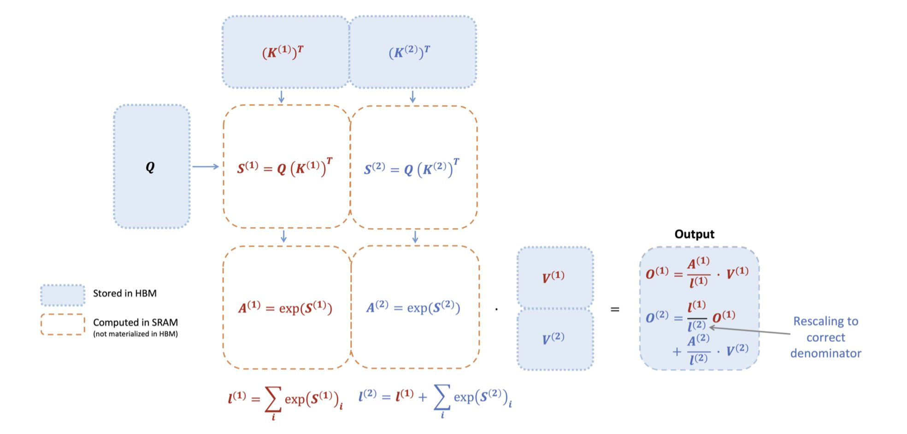

# FlashAttention-2: Faster Attention with Better Parallelism and Work Partitioning

> Tri Dao — Princeton University / Stanford University
> ICLR 2024
> ArXiv: 2307.08691

## 一句话总结

FlashAttention-2 通过优化 GPU 上注意力计算的并行化策略和工作分配机制，在 FlashAttention 基础上实现了约 2× 的速度提升，达到 A100 GPU 理论最大吞吐量的 50%-73%，使长序列 Transformer 训练和推理效率大幅提升。

## 摘要翻译

将 Transformer 扩展到更长的序列长度是近年来的一个主要问题，有望改进语言建模和高分辨率图像理解的性能，并在代码、音频和视频生成等新应用中解锁更多可能性。注意力层是扩展到长序列的主要瓶颈，因为其运行时间和内存随序列长度呈二次增长。

FlashAttention 利用 GPU 不对称内存层次结构，在不进行近似的情况下实现了显著的内存节省（从二次变为线性）和运行时间加速（比优化基线快 2-4 倍）。然而，FlashAttention 仍然远不及优化的矩阵乘法（GEMM）操作，仅达到理论最大 FLOPs/s 的 25-40%。

我们发现效率低下是由于 GPU 上不同线程块和 warp 之间的工作分配不优化，导致低占用率或不必要的共享内存读写。我们提出 FlashAttention-2，通过更好的工作分配来解决这些问题。具体而言，我们（1）调整算法以减少非矩阵乘法 FLOPs 的数量；（2）即使对于单个头，也将注意力计算并行化到不同的线程块以增加占用率；（3）在每个线程块内，将工作分配给不同的 warp 以减少共享内存通信。这些改进相比 FlashAttention 实现了约 2× 的加速，在 A100 上达到理论最大 FLOPs/s 的 50-73%，接近 GEMM 操作的效率。经验验证表明，当用于端到端训练 GPT 风格模型时，FlashAttention-2 在每个 A100 GPU 上达到高达 225 TFLOPs/s 的训练速度（72% 模型 FLOPs 利用率）。

## 研究动机

### 1. 长序列 Transformer 的瓶颈
Transformer 架构的注意力机制在序列长度上呈二次复杂度，这使得将模型扩展到更长的上下文（如理解书籍、高分辨率图像、长视频）变得困难。虽然已有多种近似注意力方法，但大多数大规模训练仍使用标准注意力。

### 2. FlashAttention 的不足
FlashAttention 虽然将注意力速度提升了 2-4 倍，但其前向传播仅达到设备理论最大 FLOPs/s 的 30-50%，反向传播更差，仅达到 25-35%。相比之下，优化的 GEMM 可以达到 80-90% 的理论最大吞吐量。

### 3. 性能瓶颈的根源
通过对 FlashAttention 的性能分析，发现效率低下的根本原因是 GPU 上不同线程块和 warp 之间的**工作分配不优化**，导致低占用率（low-occupancy）和不必要的共享内存读写。

## 方法（技术细节）

FlashAttention-2 包含三个核心改进，分别针对算法优化、并行化策略和 warp 工作分配。

### 3.1 算法优化：减少非矩阵乘法 FLOPs

现代 GPU 拥有专用的矩阵乘法加速单元（如 Nvidia GPU 的 Tensor Cores），使得矩阵乘法的吞吐量远高于非矩阵乘法操作。以 A100 为例：
- FP16/BF16 矩阵乘法：最高 312 TFLOPs/s
- FP32 非矩阵乘法：仅 19.5 TFLOPs/s
- 每个非矩阵乘法 FLOP 的代价是矩阵乘法 FLOP 的 **16 倍**

因此，算法应尽可能将时间花在矩阵乘法 FLOPs 上。

**前向传播优化：**

**优化 1：维护未缩放的输出**
FlashAttention 在每个块更新时都需要对输出进行缩放操作。FlashAttention-2 改为维护一个"未缩放"的输出版本 $\tilde{O}$，仅在循环结束时才进行一次缩放：

$$\tilde{O}^{(2)} = \text{diag}(\ell^{(1)})^{-1}O^{(1)} + e^{S^{(2)} - m^{(2)}}V^{(2)}$$

$$O^{(2)} = \text{diag}(\ell^{(2)})^{-1}\tilde{O}^{(2)}$$

**优化 2：只保存 logsumexp**
不再需要同时保存最大值 $m^{(j)}$ 和指数和 $\ell^{(j)}$，而是只保存对数求和指数 $L^{(j)} = m^{(j)} + \log(\ell^{(j)})$。

**反向传播优化：**
反向传播也做了类似的小调整，只使用行方向的 logsumexp $L$ 而非同时保存最大值和指数和。

### 3.2 并行化策略：跨序列长度维度并行化

FlashAttention 仅在 batch 和 head 维度上并行化。FlashAttention-2 在此基础上增加了**序列长度维度**的并行化。

**前向传播：**
- 外循环（遍历序列长度）被设计为"可尴尬并行化"（embarrassingly parallel），每个线程块处理一行块，线程块之间不需要通信
- 同时在 batch 和 head 维度上并行化（与 FlashAttention 相同）
- 当 batch size 和 head 数量较小时（长序列场景），额外的序列长度并行化显著提高 GPU 资源利用率

**反向传播：**
- 对每个列块调度一个线程块
- 使用原子操作（atomic adds）在不同线程块之间更新 dQ
- 优化后的并行方案如图 2 所示

这一思想（交换循环顺序和序列长度并行化）最初由 Phil Tillet 在 Triton 实现中提出和实现。

### 3.3 Warp 工作分配：消除不必要的共享内存通信

在每个线程块内，需要决定如何在不同 warp 之间分配工作（通常 4 或 8 个 warp）。

**FlashAttention 的方案（split-K）：**
- 将 K 和 V 分割到 4 个 warp，所有 warp 都能访问 Q
- 每个 warp 计算 QK^T 的一个切片
- 需要通过共享内存通信来累加结果
- 所有 warp 需要写中间结果到共享内存，同步，然后相加

**FlashAttention-2 的方案：**
- 将 Q 分割到 4 个 warp，所有 warp 都能访问 K 和 V
- 每个 warp 计算 QK^T 的一个切片后，直接与对应的 V 切片相乘得到输出切片
- **不需要 warp 之间的通信**
- 显著减少了共享内存读写

**反向传播：**
- 类似地避免 split-K 方案
- 但由于 Q、K、V、O、dO、dQ、dK、dV 之间更复杂的依赖关系，仍需要一些同步
- 避免 split-K 仍然减少了共享内存读写，带来加速

**块大小调优：**
- 增大块大小通常减少共享内存加载/存储，但增加寄存器需求
- 超过某个阈值会导致寄存器溢出或共享内存不足
- 典型选择：{64, 128} × {64, 128}，取决于 head 维度和设备共享内存大小
- 目前手动调优，未来可受益于自动调优

### 3.4 因果掩码优化

- 对于因果掩码，当列索引完全大于行索引时（约一半的块），可以跳过该块的计算
- 这导致约 1.7-1.8× 的加速（相比无因果掩码的注意力）
- 每行只需要对 1 个块应用因果掩码（假设方形块）

### 3.5 多查询注意力和分组查询注意力支持

- 多查询注意力（MQA）和分组查询注意力（GQA）是注意力的变体，多个查询头共享同一组键值头
- FlashAttention-2 通过隐式操作头索引来支持这些变体
- 反向传播中需要跨不同头累加梯度 dK 和 dV

## 实验结果

### 基准测试：注意力速度（A100 80GB SXM4）

| 方法 | 前向速度（TFLOPs/s） | 前向+反向速度（TFLOPs/s） |
|------|---------------------|--------------------------|
| PyTorch 标准实现 | 36-53 | 62-93 |
| FlashAttention | 56-91 | 127-168 |
| xformers | 67-115 | 89-128 |
| FlashAttention Triton | 78-140 | 59-102 |
| **FlashAttention-2** | **132-227** | **151-203** |

**关键结果：**
- FlashAttention-2 比 FlashAttention 快 **1.7-3.0×**
- 比 FlashAttention in Triton 快 **1.3-2.5×**
- 比标准 PyTorch 实现快 **3-10×**
- 前向传播达到 **230 TFLOPs/s**，理论最大值的 **73%**
- 反向传播达到理论最大值的 **63%**

### 端到端训练速度（8×A100 80GB SXM）

| 模型 | 无 FlashAttention | FlashAttention | FlashAttention-2 |
|------|------------------|----------------|-----------------|
| GPT3-1.3B 2k | 142 TFLOPs/s | 189 TFLOPs/s | 196 TFLOPs/s |
| GPT3-1.3B 8k | 72 TFLOPs/s | 170 TFLOPs/s | 220 TFLOPs/s |
| GPT3-2.7B 2k | 149 TFLOPs/s | 189 TFLOPs/s | 205 TFLOPs/s |
| GPT3-2.7B 8k | 80 TFLOPs/s | 175 TFLOPs/s | **225 TFLOPs/s** |

**关键结果：**
- FlashAttention-2 比无 FlashAttention 快 **2.8×**
- 比 FlashAttention 快 **1.3×**
- 最高达到 **225 TFLOPs/s**（72% 模型 FLOPs 利用率）

### H100 GPU 性能

在 H100 80GB SXM5 GPU 上（不使用 H100 特有的指令如 TMA 和第 4 代 Tensor Cores）：
- FlashAttention-2 达到最高 **335 TFLOPs/s**
- 作者预计通过使用新指令可再获得 1.5-2× 的加速

## 优势

### 1. 显著的速度提升
- 在 A100 上实现约 2× 的加速，达到理论最大吞吐量的 50-73%
- 接近 GEMM 操作的效率水平

### 2. 无近似
- 与 FlashAttention 一样，FlashAttention-2 产生精确的结果，不进行任何近似
- 保证数学正确性

### 3. 内存效率
- 将内存需求从 $O(N^2)$ 降低到 $O(N)$（线性内存）
- 只需存储 logsumexp $L$，而不需要保存完整的注意力矩阵

### 4. 端到端训练加速
- 在实际 GPT 风格模型训练中，实现高达 225 TFLOPs/s
- 72% 的模型 FLOPs 利用率

### 5. 长序列支持
- 支持长上下文训练（最高 16k）
- 可以用 8k 的成本训练 16k 的上下文

### 6. 广泛兼容性
- 支持因果掩码、多查询注意力（MQA）、分组查询注意力（GQA）
- 适用于多种 head 维度（64、128）

### 7. 开源可用
- 代码开源，通过 PyTorch 集成
- 已被广泛采用

## 局限

### 1. 硬件依赖性
- 性能高度依赖于 GPU 架构（A100、H100）
- 在 H100 上尚未充分利用 TMA 和第 4 代 Tensor Cores 等新特性
- 不同硬件（如 AMD GPU）需要适配

### 2. 块大小调优手动
- 块大小需要手动调优（目前只有 4 种选择）
- 未来需要自动调优来减少人工劳动

### 3. 共享内存限制
- 共享内存大小限制了块大小
- 过大的块会导致寄存器溢出或共享内存不足

### 4. 仅针对注意力层
- 只优化了注意力计算，不涉及其他 Transformer 层
- 需要与其他优化（如内核融合）结合使用

### 5. FP8 支持有限
- 虽然提到支持 FP8，但实现可能不如后续 FlashAttention-3 完善
- 需要新的硬件特性支持

### 6. 仍存在可优化空间
- 前向传播达到理论最大值的 73%，仍有提升空间
- 反向传播达到 63%，仍有较大的优化潜力

## 与 EfficientPaper 相关的研究方向

### 1. 注意力机制优化
- **FlashAttention**（2022）：FlashAttention-2 的直接前身，提出了 tiling 和在线 softmax 技术
- **FlashAttention-3**（2024）：进一步利用 H100 特性实现 1.5-2× 加速
- **MFA**（2024）：另一种高效注意力实现

### 2. 长序列高效推理
- **SnapKV**（2024）：KV 缓存压缩，减少推理时的内存占用
- **MiniKV**（2024）：KV 缓存压缩技术
- **ZigZagKV**（2024）：高效的 KV 缓存管理
- **MInference**（2024）：长序列推理的注意力模式分析
- **InfLLM**（2024）：无限长度语言模型推理

### 3. 注意力加速器
- **SharedAttention**（2024）：共享注意力计算
- **RecycledAttention**（2024）：循环利用注意力
- **SEA**（2024）：高效序列注意力
- **SampleAttention**（2024）：采样注意力

### 4. KV 缓存优化
- **KIVI**（2024）：KV 缓存量化
- **KVQuant**（2024）：KV 缓存量化
- **GEAR**（2024）：KV 缓存压缩
- **FrameQuant**（2024）：帧级量化
- **ZipVL**（2024）：视觉语言模型压缩

### 5. 模型压缩与推理加速
- **Wanda**（2024）：权重和激活剪枝
- **SqueezeLLM**（2024）：LLM 压缩
- **SlimGPT**（2024）：GPT 模型压缩
- **Minitron**（2024）：Mini 架构训练
- **ShadowLLM**（2024）：影子 LLM
- **MFA**（2024）：高效多头注意力

### 6. 推理系统优化
- **SGLang**（2024）：高效推理系统
- **XGrammar**（2024）：推理编译器
- **LazyLLM**（2024）：惰性推理
- **MemServe**（2024）：内存服务
- **Vidur**（2024）：推理吞吐量优化

### 7. 量化与精度优化
- **QuaRot**（2024）：旋转量化
- **PrefixQuant**（2024）：前缀量化
- **Sparse-IFT**（2024）：稀疏推断
- **MaskLLM**（2024）：掩码 LLM

### 8. 与其他研究的关系
FlashAttention-2 为 EfficientPaper 中的许多研究提供了基础：
- 所有涉及长序列的论文都依赖 FlashAttention 系列的高效实现
- KV 缓存优化方法通常与 FlashAttention 结合使用
- 模型压缩和推理优化也受益于 FlashAttention 的高效实现

## AI 生成声明

> 本笔记由 AI Agent（Hermes Agent）自动生成，基于论文原文内容和元数据进行整理。
> 生成时间：2026-06-05
> 生成方式：基于 PyMuPDF (fitz) 提取的论文文本进行分析和总结
> 本笔记仅供参考，建议阅读原论文以获取完整信息。
> 论文链接：https://arxiv.org/abs/2307.08691
