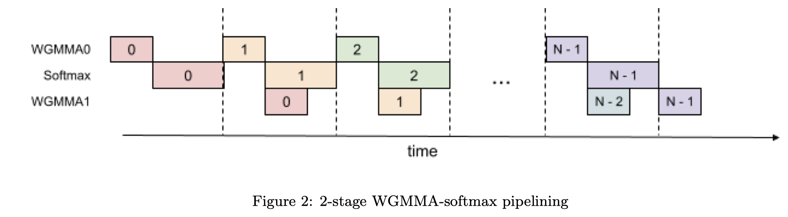

# FlashAttention-3: Fast and Accurate Attention with Asynchrony and Low-precision

> Jay Shah, Ganesh Bikshandi, Ying Zhang, Vijay Thakkar, Pradeep Ramani, Tri Dao

## 一句话总结

FlashAttention-3 通过 warp 专用化异步流水线、GEMM-softmax 重叠计算和 FP8 低精度量化，在 H100 GPU 上将注意力计算加速 1.5-2.0 倍，FP16 达到 740 TFLOPs/s（75% 利用率），FP8 接近 1.2 PFLOPs/s，同时将 FP8 数值误差降低 2.6 倍。

## 摘要翻译

注意力机制是广泛使用的 Transformer 架构的核心层，是大语言模型和长上下文应用的瓶颈。FlashAttention 通过最小化内存读写加速了 GPU 上的注意力计算。然而，它尚未利用最新硬件的能力，FlashAttention-2 在 H100 GPU 上仅达到 35% 的利用率。我们开发了三种主要技术来加速 Hopper GPU 上的注意力：利用 Tensor Cores 和 TMA 的异步性来（1）通过 warp 专用化重叠整体计算和数据移动，（2）交错执行分块矩阵乘法和 softmax 操作，以及（3）利用硬件对 FP8 低精度支持的分块量化和非相干处理。我们证明 FlashAttention-3 在 H100 GPU 上实现 1.5-2.0 倍加速，FP16 达到 740 TFLOPs/s（75% 利用率），FP8 接近 1.2 PFLOPs/s。我们验证了 FP8 FlashAttention-3 的数值误差比基线 FP8 注意力低 2.6 倍。

## 研究动机

### 注意力计算瓶颈

Transformer 架构中的注意力机制是大语言模型（LLM）和长上下文应用的主要计算瓶颈，因为计算查询和键的自注意力分数在序列长度上呈二次方缩放。扩展注意力到更长上下文将解锁新能力（对多个长文档进行建模和推理、大型代码库中的文件处理）、新模态（高分辨率图像、音频、视频）和新应用（与长历史的用户交互、长时域的智能体工作流）。

### FlashAttention-2 的局限性

FlashAttention-2 通过并行化注意力计算和优化 GPU 上的工作分布改进了 FlashAttention，但在较新的 GPU 上仍存在利用率问题：

- **硬件利用率低**：FlashAttention-2 在 H100 GPU 上仅达到 35% 的利用率，而优化的矩阵乘法（GEMM）内核可以达到 80-90%。
- **缺乏异步执行**：FlashAttention-2 采用简化的同步模型，没有显式利用异步性和低精度特性。
- **未利用 Hopper 架构特性**：未使用 Hopper 特定指令替代 Ampere 指令，未利用 Tensor Cores 的异步执行和 TMA（Tensor Memory Accelerator）等新硬件能力。

### 硬件发展带来新机遇

NVIDIA Hopper（H100）GPU 提供了以下新能力：

1. **异步执行**：TMA 可以异步执行内存传输，Tensor Cores 通过 WGMMA 指令可以异步执行，支持 warp 专用化。
2. **低精度支持**：FP8 Tensor Cores 提供 2 倍吞吐量（相对于 FP16/BF16）。
3. **warp 专用化**：通过 setmaxnreg 动态重新分配寄存器，使得执行 MMA 的 warpgroup 可以获得更大的寄存器份额。

## 方法（技术细节）

FlashAttention-3 提出了三种核心技术，利用 Hopper GPU 的异步性和低精度能力，进一步提高注意力计算的效率和精度。

### 技术一：Producer-Consumer 异步性（Warp 专用化）

**核心思想**：将 CTA（cooperative thread array）中的 warps 分为 producer（数据加载）和 consumer（计算）角色，实现计算与数据移动的重叠。

**具体实现**：
- **Producer warpgroup**：负责从 HBM 异步加载 Q、K、V 数据到共享内存（SMEM），使用 TMA（Tensor Memory Accelerator）进行异步内存传输。
- **Consumer warpgroup**：负责执行 WGMMA（Warp Group Matrix Multiply-Accumulate）指令进行 GEMM 计算和 softmax 计算。
- **循环 SMEM 缓冲区**：使用 s-stage 循环缓冲区，允许 producer 在 consumer 消费数据时提前加载下一批数据。
- **寄存器动态分配**：通过 setmaxnreg 指令，producer 释放寄存器（仅需单线程），consumer 获得更多寄存器（用于计算密集型操作）。

**算法流程**（Algorithm 1）：
1. Producer 从 HBM 异步加载 Q_i 到 SMEM，通知 consumer。
2. 对于每个 K_j、V_j 块，producer 等待缓冲区空闲，加载数据，通知 consumer。
3. Consumer 等待数据就绪，执行 WGMMA 计算 S = QK^T，然后计算 softmax 和缩放 O，最后释放缓冲区供 producer 使用。

### 技术二：GEMM-softmax 重叠（Pingpong 调度）

**核心思想**：利用 WGMMA 和 TMA 的异步特性，将 softmax 操作（低吞吐量）与 GEMM 操作（高吞吐量）重叠执行，减少 softmax 的延迟对计算的影响。

**问题背景**：
- H100 的 FP16 矩阵乘法吞吐量为 989 TFLOPs/s，但特殊函数（如指数）仅 3.9 TFLOPs/s，吞吐量相差 256 倍。
- 在 FP16 注意力中，矩阵乘法 FLOPs 是指数操作的 512 倍，但指数吞吐量低 256 倍，导致指数操作可能占 50% 的计算时间。
- FP8 下情况更严重：矩阵乘法吞吐量翻倍，但指数吞吐量不变。

**Pingpong 调度方案**：
- 使用两个 warpgroup（warpgroup 1 和 warpgroup 2），通过同步屏障（bar.sync）交错执行 GEMM 和 softmax。
- Warpgroup 1 执行 GEMM（PV）时，warpgroup 2 执行 softmax；然后角色互换。
- 这样，softmax 操作可以被"隐藏"在 GEMM 执行期间。

**效果**：在 FP16、head dimension 128、序列长度 8192 的设置下，pingpong 调度将性能从 570 TFLOPs 提升到 620-640 TFLOPs。

### 技术三：FP8 低精度（分块量化与非相干处理）

**核心思想**：利用 Hopper 的 FP8 Tensor Cores，通过分块量化和非相干处理技术，减少 FP8 量化的数值误差。

**挑战**：
1. **布局约束**：FP8 WGMMA 仅支持 k-major 格式（与 FP16 不同），需要 V 在序列长度维度上连续，而 Q、K、V 通常在头维度上连续。
2. **累积器与操作数布局不匹配**：FP8 WGMMA 的 FP32 累加器布局与操作数 A 的布局不同。

**解决方案**：

#### 1. 布局变换（Layout Transformations）

- **In-kernel 转置**：使用 LDSM/STSM 指令（128 字节粒度的 warp 级内存操作）在共享内存中转置 V 块，将 k-major 转换为 mn-major。
- **寄存器排列**：使用字节排列指令（byte permute）将第一个 WGMMA 的 FP32 累加器转换为第二个 WGMMA 操作所需的格式，匹配 V 块的转置布局。

#### 2. 分块量化（Block Quantization）

- 每个张量（Q、K、V）分为大小为 B_r×d 或 B_c×d 的块，每块独立量化。
- 量化可与注意力前的操作（如旋转位置编码）融合，无额外开销。
- FlashAttention-3 的分块操作天然支持这种量化，可以以零计算开销缩放每个 S 块。

#### 3. 非相干处理（Incoherent Processing）

- 在量化为 FP8 之前，用随机正交矩阵 M 乘以 Q 和 K，以均匀化异常值。
- 由于 M 是正交的（MM^T = I），(QM)(KM)^T = QK^T，不改变注意力输出。
- M 选择为随机对角矩阵（±1）和 Hadamard 矩阵的乘积，可在 O(d log d) 时间内计算，可与旋转位置编码融合，无额外计算开销。

### 向后传播

FlashAttention-3 的向后传播算法类似，使用 warp 专用化和异步执行，实现 1.5-1.75 倍的加速（相对于 FlashAttention-2）。

## 实验结果

### 基准测试（FP16）

在 H100 80GB SXM5 GPU 上，使用不同序列长度（512-16k）、head dimension（64/128/256）、batch size（总 token 数 16k）进行测试。

**前向传播性能**（FP16）：
- **FlashAttention-3 vs FlashAttention-2**：加速 1.5-2.0 倍
- **FlashAttention-3 vs Triton（H100 特定指令）**：加速 1.5 倍
- **FlashAttention-3 vs cuDNN**：在中长序列（1k 及以上）上超越 cuDNN
- **FlashAttention-3 vs 标准注意力**：加速 3-16 倍
- **最高性能**：达到 740 TFLOPs/s（75% 理论最大利用率），在 head dimension 256、无 causal mask 设置下

**向后传播性能**（FP16）：
- **FlashAttention-3 vs FlashAttention-2**：加速 1.5-1.75 倍

**FP8 性能**：
- **FlashAttention-3 FP8**：接近 1.2 PFLOPs/s（head dimension 256，无 causal mask）
- 在 head dimension 64 时，FP8 FlashAttention-3 优于 cuDNN
- 在 head dimension 128/256 时，与 cuDNN 持平（无 causal mask），causal mask 时略低

### 消融实验

对 2-stage WGMMA-softmax 流水线和 warp 专用化进行消融，使用固定参数 {batch, seqlen, nheads, hdim} = {4, 8448, 16, 128}，FP16，无 causal mask：

| 配置 | 时间 (ms) | TFLOPs/s |
|------|-----------|----------|
| FlashAttention-3（完整） | 3.538 | 661 |
| 无 GEMM-Softmax 流水线，有 Warp 专用化 | 4.021 | 582 |
| 有 GEMM-Softmax 流水线，无 Warp 专用化 | 4.105 | 570 |

结果表明 warp 专用化和 GEMM-softmax 流水线对加速有显著贡献。

### 数值误差验证

使用 FP64 作为参考实现，生成含异常值的 Q、K、V 数据（0.1% 的条目有标准差为 10 的异常值），计算均方根误差（RMSE）：

**FP16 数值误差**：
| 方法 | RMSE |
|------|------|
| 标准注意力 FP16 | 3.2e-4 |
| FlashAttention-2 FP16 | 1.9e-4 |
| FlashAttention-3 FP16 | 1.9e-4 |

- FlashAttention-2/3 的 RMSE 比标准实现低 1.7 倍（因为中间结果以 FP32 保存）。

**FP8 数值误差**：
| 方法 | RMSE |
|------|------|
| 标准注意力 FP8（per-tensor 量化） | 2.4e-2 |
| FlashAttention-3 FP8（完整） | 9.1e-3 |
| FlashAttention-3 FP8（无分块量化） | 9.3e-3 |
| FlashAttention-3 FP8（无非相干处理） | 2.4e-2 |

- FlashAttention-3 FP8 比标准 FP8 注意力精度高 2.6 倍（9.1e-3 vs 2.4e-2）。
- 分块量化和非相干处理对精度提升均有贡献（无分块量化时精度稍降，无非相干处理时精度显著下降）。

## 优势

1. **显著性能提升**：在 H100 GPU 上实现 1.5-2.0 倍加速（FP16），FP16 达到 740 TFLOPs/s（75% 利用率），FP8 接近 1.2 PFLOPs/s。
2. **利用新硬件特性**：充分利用 Hopper 架构的异步执行（TMA、WGMMA）和低精度（FP8）能力。
3. **异步流水线设计**：通过 warp 专用化和 pingpong 调度，有效隐藏内存延迟和计算延迟。
4. **FP8 低精度优化**：通过分块量化和非相干处理，将 FP8 数值误差降低 2.6 倍，使得低精度注意力计算更可靠。
5. **兼容性好**：支持标准注意力的所有变体（Multi-Head Attention、Multi-Query Attention、Grouped Query Attention）。
6. **开源**：以宽松许可证开源，计划集成到 PyTorch 和 Hugging Face 库中。
7. **数值精度高**：FP16 实现与 FlashAttention-2 具有相同的数值精度，FP8 在异常值情况下精度更高。

## 局限

1. **硬件依赖**：主要针对 NVIDIA Hopper（H100）架构优化，虽然算法适用于其他具有异步性和低精度能力的 GPU，但需要适配。
2. **内存压力**：2-stage 流水线需要额外寄存器存储中间结果（S_next），导致寄存器压力增加，可能限制使用更大的块大小。
3. **FP8 布局限制**：FP8 WGMMA 仅支持 k-major 格式，需要额外的 in-kernel 转置操作，增加实现复杂性。
4. **向后传播加速有限**：向后传播加速（1.5-1.75 倍）不如前向传播（1.5-2.0 倍）显著。
5. **FP8 兼容性**：在某些 head dimension（如 128/256）和 causal mask 设置下，FP8 性能略低于 cuDNN。
6. **未针对 LLM 推理优化**：目前主要关注训练场景，推理场景的优化（如 persistent kernel 设计）有待进一步研究。
7. **大规模训练效果未充分验证**：FP8 注意力在大规模训练中的效果（如精度影响、收敛性）尚未充分验证。
8. **编译器依赖**：代码依赖于 NVCC 编译器的指令重排能力，可能在不同编译器版本或优化级别下性能不一致。

## 与 EfficientPaper 相关的研究方向

1. **硬件感知注意力优化**：FlashAttention-3 展示了如何通过深入理解 GPU 硬件特性（如异步执行、warp 专用化、低精度支持）来优化注意力计算，为硬件感知的算法设计提供了范例。
2. **低精度注意力**：FP8 低精度注意力的实现（分块量化、非相干处理）为低精度训练和推理提供了重要参考，特别是处理 LLM 中的异常值特征。
3. **异步计算与流水线设计**：warp 专用化和 pingpong 调度展示了如何在 GPU 上实现计算与数据移动的重叠，为其他计算密集型内核（如卷积、线性层）的优化提供了思路。
4. **长上下文注意力**：FlashAttention-3 的加速使得更长的上下文处理成为可能，与长上下文建模、多文档推理等研究方向密切相关。
5. **软硬件协同设计**：论文展示了软件算法（如 warp 专用化、分块量化）与硬件特性（如 TMA、WGMMA、FP8 Tensor Cores）的协同设计，为软硬件协同优化提供了参考。
6. **注意力机制变体**：论文支持 Multi-Head Attention、Multi-Query Attention、Grouped Query Attention 等变体，为不同注意力架构的高效实现提供了基础。
7. **数值精度与量化**：分块量化和非相干处理为低精度计算中的数值精度问题提供了实用解决方案，与量化、混合精度训练等研究方向相关。
8. **GPU 编程模型**：论文使用 CUTLASS 库（WGMMA、TMA 抽象）实现，展示了 GPU 编程模型的高级抽象能力，为 GPU 编程和内核优化提供了参考。

## 参考文献

- FlashAttention-3: Fast and Accurate Attention with Asynchrony and Low-precision (arXiv:2407.08608v2)
- FlashAttention-2: Faster Attention with Better Parallelism and Work Partitioning
- FlashAttention: Fast and Memory-Efficient Exact Attention with IO-Awareness
- Hopper Architecture (NVIDIA H100 GPU)
- CUTLASS Library (NVIDIA)

---

**AI 生成声明**：本笔记由 AI Agent（Hermes Agent）生成，基于对 FlashAttention-3 论文的 PDF 文本提取和分析。笔记内容仅供学习参考，不代表作者观点。生成时间为 2026 年 6 月。
