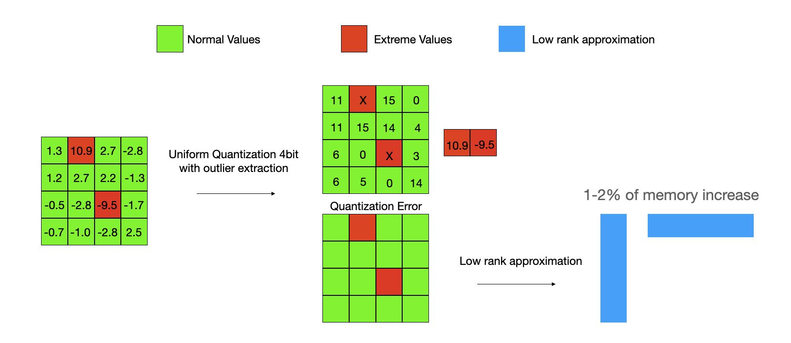

# GEAR: An Efficient KV Cache Compression Recipe for Near-Lossless Generative Inference of LLM

> Hao Kang, Qingru Zhang, Souvik Kundu, Geonhwa Jeong, Zaoxing Liu, Tushar Krishna, Tuo Zhao

## 一句话总结

GEAR 提出了一种高效的 KV Cache 压缩框架，通过将量化、低秩分解和稀疏矩阵三者协同结合，在 4-bit 和 2-bit 压缩下实现近乎无损的生成式推理性能，相比 FP16 基线可提升吞吐量高达 5.07 倍，同时降低峰值内存高达 2.39 倍。

## 摘要翻译

键值（KV）缓存已成为加速大语言模型（LLM）推理生成速度的事实标准方法。然而，随着序列长度的增长，缓存需求不断膨胀，使得 LLM 推理转变为内存受限问题，严重制约了系统吞吐量。现有方法依赖于丢弃不重要的 token 或对所有条目进行统一量化，但这些方法往往导致压缩矩阵的高近似误差。自回归解码过程进一步加剧了每一步的误差，导致模型生成的严重偏差和性能恶化。为解决这一挑战，我们提出 GEAR，一种高效的 KV Cache 压缩框架，通过增强量化方案并结合两种轻量级误差缩减技术，实现近乎无损的高压缩比性能。GEAR 首先将绝大多数（约 98%）相似幅度的条目量化到超低精度，然后使用低秩矩阵近似量化误差，再使用稀疏矩阵修补离群条目的个别误差。通过巧妙整合这三种技术，GEAR 充分利用了它们的协同潜力。实验表明，与替代方案相比，GEAR 在 2-bit KV 缓存压缩下可实现平均 14.95% 的准确率提升，同时将峰值内存降低高达 2.39 倍，吞吐量提升 2.10 倍至 5.07 倍。

## 研究动机

### 核心问题
在 LLM 推理中，KV 缓存（存储之前计算的 Key/Value 张量）的内存消耗随着模型大小和序列长度的增加而迅速增长。例如，对于一个 300 亿参数的 LLM，当输入长度为 1024、批大小为 128 时，KV 缓存可占用高达 180GB 内存。这严重限制了系统吞吐量。

### 现有方法的不足
现有方法主要有两类：
1. **Token 丢弃方法**（如 H2O）：利用注意力分数的稀疏性丢弃不重要的 token。但在复杂生成任务中（如数学推理、链式思维推理），每个 token 都可能包含重要信息，丢弃会导致性能显著下降。
2. **统一量化方法**（如 FlexGen、KIVI）：将 KV 缓存量化到低精度（如 4-bit 或 2-bit）。然而，这些方法在高压缩比下会产生显著的近似误差，且自回归解码过程会累积误差，导致生成严重偏离。

### 关键洞察
在简单任务（如文本分类）中，模型只需生成少量 token，少量近似误差不会显著影响结果。但在复杂生成任务中，模型需要生成更长的序列，每一步的近似误差都会被放大，最终导致性能急剧下降。因此，问题的核心在于高压缩比下的近似误差。

## 方法（技术细节）

### 框架概览

GEAR（GEnerative Inference with Approximation Error Reduction）是一个高效的误差缩减框架，将 KV Cache 矩阵分解为三个组件：

$$\min_{\hat{D}, L, S} \| X - \hat{D} - L - S \|_F$$

其中：
- $\hat{D}$：量化矩阵（压缩骨架）
- $L$：低秩矩阵（近似量化残差）
- $S$：稀疏矩阵（修补离群条目误差）

### 1. 异常感知量化（Outlier-aware Quantization）

**目标**：高效压缩大部分相似幅度的条目到超低精度。

**方法**：
- 对于 Key 缓存：按通道（channel）提取每个通道向量中最大和最小的 $\frac{s}{2}\%$ 条目
- 对于 Value 缓存：按 token 提取每个 token 向量中最大和最小的 $\frac{s}{2}\%$ 条目
- 将这些异常值存储到全精度的稀疏矩阵 $S$ 中

**量化骨架**（KCVT）：
- Key 缓存按通道量化（per-channel），所有 Key 通道形成一个大小为 $n$ 的组
- Value 缓存按 token 量化（per-token），所有 Value token 形成一个大小为 $d$ 的组
- 这种粗粒度分组显著减少了缩放因子和零点的存储开销

### 2. 低秩近似（Low-rank Approximation）

**目标**：高效近似量化残差中的相干分量。

**关键观察**：残差矩阵的频谱在开头快速下降，表明残差中存在相干成分。

**方法**：
- 将残差 $R = X - (\hat{D} + S)$ 沿通道维度重塑为 H 个多头子矩阵
- 对每个头 $h$，执行 head-wise 低秩分解：$L_h = A_h B_h^T$
- 使用高效幂迭代算法（Vogels et al., 2019）计算 $A_h, B_h$
- 典型设置：当 $n = 1024, d_H = 128$ 时，$r = 4$ 就足够实现近乎无损的高压缩比

**核心优势**：低秩分解利用了向量间的相似性，将残差中的相干信息高效提取出来。

### 3. 稀疏矩阵（Sparse Matrix）

**目标**：修补由异常值引起的个体误差。

**方法**：
- 将异常值（最大/最小的 $\frac{s}{2}\%$ 条目）存储到稀疏矩阵 $S$ 中
- 典型稀疏率 $s = 2\%$

**互补性**：低秩矩阵捕获残差中的相干基，稀疏矩阵修正异常值的不相干性，两者互补。

### 4. 流式缓冲策略（Streaming Buffer）

**目标**：提升长序列生成时的推理效率。

**方法**：
- 将新生成 token 的 KV 向量存储到小缓冲区（$n_b = 20$）
- 每 $n_b$ 步执行一次 KV 缓存压缩
- 低秩近似仅对缓冲区中的新 token 执行（rank 为 2）
- 显著减少低秩计算开销

### 5. GPU 友好实现

- **CUDA 内核融合**：将反量化与矩阵乘法融合，改善解码延迟
- **低秩前向传播优化**：先计算下投影 $q_h^T B_h$，再计算上投影 $(q_h^T B_h) A_h^T$
- **流式缓冲**：同时对 Key 和 Value 缓存进行流式压缩

## 实验结果

### 评估模型与任务
- **模型**：LLaMA2-7B/13B、Mistral-7B、LLaMA3-8B
- **任务**：
  - 数学推理：GSM8k（CoT）、AQuA（CoT）
  - 符号推理：BigBench Hard（BBH，CoT）
  - 长上下文理解：LongBench
- **对比基线**：Per-token Q、KIVI、KCVT Quant、H2O

### 主要结果

**CoT 推理任务（Table 1）**：
- 4-bit 压缩：GEAR 接近 FP16 精度（如 LLaMA3-8B 上平均 40.80% vs FP16 的 40.52%）
- 2-bit 压缩：GEAR 在 LLaMA3-8B 上达到 47.83% 平均准确率（FP16 为 48.69%），显著优于最佳基线 KIVI（28.82%）
- GEAR-L（轻量版，仅低秩）在 2-bit 下也显著优于基线（38.34% vs 25.25%）

**简单任务（Table 2）**：
- GSM8k 5-shot：GEAR 在 LLaMA3-8B 上达到 49.96%（KIVI 为 42.54%）
- LongBench：GEAR 在 21 个任务上达到 25.48 平均分，接近 FP16 基线

### 推理效率（Figure 3）
- **峰值内存**：相比 FP16 基线降低高达 2.39 倍，最大批大小从 3 增加到 18
- **吞吐量**：相比 FP16 基线提升 2.10 倍至 5.07 倍
- **时间开销**：低秩和稀疏组件的额外开销可忽略不计（Figure 3a）

### 消融实验
- **稀疏率 s 和秩 r**：s=2%, r=4 即可实现近乎无损的 2-bit 压缩，进一步增大收效甚微
- **低秩的作用**：移除低秩分量会导致性能显著下降，凸显其在误差缩减中的关键作用
- **稀疏矩阵的作用**：移除稀疏矩阵会降低性能，但不如移除低秩明显

## 优势

1. **近乎无损的高压缩比性能**：在 2-bit KV 缓存压缩下，GEAR 可实现近乎无损的生成式推理性能，平均准确率提升高达 24.42%（相比最佳基线）
2. **即插即用的通用性**：GEAR 可与任何现有量化方案（如 KIVI、KCVT）结合使用，无需额外校准
3. **极低的额外开销**：低秩和稀疏组件的计算和内存开销可忽略不计，主要复杂度仍来自模型前向传播
4. **显著的效率提升**：峰值内存降低高达 2.39 倍，吞吐量提升高达 5.07 倍
5. **简单的超参数设置**：仅需设置稀疏率 s=2% 和秩 r=4，无需复杂调优
6. **支持流式缓冲**：通过流式缓冲策略进一步提升长序列生成的推理效率
7. **在复杂任务中表现优异**：特别适合需要长序列生成和复杂推理的 CoT 任务

## 局限

1. **固定秩的低秩近似**：当前对所有 Key/Value 矩阵使用相同的秩 $r$，忽略了不同层和头之间重要性的差异。作者在论文中提到，自适应地分配低秩预算可能进一步提升性能，但留作未来探索
2. **稀疏矩阵的开销**：虽然稀疏率较低（$s=2\%$），但当需要提取大量异常值时，全精度存储的开销可能变得可观
3. **仅适用于 KV Cache 压缩**：GEAR 的框架专门针对 KV Cache，尚未探索其在权重量化或激活压缩中的应用
4. **对超低精度的挑战**：虽然 GEAR 在 2-bit 下表现优异，但当压缩比进一步提高时，性能仍可能下降
5. **需要 GPU 支持**：CUDA 内核实现需要特定的硬件支持

## 与 EfficientPaper 相关的研究方向

1. **KV Cache 量化与压缩**：GEAR 是 KV Cache 压缩领域的重要进展，与 KIVI、KVQuant 等工作密切相关，属于高效的 KV 缓存管理方向
2. **低秩分解在推理优化中的应用**：GEAR 中的低秩近似技术可推广到其他需要近似矩阵计算的场景
3. **自回归生成中的误差传播**：GEAR 揭示了自回归解码中近似误差累积的问题，为理解 LLM 推理中的误差传播提供了新视角
4. **内存高效的 LLM 推理**：GEAR 是实现高效 LLM 推理的重要一环，与模型压缩、量化、KV Cache 管理等方向形成完整的研究生态
5. **即插即用的误差缩减框架**：GEAR 的框架设计思想可推广到其他需要误差缩减的场景，如激活压缩、注意力计算等
6. **长序列生成优化**：GEAR 的流式缓冲策略为长序列生成提供了新的优化思路，与 FlashAttention 等注意力优化技术形成互补

## AI 生成声明

> 本笔记由 AI Agent 自动生成，基于对论文 GEAR（arXiv:2403.05527）的 PDF 文本提取和分析。笔记内容力求准确反映论文的核心思想和实验结果，但可能存在细节偏差，请以原文为准。生成时间：2026年6月。
