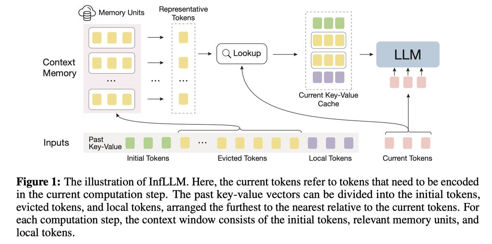

# InfLLM: Training-Free Long-Context Extrapolation for LLMs with an Efficient Context Memory

> Chaojun Xiao, Pengle Zhang, Xu Han, Guangxuan Xiao, Yankai Lin, Zhengyan Zhang, Zhiyuan Liu, Maosong Sun

## 一句话总结

InfLLM 提出了一种无需训练的上下文记忆机制，通过将远距离上下文存储为块级记忆单元并动态查找相关单元进行注意力计算，使仅在短序列上预训练的 LLM 能够高效处理长达 1024K token 的超长序列，性能与经过持续长序列训练的模型相当。

## 摘要翻译

大语言模型（LLM）已成为处理长流式输入（如 LLM 驱动的智能体）等实际应用的基石。然而，现有 LLM 在受限最大长度的序列上预训练，由于超出分布和干扰问题，无法处理更长的序列。常见解决方案通常涉及在更长的序列上进行持续预训练，这将引入昂贵的计算开销和不可控的模型能力变化。本文揭示了 LLM 在无需任何微调的情况下理解超长序列的内在能力。为此，我们引入了一种无需训练的基于记忆的方法 InfLLM。具体而言，InfLLM 将远距离上下文存储到额外的记忆单元中，并采用高效的机制查找与当前 token 相关的单元进行注意力计算。因此，InfLLM 使 LLM 能够在有限的上下文窗口下高效处理长序列，并很好地捕获长距离依赖关系。无需任何训练，InfLLM 使在仅包含几千个 token 的序列上预训练的 LLM 能够达到与在长序列上持续训练的竞争基线相当的性能。即使序列长度扩展到 1024K，InfLLM 仍能有效捕获长距离依赖关系。

## 研究动机

### 问题背景

随着 LLM 驱动的应用（如智能体构建和具身机器人）的蓬勃发展，增强 LLM 处理长流式序列的能力变得越来越关键。例如，LLM 驱动的智能体需要基于所有历史记忆持续处理来自外部环境的信息，这要求其具备处理长流式序列的鲁棒能力。

### 核心挑战

1. **超出分布问题（Out-of-domain）**：大多数 LLM 仅在几千个 token 的序列上预训练，直接处理更长的序列会遇到超出分布的挑战。
2. **干扰问题（Distraction）**：长序列中的噪声上下文会干扰 LLM 的推理能力，导致注意力分散。
3. **持续预训练的代价**：在更长序列上持续训练 LLM 会产生大量计算成本，需要大规模高质量的长序列数据集，且可能损害 LLM 在短上下文上的性能。

### 现有方法的不足

- **位置编码扩展方法**（如 NTK、SelfExtend）：可以缓解超出分布问题，但无法解决噪声上下文的干扰问题。
- **滑动窗口方法**（如 LM-Infinite、StreamingLLM）：直接丢弃远距离上下文，无法捕获长距离依赖。
- **KV 缓存压缩方法**（如 H2O）：无法在不进一步训练的情况下将上下文窗口扩展到更长的序列。
- **持续训练方法**（如 Llama-3-8B-Instruct-Gradient-1048k）：需要 512 块 GPU 进行持续训练，成本极高。

## 方法（技术细节）

### 整体框架

InfLLM 基于滑动窗口注意力机制，构建额外的上下文记忆模块，为每个 token 提供高度相关的上下文信息，赋予滑动窗口注意力机制捕获长距离依赖的能力。

**输入处理方式**：将长输入序列分块编码（chunk-by-chunk），逐个 token 生成输出。每次计算步骤的输入包括过去的 KV 向量 $P = \{(k_j, v_j)\}_{j=1}^{l_P}$ 和当前 token $X = \{t_{i+l_P}\}_{i=1}^{l_X}$。

**上下文分组**：根据与当前 token 的距离，将过去的 KV 向量分为三组：
- **初始 token**（Initial Tokens）$I = P[1:l_I]$：最远的 token，保留系统提示和任务描述。
- **被驱逐 token**（Evicted Tokens）$E = P[l_I+1:l_P-l_L]$：存储在上下文记忆中。
- **局部 token**（Local Tokens）$L = P[l_P-l_L+1:l_P]$：最近的 token。

**当前 KV 缓存组成**：$C = \text{Concat}(I, f(X, E), L)$，其中 $f(\cdot)$ 是上下文记忆的查找操作。

**注意力输出**：$O = \text{Attn}[Q_X, \text{Concat}(C_k, K_X), \text{Concat}(C_v, V_X)]$

### 上下文记忆机制

**核心思想**：利用 LLM 注意力分数矩阵的稀疏性，仅保留一小部分关键的 KV 向量，忽略不相关的噪声上下文。

#### 块级记忆单元（Block-Level Memory Units）

- 将过去的 KV 向量分割成多个块（block），每个块包含 $l_{bs}$ 个连续的 token。
- 从每个块中选择 $r_k$ 个具有最高代表分数的 token 作为块的表示。
- **代表分数**定义：$r_m = \frac{1}{l_L} \sum_{j=1}^{l_L} q_{m+j} \cdot k_m$，表示第 $m$ 个 token 在局部窗口中的重要性。
- **优势**：
  1. **有效查找**：块的连贯语义更有效地满足相关信息检索需求，最小化不重要 token 的干扰。
  2. **高效查找**：块级单元消除了逐 token 的相关性计算，显著降低计算成本，并确保连续的内存访问。

#### 位置编码

对超出局部窗口大小的所有 token 分配相同的位置编码（设为 $l_L$），避免位置超出分布问题。通过解码器的单向性，模型仍能有效理解上下文中的相对位置信息（实验验证了这一点）。

#### 缓存管理

- **GPU-CPU 卸载机制**：将大部分记忆单元存储在 CPU 内存中，仅在 GPU 内存中保留频繁使用的单元。
- **LRU（最近最少使用）策略**：在 GPU 内存中维护固定大小的缓存，使用 LRU 策略管理。
- **频率评分更新**：$s_b = s_b \cdot d + \sum_{j=1}^{l_X} \sum_{i=1}^{l_{bs}} \text{attention\_score}(q_{j+l_P}, k_i)$，其中 $d$ 是衰减系数。
- 仅需 26GB VRAM 即可处理 100K token 的序列，GPU 缓存命中率高，不会引入显著的时间开销。

### 超参数设置

- 编码块大小：512
- 记忆单元大小 $l_{bs}$：128
- 代表 token 数 $r_k$：4
- 局部窗口大小：4K（Mistral 和 Llama-3）
- 选择的记忆单元数：96（Mistral）/ 32（Llama-3）
- 初始 token 数：128
- 使用 FlashAttention 加速

## 实验结果

### 基准测试

- **∞-Bench**：平均序列长度 145.1K，涵盖问答、摘要、上下文检索、数学计算等任务。
- **LongBench**：双语多任务长上下文理解基准。
- **基座模型**：Mistral-7B-Instruct-v0.2（最大长度 32K）和 Llama-3-8B-Instruct（最大长度 8K）。

### 主要结果（∞-Bench）

| 模型 | 上下文窗口 | 平均性能 |
|------|-----------|---------|
| Mistral（原始） | 32K | 25.2 |
| NTK | 128K | 44.3 |
| SelfExtend | 128K | 44.8 |
| StreamingLLM | 32K | 21.5 |
| H2O | 32K | 18.7 |
| **InfLLM** | **16K** | **57.7** |
| Llama-3（原始） | 8K | 18.4 |
| NTK | 128K | 1.3 |
| SelfExtend | 128K | 38.0 |
| StreamingLLM | 8K | 16.3 |
| H2O | 8K | 2.1 |
| **InfLLM** | **8K** | **45.0** |

**关键发现**：
- InfLLM 在 Mistral 基座上平均性能 57.7%，远超所有基线（最佳基线 SelfExtend 仅 44.8%）。
- 在 Llama-3 基座上，InfLLM 平均 45.0%，而 NTK 仅 1.3%，SelfExtend 38.0%。
- InfLLM 在 Retrieve.PassKey、Retrieve.Number、Retrieve.KV 等检索任务上表现尤为突出（接近 100%）。

### 与持续训练模型对比

| 方法 | 训练 | R.PK | R.Num | R.KV | Choice | QA | Sum | Math.F | VRAM | 时间 |
|------|------|------|-------|------|--------|----|----|--------|------|------|
| Llama-1M | ✗ | 100.0 | 99.8 | 23.2 | 51.5 | 13.6 | 18.5 | 18.3 | 76.6G | 40.4s |
| **InfLLM** | **✓** | **100.0** | **99.0** | 5.0 | 43.7 | **19.5** | **24.3** | **23.7** | **26.3G** | **26.7s** |

- InfLLM 无需任何训练，仅使用 26.3G VRAM（vs 76.6G），时间消耗减少 34%。
- Llama-1M 需要 512 块 GPU 进行持续训练，InfLLM 无需训练。
- InfLLM 可在单 GPU 上处理高达 1024K token 的序列。

### 扩展到 1024K 上下文

在 Retrieve.PassKey 任务上，InfLLM 在序列长度从 32K 到 1024K 的范围内均保持 100% 准确率，而 LM-Infinite 的性能随长度增加而急剧下降。

### 与 RAG 对比

在三个上下文检索任务上，InfLLM 始终优于 RAG-E5（使用 E5-mistral-7B-instruct 作为检索模型）：
- Retrieve.PassKey：InfLLM 100.0% vs RAG 89.2%
- Retrieve.Number：InfLLM 96.1% vs RAG 65.4%
- Retrieve.KV：InfLLM 96.8% vs RAG 13.2%

### LongBench 结果

InfLLM 在 LongBench 的多项任务上也表现优异，例如 Mistral-InfLLM（12K 窗口）的平均性能 44.02% 与原始 Mistral（32K 窗口）的 43.78% 持平或更优。

### 消融实验

| 方法 | R.KV | Math.F | QA |
|------|------|--------|----|
| InfLLM（完整） | 96.8 | 25.7 | 15.7 |
| Decoding-Only | 85.2 | 26.3 | 12.0 |
| w/o Lookup | 0.4 | 16.3 | 11.4 |
| Mean Repr | 84.6 | 25.1 | 14.9 |

- 减少记忆查找次数会导致性能显著下降。
- 平均表示（Mean Repr）也可获得竞争性能，但代表 token 选择更优。
- 在 Vicuna（最大长度 4K）上，InfLLM 可有效将上下文长度扩展到 128K，但 Retrieve.KV 和 Math.Find 任务效果有限。

## 优势

1. **无需训练**：完全不涉及任何训练或微调，可直接应用于任何 LLM，避免了持续训练的高成本和模型能力变化。
2. **高效处理超长序列**：仅需 26GB VRAM 即可处理 100K token 序列，且可扩展到 1024K token。
3. **性能优异**：在 ∞-Bench 上平均性能显著超越所有基线方法（包括经过持续训练的模型），在检索任务上接近 100%。
4. **灵活性高**：可与经过持续训练的模型结合使用（如 Llama-1M+InfLLM），进一步提升性能。
5. **块级记忆设计**：通过块级单位减少了计算和内存访问开销，同时保证了有效的语义表示。
6. **可扩展到极长序列**：在 1024K token 的序列上仍保持 100% 的准确率。
7. **GPU-CPU 卸载机制**：利用 LRU 策略管理 GPU 缓存，显著降低 GPU 内存使用。
8. **通用性强**：适用于不同基座模型（Mistral、Llama-3、Vicuna）。

## 局限

1. **CPU 内存开销大**：大量过去的 KV 缓存需要存储在 CPU 内存中，增加了 CPU 内存的使用。未来可通过集成 KV 缓存量化等技术来减少 CPU 内存需求。
2. **推理速度仍有提升空间**：虽然 InfLLM 减少了长文本处理的计算开销，但仍有加速空间。未来可与 llama.cpp 和 vLLM 等推理框架集成，进一步提升推理速度。
3. **块大小的固定性**：当前采用启发式规则（固定块大小 128）进行上下文分割，不同任务的最优块大小可能不同（如 Retrieve.KV 需要较小的块，Math.Find 需要较大的块）。动态分割上下文是一个重要的未来研究方向。
4. **代表 token 选择的局限性**：当代表 token 数量过多（如 8 个）时，性能可能略有下降，因为包含了语义无关的 token 作为单位表示。
5. **弱模型上的效果有限**：在 Vicuna 等能力较弱的模型上，InfLLM 在某些复杂任务（如 Retrieve.KV 和 Math.Find）上无法展示性能提升，因为这些模型的隐藏向量在超长文本中过滤噪声的能力有限。
6. **记忆查找的效率问题**：随着选择单元数量的增加，模型性能显著提升，但也会增加内存调度和注意力计算的时间。

## 与 EfficientPaper 相关的研究方向

1. **KV 缓存压缩**：InfLLM 采用块级记忆和 GPU-CPU 卸载机制来管理 KV 缓存，与 KV 缓存压缩方法（如 H2O、SnapKV）密切相关。未来可结合 KV 缓存量化技术进一步优化内存使用。
2. **高效注意力机制**：InfLLM 基于滑动窗口注意力机制，并构建额外的上下文记忆模块，属于高效注意力计算的范畴。
3. **长上下文扩展**：InfLLM 通过上下文记忆机制实现长上下文扩展，与位置编码扩展方法（如 NTK、SelfExtend）和持续训练方法（如 Llama-1M）形成对比。
4. **检索增强生成（RAG）**：InfLLM 的上下文记忆机制与 RAG 的思想类似，但无需额外训练，且在多个任务上优于 RAG。
5. **推理效率优化**：InfLLM 通过块级记忆和 GPU 缓存管理提高了推理效率，可与 llama.cpp 和 vLLM 等推理框架结合，进一步优化推理速度。
6. **流式处理**：InfLLM 支持流式处理超长序列，适用于 LLM 驱动的智能体等应用场景。

## AI 生成声明

本笔记由 AI Agent（Hermes Agent）自动生成，基于论文 PDF 文本提取和元数据信息。笔记内容经过整理和翻译，可能存在翻译不准确或信息遗漏的情况，请以原始论文为准。生成时间：2025年6月。
