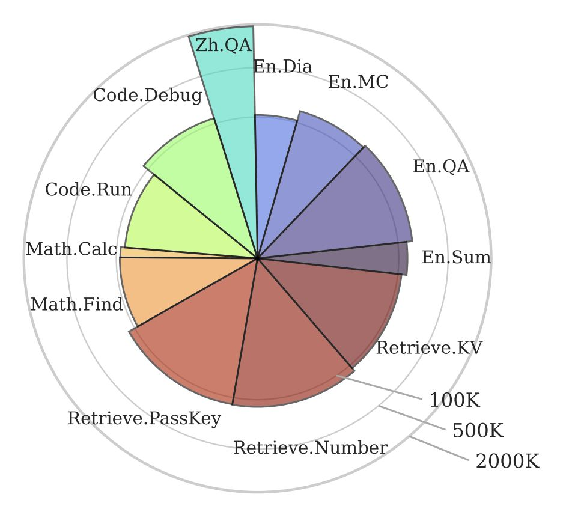

# ∞Bench: Extending Long Context Evaluation Beyond 100K Tokens

> Xinrong Zhang, Yingfa Chen, Shengding Hu, Zihang Xu, Junhao Chen, Moo Khai Hao, Xu Han, Zhen Leng Thai, Shuo Wang, Zhiyuan Liu, Maosong Sun

## 一句话总结

本文提出了 ∞Bench，首个平均数据长度超过 100K tokens 的长上下文 LLM 评估基准，涵盖 12 个任务、5 个领域、英中双语，揭示了当前最强 LLM 在超长上下文处理上仍存在严重性能退化。

---

## 摘要翻译

处理和推理长上下文对于大语言模型（LLM）的许多实际应用至关重要，如文档理解和智能体构建。尽管近年来 LLM 在处理超过 100K tokens 上下文方面取得了显著进展，但目前缺乏标准化的基准来评估这一长上下文能力。现有的公开基准通常聚焦于约 10K tokens 的上下文，限制了对 LLM 处理更长上下文能力的评估和比较。本文提出了 ∞Bench，这是首个平均数据长度超过 100K tokens 的 LLM 基准。∞Bench 包含跨越多个领域的合成和真实任务，以英语和中文呈现。∞Bench 中的任务设计需要对上下文中的长距离依赖关系有充分理解，使得仅从上下文中检索少量段落不足以完成这些任务。在实验中，基于 ∞Bench，我们评估了针对长上下文处理的最新专有和开源 LLM。结果表明，现有的长上下文 LLM 在有效处理 100K+ 上下文方面仍需重大改进。我们进一步提出了关于 LLM 处理长上下文行为的三个有趣分析。

---

## 研究动机

1. **长上下文处理需求日益增长**：LLM 在网页导航、代码仓库分析、文档信息提取等实际场景中需要处理长上下文，但传统训练的 LLM 通常只训练在 8K tokens 以内的序列上，难以处理更长序列。

2. **长上下文 LLM 快速发展但评估滞后**：GPT-4、Claude 2、Kimi-Chat 等模型声称支持 100K+ tokens，但现有基准（如 LongBench、L-Eval、LooGLE）的平均上下文长度仅约 10K tokens，远低于 100K，无法有效评估和比较长上下文 LLM 的能力。

3. **缺乏标准化的超长上下文基准**：现有基准在领域覆盖、语言支持和上下文长度上存在不足，无法全面评估 LLM 在超长上下文下的理解、推理和检索能力。∞Bench 填补了这一空白，首个平均长度超过 100K tokens（约 200K）的多领域双语基准。

---

## 方法（技术细节）

### 基准设计

∞Bench 包含 **12 个任务**，覆盖 **5 个领域**（检索、代码、数学、小说、对话），包含 **3946 个示例**，平均长度约 200K tokens。

任务分为两大类：

#### 1. 真实上下文任务（Realistic Context）

- **En.Sum（小说摘要）**：要求模型对整部小说生成简明摘要，使用 ROUGE-L-Sum 评估。
- **En.QA & Zh.QA（小说问答）**：要求模型理解小说中的长距离依赖，问题分为聚合型（汇总分散信息）和过滤型（从大量信息中识别特定信息）。
- **En.MC（小说多选题）**：类似 QA，但提供四个答案选项。
- **En.Dia（对话任务）**：从电影/电视剧剧本中随机替换角色名称为 $$MASK$$，要求模型正确识别被替换的名称。
- **Code.Debug（代码调试）**：从 PyPI 仓库中提取代码，由作者插入故意错误，要求模型识别出有错误的函数。提供四个选项，其中一个包含注入的错误。

#### 2. 合成上下文任务（Synthetic Context）

- **Retrieve.PassKey（密钥检索）**：在大量无关文本中找到随机 5 位密钥，590 个示例，59 个不同位置。
- **Retrieve.Number（数字检索）**：增强版检索，答案为 10 位数字，包含连续重复数字，测试局部注意力能力。
- **Retrieve.KV（键值检索）**：在大 JSON 对象中检索特定键对应的值。
- **Code.Run（代码执行）**：评估 LLM 模拟多步函数执行的能力，函数间有嵌套调用，深度从 2 到 10。
- **Math.Find（数学查找）**：在大数组中找出最大/最小/中位数，测试状态保持能力。
- **Math.Calc（数学计算）**：计算长算术表达式的结果，要求模型提供每个运算符后的中间结果。

### 评估方法

- **输入截断**：由于 API 限制，输入通过移除中心并拼接两端来截断，假设关键信息位于开头或结尾。
- **提示模板**：为每个模型-任务组合专门设计提示，通过短示例优化性能。
- **模型基线**：评估 GPT-4、Claude 2、Kimi-Chat、YaRN-Mistral-7B-128K。

### 关键创新

- **实体替换**：对小说任务采用关键实体替换（如主角名字替换为无关名字），防止模型通过训练记忆回答问题。
- **多种注释管道**：开发了 5 条注释管道，经过迭代优化直到质量达标。
- **合成任务可扩展**：合成任务可轻松扩展到更长的上下文长度。

---

## 实验结果

### 主要结果

| 任务 | GPT-4 | YaRN-Mistral | Kimi-Chat | Claude 2 |
|------|-------|--------------|-----------|----------|
| Retrieve.PassKey | 100.00 | 92.71 | 98.14 | 97.80 |
| Retrieve.Number | 100.00 | 56.61 | 95.42 | 98.14 |
| Retrieve.KV | 89.00 | 0.00 | 53.60 | 65.40 |
| En.Sum | 14.73 | 9.09 | 17.93 | 14.45 |
| En.QA | 22.22 | 9.55 | 16.52 | 11.97 |
| En.MC | 67.25 | 27.95 | 72.49 | 62.88 |
| En.Dia | 8.50 | 7.50 | 11.50 | 46.50 |
| Zh.QA | 23.06 | 16.98 | 18.62 | 10.53 |
| Code.Debug | 39.59 | 0.76 | 18.02 | 2.28 |
| Code.Run | 23.25 | 1.25 | 2.00 | 2.50 |
| Math.Calc | 0.01 | 0.00 | 0.00 | 0.00 |
| Math.Find | 60.00 | 17.14 | 12.57 | 32.29 |
| **平均** | **45.63** | **19.96** | **34.73** | **37.06** |

### 关键发现

1. **GPT-4 总体最强**：在检索、代码和数学领域表现突出，平均分最高（45.63）。
2. **小说任务无明显胜者**：各专有模型在小说相关任务上表现相近。
3. **开源模型差距大**：YaRN-Mistral 在大多数任务上落后，多个领域接近随机表现。
4. **检索任务相对简单**：所有基线在检索任务上表现较好，但其他领域表现不佳。
5. **Math.Calc 极具挑战**：所有模型在数学计算任务上几乎为零分。
6. **上下文长度影响性能**：随着输入长度增加，模型性能普遍下降。
7. **未发现"中间迷失"现象**：与 Liu et al. (2023) 不同，∞Bench 未发现一致的中间位置性能下降趋势。
8. **上下文召回技术**：在 Code.Debug 中，让 GPT-4 先重复相关代码再分析，准确率从 15.74% 提升至 39.59%。

---

## 优势

1. **首个超长上下文基准**：平均长度约 200K tokens，远超现有基准（约 10K），填补了评估空白。
2. **多领域覆盖**：涵盖检索、代码、数学、小说、对话 5 个领域，评估全面。
3. **英中双语支持**：同时支持英语和中文任务，适合多语言场景。
4. **合成与真实任务结合**：合成任务可扩展到任意长度，真实任务确保实际应用价值。
5. **精心设计的注释流程**：5 条注释管道，迭代优化，确保质量。
6. **实体替换防作弊**：通过关键实体替换防止模型通过训练记忆回答问题。
7. **丰富的分析洞察**：长度消融实验、"中间迷失"分析、上下文召回技术，为模型改进提供方向。
8. **开源开放**：代码和数据已公开，便于社区使用和扩展。

---

## 局限

1. **评估对象有限**：仅评估 4 个模型（GPT-4、Claude 2、Kimi-Chat、YaRN-Mistral），未涵盖更多专有和开源模型。
2. **输入截断策略**：由于 API 限制，采用移除中心的截断策略，可能丢失关键信息。
3. **缺少多模态任务**：所有任务均为纯文本，未涉及图像、音频等多模态长上下文。
4. **任务难度分布不均**：部分任务（如 Math.Calc）对所有模型都极难，区分度有限。
5. **注释质量依赖人工**：真实上下文任务依赖人工注释，可能存在主观偏差。
6. **未考虑模型成本和效率**：未评估处理长上下文的计算成本、延迟等效率指标。
7. **"中间迷失"现象未充分验证**：虽然未发现一致趋势，但可能受任务类型和模型选择影响。

---

## 与 EfficientPaper 相关的研究方向

1. **长上下文推理效率优化**：在处理 100K+ tokens 时，如何降低计算成本和内存消耗，提升推理效率。
2. **高效注意力机制**：如 FlashAttention、Sliding Window Attention、StreamingLLM 等，如何在保持长上下文理解能力的同时减少计算复杂度。
3. **位置编码优化**：如 YaRN、ALiBi 等位置编码方法，如何更好地处理超长序列的泛化。
4. **长上下文模型压缩**：在保持长上下文能力的前提下，对模型进行量化、蒸馏等压缩。
5. **长上下文数据高效训练**：如何用更少的数据和计算资源训练出能处理长上下文的模型。
6. **长上下文评估方法改进**：如何设计更高效、更全面的长上下文评估基准，减少评估成本。
7. **长上下文推理加速**：如 KV Cache 优化、推测解码等技术，加速长上下文推理。
8. **多模态长上下文**：如何高效处理图像、音频等多模态长上下文，扩展 ∞Bench 到多模态场景。

---

## AI 生成声明

本笔记由 AI Agent（Hermes Agent）自动生成，基于论文元数据、现有笔记内容和 PDF 文本提取。笔记内容经过整理和翻译，仅供参考。所有技术细节和实验结果均来自原论文，AI 不对其准确性负责。如需引用，请查阅原始论文。
