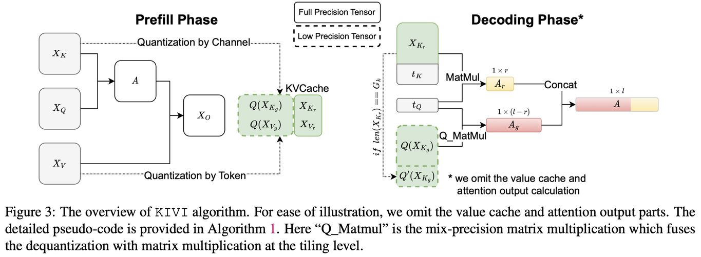

# KIVI: A Tuning-Free Asymmetric 2bit Quantization for KV Cache

> Zirui Liu, Jiayi Yuan, Hongye Jin, Shaochen Zhong, Zhaozhuo Xu, Vladimir Braverman, Beidi Chen, Xia Hu

**发表信息**: ICML 2024 | **机构**: Rice University, Texas A&M University, Stevens Institute of Technology, Carnegie Mellon University
**代码**: https://github.com/jy-yuan/KIVI

---

## 一句话总结

KIVI 提出了一种无需微调的非对称 2bit KV Cache 量化方法，通过对 Key Cache 按通道（per-channel）量化、Value Cache 按令牌（per-token）量化，在保持模型质量几乎不变的前提下，将峰值内存降低 2.6 倍，吞吐量提升 2.35×~3.47×。

---

## 摘要翻译

高效服务大语言模型（LLM）需要将大量请求批处理以降低单个请求的成本。然而，随着批处理大小和上下文长度的增加，KV Cache（存储注意力键和值以避免重复计算）显著增加内存需求，成为速度和内存使用的新瓶颈。此外，KV Cache 的加载导致计算核心空闲，限制了推理速度。量化是一种简单且有效的减少 KV Cache 大小的方法，它减少了 KV Cache 所占用的总字节数。然而，目前缺乏对 KV Cache 元素分布的深入研究，难以理解 KV Cache 量化的难度和局限性。为了填补这一空白，我们对流行 LLM 的 KV Cache 元素分布进行了全面研究。研究发现：Key Cache 应按通道量化（即沿通道维度分组元素并一起量化），而 Value Cache 应按令牌量化。基于此分析，我们开发了一种名为 KIVI 的无需微调的 2bit KV Cache 量化算法。通过硬件友好的实现，KIVI 可以使 Llama、Falcon 和 Mistral 模型在保持几乎相同质量的同时，使用 2.6 倍更少的峰值内存（包括模型权重）。这种内存减少使得批处理大小可以增加最多 4 倍，在实际 LLM 推理工作负载上带来 2.35×~3.47× 的吞吐量提升。

---

## 研究动机

1. **KV Cache 是推理瓶颈**：在大语言模型的推理过程中，KV Cache 存储了注意力机制的键和值，避免重复计算。随着批处理大小和上下文长度增加，KV Cache 的内存需求急剧增长。例如，OPT-175B 在批大小 512、上下文长度 512 的情况下，KV Cache 需要 1.2TB，是模型权重的 3.8 倍。
2. **内存与速度双重瓶颈**：KV Cache 不仅占用大量 GPU 显存，还导致 GPU 在加载 KV Cache 时计算核心空闲，限制了推理速度。
3. **缺乏对 KV Cache 分布的深入研究**：现有量化方法没有深入探索 KV Cache 元素的分布特征，导致量化策略不够精细。
4. **现有量化方法的不足**：传统的 round-to-nearest 量化方法没有考虑 Key Cache 和 Value Cache 在分布上的差异，导致 2bit 量化时性能严重下降（如对 Llama-2-13B，2bit 全量量化导致 CoQA 准确率从 66.37 降至 2.88）。

---

## 方法（技术细节）

### 3.1 KV Cache 分布分析

通过可视化 Llama-2-13B 和 Falcon-7B 的 Key/Value Cache 分布，发现：
- **Key Cache**：存在少量固定通道（channel）的值非常大（outlier channels），与激活异常值一致（Dettmers et al., 2022; Lin et al., 2023）。
- **Value Cache**：没有明显的通道异常值模式，分布较为均匀。

### 3.2 非对称量化策略（核心贡献）

基于分布分析，提出**非对称量化**：
- **Key Cache 按通道量化（per-channel）**：将误差限制在每个通道内，不影响其他正常通道。实验表明，per-channel 量化的注意力分数误差比 per-token 低 5 倍。
- **Value Cache 按令牌量化（per-token）**：由于注意力输出本质上是 Value Cache 的加权求和（value cache mixer），且注意力分数高度稀疏（84.3%），per-token 量化可以将误差限制在每个令牌内，不会影响其他重要令牌。

### 3.3 KIVI 算法

**问题**：Key Cache 按通道量化需要跨不同令牌分组，但在自回归推理中，新令牌是按顺序到达的（流式设置），无法直接实现。

**解决方案**：将 Key Cache 分为两部分：
1. **Grouped Key Cache**（分组部分）：包含多个令牌组，每组 G 个令牌，进行按通道量化。
2. **Residual Key Cache**（残差部分）：不足一个完整组的令牌，保持全精度。

类似地，Value Cache 也分为分组和残差两部分。

**流式数据结构**：
- 新到达的令牌添加到残差部分
- 当残差部分达到 R 个令牌（残差长度超参数）时，量化并拼接到已有分组部分
- 残差部分重置为空张量

**注意力计算**：使用分块矩阵乘法（tiled matrix multiplication），合并分组量化部分和残差全精度部分。

**超参数**：组大小 G=32，残差长度 R=128（或 32）。

### 3.4 硬件优化

- **Q_MatMul**：将反量化过程与矩阵乘法在分块级别融合，使用 CUDA 实现。
- **分组量化核**：使用 Triton 实现。
- 与权重量化（weight-only quantization）完全兼容。

---

## 实验结果

### 模型和数据集
- **模型**：Llama/Llama-2, Falcon, Mistral
- **评估**：LM-Eval（CoQA, TruthfulQA, GSM8K）和 LongBench（8个任务）

### 准确性对比（表3，部分关键结果）

| 模型 | 配置 | CoQA | TruthfulQA | GSM8K |
|------|------|------|------------|-------|
| Llama-2-13B | 16bit | 66.37 | 29.53 | 22.67 |
| Llama-2-13B | 2bit (K-C, V-T) | 63.53 | 28.60 | 12.21 |
| Llama-2-13B | KIVI-2 | 66.23 | 29.84 | 20.77 |
| Mistral-7B | 16bit | 67.40 | 30.45 | 38.36 |
| Mistral-7B | KIVI-2 | 66.35 | 32.17 | 36.01 |

### 效率提升
- **峰值内存**：降低 2.6 倍（包括模型权重）
- **批处理大小**：增加最多 4 倍
- **吞吐量**：提升 2.35×~3.47×（在 NVIDIA A100 80GB 上测试）
- 吞吐量提升随上下文长度和输出长度增加而增大

### LongBench 结果（表4）
KIVI-2 在 8 个 LongBench 任务上的平均性能与 16bit 基线几乎持平，例如：
- Llama-2-7B: 16bit 平均 44.52 vs KIVI-2 平均 44.27
- Mistral-7B: 16bit 平均 46.58 vs KIVI-2 平均 45.85

### NIAH（Needle-in-a-Haystack）测试
KIVI 即使在 2bit 量化下仍能保持模型的长上下文检索能力。

### 消融实验
- **组大小 G**：G=32 和 G=64 效果相似，G=128 性能显著下降
- **残差长度 R**：R=32, 96, 128 效果相近，R=64 效果最差

---

## 优势

1. **无需微调（Tuning-Free）**：KIVI 不需要任何校准数据或微调过程，直接应用于现有模型。
2. **非对称量化策略**：根据 Key Cache 和 Value Cache 的分布差异，采用不同的量化维度，这是关键创新点。
3. **极端低比特量化**：2bit 量化即可保持接近全精度的性能，显著优于简单的 per-token 2bit 量化。
4. **硬件友好的实现**：通过 CUDA 和 Triton 实现，反量化与矩阵乘法融合，效率高。
5. **与权重量化兼容**：KIVI 可以与 AWQ、GPTQ 等权重量化方法结合使用。
6. **流式数据结构**：完美适配自回归推理的流式特性，无需额外缓冲。
7. **通用性强**：在 Llama、Falcon、Mistral 等多种模型和任务上均表现良好。

---

## 局限

1. **对 GQA/MQA 模型的适用性**：虽然论文在 Falcon（MQA）上测试，但主要关注 MHA 模型，GQA 模型的 KV Cache 结构可能需要额外适配。
2. **组大小和残差长度的敏感性**：超参数（G 和 R）的选择会影响性能，虽然 R=32/128 差异不大，但 G=128 会导致显著性能下降。
3. **复杂任务上的性能下降**：在 GSM8K 等需要长程推理的困难任务上，KIVI-2 相比 16bit 仍有较大差距（如 Llama-2-13B 从 22.67 降至 20.77）。
4. **仅适用于推理阶段**：KIVI 不涉及训练阶段的优化，仅针对推理时的 KV Cache 压缩。
5. **量化误差累积**：虽然非对称量化策略减少了误差，但 2bit 量化本身仍会引入量化噪声，在极长上下文或复杂推理场景下可能累积。
6. **NIAH 测试深度有限**：虽然保持了检索能力，但在极端长上下文（如 20K+ tokens）下的表现仍需进一步验证。
7. **与 vLLM 等系统级优化的集成**：虽然与系统级优化（如 PagedAttention）正交，但两者的结合效果尚未充分探索。

---

## 与 EfficientPaper 相关的研究方向

1. **KV Cache 量化**：KIVI 属于 KV Cache 压缩的重要方向，与 KVQuant（Hooper et al., 2024）、ATOM（Zhao et al., 2024）等工作相关，探索如何在极低比特下保持 KV Cache 质量。
2. **KV Cache 压缩的其他方法**：与 H2O（保留重要 token）、Scissorhands（利用 KV Cache 稀疏性）、StreamingLLM（利用注意力 sink）等 token 驱逐方法互补。
3. **系统级优化**：与 vLLM（PagedAttention）、S3 等系统级内存管理方法正交，可以结合使用。
4. **权重量化与 KV Cache 量化的结合**：KIVI 可以与 AWQ、GPTQ 等权重量化方法协同工作，实现更全面的模型压缩。
5. **长上下文推理优化**：KIVI 的 KV Cache 压缩对长上下文推理（如 4K-20K tokens）至关重要，与 LongBench 等长上下文评估基准相关。
6. **硬件高效推理**：KIVI 的 CUDA/Triton 实现展示了如何在 GPU 上高效运行低比特量化，与 GPU 推理优化研究相关。
7. **流式推理优化**：KIVI 的流式数据结构设计对自回归生成场景下的内存管理有参考价值。

---

## AI 生成声明

本笔记由 AI Agent（Hermes）自动生成，基于论文原文的 PDF 文本提取和元数据信息。笔记内容经过结构化整理，但可能存在信息遗漏或理解偏差。建议读者参考原始论文以获取完整和准确的信息。本笔记仅供学术研究参考，不构成任何学术建议。

---

**参考文献**:
- Frantar et al., "GPTQ: Accurate Post-Training Quantization for Generative Pre-Trained Transformers", arXiv:2210.17323, 2022
- Lin et al., "AWQ: Activation-aware Weight Quantization", arXiv:2306.00978, 2023
- Hooper et al., "KVQuant: Towards 10 Million Context Length LLM Inference with KV Cache Quantization", arXiv:2401.18079, 2024
- Zhao et al., "ATOM: Efficient Test-Time Model Adaptation via Coarse-to-Fine Out-of-Distribution Detection", 2024
- Kwon et al., "Efficient Memory Management for Large Language Model Serving with PagedAttention", arXiv:2309.06180, 2023
