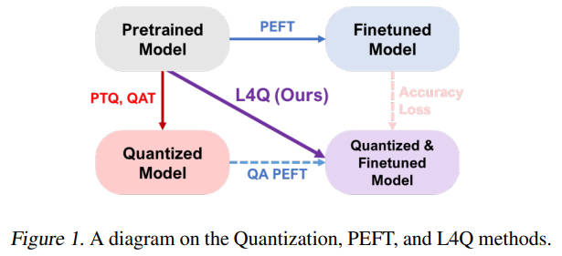

# L4Q: Parameter Efficient Quantization-Aware Fine-Tuning on Large Language Models via LoRA-wise LSQ

> **本文由 AI Agent 自动生成（Hermes Agent），基于 arXiv 论文全文阅读与分析。生成日期：2026-06-05。**

---

## 一句话总结

L4Q 提出了一种将量化感知训练（QAT）与 LoRA 低秩适配深度融合的方法，通过先合并权重与 LoRA 参数再统一量化的设计，实现了全量化模型的推理加速，同时将训练内存开销降至与纯 LoRA 相当的水平，在 4-bit 和 3-bit 量化下均取得了优于现有方法的精度。

---

## 摘要翻译

由于大语言模型（LLM）的高内存和计算成本，模型压缩技术如量化（降低推理成本）和参数高效微调（PEFT）方法如 LoRA（降低训练成本）获得了广泛关注。此前的量化感知 PEFT 方法通常采用先 PTQ 后 PEFT 的两阶段策略，但这种方法在恢复精度损失方面存在局限。本文提出 L4Q，一种将量化感知训练（QAT）与 LoRA 融合的方法。通过内存优化的层设计，L4Q 显著降低了 QAT 的内存开销，使其训练成本与 LoRA 相当，同时保留了 QAT 产生高精度全量化 LLM 的优势。实验表明，这种结合量化和微调的方法在 4-bit 和 3-bit 量化下相比解耦方案取得了更优的精度。使用 LLaMA 和 Mistral 模型在指令数据集上，L4Q 展示了其在语言任务和少样本学习方面的能力。

---

## 研究动机

1. **LLM 部署瓶颈**：大语言模型（如 GPT、LLaMA、Mistral）参数量巨大，推理和训练的内存开销极高，需要有效的压缩方法。

2. **量化与 PEFT 的局限**：
   - **QAT（量化感知训练）** 虽然能有效降低量化误差，但对 LLM 的内存开销极大（7B 模型约需 80GB），难以实际应用。
   - **PTQ（训练后量化）** 虽然内存开销小，但量化误差大，且无法通过训练恢复。
   - **QLoRA 等方法** 采用先 PTQ 再 LoRA 微调的两阶段策略，但量化权重与高精度 LoRA 参数无法合并，导致推理时为混合精度模型（4-bit + 16-bit），推理效率受限。
   - **QA-LoRA** 通过约束 LoRA 结构使参数可合并，但约束限制了微调能力。

3. **核心矛盾**：如何在不增加训练内存开销的前提下，实现全量化模型（推理效率高）且保持高精度？

---

## 方法（技术细节）

### 整体架构

L4Q 的核心思想是将 QAT 与 LoRA 深度融合，而非简单的两阶段组合。其设计包含三个关键创新：

### 1. 全量化线性层设计（Fully-Quantized Linear Layer）

与 QLoRA（权重量化 + 高精度 LoRA 参数分离）不同，L4Q 先将预训练权重 $W_0$ 和 LoRA 参数 $\alpha BA$ 合并为统一参数矩阵：

$$W_{comb} = W_0 + \alpha BA$$

然后对合并后的权重 $W_{comb}$ 进行统一量化，得到量化权重 $W_q$。推理时直接使用 $Y = W_q X$，无需额外的 LoRA 分支，实现全量化模型。

这与 QA-LoRA 的关键区别在于：L4Q **不对 LoRA 结构施加任何约束**，LoRA 参数可以自由学习，同时仍能实现全量化推理。QA-LoRA 需要将 A 的输入维度设为量化组数，限制了微调能力。

### 2. 内存高效 QAT（Memory-Efficient QAT）

传统 QAT 需要存储权重梯度 $\frac{\partial L}{\partial W_q}$ 以更新量化参数 $s$ 和 $b$，这是内存开销的主要来源。L4Q 的解决方案是：

- **局部计算权重梯度**：在反向传播中，就地计算 $\frac{\partial L}{\partial W_q} = \frac{\partial L}{\partial Y} X^\top$
- **梯度即时释放**：计算完成后立即释放权重梯度，避免内存累积

### 3. 高效 LoRA 训练（Efficient LoRA Training）

由于 L4Q 在 LoRA 参数之后施加了非线性量化函数，LoRA 参数的梯度计算需要经过量化函数的链式法则。L4Q 通过复用已计算的权重梯度 $\frac{\partial L}{\partial W_q}$（与量化参数更新共用），仅需额外计算 $\frac{\partial W_q}{\partial A}$ 和 $\frac{\partial W_q}{\partial B}$：

$$\frac{\partial L}{\partial A} = \frac{\partial W_q}{\partial A} \cdot \frac{\partial L}{\partial W_q} = \begin{cases} \alpha B^\top \cdot \frac{\partial L}{\partial W_q}, & \text{if } Q_N \leq w \leq Q_P \\ 0, & \text{otherwise} \end{cases}$$

$$\frac{\partial L}{\partial B} = \frac{\partial W_q}{\partial B} \cdot \frac{\partial L}{\partial W_q} = \begin{cases} \alpha A^\top \cdot \frac{\partial L}{\partial W_q}, & \text{if } Q_N \leq w \leq Q_P \\ 0, & \text{otherwise} \end{cases}$$

其中 $w$ 为量化前的权重值，条件分支表示 STE（直通估计器）的门控机制。

### 4. 联合优化（Joint Quantization and Low-rank Adaptation）

由于 LoRA 参数的梯度依赖于量化后的权重 $W_q$，量化参数的变化直接影响 LoRA 更新，实现量化参数与 LoRA 参数的联合优化，而非传统方法中的解耦更新。

### 5. 量化参数初始化策略（L4Qinit）

针对 LLM 中激活值异常值（outlier）敏感性问题，L4Q 提出了专门的量化参数初始化方法：

$$s = \max\left(\left|\frac{\min(W)}{Q_n}\right|, \left|\frac{\max(W)}{Q_p}\right|\right)$$

与 LSQ+ 初始化（基于权重标准差）不同，L4Qinit 采用对称量化方案，同时捕获最小和最大异常值，有效减少裁剪误差（clipping error）。

---

## 实验结果

### 实验设置

- **模型**：OpenLLaMA 3B、LLaMA 系列（7B/13B/33B）、Mistral-v0.1 7B
- **基线方法**：LSQ（QAT）、GPTQ（PTQ）、OmniQuant（PTQ）、QLoRA、QA-LoRA、LoftQ、QAT-LoRA
- **数据集**：Stanford-Alpaca（50k 训练样本）
- **评测基准**：CSQA（Commonsense QA，7 个多选任务）、MMLU（57 个子类别，4 大类）
- **硬件**：NVIDIA A100 80GB GPU

### 训练内存开销（Table 1）

| 方法 | OpenLLaMA 3B | LLaMA 7B | LLaMA 13B | LLaMA 33B |
|------|-------------|----------|-----------|-----------|
| LoRA | 15.1 GB | 25.1 GB | 43.8 GB | 71.9 GB |
| QAT | 44.2 GB | 79.5 GB | OOM | OOM |
| QAT-LoRA | 22.6 GB | 41.9 GB | 70.6 GB | OOM |
| **L4Q** | **15.3 GB** | **25.4 GB** | **44.3 GB** | **73.2 GB** |

L4Q 的内存开销与 LoRA 几乎相同，远低于 QAT 和 QAT-LoRA。

### 推理加速（Figure 4）

- **全量化 4-bit 模型**（L4Q、QA-LoRA）：相比 16-bit 预训练模型加速 **1.8×–2.3×**
- **混合精度模型**（QLoRA、LoftQ、QAT-LoRA）：加速 1.4×–1.6×
- L4Q 的全量化模型比混合精度模型快 **1.4×–1.6×**

### 精度对比（4-bit，Table 2）

- **LLaMA-1 7B**：L4Q 在 CSQA 上达到 62.7%（vs. QLoRA 61.3%、QA-LoRA 61.3%），MMLU 5-shot 达到 35.7%（vs. QLoRA 33.6%、QA-LoRA 35.6%）
- **LLaMA-2 7B**：L4Q 在 CSQA 上达到 **63.6%**（vs. QLoRA 61.3%、QA-LoRA 61.0%），MMLU 5-shot 达到 **45.5%**（vs. QLoRA 44.6%、QA-LoRA 44.4%）
- **LLaMA-2 13B**：L4Q 在 CSQA 上达到 65.8%（vs. QLoRA 64.0%、QA-LoRA 64.5%）
- **LLaMA-1 33B**：L4Q 在 MMLU 0-shot 达到 53.3%（vs. 预训练 53.0%，接近 16-bit）
- **Mistral 7B**：L4Q 在 CSQA 上达到 66.1%（vs. 预训练 66.2%），接近无损

### 精度对比（3-bit，Table 3）

- 3-bit 下差距更大，PTQ 方法（GPTQ、OmniQuant）出现严重精度下降
- L4Q 在 LLaMA-2 7B 上 CSQA 达到 **61.3%**（vs. GPTQ 57.6%、QLoRA 57.6%）
- L4Q 在 LLaMA-1 13B 上 MMLU 5-shot 达到 **41.8%**（vs. GPTQ 38.2%、QLoRA 40.4%）
- LoftQ* 在 3-bit 下表现极差（部分任务仅 23-24%）

---

## 优势

1. **训练内存效率**：内存开销与 LoRA 相当（~25 GB for 7B），远低于标准 QAT（~80 GB）
2. **全量化推理**：推理时使用 4-bit 全量化权重，比混合精度模型快 1.4×–1.6×
3. **联合优化**：量化参数与 LoRA 参数联合训练，优于解耦方法
4. **无结构约束**：不像 QA-LoRA 那样限制 LoRA 矩阵结构，保留了完整的微调能力
5. **3-bit 表现优异**：在极低比特量化下，相比 PTQ 方法优势显著
6. **灵活的初始化策略**：L4Qinit 有效应对 LLM 权重中的异常值问题

---

## 局限

1. **仅关注权重量化**：未涉及激活量化（Activation Quantization），后者可进一步降低计算成本
2. **未处理 KV Cache 压缩**：对于长上下文应用，KV Cache 的内存开销未被优化
3. **LoRA 初始化方案**：未探索针对量化模型的 LoRA 初始化改进
4. **实验范围有限**：未在更大规模模型（>33B）上验证，也未在视觉或多模态模型上测试
5. **代码未开源**：GitHub URL 为空，可复现性受限
6. **量化组大小影响**：仅使用 128 的量化组大小（OpenLLaMA 64），未充分探索不同组大小的影响

---

## 与 EfficientPaper 相关的研究方向

- **量化（Quantization）**：L4Q 是 QAT 与 PEFT 融合的代表性工作，与 GPTQ、AWQ、SmoothQuant、OmniQuant 等 PTQ 方法形成互补
- **低秩适配（Low-Rank Adaptation）**：与 LoRA、QA-LoRA、LoftQ、QLoRA 等方法直接相关
- **参数高效微调（PEFT）**：在微调效率和量化精度之间找到了良好的平衡
- **LLM 压缩与推理加速**：L4Q 的全量化推理设计与 LLM.int8()、AWQ 等方法在推理效率层面相关
- **量化感知训练（QAT）**：与 LSQ、LSQ+、LLM-QAT 等 QAT 方法在同一研究脉络中
- **混合精度与全量化**：L4Q 的全量化设计与 QLoRA 等混合精度方法形成对比，为后续全量化 PEFT 研究提供了参考

---

## 关键公式汇总

| 公式 | 含义 |
|------|------|
| $Y = W_0 X + \alpha BAX$ | LoRA 前向传播（基础形式） |
| $W_{comb} = W_0 + \alpha BA$ | L4Q 权重合并 |
| $\tilde{w} = \text{round}(\text{clamp}(\frac{W_{comb}-b}{s}, Q_N, Q_P))$ | 量化操作 |
| $Y = W_q X$ | L4Q 推理（全量化） |
| $\frac{\partial L}{\partial W_q} = \frac{\partial L}{\partial Y} X^\top$ | 局部计算权重梯度（内存优化） |
| $\frac{\partial L}{\partial A} = \alpha B^\top \cdot \frac{\partial L}{\partial W_q}$（带 STE 门控） | LoRA A 参数梯度 |
| $s = \max(\|\min(W)/Q_n\|, \|\max(W)/Q_p\|)$ | L4Qinit 量化参数初始化 |

---

## 参考链接

- arXiv: https://arxiv.org/abs/2402.04902
- 作者: Hyesung Jeon, Yulhwa Kim, Jae-Joon Kim
- 机构: Seoul National University, Sungkyunkwan University
- 发表: arXiv 2024
- 关键词: quantization, low_rank, QAT, LoRA, PEFT
