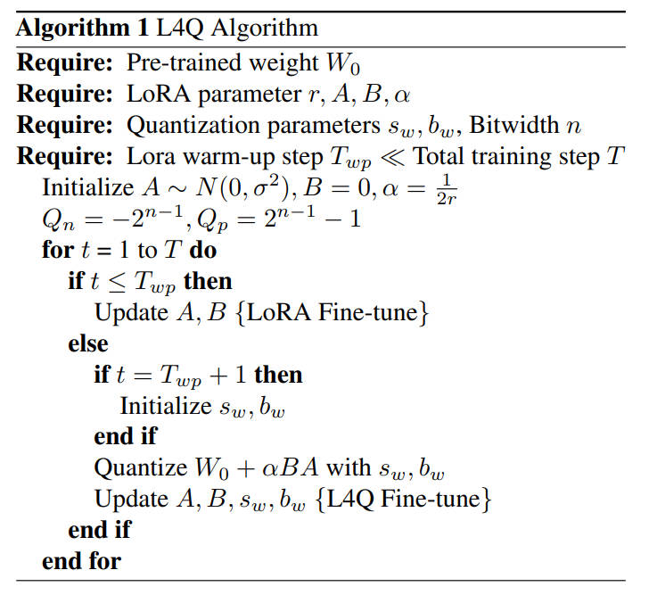
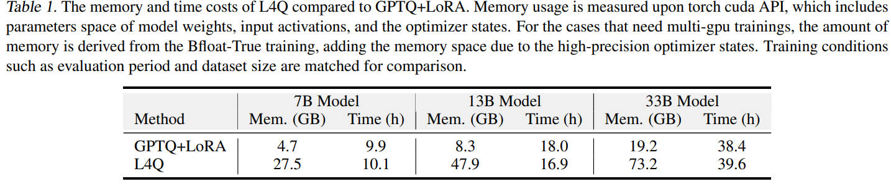
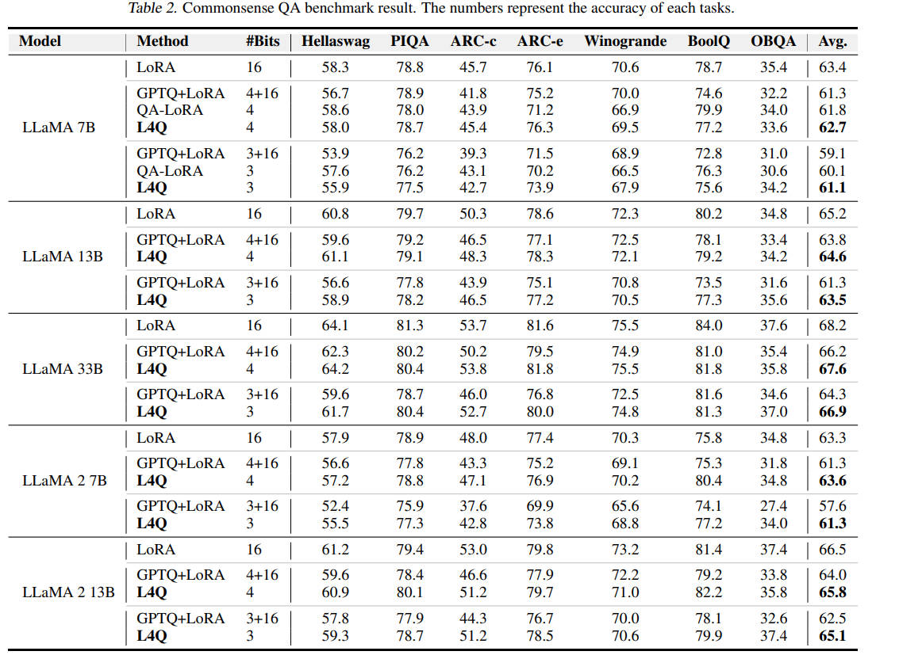

# L4Q

- Method
    - Step1: warm up Q(W) + $\alpha$ AB
    - Step2: quantize(W + sAB)

## Experiments

memory的占用变多了很多，论文中说GPTQ+LoRA stores the quantized weights in memory and dequantizate operation，包含了一些额外的操作，但是期望通过优化达到QLoRA的低memory占用。

实验结果表现还不错，比QLoRA要好，
