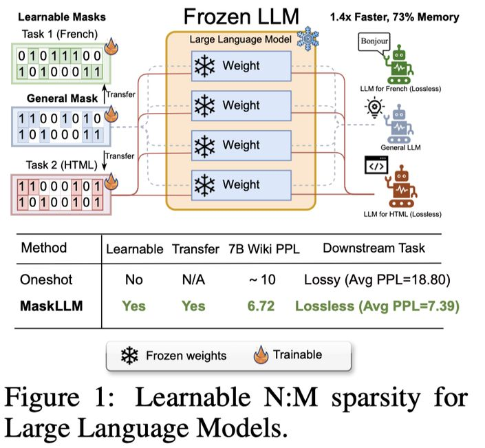

# MaskLLM: Learnable Semi-Structured Sparsity for Large Language Models

## 一句话总结

MaskLLM 提出了一种基于 Gumbel Softmax 的可学习 N:M 半结构化剪枝方法，通过端到端训练在大规模数据集上学习高质量的稀疏掩码，显著优于 SparseGPT、Wanda 等一次性剪枝方法，并支持跨域/跨任务的稀疏迁移学习，实现下游任务的无损压缩。

## 摘要翻译

大语言模型（LLMs）以其庞大的参数量而著称，这通常导致显著的冗余。本文提出了 MaskLLM，一种可学习的剪枝方法，通过在 LLMs 中建立半结构化（即"N:M"）稀疏性来减少推理时的计算开销。与开发新的重要性准则不同，MaskLLM 通过 Gumbel Softmax 采样显式地将 N:M 模式建模为可学习的分布。该方法在大规模数据集上实现了端到端训练，并提供了两个显著优势：1）高质量掩码——该方法有效地扩展到大数据集并学习到精确的掩码；2）可迁移性——掩码分布的概率建模使得稀疏性能够跨域或跨任务进行迁移学习。作者使用 2:4 稀疏性在多种 LLM（包括 LLaMA-2、Nemotron-4 和 GPT-3，参数量从 843M 到 15B）上评估了 MaskLLM，实验结果显示其显著优于现有方法。例如，现有方法在 Wikitext 上的困惑度（PPL）为 10 或更高（密集模型为 5.12 PPL），而 MaskLLM 仅通过冻结权重学习掩码就实现了显著更低的 6.72 PPL。此外，MaskLLM 的可学习特性允许为下游任务或域定制掩码，实现 2:4 稀疏性的无损应用。代码已开源：https://github.com/NVlabs/MaskLLM。

## 研究动机

大语言模型在各类任务上表现优异，但其庞大的参数规模（从十亿到数百亿）给实际部署带来了巨大挑战。半结构化剪枝（N:M 稀疏性）是一种兼顾效率和硬件友好的方法，但现有方法（如 SparseGPT、Wanda）存在两个关键问题：

1. **小校准集不足以代表 LLM 的全面知识**：LLM 在广泛多样的数据域上进行预训练，仅使用小规模校准集无法覆盖其全部知识。实验表明，手工设计的重要性准则仅适用于数据的一个紧凑子集，将校准集扩大到 256 条以上并不能提高质量，这限制了剪枝后 LLM 在不同域的泛化能力。

2. **手工设计的重要性准则与真实差异之间存在不可避免的误差**：使用梯度信息、权重幅度、Hessian 矩阵等代理指标来衡量剪枝引起的真实差异，不可避免地引入误差，剪枝后的模型与原始模型之间仍有相当大的差距。

因此，需要一种能够充分利用大规模数据集进行端到端训练的可学习剪枝方法。

## 方法（技术细节）

### N:M 稀疏性形式化

N:M 稀疏性要求在每 M 个连续参数中保留 N 个非零值。对于 2:4 稀疏性，每 4 个参数中保留 2 个，候选掩码集大小为 C(4,2)=6，即 6 种可能的掩码模式。剪枝目标是最小化语言建模损失：{M*_i} = argmin LLM(x; {W_i ⊙ M_i})。

### 可学习掩码分布建模

核心思想：将掩码选择问题转化为概率分布学习问题。为每个参数块定义一个类别分布 p(M_i)，通过梯度下降优化分布参数。使用 Gumbel Softmax 实现可微采样。

### Gumbel Softmax 可微采样

- 使用 Gumbel Max 技巧将采样过程的随机性解耦到独立的噪声变量 g_i
- Gumbel 噪声：g_i = -log(-log ε_i)，其中 ε_i ~ U(0,1)
- 通过 Softmax 近似 argmax，得到软索引 ỹ_i = exp((log(p_i) + g_i)/τ) / Σ exp((log(p_j) + g_j)/τ)
- 温度参数 τ 控制采样硬度，τ→0 时趋近 one-hot 向量
- 可微掩码：M̃ = ỹ × S（软索引与掩码矩阵的加权平均）

### 稀疏权重正则化

引入正则化项 −λ Σ_i ||W_i ⊙ M̃_i||²_2，鼓励保留权重保持较大幅度，防止梯度消失问题。该正则化对于掩码学习和迁移学习至关重要。

### 迁移学习（Mask Prior）

利用预计算掩码（如 Magnitude Pruning、SparseGPT、Wanda 的掩码）作为先验，通过掩码相似度计算来初始化分布：
- 相似度计算：sim(M_0, M̂_i) = M_0 M̂_i^T - N/2
- 初始化：π'_i = π_i + σ(π) × sim(M_0, M̂_i) × α
- 这大大加速了训练过程并提高了掩码质量

### 训练超参数

- 优化器：AdamW（学习率 5e-4，权重衰减 0.1）
- 训练步数：2,000 步
- 缩放因子 κ：从 1e2 线性增加到 5e2
- Gumbel 温度 τ：从 4 线性降低到 0.05
- 先验强度 α：3（使用 SparseGPT 先验）
- 稀疏正则化 λ：1e-5
- 全局 batch size：256
- 训练设备：64 A100 GPU（8-way tensor parallel）

## 实验结果

### 主要结果（LLaMA-2 7B，Wikitext-2 PPL）

| 方法 | 权重更新 | PPL |
|------|----------|-----|
| Dense | - | 5.12 |
| SparseGPT | 否 | 10.42 |
| Wanda | 否 | 11.25 |
| MaskLLM | 否 | **6.72** |

MaskLLM 在不更新权重的情况下实现了 6.72 PPL，显著优于 SparseGPT（10.42）和 Wanda（11.25），接近密集模型（5.12）。

### 多模型结果

- **LLaMA-2 13B**：MaskLLM 实现 PPL 5.85，优于 SparseGPT（8.32）、Wanda（8.27）、ADMM-Iter（7.78）等
- **LLaMA-3 8B**：MaskLLM 实现 PPL 8.50，优于 Wanda（23.40）
- **GPT-3 843M/2B**：MaskLLM 在多种域上实现无损压缩

### 下游任务迁移学习

- 在 GPT-3 2B 上，MaskLLM 在 8 个域（C#、HTML、Pascal、Story、French、Japanese、Chinese、OpenWeb）上实现平均 PPL 7.39，接近密集模型的 7.42
- 在 LLaMA-2 7B 上，MaskLLM 在 8 个域（CUDA、VHDL、Javascript 等）上实现平均 PPL 4.90，接近密集模型的 4.80

### 先验掩码效果（LLaMA-2 7B）

| 先验类型 | 先验 PPL | 学习后 PPL |
|----------|----------|------------|
| Magnitude | 54.71 | 6.77 |
| SparseGPT | 10.46 | **6.72** |
| Wanda | 11.29 | 6.80 |
| 无先验 | - | 9.12 |

### 推理加速

在 A6000 GPU 上使用 TensorRT-LLM 进行 2:4 稀疏性推理：
- 1.36× ~ 1.41× 加速
- 27% 内存减少
- 每个下游任务掩码仅需 0.65 bits/param 存储

## 优势

1. **显著优于一次性剪枝方法**：在多种 LLM 和规模上实现大幅 PPL 改善，例如 LLaMA-2 7B 从 10.42 降至 6.72
2. **端到端训练充分利用大规模数据**：与一次性方法仅使用小校准集不同，MaskLLM 可以利用整个训练数据集，保留 LLM 的丰富知识
3. **可迁移性**：掩码分布的概率建模使得稀疏性可以跨域/跨任务迁移，实现下游任务的无损压缩
4. **硬件友好**：2:4 稀疏性兼容 NVIDIA GPU 的 Tensor Core 加速，实现 1.4× 速度提升和 73% 内存节省
5. **低存储开销**：任务特定掩码仅需 0.65 bits/param，相比微调需要的完整模型副本大幅节省存储
6. **冻结权重**：不需要更新 LLM 参数，仅学习掩码，简化部署流程
7. **灵活性**：可与任意一次性剪枝方法（如 Magnitude Pruning、SparseGPT、Wanda）结合使用，作为先验初始化
8. **实现简单**：训练过程直接，2000 步即可收敛，无需复杂的数据处理或微调流程

## 局限

1. **训练成本较高**：与一次性剪枝方法相比，端到端训练不可避免地消耗更多资源（如 LLaMA-2 7B 需要 1,280 GPU 小时），未来需要提高训练效率
2. **仅针对 2:4 稀疏性**：虽然可扩展到其他 N:M 模式，但主要实验集中在 2:4，对其他模式的探索有限
3. **掩码学习的随机性**：缩放因子 κ 的选择对掩码质量和收敛速度有显著影响，需要仔细调参
4. **特定硬件依赖**：2:4 稀疏性在 NVIDIA Ampere 架构的 GPU 上有硬件加速支持，其他平台可能无法获得同等加速
5. **与微调方法的比较**：虽然掩码学习不需要更新权重，但在某些场景下，微调可能提供更好的性能（尽管存储开销更大）

## 与 EfficientPaper 相关的研究方向

1. **模型剪枝（Pruning）**：MaskLLM 属于半结构化剪枝，是 EfficientPaper 项目中 sparse_pruning、weight_sparsity 关键词下的重要工作，与 SparseGPT、Wanda 等方法形成对比
2. **LLM 压缩与加速**：MaskLLM 通过 N:M 稀疏性减少推理计算开销，与量化（Quantization）、蒸馏（Distillation）等方法互补
3. **可学习稀疏性（Learnable Sparsity）**：MaskLLM 是第一个将可学习掩码应用于冻结 LLM 的工作，与 STEP、Pruner-Zero 等方法相关
4. **迁移学习与域适应**：MaskLLM 的 Mask Prior 技术使得稀疏模式可以跨域/跨任务迁移，与 LLM 的域适应和持续学习研究方向相关
5. **硬件-算法协同设计**：2:4 稀疏性与 NVIDIA Tensor Core 的硬件加速特性紧密耦合，体现了硬件-算法协同设计的重要性
6. **大模型部署优化**：MaskLLM 通过稀疏性实现 1.4× 加速和 73% 内存减少，直接服务于大模型的高效部署
7. **高效微调与适配**：MaskLLM 的任务特定掩码学习为 LLM 在特定任务上的高效适配提供了新思路，与 LoRA、Adapter 等参数高效微调方法形成互补

## AI 生成声明

本笔记由 AI Agent（Hermes Agent）自动生成，基于对论文原文的 PDF 文本提取和分析。笔记内容仅供参考，具体技术细节请以原始论文为准。生成时间：2026年6月。
