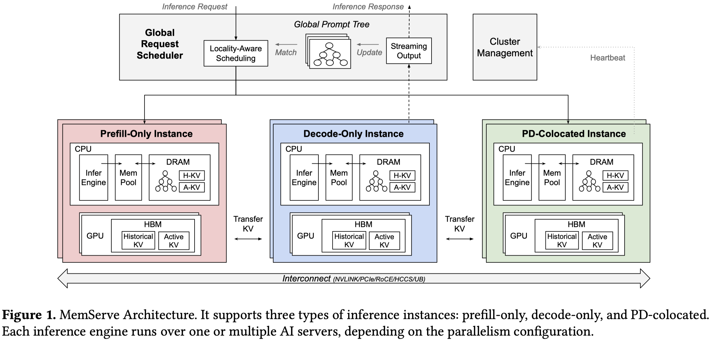

# MemServe: Context Caching for Disaggregated LLM Serving with Elastic Memory Pool

> Cunchen Hu, Heyang Huang, Junhao Hu, Jiang Xu, Xusheng Chen, Tao Xie, Chenxi Wang, Sa Wang, Yungang Bao, Ninghui Sun, Yizhou Shan

## Abstract

Large language model (LLM) serving has transformed from stateless to stateful systems, utilizing techniques like context caching and disaggregated inference. These optimizations extend the lifespan and domain of the KV cache, necessitating a new architectural approach. We present MemServe, a unified system that integrates both inter-request and intra-request optimizations. MemServe introduces MemPool, an elastic memory pool managing distributed memory and KV caches across serving instances. Using MemPool APIs, MemServe combines context caching with disaggregated inference for the first time, supported by a global scheduler that enhances cache reuse through a global prompt tree-based locality-aware policy. Tests show that MemServe significantly improves job completion time and time-to-first-time.
