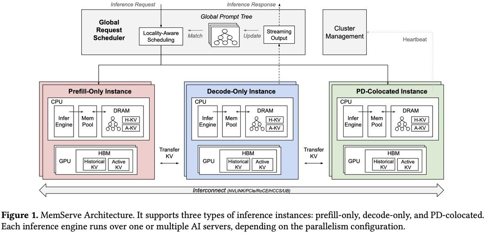

# MemServe: Context Caching for Disaggregated LLM Serving with Elastic Memory Pool

> Cunchen Hu, Heyang Huang, Junhao Hu, Jiang Xu, Xusheng Chen, Tao Xie, Chenxi Wang, Sa Wang, Yungang Bao, Ninghui Sun, Yizhou Shan

> 注：以下论文笔记由 AI Agent 自动生成，可能存在理解偏差或遗漏，请以原论文为准。

## Abstract

Large language model (LLM) serving has transformed from stateless to stateful systems, utilizing techniques like context caching and disaggregated inference. These optimizations extend the lifespan and domain of the KV cache, necessitating a new architectural approach. We present MemServe, a unified system that integrates both inter-request and intra-request optimizations. MemServe introduces MemPool, an elastic memory pool managing distributed memory and KV caches across serving instances. Using MemPool APIs, MemServe combines context caching with disaggregated inference for the first time, supported by a global scheduler that enhances cache reuse through a global prompt tree-based locality-aware policy. Tests show that MemServe significantly improves job completion time and time-to-first-token.

## 一句话总结

MemServe 提出弹性内存池 MemPool，首次将上下文缓存（inter-request）与解耦推理（intra-request）统一在一个系统中，通过全局 prompt 树实现本地性感知调度，显著降低 JCT 和 TTFT。

## 摘要翻译

大语言模型（LLM）服务系统已从无状态演变为有状态系统，利用上下文缓存和解耦推理等技术。这些优化延长了 KV 缓存的生命周期和作用域，需要新的架构方法。本文提出 MemServe，一个统一的系统，集成请求间和请求内优化。MemServe 引入 MemPool——一个弹性内存池，管理跨服务实例的分布式内存和 KV 缓存。通过 MemPool API，MemServe 首次将上下文缓存与解耦推理结合，辅以全局调度器，通过全局 prompt 树的本地性感知策略增强缓存复用。测试表明 MemServe 显著改善了作业完成时间和首 token 时间。

## 背景与问题

### 研究动机

LLM 推理服务已从无状态系统演变为有状态系统，利用请求间的依赖关系（如上下文缓存）和请求内的依赖关系（如解耦推理、序列并行）来提升效率。然而，这两个维度的优化目前无法共存，存在两个关键问题：

1. **请求间与请求内优化无法同时应用**：现有的上下文缓存（inter-request）方法未考虑请求内场景，导致解耦推理（intra-request）无法利用上下文缓存。同样，序列并行分散了 KV 缓存，缺乏保存和复用机制。
2. **缺乏全局设计来有效利用请求间优化**：当前 LLM 服务系统基于负载或会话 ID 调度请求，未能最大化跨会话的 KV 缓存复用。

### 核心挑战

- KV 缓存的生命周期已从单个请求扩展到分布式实例，需要统一的管理架构
- 现有系统假设 KV 缓存是单个请求在单个实例上的中间数据，无法适应新的范式
- 分布式环境下的 KV 缓存管理和传输机制缺失

## 核心方法

### 1. MemPool：弹性内存池

MemPool 是 MemServe 的核心组件，管理推理集群中的所有内存，包括 CPU DRAM 和 GPU HBM。它提供三类 API：

**内存管理 API**：
- `alloc_mem(size, type, id)`：在指定实例上分配特定类型的内存，返回地址列表
- `free_mem(addrList)`：释放内存

**索引 API**：
- `insert(tokenList, addrList, flags)`：将 prompt token 和 KV 缓存地址映射插入本地索引
- `match(tokenList)`：查找 prompt 的缓存数据，返回地址列表
- `delete(tokenList)`：删除 prompt 的缓存数据

**分布式传输 API**：
- `transfer(id, srcAddrList, dstAddrList, flags, private)`：将数据传输到指定实例
- `transfer_with_insert(id, tokenList, srcAddrList, dstAddrList, flags, private)`：传输并插入，避免额外网络往返

MemPool 采用基于 radix tree 的索引（扩展自 SGLang），关键扩展：
- 支持引用系统中任意位置的数据（CPU DRAM 和 GPU HBM）
- 每个树节点增加字段指示哪个推理实例持有数据

### 2. 上下文缓存与解耦推理的结合

MemServe 通过四个设计里程碑逐步构建完整的上下文缓存解耦推理：

**(a) PD-Basic**：基本的解耦推理架构（DistServe/Splitwise），prefill 实例通过 `transfer` API 将活跃 KV 缓存发送到 decode 实例。

**(b) PD-Caching-1**：在 prefill-only 实例上启用缓存（通过 `insert` API 保留历史 KV 缓存），但不支持 decode 阶段的缓存。

**(c) PD-Caching-2**：在 decode-only 实例上启用缓存（通过 `transfer_with_insert` 和 `insert` API），减少重复数据传输。但 prefill 实例仍缺少 decode 阶段的历史 KV 缓存。

**(d) PD-Caching-3**：完整的上下文缓存解耦推理。decode-only 实例通过 `transfer_with_insert` 将 decode 阶段的 KV 缓存发送回 prefill-only 实例，使缓存复用随多轮对话线性增长。

### 3. 内存与网络优化

**问题**：现有 PagedAttention 使用离散内存布局（每层两个 block），NCCL send/recv API 每次只能传输单个 block，导致网络调用次数过多。

**解决方案**：Block Aggregation（大页机制）
- 将每层的两个小 block 聚合成一个大 block，新 block 大小 = 2 × L × 原始 block
- 有效减少网络 API 调用次数 2L 倍
- 仅适用于 by-request 方式（by-layer 方式仍需至少 L 次网络调用）

### 4. 上下文缓存代价模型

代价模型 `exec(x, y)` 预测给定 prompt 长度 x 和缓存比率 y 的执行时间，用于：
- 全局调度器的本地性感知和负载均衡调度
- 决定是否传输 KV 缓存或重新计算

采用**算子级**代价模型（而非架构级），原因：
- 更好的可扩展性（TP 变化时无需重新校准）
- 更可解释、更易拟合

代价模型考虑三类算子：
- **计算密集型算子**：基于线程块数和 FLOP 指令
- **内存密集型算子**：通过拟合延迟与读写操作数的关系
- **常量算子**：归一化、激活等，执行时间恒定

### 5. 局部性感知全局调度

**全局 Prompt 树**：为三种推理实例（prefill-only、decode-only、PD-colocated）分别维护 radix 树，每个树节点指向存储 KV 缓存的实例。

**调度流程**：
1. GS 将 prompt 字符串转换为 token ID
2. 并发查询所有类型的全局 prompt 树（match 操作）
3. 将查询结果和负载信息发送到策略模块
4. 策略模块选择最长公共前缀的实例（最大历史 KV 缓存）
5. 检查是否存在额外历史 KV 缓存的其他实例，触发数据传输
6. 发送请求和元数据到选中实例

**调度策略对比**（Table 6）：
| 策略 | 会话内缓存 | 跨会话缓存 |
|------|-----------|-----------|
| Least Load | ✗ | ✗ |
| Session-ID-Based | ✓ | ✗ |
| Prompt-Tree-Based | ✓ | ✓ |

Prompt-tree-based 策略可最大化 KV 缓存复用，P99 TTFT 改善 59%。

## 实验设置

- **硬件**：单台 NVIDIA DGX H800 服务器（8×H800-80GB GPU，NVLink 400GB/s，192核 Intel Xeon CPU，2TB DRAM）
- **模型**：Llama2-13B，TP=2
- **Baseline**：vLLM-0.4.0（PD-colocated）
- **工作负载**：
  - ShareGPT：用户共享的 ChatGPT 对话历史
  - LooGLE：长文档 QA 评估基准
  - ReAct：Agent 推理与行动框架（HotpotQA 数据集）
- **指标**：TTFT、JCT、TPOT

## 实验结果

### 端到端性能（ShareGPT）

- **解耦推理（1P2D vs PD）**：平均 JCT 降低 30%，P99 JCT 降低 42%
- **解耦推理 + 上下文缓存（1P2D-CC vs 1P2D）**：平均 JCT 再降低 17%，P99 JCT 再降低 29%；平均 TTFT 降低 58%，P99 TTFT 降低 45%

### 端到端性能（LooGLE）

- **解耦推理**：平均 JCT 降低 10.3%，P99 JCT 降低 10.8%
- **解耦推理 + 上下文缓存**：平均 JCT 再降低 26.9%，P99 JCT 再降低 22.5%；平均 TTFT 降低 56.2%，P99 TTFT 降低 45.2%

### 端到端性能（ReAct）

- **解耦推理**：平均 JCT 降低 40.8%，P99 JCT 降低 53.1%
- **解耦推理 + 上下文缓存**：平均 JCT 再降低 26.7%，P99 JCT 再降低 21.4%；平均 TTFT 降低 78.5%，P99 TTFT 降低 84.9%

### 微基准测试

- **MemPool API**：内存 API 延迟随 block 数线性增加（~800ns/block），索引 API 延迟基本不随缓存比率变化（最多 0.7ms/4K token）
- **MemPool 缓存**：与 vanilla vLLM 的 hash-based index 相比，radix-based index 开销极小
- **Block Aggregation**：聚合内存布局相比原始离散内存布局性能大幅提升
- **By-Req-Agg**：在高负载下优于 by-layer 和 by-req
- **上下文缓存**：缓存比率越大、prompt 越长，收益越大；batch size 等效于 prompt 长度
- **代价模型**：算子级模型在预测精度和可扩展性上优于架构级模型
- **全局调度器**：prompt-tree-based 调度相比 session-based 调度 P99 TTFT 改善 59%

## 优点

1. **统一架构**：首次将请求间（上下文缓存）和请求内（解耦推理）优化统一在一个系统中
2. **弹性内存池 MemPool**：提供丰富的 API，支持多种优化组合（上下文缓存、解耦推理、序列并行、请求迁移）
3. **局部性感知调度**：基于全局 prompt 树的调度策略，可最大化跨会话的 KV 缓存复用
4. **内存与网络优化**：通过 block aggregation 减少网络调用次数，在高负载下性能显著提升
5. **代价模型**：算子级代价模型精度高、可扩展性好，支持 TP 变化
6. **实现简洁**：MemPool 约 5K SLOC Python + 1.6K SLOC C++，修改 vLLM 仅 200 SLOC Python + 400 SLOC CUDA C++

## 局限

1. **实验规模有限**：仅在单台服务器（8×H800）上测试，使用 Llama2-13B（TP=2），未验证更大规模和更大模型
2. **网络实现受限**：使用 NCCL send/recv 点对点 API，未实现 RDMA，限制了跨节点性能
3. **缺少代码开源**：论文未提供公开代码，难以复现
4. **调度策略的 best-effort 特性**：全局 prompt 树可能过时（因局部驱逐事件），需要 TTL 机制缓解
5. **未与其他系统直接对比**：未与 DistServe、Splitwise、TetriServe 等进行直接对比实验
6. **单线程通信**：NCCL send/recv 使用单线程保证顺序，限制了并行度
7. **模型规模限制**：13B 模型在 8 卡上只能创建 4 个实例，更大会限制实例数

## 与 EfficientPaper 相关的研究方向

MemServe 属于 **LLM 推理服务系统** 领域，核心贡献包括：

- **KV 缓存管理**（`kv_cache_management`）：弹性内存池 MemPool、分布式 KV 缓存管理、上下文缓存、解耦推理
- **调度与系统**：全局 prompt 树、本地性感知调度、代价模型
- **推理效率**：通过统一请求间和请求内优化提升 JCT、TTFT、TPOT

与 EfficientPaper 中已有论文的关系：
- **vLLM/PagedAttention (2023)**：MemServe 的基础，修改 vLLM 构建上下文缓存和解耦推理
- **SGLang (2024)**：MemServe 的 radix tree 索引扩展自 SGLang 的 RadixAttention
- **Splitwise/DistServe (2024)**：MemServe 的解耦推理架构与之类似，但增加了统一的 MemPool 和上下文缓存
- **Mooncake (2024)**：同为 KV 缓存中心的解耦架构，但 MemServe 更强调统一的内存池和局部性感知调度
- **CachedAttention (2024)**：同为上下文缓存相关工作，CachedAttention 侧重层级化 KV 缓存和异步加载

**相关关键词**：`kv_cache_management`、`disaggregated_inference`、`context_caching`、`scheduling`、`memory_pool`

## 可复现/实现要点

1. **MemPool API**：三类 API（内存、索引、分布式传输），基于 radix tree 索引
2. **Block Aggregation**：将每层两个小 block 聚合成一个大 block，减少网络调用
3. **代价模型**：算子级模型，区分计算密集型、内存密集型和常量算子
4. **全局调度器**：基于全局 prompt 树的本地性感知调度，TTL 机制防止过期
5. **实现规模**：MemPool ~5K SLOC Python + 1.6K SLOC C++，vLLM 修改 ~200 SLOC Python + 400 SLOC CUDA C++，全局调度器 ~600 SLOC Python
6. **依赖**：NCCL send/recv 点对点 API（无 RDMA），socket API（DRAM 端）
7. **实验配置**：Llama2-13B，TP=2，8×H800-80GB GPU，vLLM-0.4.0

## 个人备注

- MemServe 的核心贡献是**提出 MemPool 作为统一的内存管理组件**，将请求间和请求内优化统一在同一个系统中，这是一个重要的架构创新。
- **Block Aggregation**（大页机制）是一个实用的优化，通过减少网络调用次数在高负载下显著提升性能，这个思想值得在其他场景中借鉴。
- **代价模型**的算子级设计在 TP 变化时保持精度，但论文未讨论更复杂的并行配置（如 PP+TP 混合）。
- **局限**：实验规模有限（单机 8 卡），缺少 RDMA 支持，未与 DistServe/Splitwise 等直接对比。
- **未来方向**：跨节点 MemPool（RDMA 支持）、与量化/KVCache 压缩结合、动态弹性伸缩。
