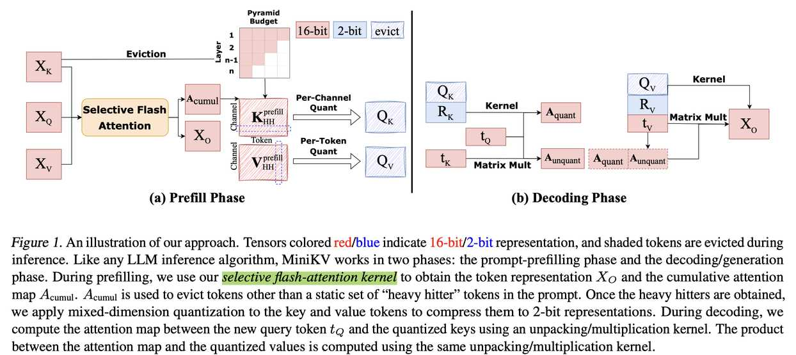

# MiniKV: Pushing the Limits of 2-Bit KV Cache via Compression and System Co-Design for Efficient Long Context Inference

> **一句话总结：** MiniKV 通过将 2-bit KV cache 量化与自适应 KV 策略（token 驱逐）相结合，并开发硬件友好的 Triton kernel，实现了 >80% 的 KV cache 压缩率，同时在长上下文任务中保持高精度和卓越的系统性能。

> **注意：本 note 由 AI Agent 自动生成，内容基于论文全文阅读，仅供参考。生成时间：2025-06。**

---

## 摘要翻译

当前最先进的 2-bit KV cache 量化技术在加速 LLM 推理的同时，能够在长上下文任务上保持良好的精度。然而，进一步提高压缩率会导致性能下降。在本工作中，我们重新审视了这些方法，额外考虑了自适应 KV 方法，即只保留 KV 状态的一个子集以保持 LLM 精度。基于此，我们提出了一种结合 2-bit KV cache 量化与自适应 KV 策略的方法。此外，我们采用算法与系统协同设计的方式，开发了硬件友好的内核来加速 LLM 推理，同时使 MiniKV 与现有的内存高效注意力技术（如 FlashAttention）兼容，有效地将算法改进转化为系统性能提升。在广泛的长上下文任务上的实验表明，MiniKV 有效实现了 >80% 的 KV cache 压缩，同时保持了精度，超越了最先进的方法，并在长上下文推理中实现了卓越的延迟、吞吐量和内存消耗改进。

---

## 研究动机

1. **KV cache 是 LLM 推理的主要瓶颈**：LLM 推理的瓶颈之一是 KV cache 的内存消耗，尤其在长上下文任务中更为突出。
2. **现有方法的局限性**：
   - **KV cache 量化**：FP8/INT8/INT4 量化可有效保留精度，但进一步推至 2-bit 以下会导致严重精度损失。KIVI 等方法虽然实现了 2-bit 量化，但未与自适应 KV 策略结合研究。
   - **自适应 KV**：包括 heavy hitters 和 recent window 选择，但大多数方法在长上下文推理中难以超过 50% 的压缩率，且引入的不规则操作与 FlashAttention 不兼容。
3. **两类方法的脱节**：量化 KV 和自适应 KV 是 KV cache 优化的两个极端，但鲜有工作探索如何将两者结合以最大化内存节省。现有尝试将 4-bit 量化与自适应 KV 结合的研究表明，两者的组合会产生非平凡的交互，需要仔细设计。
4. **核心问题**：如何将 2-bit KV cache 量化技术与自适应 KV 策略结合，在保留高精度的同时最大化推理速度？

---

## 方法（技术细节）

MiniKV 采用压缩与系统协同设计（compression and system co-design）方法，主要包含以下组件：

### 3.1 算法层面：重新审视 2-bit 量化 KV 与自适应 KV 策略

#### 3.1.1 子通道 Key 量化与持久上下文选择

- **问题**：现有 KV cache 量化方法通常采用 per-token 量化，但 Key cache 的通道维度存在异常值（outliers），需要 channel-wise 量化。进一步地，数据分布随生成步骤变化，导致不精确量化。
- **方案**：使用子通道（sub-channel）Key 量化，对每个子通道组（如 16/32 个元素）进行量化。
- **挑战**：自适应 KV 中，子通道组内的元素可能在解码步骤后因 token 驱逐而变化。
- **解决方案——持久上下文选择（Persistent Context Selection）**：基于关键观察——在足够大的缓存预算下，重要 token 可以在生成前被识别并持续保持。MiniKV 在 prefill 阶段结束时选择一组持久的 heavy hitters，在整个生成过程中不再更新，从而避免重新编码子通道组，同时保持低量化误差。

#### 3.1.2 长上下文中的选择性：Heavy Hitters vs. Recent Window

- **关键发现**：使用高度受限的内存预算（如 20%），现有方法（H2O、SnapKV）在长上下文任务中性能显著下降。
- **实验分析**：
  - 固定总缓存预算为 50%，在 RW（Recent Window）和 HH（Heavy Hitters）之间分配。
  - 仅使用 RW 或 HH 会导致某些任务（如 Lcc、TriviaQA）灾难性精度下降。
  - 保持至少 5-10% 的 HH/RW 比例可避免显著精度下降。
  - 与先前研究不同，随着序列长度增加，在相同 KV cache 大小预算下保持精度变得困难；但中等水平的驱逐（如 50%）仍可实现。
- **核心洞察**：高水平的 KV cache 驱逐会显著降低 LLM 在长上下文任务上的性能，但中等水平的驱逐仍可保持可比的精度，且需要同时保持一定比例的 HH 和 RW token。

#### 3.1.3 层特定选择性：Uniform、Variance 或 Pyramid？

MiniKV 探索了三种层特定 KV cache 选择策略：
- **Uniform 分配**：所有层具有相同的 KV cache 预算（先前工作的常见做法）。
- **Variance-based 分配**：使用累积注意力图的方差决定逐层 KV cache 预算。
- **Pyramid 分配**：在低层分配更多缓存，高层分配更少，中间层通过线性插值确定。

**实验结果**：Pyramid 策略在中等水平驱逐时实现显著更好的精度。

### 3.2 系统层面：内存高效融合选择性注意力内核

- **挑战**：基于注意力分数的自适应 KV 方法依赖于访问注意力矩阵 A，其大小随序列长度二次增长。FlashAttention 通过避免物化注意力矩阵来降低内存使用，因此现有自适应 KV 方法无法与 FlashAttention 兼容。
- **解决方案**：开发基于 Triton 的两阶段（two-pass）选择性 FlashAttention 内核，同时返回两个输出：
  1. 值张量的加权和 XO（与 FlashAttention 相同）
  2. 沿每列的累积注意力分数 Acumul
- **内核设计**：
  - **第一阶段**：遵循 FlashAttention 的行分块（row-wise tiling），计算值张量的加权和，同时保存中间 LSE（Log Sum Exponential）值。
  - **第二阶段**：并行处理不同列，计算每个 token 位置的注意力权重顺序累积和，重新计算 QKT 值并使用 LSE 值归一化。
- **内存复杂度**：所有内存缓冲区随序列长度线性扩展（LSE: O(lquery)，Acumul: O(lkey)）。

### 3.3 MiniKV 算法流程

**Prefill 阶段：**
1. 使用融合选择性 FlashAttention 内核获取聚合注意力分数 Acumul。
2. 根据注意力分数选择高注意力得分的 KV 状态子集（Heavy Hitters）。
3. 对选中的 token 进行 2-bit INT2 量化（Key 使用子通道量化，Value 使用 token 级量化）。
4. 将 16 个 INT2 标量值打包为 INT32 张量。

**Decoding 阶段：**
1. 新生成的 Key/Value 先存储在 FP16（streaming buffer）。
2. 每 nr 步进行一次量化压缩。
3. 使用融合解量化和乘法内核计算注意力：
   - 反量化量化的 KV cache
   - 计算新 Query token 与量化的 Key 之间的注意力映射
   - 计算注意力映射与量化 Value 的乘积
4. 有效减少内核启动开销和全局内存访问，降低延迟。

### 超参数

- 缓存预算：50%（25% Heavy Hitter + 25% Recent Window）
- 量化组大小：16（token/channel-wise）
- 残余长度：nr = 128
- 最大提示长度：4096（前 2048 + 后 2048 token）
- 最大生成长度：数据集特定，不超过 512 token

---

## 实验结果

### 评估设置
- **模型**：LLaMA2-7B-chat、LLaMA2-13B-chat、Mistral-7B-Instruct-v0.2、Llama3 系列
- **数据集**：LongBench、InfiniteBench、GSM8K
- **基线方法**：H2O (15%)、SnapKV (15%)、Q-Hitter (59%)、KIVI、Full Model
- **硬件**：NVIDIA 4×A100-40GB、4×A40-46GB、4×GH200-120GB

### 准确性结果

| 模型 | 方法 | LongBench 平均分 | 压缩率 | 精度保留率 |
|------|------|-----------------|--------|-----------|
| LLaMA2-7B-chat | Full Model | 35.19 | 0% | 100% |
| LLaMA2-7B-chat | KIVI | 34.97 | ~0% | 99.4% |
| LLaMA2-7B-chat | H2O (15%) | 33.49 | ~85% | 95.2% |
| LLaMA2-7B-chat | SnapKV (15%) | 33.60 | ~85% | 95.5% |
| LLaMA2-7B-chat | Q-Hitter (59%) | 33.01 | ~59% | 93.8% |
| **LLaMA2-7B-chat** | **MiniKV Pyramid** | **34.65** | **86%** | **98.5%** |

- MiniKV-Pyramid 在 LLaMA2-7B-chat 上实现 86% 压缩率，保留 98.5% 的全模型精度。
- MiniKV 在 LLaMA2-13B-chat 和 Mistral-7B 上也保持了良好精度，表明方法的泛化能力。
- 在相同 KV cache 大小下，MiniKV 优于 H2O、SnapKV、Q-Hitter 等方法。
- 达到所有 6 个 LongBench 任务类别的 Pareto 最优。

### InfiniteBench 结果

- Llama3-8B-instruct：MiniKV 平均得分 13.44，接近全模型 13.52 和 KIVI 13.59，但 KV cache 显著更小。
- 在 Llama3-3B-instruct 和 Llama3-1B-instruct 上也有类似表现。

### GSM8K 结果
- GSM8K 是推理密集型任务（短上下文 ~256 token），MiniKV 需要约 90% 的自适应 KV 缓存预算才能匹配全模型性能。

### 系统性能结果

- **端到端延迟**：MiniKV 延迟低于所有基线，尤其在长序列（>10k）中表现更优。
- **吞吐量**：MiniKV 吞吐量最高，得益于更低延迟和更大的 batch size/序列长度支持。在单个 A100 上，最大吞吐量比最强基线高 48%。
- **峰值内存使用**：MiniKV 峰值内存消耗最低。H2O 在 batch size=16 时 OOM，KIVI 因维护完整 KV cache 内存消耗更高。
- **最大可处理提示长度**：MiniKV 可处理比最强基线 KIVI 长 10% 的提示，支持 44K token。
- **Kernel 微基准**：MiniKV 内核在内存使用和延迟方面显著优于标准注意力实现（如 H2O 使用的标准注意力）。

---

## 优势

1. **高压缩率与高精度兼顾**：通过 2-bit 量化与自适应 KV 的协同设计，实现 >80% 压缩率，同时保持 >98.5% 精度。
2. **硬件友好的算法设计**：避免引入不规则操作，使用 PyTorch 和 Triton 实现，与现有系统优化（如 FlashAttention）兼容。
3. **系统协同设计**：开发了专用的 Triton 内核，解决了基于分数的自适应 KV 方法与 FlashAttention 的不兼容问题。
4. **卓越的系统性能**：在延迟、吞吐量和内存消耗方面均优于基线方法。
5. **Pareto 最优**：在所有 LongBench 任务类别上实现 Pareto 最优压缩策略。
6. **支持超长上下文**：支持 44K token 提示长度，比最强基线长 10%。
7. **可扩展性**：方法设计可与其他 KV 优化技术（如 StreamingLLM、KVQuant）兼容。
8. **实用性**：已在 PyTorch 框架下实现，提供开源代码。

---

## 局限

1. **与模型优化的结合**：目前主要关注 KV cache 优化，未与模型压缩（如 GPTQ）等技术结合。结合这些技术可能进一步提升计算和内存效率。
2. **SnapKV 兼容性**：MiniKV 结合 H2O 和 KIVI 工作良好，但尝试结合 SnapKV 和 KIVI 时性能严重下降（LongBench 分数从 35 降至 32）。原因：SnapKV 保留的 token 对 2-bit 量化更敏感，表明需要更鲁棒的驱逐-量化组合方法。
3. **推理密集型任务的局限**：在 GSM8K 等推理密集型短上下文任务上，需要约 90% 的 KV 缓存预算才能匹配全模型性能，压缩空间有限。
4. **持久上下文选择的假设**：依赖于"重要 token 可以在生成前识别并持久保持"的假设，在某些场景下可能不成立。
5. **内核开销**：MiniKV 内核在 prefill 阶段比 FlashAttention 慢（0.622 ms vs. 0.118 ms），虽然显著降低了内存使用（0.25 GB vs. 1.25 GB）。

---

## 与 EfficientPaper 相关的研究方向

1. **KV cache 量化（kv_cache_quant）**：MiniKV 是 2-bit KV cache 量化的重要工作，与 KIVI、KVQuant 等方法密切相关。可进一步探索更低位宽（如 1-bit）或混合精度量化。
2. **KV cache 稀疏化/自适应（kv_cache_sparse）**：MiniKV 的自适应 KV 策略（heavy hitters + recent window）属于此方向。可进一步研究更高效的 token 选择策略。
3. **算法-系统协同设计**：MiniKV 展示了将算法改进转化为系统性能的协同设计方法，这是高效 AI 研究的重要趋势。
4. **长上下文推理优化**：MiniKV 专注于长上下文任务的 KV cache 压缩，与高效长上下文推理研究方向高度相关。
5. **注意力机制优化**：MiniKV 开发的选择性 FlashAttention 内核属于注意力机制优化范畴，与 FlashAttention、FlashAttention-2 等工作相关。
6. **模型部署与推理加速**：MiniKV 的方法可直接应用于 LLM 的实际部署，降低推理成本，与 vLLM、NVIDIA TensorRT-LLM 等系统优化方向相关。
7. **混合压缩策略**：结合量化与自适应 KV 的方法，与模型压缩（如 GPTQ）、权重量化等技术的结合，是未来研究的重要方向。
8. **Pyramid KV**：MiniKV 的层特定分配策略（Pyramid）与 PyramidKV 等工作相关，可进一步探索更优的层间资源分配策略。

---

## 参考信息

- **论文标题**：MiniKV: Pushing the Limits of 2-Bit KV Cache via Compression and System Co-Design for Efficient Long Context Inference
- **作者**：Akshat Sharma, Hangliang Ding, Jianping Li, Neel Dani, Minjia Zhang
- **机构**：SSAIL Lab, University of Illinois at Urbana-Champaign
- **发布**：arXiv (2024)
- **arXiv**：[http://arxiv.org/abs/2411.18077](http://arxiv.org/abs/2411.18077)
- **代码**：[https://github.com/akshatsh49/MiniKV-Dev](https://github.com/akshatsh49/MiniKV-Dev)
- **关键词**：kv_cache_quant, kv_cache_sparse
- **硬件**：NVIDIA A100-40GB, A40-46GB, GH200-120GB

---

*本 note 由 AI Agent 自动生成，基于论文全文阅读和元数据分析。内容仅供参考，如有错误请以原始论文为准。*
