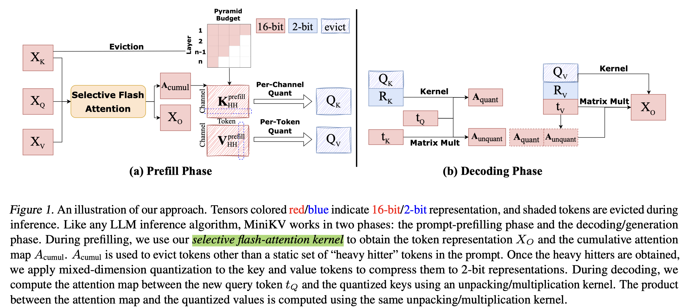

# MiniKV: Pushing the Limits of LLM Inference via 2-Bit Layer-Discriminative KV Cache

## Abstract

How to efficiently serve LLMs in practice has become exceptionally
challenging due to their prohibitive memory and computation requirements. In
this study, we investigate optimizing the KV cache, whose memory footprint
poses a critical bottleneck in LLM inference, especially when dealing with long
context tasks. To tackle the challenge, we introduce MiniKV, a KV cache
optimization method that simultaneously preserves long context task accuracy
while significantly reducing KV cache size via a novel 2-bit
layer-discriminative KV cache. More importantly, we develop specialized CUDA
kernels to make MiniKV compatible with FlashAttention. Experiments on a wide
range of long context tasks show that MiniKV effectively achieves 86% KV cache
compression ratio while recovering over 98.5% of accuracy, outperforming
state-of-the-art methods while achieving excellent measured system performance
improvements.

KIVI重点在于量化，miniKV在此基础上结合了kv sparse，(eviction)