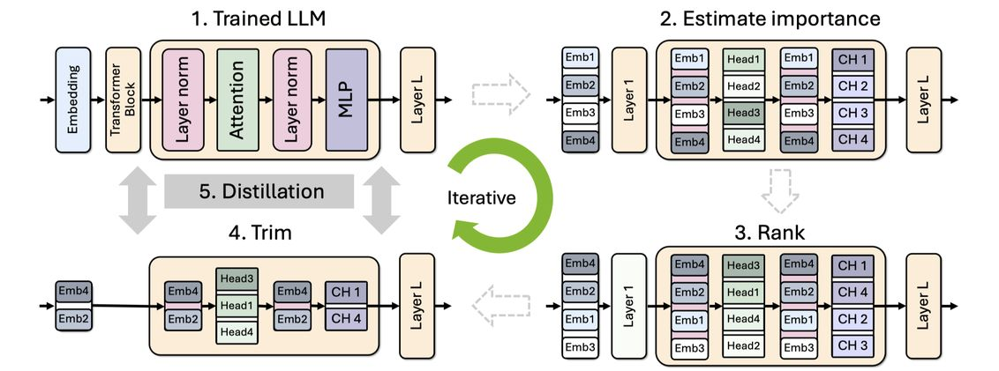

# Minitron: Compact Language Models via Pruning and Knowledge Distillation

> **论文来源**: NVIDIA | **arXiv**: [2408.11796v2](https://arxiv.org/abs/2408.11796v2) | **年份**: 2024  
> **关键词**: `sparse_pruning`, `structured_sparsity`  
> **代码**: [GitHub - NVlabs/Minitron](https://github.com/NVlabs/Minitron)

---

## 一句话总结

Minitron 通过**结构化剪枝（depth/width pruning）+ 知识蒸馏（KD）**的方式，将已预训练的大模型（如 Llama 3.1 8B、Mistral NeMo 12B）压缩为 4B/8B 参数的小模型，仅需原始训练数据的 <3% 即可恢复精度，训练成本相比从头训练降低 40 倍以上，且在多个基准上优于同类模型。

---

## 摘要翻译

大型语言模型（LLM）通常需要为不同部署规模和尺寸分别从头训练，这极其消耗计算资源。本文研究了对已有 LLM 进行剪枝、然后用少量（<3%）原始训练数据重新训练是否可以替代反复从头训练。为此，作者开发了一套实用且有效的 LLM 压缩最佳实践，结合了**深度、宽度、注意力头和 MLP 剪枝**与**知识蒸馏重训练**。通过详细的实证探索，找到了各轴剪枝策略、轴组合方法、蒸馏策略和架构搜索技术的最优组合。使用该方法，将 Nemotron-4 系列 LLM 压缩 2-4 倍，相比同等规模模型在多个语言建模任务上表现优异。从已预训练的 15B 模型派生出 8B 和 4B 模型，所需训练 token 数相比从头训练减少高达 40 倍，整个模型家族（15B、8B、4B）的训练计算成本节省 1.8 倍。Minitron 模型在 MMLU 上得分最高提升 16%，与 Mistral 7B、Gemma 7B、Llama-3 8B 等社区模型表现相当，并超越了现有最先进的压缩技术。

---

## 研究动机

1. **训练成本高昂**: LLM 提供者通常需要为不同部署规模（参数量）从头训练多个模型，这极其耗时、耗数据、耗资源。
2. **重复训练浪费**: 为 Llama 3.1 8B/70B/405B 等不同规格分别训练，资源浪费严重。
3. **剪枝+蒸馏的潜力**: 已有研究表明，结合权重剪枝和知识蒸馏可以显著降低训练成本，但系统性的压缩实践指南仍然缺乏。
4. **关键问题**: 如何在不访问原始训练数据的情况下，利用剪枝和蒸馏高效地从大模型派生小模型？如何选择最优的剪枝轴（深度 vs. 宽度）和蒸馏策略？

---

## 方法（技术细节）

### 总体流程

Minitron 的压缩流程分为三步：
1. **教师校正（Teacher Correction）**: 由于无法访问原始训练数据，先在目标数据集上对教师模型进行轻微微调（~127B tokens），以纠正数据分布不匹配。
2. **结构化剪枝（Structured Pruning）**: 从教师模型出发，对深度、宽度、注意力头、MLP 等维度进行剪枝。
3. **知识蒸馏重训练（Distillation Retraining）**: 使用未剪枝的教师模型作为监督信号，通过 KL 散度损失恢复被剪枝模型的精度。

### 剪枝策略

#### 重要性估计（Importance Estimation）
- 使用**纯基于激活的重要性估计**策略，仅需前向传播，不需要反向传播。
- 使用小规模校准数据集（1024 个样本）同时计算深度、神经元、注意力头和嵌入通道的重要性。
- 通过检查多头注意力（MHA）、多层感知机（MLP）和 LayerNorm 层的激活来评估。

#### 深度剪枝（Depth Pruning）
- 评估层重要性的三种指标：(1) 语言模型验证损失，(2) 块重要性（BI，基于输入输出余弦距离），(3) 下游任务准确率（Winogrande）。
- **发现**: BI 和 LM loss 高度相关，但在下游任务上不一定最准确。因此使用 Winogrande 基准评估层重要性。
- **关键发现**: 丢弃连续子群的层比基于重要性的非连续剪枝更有效。
- Llama-3.1-Minitron-4B-Depth: 32 层 → 16 层。

#### 宽度剪枝（Width Pruning）
- 对嵌入维度和 MLP 隐藏维度进行压缩。
- 使用 l2-norm 和 mean 作为聚合函数，执行单次剪枝（避免迭代方法）。
- Llama-3.1-Minitron-4B-Width: hidden 4096→3072, MLP 14336→9216。
- MN-Minitron-8B: hidden 5120→4096, MLP 14336→11520。

#### 模型裁剪（Model Trimming）
- 根据重要性排名对权重矩阵直接进行裁剪（reshape）。
- 跳过轻量级神经架构搜索（NAS），使用手动架构配置。

### 知识蒸馏

- 使用前向 KL 散度损失（forward KL divergence），仅在教师和学生的 logits 上计算。
- 学生模型模仿教师模型的输出分布。
- **关键发现**: 若无原始训练数据访问，教师模型应在蒸馏数据集上进行轻微微调（教师校正），否则数据分布不匹配会导致蒸馏效果下降。

### 数据集

- 使用 Nemotron-4 精选持续训练（CT）数据集进行所有剪枝和蒸馏实验。
- 教师校正使用约 127B tokens。
- 蒸馏使用 <400B tokens（相比从头训练 15T tokens）。

---

## 实验结果

### 预训练基准结果

| 模型 | 参数量 | 训练 Tokens | MMLU | GSM8K | HellaSwag | Arc_challenge |
|------|--------|------------|------|-------|-----------|---------------|
| MN-Minitron-8B | 8.4B | 380B | 69.5 | 58.5 | 83.0 | 64.4 |
| Llama 3.1 8B | 8B | 15T | 65.3 | 48.6 | 81.8 | 57.9 |
| Gemma 7B | 7.3B | 8T | 64.1 | 37.0 | 83.2 | 60.3 |
| Mistral NeMo 12B | 12.2B | - | 69.0 | 56.4 | 85.2 | 65.1 |
| Llama-3.1-Minitron-4B-Width | 4.5B | 94B | 60.5 | 41.2 | 76.1 | 55.6 |
| Llama-3.1-Minitron-4B-Depth | 4.5B | 94B | 58.7 | 16.8 | 73.2 | 52.6 |

### 关键发现

1. **MN-Minitron-8B** 是 SOTA 8B 模型，在常见语言建模基准上全面超越同规模模型。
2. **宽度剪枝 vs. 深度剪枝**: 宽度剪枝在准确率上更优（MMLU 60.5% vs. 58.7%），但深度剪枝在推理速度上更有优势（2.7x 加速 vs. 1.8x 加速）。
3. **训练成本节省**: 从 15B 模型派生 8B/4B 模型所需训练 token 数相比从头训练减少高达 40 倍。
4. **MMLU 提升**: Minitron 模型相比从头训练最多提升 16%。
5. **推理加速**: Llama-3.1-Minitron-4B-Depth 相比 Llama 3.1 8B 提供平均 2.7x 加速，Llama-3.1-Minitron-4B-Width 提供 1.8x 加速。
6. **教师校正至关重要**: 若不进行教师校正，蒸馏效果会因数据分布不匹配而显著下降。

### 对齐后基准（Llama-3.1-Minitron-4B 系列）

| 基准 | Gemma 2B | Phi-2 2.7B | Llama-3.1-Minitron-4B-Width |
|------|----------|-----------|----------------------------|
| IFEval | 64.5 | 44.0 | 52.4 |
| MT-Bench | 7.7 | 4.3 | 6.3 |
| ChatRAG* | 37.5 | 37.6 | 44.0 |
| BFCL | 35.6 | 23.1 | 64.9 |

---

## 优势

1. **训练成本极低**: 仅需 <3% 原始训练数据，token 需求降低 40 倍，计算成本降低 1.8 倍。
2. **开源友好**: 权重在 Hugging Face 上开源，附带许可证和代码。
3. **SOTA 性能**: MN-Minitron-8B 在 8B 模型中达到最佳水平，超越 Llama 3.1 8B、Gemma 7B、Mistral 7B 等。
4. **灵活性**: 支持深度剪枝（更快推理）和宽度剪枝（更高精度），用户可根据需求选择。
5. **实用性强**: 不需要原始训练数据，只需教师模型微调即可，适用于真实部署场景。
6. **系统化压缩指南**: 提供了完整的剪枝和蒸馏最佳实践，可推广到其他模型。
7. **推理加速**: 深度剪枝模型提供 2.7x 加速，宽度剪枝模型提供 1.8x 加速。

---

## 局限

1. **依赖原始模型质量**: 剪枝后的模型性能上限受限于原始教师模型。
2. **教师校正增加额外开销**: 教师校正需要额外的 ~127B tokens 训练，虽低于从头训练但仍有成本。
3. **深度剪枝推理优势与精度的权衡**: 深度剪枝虽然推理更快，但准确率（尤其是推理能力如 GSM8K）显著下降。
4. **数据分布依赖**: 蒸馏效果高度依赖目标数据集与原始训练数据的匹配度，教师校正虽有帮助但不完全等效。
5. **对齐后模型性能**: MN-Minitron-8B 的对齐版本尚未完全评估，缺乏指令调优后的完整基准结果。
6. **单一数据源**: 所有实验仅使用 Nemotron-4 CT 数据集，未验证其他数据集的泛化性。
7. **NAS 被跳过**: 本工作未执行神经架构搜索，可能未达到最优架构配置。

---

## 与 EfficientPaper 相关的研究方向

Minitron 与 EfficientPaper 项目关注的高效 AI 研究方向密切相关，具体包括：

- **结构化稀疏化（Structured Sparsity）**: 本论文的核心技术，通过剪枝实现模型压缩，与 EfficientPaper 中的稀疏化研究方向一致。
- **知识蒸馏（Knowledge Distillation）**: 本论文结合剪枝与蒸馏，是 EfficientPaper 中关注的模型压缩技术之一。
- **模型压缩（Model Compression）**: Minitron 属于模型压缩的前沿工作，与 EfficientPaper 中的模型压缩研究方向高度相关。
- **推理加速（Inference Acceleration）**: 通过剪枝实现的推理速度提升，与 EfficientPaper 关注的推理效率方向一致。
- **训练效率（Training Efficiency）**: 使用少量数据重新训练大模型，与 EfficientPaper 关注的训练效率研究方向一致。
- **大语言模型家族（LLM Families）**: 本论文展示了如何高效构建 LLM 模型家族，与 EfficientPaper 关注的模型系列化研究方向一致。

---

## AI 生成声明

> 本文档由 AI Agent（Hermes Agent）自动生成，基于论文 [Minitron: Compact Language Models via Pruning and Knowledge Distillation](https://arxiv.org/abs/2408.11796v2) 的 PDF 文本提取和元数据整理。生成时间：2026 年 6 月 5 日。内容仅供参考，如有错误请以原文为准。
