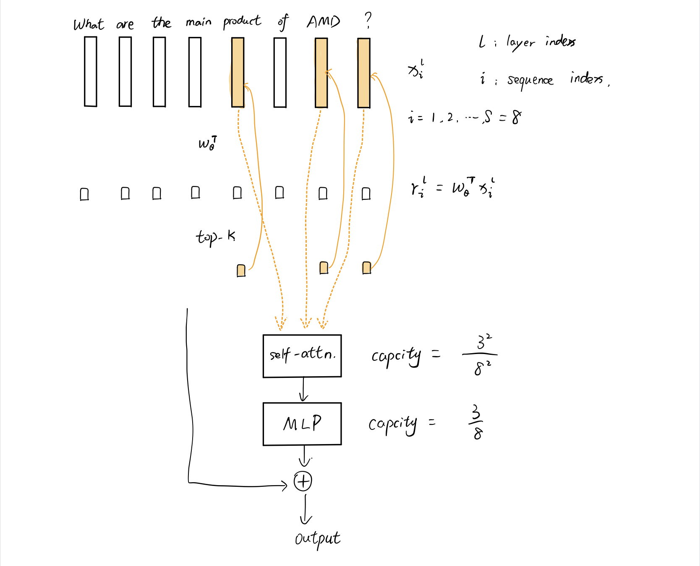
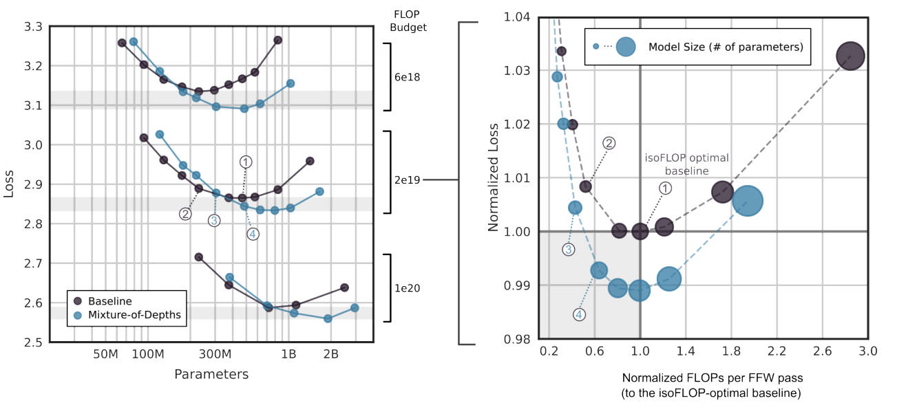

# Mixture-of-Depths: Dynamically allocating compute in transformer-based language models

## Abstract

Transformer-based language models spread FLOPs uniformly across input
sequences. In this work we demonstrate that transformers can instead learn to
dynamically allocate FLOPs (or compute) to specific positions in a sequence,
optimising the allocation along the sequence for different layers across the
model depth. Our method enforces a total compute budget by capping the number
of tokens ($k$) that can participate in the self-attention and MLP computations
at a given layer. The tokens to be processed are determined by the network
using a top-$k$ routing mechanism. Since $k$ is defined a priori, this simple
procedure uses a static computation graph with known tensor sizes, unlike other
conditional computation techniques. Nevertheless, since the identities of the
$k$ tokens are fluid, this method can expend FLOPs non-uniformly across the
time and model depth dimensions. Thus, compute expenditure is entirely
predictable in sum total, but dynamic and context-sensitive at the token-level.
Not only do models trained in this way learn to dynamically allocate compute,
they do so efficiently. These models match baseline performance for equivalent
FLOPS and wall-clock times to train, but require a fraction of the FLOPs per
forward pass, and can be upwards of 50\% faster to step during post-training
sampling.

## Method
### Defining a compute budget
假设一共有T个tokens输入到transformer中进行运算，此时的compute budget则为T. MoE方法由于有多个experts，且回选择其中一个expert进行运算，所以平均的compute budget也约为T。

对于MoD来说，由于这个方法会跳过一些block，所以最终的compute budget会小于T。假设，定义某一个block的compute budget为$T/2$，那么这个block中的self-attention的flops会由之前的$T^2$变为$\frac{T}{2}^2$，也就是变为了原来的25%。同理，对于MLP，则由原来的$T$变为$\frac{T}{2}$，即原来的50%。

### Routing schemes
Routing的方式可以有以下几种选择
- 随机route，类似dropout，对performance影响很大
- learned routing，证明是比随机routing更好的方法
    - token-choice routing
        - token可以选择合适的path，但是需要引入balancing loss，不然所有的token选择的path容易趋向与一致
        - 由于没有强制的约束，token-choice routing会导致load unbalance
    - **expert-choice routing**
        - 约束每个path有top-k的token来选择，可以保证load balance
        - 但是会导致某些token实际计算量比最优需求高或者低。

前两个图是以MoE为例，第三个图则是MoD routing的方法。MoE中有多个expert，token-choice每个token可以选择自己的expert，如左1途中虚线所示，如果expert1被选择的次数过多，超过了设置的capacity，则只能把这个token直接扔掉。中间图则采用了expert-choice 方式，每个expert对应两个token，由于有多个experts，所以某些token可能会有多个expert，某些token则可能一个expert都没有，相当于不参与这个block运算。右图则是对MoD的routing，选择只有两种，要么参与运算，要么不参与运算，所以top-2的token会参与这个block的运算，其他tokens则会直接跳过这个block的运算。

- 最终，论文选择**expert-choice routing**，具体原因为：
    - 不需要增加balancing loss，既可以满足load balance
    - Top-k的方法可以找到最需要参与运算的tokens，其他tokens则选择跳过运算
    - 选择只有两种，计算或者跳过计算，top-k的方式可以很好的实现这个选择

### Routing implementation

可以看到，选择top-k的token embedding进行运算，可以有效的减少compute budget

需要注意的是，这里的block的输出$f_i(x)$增加了与$r_i$作为权重。

### Non-causal problem during sampling
在自回归sampling时，确定这个token是否在top-k中，需要与未来的token进行比较，但是无法获取未来的token，导致因果逻辑混乱。论文中给出了两个解决方法：
- A simple auxiliary loss
    - 使用binary cross-entropy loss来区分每个token的$r_i$是否属于topk
- A small auxiliary MLP predictor
    - 相当于second router，用于预测是否属于topk

### Training
Training部分所有的超参数保持不变，只修改了layer number，heads和embedding size等

## Results

同等参数量下，MoD比baseline要快，同等训练flops和wall-clock下，训练结果相似；（也就是说MoD需要训练更多的iteration） 

Every block routing 和 **Evary other block routing**对比，后者表现更好。

