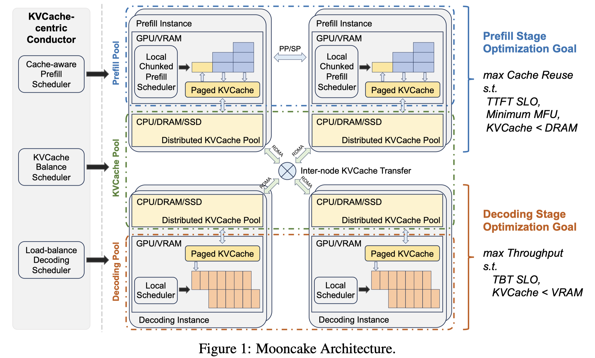

# Mooncake: A KVCache-centric Disaggregated Architecture for LLM Serving

> Ruoyu Qin, Zheming Li, Weiran He, Mingxing Zhang, Yongwei Wu, Weimin Zheng, Xinran Xu

## Abstract

Mooncake is the serving platform for Kimi, a leading LLM service provided by Moonshot AI. It features a KVCache-centric disaggregated architecture that separates the prefill and decoding clusters. It also leverages the underutilized CPU, DRAM, and SSD resources of the GPU cluster to implement a disaggregated cache of KVCache. The core of Mooncake is its KVCache-centric scheduler, which balances maximizing overall effective throughput while meeting latency-related Service Level Objectives (SLOs). Unlike traditional studies that assume all requests will be processed, Mooncake faces challenges due to highly overloaded scenarios. To mitigate these, we developed a prediction-based early rejection policy. Experiments show that Mooncake excels in long-context scenarios. Compared to the baseline method, Mooncake can achieve up to a 525% increase in throughput in certain simulated scenarios while adhering to SLOs. Under real workloads, Mooncake's innovative architecture enables Kimi to handle 75% more requests.
