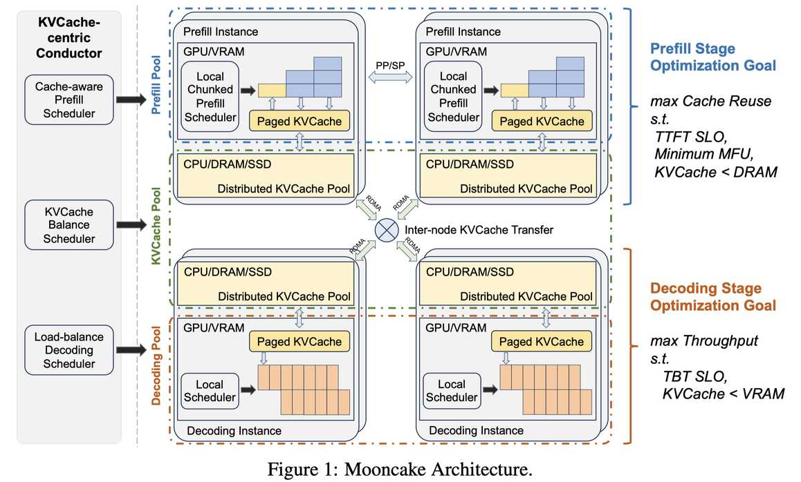

# Mooncake: A KVCache-centric Disaggregated Architecture for LLM Serving

> Ruoyu Qin, Zheming Li, Weiran He, Mingxing Zhang, Yongwei Wu, Weimin Zheng, Xinran Xu

> 注：以下论文笔记由 AI Agent 自动生成，可能存在理解偏差或遗漏，请以原论文为准。

## Abstract

Mooncake is the serving platform for Kimi, a leading LLM service provided by Moonshot AI. It features a KVCache-centric disaggregated architecture that separates the prefill and decoding clusters. It also leverages the underutilized CPU, DRAM, and SSD resources of the GPU cluster to implement a disaggregated cache of KVCache. The core of Mooncake is its KVCache-centric scheduler, which balances maximizing overall effective throughput while meeting latency-related Service Level Objectives (SLOs). Unlike traditional studies that assume all requests will be processed, Mooncake faces challenges due to highly overloaded scenarios. To mitigate these, we developed a prediction-based early rejection policy. Experiments show that Mooncake excels in long-context scenarios. Compared to the baseline method, Mooncake can achieve up to a 525% increase in throughput in certain simulated scenarios while adhering to SLOs. Under real workloads, Mooncake's innovative architecture enables Kimi to handle 75% more requests.

## 一句话总结

Mooncake 是 Moonshot AI 为 Kimi 打造的 LLM 推理平台，采用以 KVCache 为中心的解耦架构，将 prefill 和 decoding 分离到不同节点池，并利用 CPU/DRAM/SSD 构建分布式 KVCache 缓存，实现 KVCache 感知的全局调度，在长上下文和过载场景下显著提升吞吐量（模拟数据最高 525%），真实负载下处理请求量提升 75%。

## 背景与问题

- **MaaS 服务的挑战**：Kimi 作为 MaaS 服务提供商，面临请求到达率远超推理资源增长率的问题，尤其在高峰期，GPU 供应有限，无法弹性扩容。
- **Prefill vs Decoding 的差异**：LLM 推理分为 prefill 和 decoding 两个阶段，计算特性截然不同——prefill 是计算密集型（注意力机制随输入长度二次增长），decoding 是内存带宽密集型（逐 token 自回归生成），混合调度会导致 TTFT 和 TBT SLO 的冲突。
- **SLO 约束**：TTFT（首 token 延迟）和 TBT（token 间延迟）是关键指标，需要同时满足。在过载场景下，需要高效地拒绝请求以避免浪费预填充计算资源。
- **KVCache 复用的收益与代价**：复用 KVCache 可减少计算，但远程访问会延长 TTFT；增大 batch 可提升 MFU，但会违反 TBT SLO。

## 核心方法

### 1. 解耦架构（Disaggregated Architecture）

Mooncake 的核心设计是以 KVCache 为中心的解耦架构：

- **Prefill Pool + Decoding Pool**：将 prefill 和 decoding 节点分离为独立的资源池，各自独立优化。
- **分布式 KVCache 池**：利用 GPU 节点的 CPU/DRAM/SSD 资源，构建一个分布式的 KVCache 缓存层，通过 GPUDirect RDMA 实现跨节点的高效 KVCache 传输（称为 Messenger 服务）。
- **全局调度器（Conductor）**：基于 KVCache 分布和工作负载，为每个请求选择 prefill 和 decoding 实例，并调度 KVCache 的复用、传输和管理。

### 2. KVCache 缓存机制

- **Paged KVCache**：KVCache 以 paged block 形式存储在 CPU 内存中，block size 为 512 tokens。
- **Prefix Hash**：每个 block 通过链式哈希（包含当前 block 和所有前缀 block 的哈希）生成唯一标识，用于检测前缀缓存命中。
- **缓存策略**：支持 LRU、LFU、LengthAwareCache 等算法。在实际工作负载中，LRU 表现最佳（受请求时间局部性影响）。
- **Hot-spot Migration**：启发式的热点迁移方案，自动复制热点 KVCache block 到多个节点，避免传输拥塞。

### 3. Chunked Pipeline Parallelism (CPP)

针对长上下文场景，Mooncake 采用分块流水线并行（CPP）：

- 将输入 token 分成多个 chunk（每个不超过 prefill_chunk），分配到不同节点并行处理。
- 与 Sequence Parallelism (SP) 相比，CPP 只需在 pipeline 边界进行跨节点通信，网络消耗更低，MFU 更高。
- 自然适配短/长上下文，无需频繁调整节点分组。

### 4. Layer-wise Prefill

通过逐层预填充来减少 VRAM 占用：

- 在每层 attention 计算之前异步加载该层的 KVCache，在计算完成后异步存储。
- KVCache 的传输与计算重叠，使得 prefill 实例的执行时间大致等于 KVCache 加载时间或标准 prefill 时间（取决于 prefix cache 比例）。
- 结果：prefill 调度可以忽略 VRAM 大小限制，只要能容纳一个请求即可。

### 5. KVCache-centric Scheduling

算法 1 描述了 cache-aware 的 prefill 全局调度：

1. 为每个请求的输入 token 计算 block hash key。
2. 对每个 prefill 实例，计算 prefix cache 命中长度。
3. 估计 prefill 执行时间和队列等待时间，计算 TTFT。
4. 选择 TTFT 最短的实例，同时考虑 cache 复用、负载均衡和 SLO。
5. 如果 best_prefix_len 与当前实例的 prefix_len 差距超过阈值，触发 KVCache 热点迁移。

### 6. 过载调度（Overload-oriented Scheduling）

- **Early Rejection**：在 prefill 之前评估 decoding 实例负载，如果 decoding 无法满足 TBT SLO，直接拒绝请求，避免 prefill 计算浪费。
- **Early Rejection Based on Prediction**：通过预测未来 decoding 负载来缓解 Early Rejection 引发的负载波动（反相振荡问题）。采用系统级预测：假设每个请求的 decoding 阶段耗时为 td，估计未来 t 时刻的 decoding 负载。

## 技术细节

### KVCache 哈希机制

每个 block 的 hash 由其自身 token 和前缀 block 的 hash 组成，形成链式哈希（如 `F=Hash(E+f)`）。相同 hash ID 表示前缀完全匹配，可复用 KVCache。block size 为 512 tokens。

### 并行策略对比

- **TP (Tensor Parallelism)**：跨节点需要两次 RDMA all-reduce（每层），MFU 下降显著。
- **SP (Sequence Parallelism)**：需要至少一次跨节点通信（Ring/Striped Attention），MFU 优于 TP，但不如单节点 TP。
- **CPP (Chunked Pipeline Parallelism)**：只在 pipeline 边界通信，可与计算重叠，MFU 最优，且无需频繁弹性伸缩。

### 典型工作流

1. **KVCache Reuse**：从远程 CPU 加载 prefix cache 到 GPU。
2. **Incremental Prefill**：使用 prefix cache 进行增量预填充，将新生成的 KVCache 存回 CPU。
3. **KVCache Transfer**：通过 Messenger 异步流式传输 KVCache 到 decoding 节点（与 prefill 计算重叠）。
4. **Decoding**：KVCache 到达后，请求加入 continuous batching 进行解码（double-check TBT SLO）。

## 实验设置

- **模型**：使用 dummy LLaMA2-70B 架构（为保护商业机密，使用模拟模型）
- **硬件**：NVIDIA A800-SXM4-80GB GPU，每节点 8 卡，800 Gbps RDMA 网络
- **Baseline**：vLLM（continuous batching + PagedAttention）
- **数据集**：
  - ArXiv Summarization：平均输入 8088 tokens，输出 229 tokens，~0% 缓存命中
  - L-Eval：平均输入 19019 tokens，输出 72 tokens，>80% 缓存命中
  - 模拟数据：16k/32k/64k/128k 输入，512 输出，50% 缓存命中
  - 真实数据：23,000 条 Kimi 在线请求 trace，平均输入 7955 tokens，输出 194 tokens，~50% 缓存命中
- **指标**：TTFT 和 TBT 的 P90，归一化到 SLO 阈值（TTFTP90 = 10×，TBTP90 = 5×）
- **集群配置**：
  - Mooncake-[3P+1D]：3 prefill + 1 decoding
  - Mooncake-[2P+2D]：2 prefill + 2 decoding
  - Mooncake-[10P+10D]：10 prefill + 10 decoding
  - vLLM-[4M] / vLLM-[20M]：4/20 个统一线程实例

## 主要结果

### 公开数据集（ArXiv Summarization + L-Eval）

- Mooncake-[3P+1D] 相比 vLLM-[4M] 吞吐量提升 **20%（ArXiv）** 和 **40%（L-Eval）**
- L-Eval 上 prefix caching 贡献显著，进一步降低 TTFT
- Mooncake-[2P+2D] TTFT 指标不如 [3P+1D]（prefill/decoding 负载不平衡）

### 模拟数据（长上下文）

- Mooncake 在 16k/32k/64k/128k 输入长度下，吞吐量提升 **50%~525%**
- 有效避免了 prefill 阶段对 decoding 的干扰，TBT SLO 始终满足

### 真实工作负载

- Mooncake-[10P+10D] 和 vLLM-[20M] 的 TTFT 分布几乎一致（~100% 满足 TTFT SLO）
- Mooncake 的 TBT 满足率 ~100%，而 vLLM 仅 **57%** 满足 TBT SLO
- Mooncake 处理请求量多 **75%**

### 过载场景

| 策略 | 拒绝请求数 |
|------|-----------|
| Baseline | 4,183 |
| Early Rejection | 3,771 |
| Early Rejection + Prediction | 3,589 |

Early Rejection + Prediction 比 baseline 减少约 **14%** 的请求拒绝。

### KVCache 调度实验（Mooncake 集群 8P+8D）

- KVCache-centric 调度：平均 TTFT **6.26s**
- Cache-aware 调度：14.36s
- Load-balancing 调度：60.41s
- Random 调度：92.07s

KVCache-centric 调度相比 random 调度 TTFT 降低 **93%**。

## 优点与局限

### 优点

1. **架构设计完整**：以 KVCache 为中心的解耦架构，将 prefill/decoding 分离，利用异构资源（CPU/DRAM/SSD）构建分布式 KVCache 缓存。
2. **调度策略先进**：cache-aware 调度 + 热点迁移 + 过载调度（Early Rejection + Prediction），兼顾吞吐量和 SLO。
3. **长上下文优化**：CPP（Chunked Pipeline Parallelism）和 Layer-wise Prefill 有效降低长上下文的 TTFT 和 VRAM 占用。
4. **真实生产验证**：Mooncake 是 Kimi 的核心推理平台，经过实际大规模部署验证。
5. **开源贡献**：发布真实请求 trace 数据集（23,608 条），对社区有参考价值。

### 局限

1. **实验使用 dummy model**：为保护商业机密，使用 LLaMA2-70B 架构的模拟模型，未使用真实模型，可能影响结果的代表性。
2. **Prefill/Decoding 比例固定**：实际部署中 prefill 和 decoding 实例比例需预设，缺乏动态弹性伸缩机制。
3. **Early Rejection 预测精度**：系统级预测（假设统一 decoding 时间）可能不够精确，请求级预测尚待探索。
4. **Cache 重用率有限**：真实工作负载中 KVCache 可重用率仅约 50%（某些场景如 chat-to-paper 可达 90%），受应用场景影响大。
5. **缺少与 DistServe/Splitwise 等的直接对比**：虽然提到了相关工作，但未直接与这些系统进行端到端比较。

## 与 EfficientPaper 主题的关系

Mooncake 属于 **LLM 推理服务系统** 领域，核心贡献包括：

- **KVCache 管理**（`kv_cache_management`）：分布式 KVCache 缓存池、prefix caching、hot-spot migration。
- **调度与系统**（`tool`）：cache-aware 调度、过载调度（Early Rejection + Prediction）。
- **推理效率**：通过 prefill/decoding 解耦、CPP、Layer-wise Prefill 提升推理吞吐量。

与 EfficientPaper 中已有论文的关系：
- **vLLM/PagedAttention (2023)**：Mooncake 的基础，继承 PagedAttention 和 continuous batching。
- **SGLang (2024)**：基于 RadixAttention 的 prefix caching，与 Mooncake 的 cache-aware 调度有相似之处。
- **Splitwise (2024)**：同为 prefill/decoding 解耦架构，Mooncake 在此基础上增加了分布式 KVCache 池和过载调度。
- **RTP-LLM (2026)**：阿里巴巴的推理引擎，也有 prefill/decode 分离设计，但侧重量化和多硬件支持。

## 可复现/实现要点

1. **KVCache Hash 机制**：block size 为 512 tokens，链式哈希（前缀 + 当前 block）。
2. **GPUDirect RDMA**：Messenger 服务负责跨节点 KVCache 传输，可与 prefill 计算重叠。
3. **CPP 并行**：将输入分 chunk 分配到不同节点，跨节点通信仅在 pipeline 边界。
4. **Layer-wise Prefill**：每层异步加载/存储 KVCache，与计算重叠。
5. **Cache-aware 调度**：估计 prefill 时间 + 队列等待时间 + KVCache 传输时间，选择 TTFT 最短的实例。
6. **Early Rejection + Prediction**：系统级预测未来 decoding 负载，避免反相振荡。
7. **实验可复现**：trace 数据集已开源（https://github.com/kvcache-ai/Mooncake），但需 dummy model。

## 个人备注

- Mooncake 的核心洞察是 **KVCache 是 LLM 服务调度的中心**，围绕 KVCache 分布来决策调度，而非简单地做负载均衡。
- 在过载场景下，Early Rejection + Prediction 的方案非常实用，但预测精度有待提升（请求级预测仍待探索）。
- 与 DistServe/Splitwise/TetriInfer 等同期工作相比，Mooncake 的优势在于**过载调度**和**分布式 KVCache 池**，但缺少直接对比实验。
- 论文提到的"真实工作负载"仅是 dummy model 的模拟，但 trace 数据集开源对社区有重要参考价值。
- 未来方向值得关注：异构加速器（如 PIM、Hybrid Bonding）、注意力算子解耦（将 attention 从其他线性算子分离）、KVCache 压缩（与 EfficientPaper 中多篇论文相关）。
