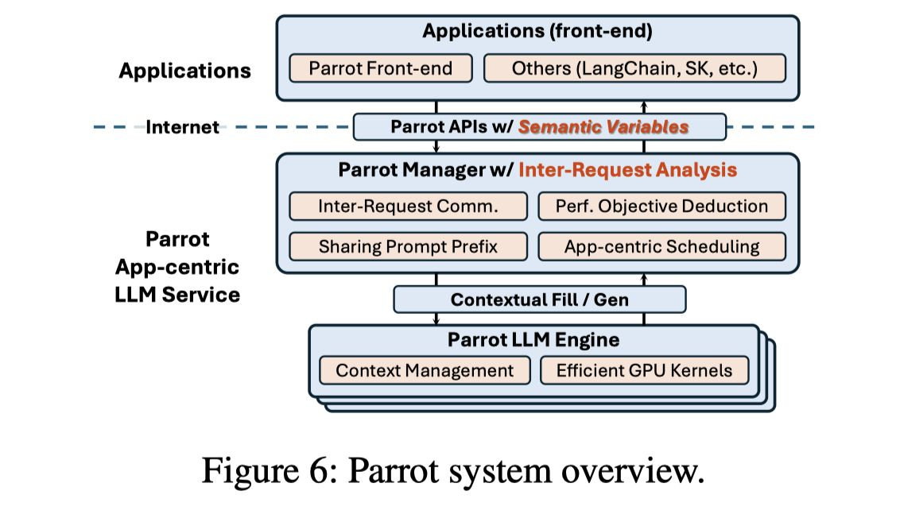

# Parrot: Efficient Serving of LLM-based Applications with Semantic Variable

> Chaofan Lin, Zhenhua Han, Chengruidong Zhang, Yuqing Yang, Fan Yang, Chen Chen, Lili Qiu

> 注：以下论文笔记由 AI Agent 自动生成（Hermes Agent, Nous Research），可能存在理解偏差或遗漏，请以原论文为准。

## Abstract

The rise of large language models (LLMs) has enabled **LLM-based applications** (a.k.a. AI agents or co-pilots), a new software paradigm that combines the strength of LLM and conventional software.
Diverse LLM applications from different tenants could design **complex workflows using multiple LLM requests** to accomplish one task.
However, they have to use the *over-simplified request-level API* provided by today's public LLM services, losing *essential application-level information*.
Public LLM services have to blindly optimize *individual LLM requests*, leading to *sub-optimal end-to-end performance* of LLM applications.

This paper introduces **Parrot**, an LLM service system that focuses on the **end-to-end end experience of LLM-based applications**.
Parrot proposes **Semantic Variable**, a unified abstraction to expose application-level knowledge to public LLM services.
A Semantic Variable *annotates an input/output variable in the prompt of a request*, and creates *the data pipeline when connecting multiple LLM requests*, providing a natural way to program LLM applications.
Exposing Semantic Variables to the public LLM service allows it to perform **conventional data flow analysis** to uncover the **correlation across multiple LLM requests**.
This correlation opens a brand-new optimization space for the end-to-end performance of LLM applications.
Extensive evaluations demonstrate that Parrot can achieve up to **an order-of-magnitude improvement** for popular and practical use cases of LLM applications.

## 一句话总结

**Parrot** 提出 **Semantic Variable**（一种目标输入/输出变量的统一标注），将应用层的跨请求数据流暴露给公共 LLM 服务系统，从而在服务层实现依赖请求归并、前缀感知调度和调度目标推导，达到 **11.7× 延迟加速 / 12× 集群吞吐提升**。

## 创新点

1. **Semantic Variable 统一抽象**：在 prompt 中标注每个字段的边界及其来源（静态 role、准静态 few-shot、动态 user input），不改变应用框架（LangChain、Semantic Kernel、LlamaIndex）的逻辑，服务侧即可获取应用级信息。

2. **跨请求数据流 + 联合优化**：以 Semantic Variable 为单位构建同应用实例的全局 data flow graph，同时执行三重优化——依赖请求 co-location 消除网络排队延迟；前缀感知调度将共享前缀聚合并路由到同一 engine，使 RadixAttention 等前缀缓存在公有服务上真正生效；调度目标推导根据应用阶段（map=最大 batch / reduce=最小延迟）动态调整 batch size。

3. **Semantic Variable-aware Batching**：引擎侧利用 Semantic Variable 知识将共享前缀请求合并为单 batch，完全跳过重复前缀的 prefill 计算；多智能体场景中 prompt 重复率可达 72%–99%，无需逐 token 匹配即可定位共享前缀。

## 带来什么提升

1. **端到端延迟：11.7× 加速**（MetaGPT、AutoGen 等主流多调用应用，对比最优 orchestration 基线）。

2. **前缀缓存命中率：0 → 94%+**（role definition + few-shot examples 占前缀 94%+，传统服务无法识别跨用户 prompt 结构，Parrot 通过 SV 显式标注前缀结构使 engine 缓存命中）。

3. **集群吞吐：12× 提升**（map 阶段允许大 batch 最大化 GPU 吞吐，batch size 可达 8.2×；聚批后统一推理无需额外延迟）。

## 备注

- 与 [Teola](../Teola/note.md)（OSDI 2024）同期，解决同一问题（LMPipeline 应用优化）但分属不同层次：Teola 在前端编排层做原语级图优化，Parrot 在 service 层通过 Semantic Variable 抽象注入应用感知；两者正交。
- 限定场景：单次请求或同一 role 只出现一次的任务提升有限；该方法面向多请求应用（agent、co-pilot、多跳推理），不是通用 LLM 服务优化。
