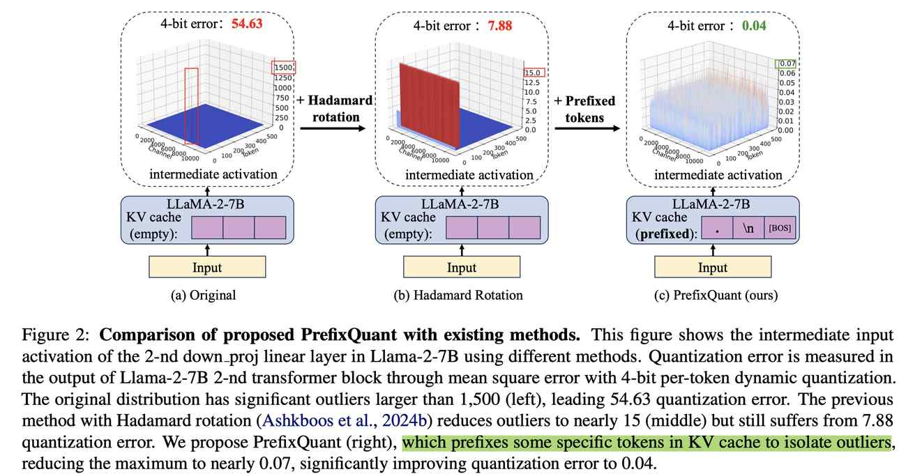

# PrefixQuant: Eliminating Outliers by Prefixed Tokens for Large Language Models Quantization

> Mengzhao Chen, Yi Liu, Jiahao Wang, Yi Bin, Wenqi Shao, Ping Luo

## 一句话总结

PrefixQuant 提出了一种通过在 KV 缓存中前缀化 outlier token 来消除 token 级别异常值的量化方法，以训练无关且高效的方式实现了 W4A4KV4/W4A8KV4 量化下的 SOTA 性能，显著优于 SpinQuant、QuaRot 等现有动态量化方法。

## 摘要翻译

现有的大语言模型（LLM）权重-激活量化方法主要关注通道级异常值（channel-wise outliers），但往往忽略了 token 级别异常值（token-wise outliers），这限制了量化模型的精度。在本文中，我们提出了 PrefixQuant，一种新颖的量化方法，通过有效隔离 token 级别异常值，在各种精度级别（W4A4KV4 和 W4A8KV4）和粒度（动态量化和静态量化）下实现了最先进的性能。首先，PrefixQuant 通过在 KV 缓存中前缀化异常值 token 来消除 token 级别异常值，这一过程无需训练且高效（例如，Llama-3-70B 仅需 1 分钟）。其次，PrefixQuant 引入了新的可训练参数进行分块训练以补偿量化误差。我们的实验表明，PrefixQuant 显著优于现有的动态量化方法，即使在更粗糙的静态量化设置下也是如此。例如，在 W4A4KV4 Llama-3-8B 上，PrefixQuant 在动态和静态量化设置下，在五个零样本推理任务上的平均精度分别比 SpinQuant（动态量化）提高了 +3.08 和 +2.85 个百分点。此外，我们展示了使用 W4A4 PrefixQuant 可实现高达 2.74 倍的预填充加速和 2.16 倍的解码加速。

## 研究动机

大语言模型（LLM）的参数量和计算需求带来了显著的部署挑战，量化技术成为降低内存使用和加速推理的关键手段。然而，LLM 激活值中的异常值（outliers）会导致严重的量化误差和精度退化。

现有方法主要关注通道级异常值，通过通道级缩放（如 SmoothQuant）、混合精度量化（如 Atom、QUIK）、Hadamard 旋转（如 QuaRot、SpinQuant）等方式进行处理。但这些方法忽略了 token 级别异常值的问题。

本文的关键发现是：在 2048 个 token 的输入上下文中，仅 2 个异常值 token 就贡献了 94.7% 的量化误差。具体而言，在 Llama-2-7B 的第 2 个 Transformer 块中，两个异常值 token 贡献了 51.7（占总量化误差的 94.7%），而其余 2046 个 token 仅贡献 2.9（占 5.3%）。即使使用 Hadamard 旋转（QuaRot），异常值 token 的最大值仍比正常 token 大数百倍，导致量化误差为 7.88。

因此，如何有效消除 token 级别异常值成为提升量化模型精度的关键问题。

## 方法（技术细节）

### 4.1 异常值 Token 的深入分析

**异常值 Token 的定义：** 给定 token 序列的绝对值矩阵 X ∈ R^{T×C}，计算每个 token 的逐 token 最大值 M ∈ R^T，第 i 个 token 的异常值程度通过与 M 的中位数比较来衡量：

R_i = M_i / median(M)

当 R_i > η₁（上异常值，η₁=64）或 R_i^{-1} > η₂（下异常值，η₂=8）时，该 token 被分类为异常值 token。

**异常值 Token 的特征：**
- **数量：** 异常值 token 仅占输入序列的很小比例（例如 Llama-2-7B 仅 2 个位置）
- **位置：** 初始 token 几乎在所有模型中都是异常值 token（与 attention sinks 现象一致），此外序列前部的某些位置也可能是异常值 token
- **内容：** 初始 token 始终是异常值 token，不论其内容如何；某些模型（如 Llama-2-7B）在分隔符 token（如"."或"\n"）上也表现为异常值

**异常值类型：**
1. **上异常值：** 出现在 down_proj 线性层的输入和 Transformer 块的输出中，max(top-1/median) 可达 4161
2. **下异常值：** 出现在自注意力机制的 Q/K 中，某些 token 表现出极小值，max(median/min-1) > 9

### 4.2 前缀化异常值（Prefixed Outliers）

核心思想：将高频异常值 token 前缀化到输入序列的开头，将异常值 token 约束到前缀 token 中。由于前缀 token 在所有输入中保持一致，可以离线进行预填充并存储其 KV 缓存，从而在推理时复用。

**前缀 token 的选择：**
- 通过分析少量校准数据集确定异常值 token 的数量 o
- 前缀化 top-o 个高频异常值 token（排除初始 token）
- 对于特殊模型（如 Llama-3-8B、Qwen-2-7B），仅将 [BOS] 作为前缀 token
- 所有模型均将 [BOS] 作为最后一个前缀 token

**KV 缓存中的前缀 token 计算：**

在 LLM 的自回归推理中，前缀 token 的 KV 缓存通过以下注意力机制公式计算：

Attention(Q, K, V; k', v') = Softmax(QK^T / √d) [V; v'^T]

其中 k', v' ∈ R^{o×C} 是存储在 KV 缓存中的前缀 token，在一次全精度模型的预填充过程中计算得到，并在量化模型推理时复用。注意，KV 缓存中的前缀 token 即使在使用量化模型时也保持全精度。

**不同模型的前缀 token：**
- Llama-2-7B: 3 个前缀 token（".\n[BOS]"）
- Llama-2-13B: 3 个（"the.[BOS]"）
- Llama-2-70B: 4 个（"\n"[BOS]"）
- Llama-3-8B(-Instruct): 1 个（"[BOS]"）
- Llama-3-70B(-Instruct): 3 个（", [BOS]"）
- Mistral-v0.3-7B: 4 个（"\n.to[BOS]"）
- Qwen-2-7B: 1 个（"[BOS]"）

**分布改善效果：**
- down_proj 输入的 max(top-1/median) 比率从 461 降至 2.4
- Q/K 的 max(median/min-1) 比率从 >9 降至 <3.5

### 4.3 分块微调（Block-wise Fine-tuning）

引入可训练参数的分块微调来进一步降低量化误差，具体包括：

**动态激活量化（PrefixQuant-O1）：**
- 设置 tensor 级别的裁剪因子（clipping factors）为可训练参数
- 裁剪因子不能是 token 级别的，因为长上下文场景中 token 级裁剪因子会带来过大的存储开销

**静态激活量化（PrefixQuant-O2）：**
- 量化参数（缩放因子和零点）本身是可训练的

**权重量化：**
- 采用 EfficientQAT 的方法，使所有权重和权重量化参数均可训练

**训练配置：**
- 使用 Pile 数据集的 512 个样本，1024 上下文长度
- 学习率：量化参数 5e-5，全精度权重 5e-6（Llama-3-70B 使用 2e-5 和 2e-6）
- Batch size: 4
- Epochs: W4A8KV4 为 10，W4A4KV4 为 20
- 优化目标：块输出的均方误差（MSE）

### 量化设置

| 方法 | 权重 | 激活 | KV 缓存 |
|------|------|------|---------|
| SmoothQuant | per-channel | per-token 动态 | per-token 动态 |
| Atom | group-wise | group-wise 动态 | group-wise 动态 |
| QuaRot/SpinQuant | per-channel | per-token 动态 | group-wise 动态 |
| PrefixQuant-O1 | per-channel | per-token 动态 | group-wise 动态 |
| PrefixQuant-O2 | per-channel | per-tensor 静态 | per-head 静态 |

所有 group-wise 量化设置 group size 为 128。PrefixQuant-O1 与现有方法一致以进行公平比较，PrefixQuant-O2 更高效（即更低延迟）。

## 实验结果

### W4A4KV4 结果（Llama 系列模型）

| 模型 | 方法 | PPL | Acc. |
|------|------|-----|------|
| Llama-2-7B | FP16 | 5.47 | 69.04 |
| | Atom | 6.12 | 59.73 |
| | QuaRot | 6.19 | 64.69 |
| | DuQuant | 6.20 | 66.25 |
| | SpinQuant | 5.95 | 65.35 |
| | PrefixQuant-O1 | **5.93** | **66.74** |
| | PrefixQuant-O2 | 6.01 | 66.37 |
| Llama-2-13B | SpinQuant | 5.24 | 69.24 |
| | PrefixQuant-O1 | **5.24** | **70.05** |
| | PrefixQuant-O2 | 5.32 | 70.36 |
| Llama-2-70B | SpinQuant | 3.70 | 75.19 |
| | PrefixQuant-O1 | **3.62** | **76.23** |
| | PrefixQuant-O2 | 3.81 | 75.48 |
| Llama-3-8B | SpinQuant | 7.36 | 68.23 |
| | PrefixQuant-O1 | **7.26** | **71.31** |
| | PrefixQuant-O2 | 7.43 | 71.08 |
| Llama-3-70B | DuQuant | 5.67 | 74.89 |
| | PrefixQuant-O1 | **4.16** | **77.08** |
| | PrefixQuant-O2 | 4.41 | 77.18 |

### W4A8KV4 结果

PrefixQuant-O1 和 O2 在大多数模型上均优于 QoQ 和 QuaRot。例如，在 Llama-3-8B 上，PrefixQuant-O1 比 QoQ 提高了 0.31 困惑度和 +1.22 个百分点精度。

### MMLU 结果（Llama-3-8B）

| 方法 | 精度 | MMLU Acc. |
|------|------|-----------|
| FP16 | - | 62.07 |
| SpinQuant | W4A4KV4 | 51.93 |
| PrefixQuant-O1 | W4A4KV4 | **56.00** |
| PrefixQuant-O2 | W4A4KV4 | 54.65 |
| SpinQuant | W4A8KV4 | 58.25 |
| PrefixQuant-O1 | W4A8KV4 | **60.49** |
| PrefixQuant-O2 | W4A8KV4 | 59.20 |

### 消融实验（Llama-3-8B）

W4A4KV4 的逐步改进：
- RTN: 1282.34 → +旋转: 24.98 → +Grid Search: 11.70
- PrefixQuant-O1 (+前缀化异常值): 7.53 → +分块微调: **7.23**
- PrefixQuant-O2 (+静态量化): 141.02 → +前缀化异常值: 7.93 → +分块微调: **7.41**

### 推理加速（W4A4 Llama-2-7B）

| 方法 | 预填充 (ms) | 解码 (token/s) |
|------|-------------|----------------|
| FP16 | 489 | 43 |
| PrefixQuant-O1 | 183 (2.67x) | 91 (2.11x) |
| PrefixQuant-O2 | 178 (2.74x) | 93 (2.16x) |

## 优势

1. **无需训练的异常值消除：** PrefixQuant 通过前缀化异常值 token 来隔离 token 级别异常值，这一过程不需要任何重新训练，且极其高效（Llama-2-7B 仅需 12 秒，Llama-3-70B 仅需 1 分钟）
2. **显著的精度提升：** 在 W4A4KV4 Llama-3-8B 上，比 SpinQuant（动态量化）平均提高 +3.08（动态）和 +2.85（静态）个百分点
3. **首次突破：** 据作者所知，PrefixQuant 是首个使用更粗糙的 per-tensor 静态量化超越先前 per-token 动态量化方法的方法
4. **广泛的适用性：** 兼容 W4A4KV4 和 W4A8KV4 多种精度，支持动态和静态量化两种粒度
5. **显著的推理加速：** W4A4 下实现高达 2.74 倍预填充加速和 2.16 倍解码加速
6. **与 Hadamard 旋转正交：** PrefixQuant 关注 token 级别异常值，与处理通道级异常值的 Hadamard 旋转方法互补，可以叠加使用
7. **兼顾上异常值和下异常值：** 不同于先前只关注大值异常值的方法，PrefixQuant 还识别了自注意力 Q/K 中的极小值异常值
8. **高效检测：** 前缀 token 的检测不需要任何重新训练，比 QFeP（12 小时）和 Cushion-Cache（12 小时）等方法快得多（12 秒）

## 局限

1. **前缀 token 的数量有限：** 异常值 token 通常只有少量（如 Llama-2-7B 仅 2 个），这限制了异常值隔离的覆盖面
2. **静态量化设置的效率问题：** 虽然 PrefixQuant-O2 在静态量化下性能优异，但静态量化的预计算过程（使用校准数据集）可能不如动态量化灵活
3. **KV 缓存中的全精度存储：** 前缀 token 在 KV 缓存中保持全精度，这会增加一定的内存开销（虽然前缀 token 数量通常很少）
4. **对特定模型的依赖：** 不同模型的前缀 token 内容和数量不同，需要针对每个模型进行单独分析
5. **裁剪因子的限制：** 在动态激活量化中，裁剪因子是 tensor 级别的而非 token 级别的，这可能限制了某些场景下的性能
6. **异常值 token 位置的不确定性：** 异常值 token 的位置依赖于输入序列且变化显著，因此不适合进行离线混合精度量化
7. **训练数据和配置的敏感性：** 分块微调需要特定的训练数据（Pile 512 样本）和超参数设置，可能存在过拟合风险

## 与 EfficientPaper 相关的研究方向

1. **KV Cache 量化：** PrefixQuant 直接处理 KV 缓存中的异常值 token，与 KV Cache 量化研究密切相关，是提升量化精度的有效方向
2. **异常值处理：** PrefixQuant 提供了对 token 级别异常值的系统性分析，对 LLM 量化中的异常值处理研究具有重要参考价值
3. **动态 vs 静态量化：** PrefixQuant 展示了静态量化可以超越动态量化，这对量化策略选择的研究方向有重要启示
4. **训练无关量化：** PrefixQuant 的前缀化过程无需训练，属于高效、低成本的量化方法
5. **块级微调：** PrefixQuant 使用分块微调来补偿量化误差，与 EfficientQAT 等方法相关
6. **加速推理：** PrefixQuant 展示了显著的推理加速效果（2.74x 预填充、2.16x 解码），对 LLM 部署优化具有重要价值
7. **多精度量化：** PrefixQuant 兼容 W4A4KV4 和 W4A8KV4 多种精度，对低比特量化研究有指导意义
8. **Attention Sink 与异常值：** PrefixQuant 的发现与 Attention Sink 现象相关，为理解 LLM 中的异常值模式提供了新视角

## AI 生成声明

> 本笔记由 AI Agent（Hermes Agent）基于论文 PDF 文本自动提取和分析生成。笔记内容涵盖了论文的核心方法、实验结果和关键发现，但可能存在对原文细节的简化或遗漏。建议读者参考原文进行深入研究。
