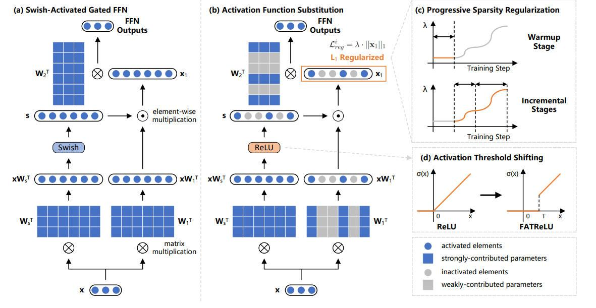

# ProSparse: Introducing and Enhancing Intrinsic Activation Sparsity within Large Language Models

## 一句话总结

ProSparse 是一种简单有效的 ReLUfication 方法，通过渐进式稀疏正则化和激活阈值偏移，将非 ReLU 激活函数的大型语言模型（如 LLaMA2 和 MiniCPM）转换为具有高激活稀疏性（最高 89.32%）的模型，同时保持与原始 Swish 激活版本相当的性能，并实现最高 4.52 倍的推理加速。

## 摘要翻译

激活稀疏性是指激活输出中存在大量弱贡献元素的现象，为加速模型推理提供了一种有前途的范式。然而，大多数大型语言模型（LLMs）采用不具有内在激活稀疏性的激活函数（如 GELU 和 Swish）。

一些近期工作探索了引入 ReLU 或其变体作为替代激活函数以追求激活稀疏性和加速，但很少有方法能同时获得高激活稀疏性和可比较的模型性能。本文提出了一种简单有效的方法"ProSparse"，在实现稀疏化的同时保持模型性能。具体而言，在引入 ReLU 激活后，ProSparse 采用渐进式稀疏正则化，正则化因子在多个阶段平滑增加。这可以增强激活稀疏性，并通过避免激活分布的剧烈变化来缓解性能退化。

通过 ProSparse，我们分别获得了 LLaMA2-7B 的 89.32%、LLaMA2-13B 的 88.80% 和端侧模型 MiniCPM-1B 的 87.89% 的高稀疏性，且性能与原始 Swish 激活版本相当。这些是开源 LLaMA 版本中激活最稀疏的模型，也是具有竞争力的端侧模型。推理加速实验进一步证明了具有更高激活稀疏性的 LLM 的显著实际加速潜力，获得了最高 4.52 倍的推理加速。

## 研究动机

1. **LLM 推理成本高昂**：大型语言模型的部署和推理需要大量计算资源，限制了其在实际应用中的广泛使用。
2. **激活稀疏性的潜力**：激活输出中存在大量可忽略的元素（弱贡献元素），这些元素可以被跳过以节省计算资源，是提升推理效率的有前途的技术。
3. **非 ReLU 模型的局限**：近期主流 LLMs（如 LLaMA、Falcon）采用 GELU 或 Swish 激活函数，缺乏内在的激活稀疏性，无法直接利用稀疏加速。
4. **现有 ReLUfication 方法的不足**：
   - 直接替换激活函数为 ReLU（vanilla ReLU）无法显著提高稀疏性，因为没有改变原始密集激活分布。
   - 插入和偏移的 ReLU（shifted ReLU）通过剧烈改变激活分布来强制稀疏化，但无法同时保持性能，且声称的 95% 稀疏性无法复现。
5. **目标**：需要一种方法能够同时实现高激活稀疏性和可比较的模型性能，且适用于非 ReLU 模型的 ReLUfication。

## 方法（技术细节）

ProSparse 包含三个精心设计的步骤，将非 ReLU LLM 转换为具有高激活稀疏性的 ReLU 激活模型：

### 1. 激活函数替换（Activation Function Substitution）

- 将 FFN 中的非 ReLU 激活函数（如 Swish/GELU）替换为 ReLU：σ(x) = max(x, 0)
- 进行持续训练（continual training），使模型初步适应 ReLU 激活
- **局限**：这一步本身无法显著提高稀疏性，因为没有改变原始激活分布

### 2. 渐进式稀疏正则化（Progressive Sparsity Regularization）

这是 ProSparse 的核心创新，通过逐步增加 L1 稀疏正则化因子来增强激活稀疏性。

**数学定义**：
- 对于 LLM 中第 i 层 FFN 的中间输出 x₁，L1 正则化损失为：Lᵢ_reg(λ) = λ · ||x₁||₁
- 总正则化损失为所有 K 层的损失之和：L_reg(λ) = Σᵢ₌₁ᴷ Lᵢ_reg(λ)
- 整体优化目标：L_lm + L_reg(λ)，其中 L_lm 为原始语言模型损失

**渐进式调度策略**：
- **预热阶段（Warmup Stage）**：λ 设为相对较小的常数值，防止激活分布剧烈变化，同时引入较高的初步稀疏性
- **增量阶段（Incremental Stages）**：λ 沿平滑正弦曲线从谷值增加到峰值
  - 借鉴余弦退火调度器（cosine annealing scheduler）的思想
  - 正弦函数在谷值和峰值附近的导数较小，使 λ 不会在这些点附近急剧增加
  - 这为 LLM 提供更多时间适应新的 L1 正则化
  - 每个阶段伴随一定数量的训练步骤
- **阶段数量和峰值 λ 值**：根据目标稀疏性和稳定性选择

**关键优势**：
- 避免了固定正则化因子可能导致的性能退化
- 可以达到更高的激活稀疏性，同时保持与无正则化方法可比的性能
- 训练额外 token 开销约 54.53B（仅占 LLaMA2 预训练 2T tokens 的 2.73%）

### 3. 激活阈值偏移（Activation Threshold Shifting）

- 将 ReLU 转换为 FATReLU（Frequency-Adaptive Threshold ReLU）：σ(x) = x（当 x ≥ t），0（当 x < t），其中 t > 0 为正阈值
- 目的：移除对最终结果影响较小的非零小元素，进一步提高稀疏性
- 阈值 t 的选择需要精心调整（见论文附录 O）

### 实际推理加速

**近似加速算法（Approximate Acceleration）**：
- 使用 PowerInfer，一种基于激活预测器的近似加速算法
- 激活预测器（小型神经网络）预测激活分布，以优化硬件分配
- 评价指标：激活召回率（Activation Recall）、预测稀疏性（Predicted Sparsity）、推理速度

**精确加速算法（Accurate Acceleration）**：
- 实现两个硬件高效的稀疏 GPU 算子，利用系统级优化（算子融合、合并内存访问、向量化）
- 一个算子处理输出侧稀疏（ReLU 与 s⊙(x₁) 的融合）
- 另一个算子处理输入侧稀疏（稀疏矩阵向量乘法 x₁W₂ᵀ）
- 无预测器、可插拔、不受推理不准确性影响

## 实验结果

### 主要结果（Table 1）

| 模型 | 平均性能(%) | 激活稀疏性(%) |
|------|-------------|---------------|
| LLaMA2-7B | 37.96 | - |
| ReluLLaMA-7B | 37.62 | 66.98 |
| ProSparse-7B | 38.46 | 89.32 |
| LLaMA2-13B | 44.06 | - |
| ReluLLaMA-13B | 42.74 | 71.56 |
| ProSparse-13B | 44.90 | 88.80 |
| MiniCPM-1B | 44.44 | - |
| ProSparse-1B | 44.72 | 87.89 |

**关键发现**：
1. **有效性**：ProSparse 同时实现了高稀疏性和可比的下游性能，稀疏性显著高于 ReluLLaMA
2. **规模可扩展性**：在三种模型规模（7B、13B、1B）上一致有效
3. **激活阈值偏移效果**：在保持性能的同时进一步提高了稀疏性

### 推理加速效果（Table 2）

- **近似加速**：PowerInfer 实现最高 4.52 倍加速，更高的激活稀疏性显著提高了激活召回率和预测稀疏性
- **精确加速**：
  - 输出侧算子最高 2.44 倍加速
  - 输入侧算子最高 1.70 倍加速
  - 更大模型获得更好的加速效果

### 消融实验

- **固定 L1 正则化 vs 渐进式**：固定正则化因子（λ=0.1）获得 88.62% 稀疏性但性能仅 36.34%（ProSparse-7B 为 38.46%），证明渐进式正则化不可或缺
- **稀疏性与正则化因子的关系**：最终激活稀疏性主要取决于最后一阶段的正则化因子 λS，且呈负指数关系：sparsity ≈ 100 − exp(−1.76 · λ^0.30_S + 3.49)
- **SFT 经验**：SFT 可应用于 ProSparse 获得的稀疏模型，但需要选择较小的正则化因子

### 稀疏性分布特征

- 激活稀疏性在更格式化的指令微调数据集和更高层（靠近输出的层）上更高

## 优势

1. **简单有效**：三步方法设计清晰，无需复杂架构修改
2. **高稀疏性**：实现最高 89.32% 的激活稀疏性，远超 ReluLLaMA（66.98%）
3. **保持性能**：稀疏化后模型性能与原始 Swish 激活版本相当，甚至略有提升
4. **可扩展性**：在 7B、13B、1B 三种规模上一致有效
5. **可控性**：可通过调整最后一阶段正则化因子精确控制目标稀疏性
6. **实际加速**：通过近似和精确算法均实现了显著的推理加速（最高 4.52 倍）
7. **开源可用**：提供 Huggingface 上的预训练模型（prosparse-llama-2-7b、prosparse-llama-2-13b、ProSparse-MiniCPM-1B-sft）
8. **与现有技术正交**：激活稀疏性与模型压缩和高效采样方法正交，可组合使用

## 局限

1. **模型规模限制**：仅在 7B、13B 和 1B 规模上进行了实验，缺少对更大规模模型（如 70B 或更大）的验证，未来需要在计算资源充足时进行更全面的研究
2. **计算优化不完整**：仅关注了 FFN 步骤 (2) 和 (3) 的稀疏化加速，忽略了 LLM 计算中相当比例的其他部分
3. **注意力层未优化**：未探索注意力层的稀疏化（虽然已有初步工作如 Shen et al., 2023）
4. **FFN 步骤 (1) 未优化**：未优化 FFN 的步骤 (1)（密集矩阵-向量乘法），虽然已有剪枝和低秩分解等方法可提供帮助
5. **PowerInfer 限制**：MiniCPM-1B 架构当前不被 PowerInfer 支持，无法测试其近似加速效果
6. **训练开销**：需要额外的训练步骤（约 54.53B tokens）来达到高稀疏性，尽管仅占预训练的 2.73%
7. **SFT 复杂性**：对稀疏模型进行监督微调（SFT）需要精心选择正则化因子，避免性能退化

## 与 EfficientPaper 相关的研究方向

1. **激活稀疏性（Activation Sparsity）**：利用激活函数的稀疏性加速 LLM 推理，是模型效率优化的重要方向
2. **ReLUfication**：将非 ReLU 模型转换为 ReLU 激活模型，以获得内在的激活稀疏性
3. **模型压缩（Model Compression）**：包括量化、剪枝、蒸馏等方法，与激活稀疏性正交且可组合
4. **高效推理（Efficient Inference）**：通过硬件优化（如稀疏 GPU 算子）实现实际推理加速
5. **渐进式训练（Progressive Training）**：通过逐步调整超参数来平衡性能和效率
6. **端侧部署（Edge Deployment）**：在资源受限的端侧设备上高效部署 LLM，MiniCPM-1B 的实验结果展示了这一潜力
7. **L1 正则化（L1 Regularization）**：通过 L1 正则化诱导稀疏性，是模型压缩的经典方法
8. **激活预测器（Activation Predictors）**：使用小型神经网络预测激活分布，以优化推理时的硬件分配

## AI 生成声明

本笔记由 AI Agent（Hermes Agent）基于论文原文自动生成。内容基于 arXiv 论文 2402.13516 的文本提取和分析，包含对论文方法、实验和贡献的总结与翻译。AI 生成内容可能存在理解偏差或遗漏，建议参考原文获取完整信息。本笔记用于学术研究和学习目的，不构成任何形式的学术发表或引用。
