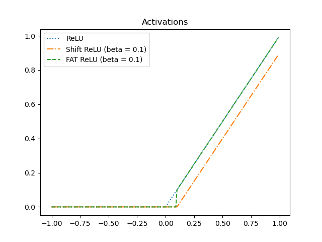
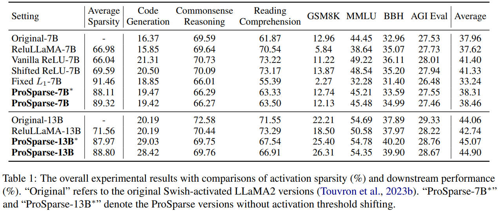
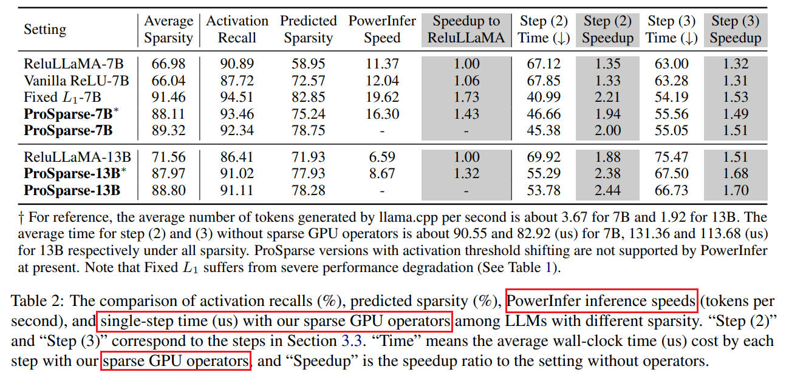

# ProSparse: Introducing and Enhancing Intrinsic Activation Sparsity within Large Language Models

## Method
There are three stages of ProSparse:
1. ReLU replacement
    - Replace Non-ReLU activation with ReLU and finetune the model.
    - However, this stage usually does not achieve satisfactory sparsity.
2. Progressive sparsity regularization
    - Apply sparsity regularization to the output of FFN.
    - Progressively increase the regularization factor for better performace.
    - Enhance higher sparsity.
3. Activation threshold shifting
    - Modify the vanilla ReLU with FAT ReLU.

This paper provides two models [prosparse-llama-2-7b](https://huggingface.co/SparseLLM/prosparse-llama-2-7b) and [prosparse-llama-2-13b](https://huggingface.co/SparseLLM/prosparse-llama-2-13b) in Huggingface.

## Experiment

### Real accelerate on hardware

1. Approximate strategy
    - A predictor to predict the position of activation sparse.
    - However, the final performance depends on the quality of the predictor and the predictor itself introduce an addional overhead.
    - Test on [PowerInfer](https://github.com/SJTU-IPADS/PowerInfer), a c++ library.
2. Accurate strategy
    - GPU kernel
        - operation fusion
        - coalesced memory access
        - vectorization

### Training Dataset

1. Pretraining Dataset
 - StarCoder
 - Wikipedia
 - Pile
 - other collected data.
2. Instruction tuning dataset
 - UltraChat
 - multiple-choice QA data of P3
 - PAQ
 - Unnatural Instructions
 - Flan
 - Super-Natural Instructions
 - other collected data.

Prosparse achieves better result than Original model. I think the orginal models do not adopt **Instruction Finetuning**, but Prosparse does.

