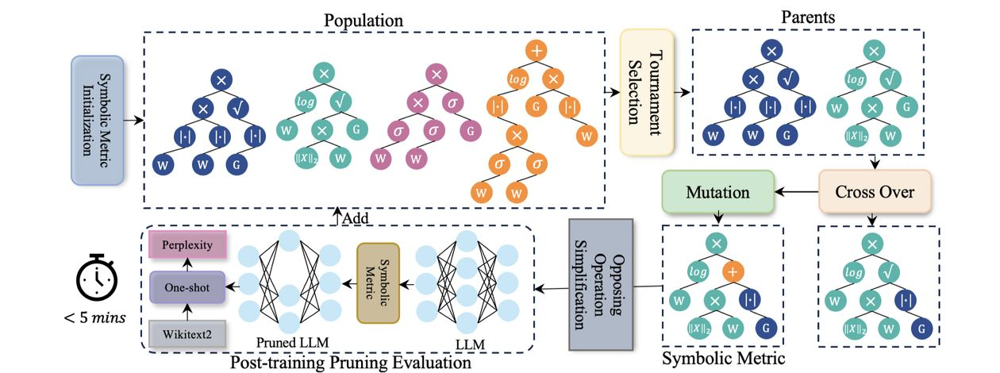

# Pruner-Zero: Evolving Symbolic Pruning Metric from scratch for Large Language Models

> **一句话总结**：Pruner-Zero 利用遗传编程自动搜索最优的符号剪枝度量（Symbolic Pruning Metric），通过设计涵盖现有剪枝度量的统一搜索空间和对立操作简化策略（OOS），在无需重训练或权重更新的情况下，自动发现并生成优于 SparseGPT、Wanda 等 SOTA 方法的剪枝指标，实现了 LLM 的高效后训练剪枝。

---

## 摘要翻译

尽管大型语言模型（LLM）具有卓越的能力，但其庞大的规模给部署带来了巨大挑战。剪枝方法通过丢弃权重子集来加速模型，但许多方法需要重训练，这对 LLM 来说计算成本极高。最近，后训练剪枝方法引入了新的度量指标，使得无需重训练即可剪枝 LLM，但这些指标依赖于人类专家的参与和繁琐的试错过程。为了高效地识别更优的剪枝度量，我们开发了一个使用遗传编程自动搜索符号剪枝度量的框架。具体而言，我们设计了一个精心构建的搜索空间，涵盖现有剪枝度量，以发现潜在的符号剪枝度量。我们提出了对立操作简化策略（Opposing Operation Simplification），以增加种群的多样性。通过这种方式，Pruner-Zero 能够自动生成符号剪枝度量。基于搜索结果，我们探索了剪枝度量与剪枝后性能之间的相关性，并总结了一些原则。在 LLaMA 和 LLaMA-2 上进行的大量语言建模和零样本任务实验表明，我们的 Pruner-Zero 在后训练剪枝方面获得了优于 SOTA 方法的性能。代码地址：https://github.com/pprp/Pruner-Zero。

---

## 研究动机

1. **LLM 部署的计算瓶颈**：大型语言模型（如 GPT-3 的 1750 亿参数）需要大量计算资源进行部署，迫切需要高效的模型压缩技术。模型稀疏化（sparsing）是一种极具前景的方法，通过识别并消除权重矩阵中的冗余元素来压缩模型。

2. **传统剪枝方法的局限性**：传统的剪枝方法（如从随机初始化训练、重训练或迭代剪枝）由于 LLM 的复杂性、计算和数据需求，变得不可行。后训练剪枝（post-training pruning）成为更实用的选择，但现有的后训练剪枝方法存在两个关键挑战：
   - **人类依赖性（Human-Dependence）**：现有方法严重依赖领域知识，需要大量试错。
   - **格式敏感性（Format-Sensitivity）**：剪枝度量对格式极为敏感，需要系统性的实验方法。

3. **现有剪枝度量的不足**：
   - **SparseGPT**：需要权重更新和 Hessian 矩阵逆运算，计算复杂度高。
   - **Wanda**：虽然不需要权重更新，但度量设计依赖人工经验。
   - **GBLM-Pruner**：使用梯度信息，但同样依赖人工设计。
   - 这些方法的度量都需要人工设计，且缺乏系统性搜索框架。

4. **关键洞察**：剪枝度量可以表示为一系列符号的组合（类似符号回归），因此可以通过自动化搜索来发现更优的度量，而非依赖人工设计。这催生了两个核心问题：
   - 如何设计一个统一的搜索空间来涵盖现有剪枝度量？
   - 如何找到为 LLM 定制的最优剪枝度量？

---

## 方法（技术细节）

### 核心思想

Pruner-Zero 将剪枝度量的发现形式化为一个**符号回归（Symbolic Regression）**问题，利用**遗传编程（Genetic Programming）**自动搜索最优的符号剪枝度量（Symbolic Pruning Metric, SPM）。

### 搜索空间设计

**输入变量（LLM Statistics）**：
- **权重（W）**：模型权重矩阵
- **梯度（G）**：使用 128 个校准样本预计算并本地存档
- **激活（X）**：输入激活值
- 排除了 Hessian 矩阵（因其随隐藏层维度二次方增长，$O(d_{hidden}^2)$，计算成本过高）

**原始操作（Primitive Operations）**：
- 受 AutoML-Zero 和 EMQ 启发，包含一元操作（UOP）和二元操作（BOP）
- 完整操作集合参考 Table 10（附录），涵盖绝对值、范数、幂运算、乘除等
- 共 17 种原始操作

**表达树（Expression Tree）**：
- 剪枝度量表示为一棵表达树，叶节点为 LLM 统计量（W、G、X），内部节点为数学操作
- 一元操作有一个子节点，二元操作有两个子节点
- 输出维度必须与权重维度对齐，表示每个权重的重要性

### 遗传编程框架

**算法流程（Algorithm 1）**：
1. **初始化**：用不同深度（3-5）的符号树初始化种群 P
2. **迭代搜索**（300 次迭代）：
   - 随机选择 r×|P| 个子网进行评估
   - 从 top-k 候选中选取两个父代
   - 执行子树交叉（Crossover）和节点变异（Mutation，概率 p=0.5）
   - 应用 OOS 策略简化后代
   - 如果后代与父代等价，则重新随机生成
   - 评估后代的困惑度（perplexity）作为适应度
   - 移除困惑度最高的个体

**进化设置**：
- 初始种群大小：50
- 迭代次数：300
- 符号树深度：3-5
- 锦标赛选择 top-k=10
- 变异概率：0.5
- 适应度指标：WikiText2 上 LLaMA-2-7B 的困惑度
- 评估时间：不到 5 分钟
- 硬件：2 × NVIDIA 4090 GPU

### 对立操作简化策略（OOS）

**问题**：搜索空间中存在数学等价但形式不同的符号树，如 `exp` 和 `log`、`sub` 和 `neg` 等对立操作对，这些冗余增加了搜索复杂度，降低了可解释性。

**解决方案**：OOS 策略在每次变异后，遍历符号树的所有节点，检测并移除对立操作对（如 exp/log、sub/neg 等），从而：
- 减少搜索空间的冗余
- 提高基因编程的搜索效率
- 增强种群多样性
- 提升表达树的可解释性

### 搜索到的符号剪枝度量

最终搜索到的最优符号剪枝度量为：

$$\text{Pruner-Zero} = ||W| \times |W|| \times \sigma(|G|)$$

其中：
- $\sigma$ 为 min-max 归一化函数
- $|W|$ 为权重绝对值，$||W|$ 为双重绝对值（即平方的平方根，类似于几何平均）
- $|G|$ 为梯度绝对值
- min-max 缩放函数将权重和梯度归一化到相同尺度，避免扭曲值域差异
- 平方操作与梯度乘积的几何平均形式有助于抑制极端值的影响

**该度量的特点**：
- 不需要权重更新（与 Wanda 类似）
- 不需要 Hessian 矩阵（计算复杂度低）
- 同时考虑权重大小和梯度信息
- 通过 min-max 缩放实现归一化

---

## 实验结果

### 评估设置

- **模型**：LLaMA (7B/13B/30B/65B)、LLaMA-2 (7B/13B/70B)、Tiny-LLaMA、OPT
- **数据集**：WikiText2（语言建模）、EleutherAI LM Harness（7 个零样本任务）
- **稀疏类型**：非结构化 50%、结构化 4:8、结构化 2:4
- **对比方法**：Magnitude、SparseGPT（需权重更新）、Wanda（无需权重更新）
- **实现**：基于 Wanda 框架

### 语言建模结果（WikiText2 Perplexity）

| 方法 | 权重更新 | 稀疏度 | LLaMA 7B | 13B | 30B | 65B | LLaMA-2 7B | 13B | 70B |
|------|----------|--------|-----------|-----|-----|-----|-----------|-----|-----|
| Dense | - | 0% | 5.68 | 5.09 | 4.77 | 3.56 | 5.12 | 4.57 | 3.12 |
| Magnitude | ✗ | 50% | 17.29 | 20.21 | 7.54 | 5.90 | 14.89 | 6.37 | 4.98 |
| SparseGPT | ✓ | 50% | 7.22 | 6.21 | 5.31 | 4.57 | 6.51 | 5.63 | 3.98 |
| Wanda | ✗ | 50% | 7.26 | 6.15 | 5.24 | 4.57 | 6.42 | 5.56 | 3.98 |
| **Pruner-Zero** | **✗** | **50%** | **6.95** | **5.94** | **5.01** | **4.33** | **6.26** | **5.36** | **3.82** |

**关键发现**：
- Pruner-Zero 在非结构化 50% 稀疏度下，所有模型的困惑度均低于 SparseGPT 和 Wanda
- LLaMA-7B：Pruner-Zero 6.95 vs SparseGPT 7.22 vs Wanda 7.26
- LLaMA-2-7B：Pruner-Zero 6.26 vs SparseGPT 6.51 vs Wanda 6.42
- 在结构化 4:8 和 2:4 稀疏度下同样保持优势
- 不需要权重更新，实现了与 SparseGPT（需权重更新）相当甚至更优的性能

### 零样本任务结果（平均准确率 %）

| 方法 | 权重更新 | 稀疏度 | LLaMA 7B | 13B | 30B | 65B | LLaMA-2 7B | 13B | 70B |
|------|----------|--------|-----------|-----|-----|-----|-----------|-----|-----|
| Dense | - | 0% | 59.99 | 62.59 | 65.38 | 66.97 | 59.71 | 63.03 | 67.08 |
| Magnitude | ✗ | 50% | 46.94 | 47.61 | 53.83 | 62.74 | 51.14 | 52.85 | 60.93 |
| SparseGPT | ✓ | 50% | 54.94 | 58.61 | 63.09 | 66.30 | 56.24 | 60.72 | 67.28 |
| Wanda | ✗ | 50% | 54.21 | 59.33 | 63.60 | 66.67 | 56.24 | 60.83 | 67.03 |
| **Pruner-Zero** | **✗** | **50%** | **59.56** | **62.67** | **67.49** | **69.81** | **58.87** | **64.83** | **71.10** |

**关键发现**：
- Pruner-Zero 在所有模型和稀疏类型上均显著优于其他方法
- LLaMA-7B：Pruner-Zero 59.56% vs SparseGPT 54.94% vs Wanda 54.21%（提升约 5%）
- LLaMA-2-7B：Pruner-Zero 58.87% vs SparseGPT 56.24% vs Wanda 56.24%（提升约 2.6%）
- 在 LLaMA-65B 上达到 69.81%，接近稠密模型的 66.97%（实际上超过了稠密模型）
- 不需要权重更新即可获得优异性能

### 搜索效率

- **搜索时间**：单次评估不到 5 分钟（在 LLaMA-2-7B 上）
- **硬件需求**：仅需 2 × NVIDIA 4090 GPU 进行搜索
- **进化搜索 vs 随机搜索**：进化搜索在效率和稳定性上显著优于随机搜索（如 Figure 2 所示，个体困惑度更低）

### 消融实验

- **不同稀疏度**：Pruner-Zero 在 50%、4:8、2:4 稀疏度下均表现优异
- **不同校准样本数**：对校准样本数量有一定敏感性（如 Figure 3 所示）
- **操作类型分析**：对 17 种原始操作进行了深入分析（Appendix C.4），揭示了哪些操作对剪枝性能最关键

### 设计原则总结

基于搜索结果，作者总结了若干剪枝度量设计原则：
1. **梯度信息的重要性**：梯度（G）在所有最优度量中都扮演关键角色
2. **归一化操作的必要性**：min-max 缩放有助于平衡不同尺度的输入
3. **几何平均的优势**：平方操作与梯度乘积的几何平均形式有助于抑制极端值
4. **权重和梯度的组合**：同时考虑权重大小和梯度信息能获得更好的剪枝效果

---

## 优势

1. **无需重训练或权重更新**：Pruner-Zero 搜索到的度量不需要权重更新或重训练，剪枝后的 LLM 可直接使用
2. **自动化搜索**：通过遗传编程自动发现最优剪枝度量，消除了人工设计的试错过程
3. **性能超越 SOTA**：在 LLaMA 和 LLaMA-2 上，Pruner-Zero 在语言建模和零样本任务上均显著优于 SparseGPT 和 Wanda
4. **统一搜索空间**：设计了涵盖现有所有剪枝度量的统一搜索空间，确保了搜索的全面性
5. **OOS 策略**：对立操作简化策略有效减少了搜索空间的冗余，提高了搜索效率
6. **搜索效率高**：单次评估不到 5 分钟，总搜索时间短，计算资源需求低
7. **可解释性**：搜索到的符号度量具有明确的数学表达式，便于理解和分析
8. **通用性强**：适用于 LLaMA、LLaMA-2、Tiny-LLaMA、OPT 等多种 LLM 家族
9. **无需 Hessian 矩阵**：避免了 SparseGPT 中复杂的 Hessian 逆运算，降低了计算复杂度
10. **设计原则启示**：通过分析搜索结果，总结了剪枝度量设计的原则，为后续研究提供了指导

---

## 局限

1. **搜索空间有限**：虽然搜索空间涵盖现有度量，但仅包含 17 种原始操作和 3 种输入变量，可能遗漏更优的度量组合
2. **搜索效率受种群大小限制**：进化搜索需要 50 个种群和 300 次迭代，对计算资源有一定需求（尽管单次评估快速）
3. **仅适用于非结构化剪枝**：论文主要关注非结构化剪枝和 N:M 结构化剪枝，未涉及其他剪枝类型（如列剪枝、通道剪枝等）
4. **仅适用于线性层**：剪枝仅针对线性层，未考虑注意力层等其他组件
5. **校准数据依赖**：需要 128 个校准样本预计算梯度信息，虽然对数量不敏感，但仍需数据
6. **性能差距在小模型上**：虽然在所有模型上都优于基线，但在小模型（如 7B）上与稠密模型的差距仍然较大，需要微调恢复
7. **搜索结果可能过拟合**：搜索在 LLaMA-2-7B 上进行，虽然在其他模型上泛化良好，但可能对特定模型有偏好
8. **仅评估语言建模和零样本任务**：未在更复杂的下游任务（如问答、摘要等）上进行评估
9. **未与其他自动化方法比较**：未与自动剪枝或 NAS 等其他自动化方法进行对比

---

## 与 EfficientPaper 相关的研究方向

1. **模型稀疏化与权重剪枝（weight_sparsity / sparse_pruning）**：Pruner-Zero 是 EfficientPaper 项目中稀疏剪枝方向的重要工作，与 SparseGPT、Wanda 等方法形成对比，展示了自动化搜索剪枝度量的新范式

2. **无重训练剪枝（post-training pruning）**：Pruner-Zero 与 SparseGPT、Wanda 一样，属于无需重训练的后训练剪枝方法，但通过自动化搜索获得了更优的剪枝度量

3. **自动机器学习（AutoML）与符号回归**：Pruner-Zero 将符号回归与遗传编程应用于剪枝度量搜索，展示了 AutoML 在模型压缩领域的潜力

4. **LLM 压缩与高效推理**：作为 LLM 压缩技术，Pruner-Zero 与量化（如 GPTQ、AWQ）等方法互补，为高效 LLM 部署提供新思路

5. **硬件感知稀疏性**：Pruner-Zero 支持结构化 N:M 稀疏性（如 2:4、4:8），可利用 NVIDIA 稀疏张量核加速推理

6. **剪枝度量设计原则**：论文总结了剪枝度量设计的原则，为后续研究提供了理论指导

7. **与 SparseGPT/Wanda 的对比**：Pruner-Zero 作为 SparseGPT 和 Wanda 的基线（baseline），为后续研究提供了参考

---

## AI 生成声明

> 本笔记由 AI Agent（Hermes Agent）自动生成，基于论文原文 PDF 提取和分析。笔记内容仅供参考，建议读者阅读原文获取完整信息。

---

*笔记生成时间：2026-06-05*
*论文链接：[arXiv:2406.02924](http://arxiv.org/abs/2406.02924v1)*
*代码仓库：[GitHub - pppr/Pruner-Zero](https://github.com/pprp/Pruner-Zero)*
*发表会议：ICML 2024*
