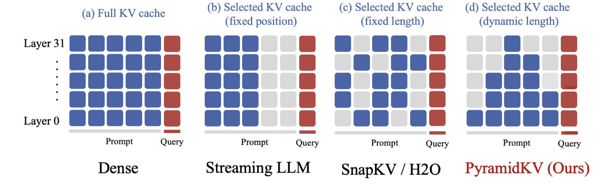

# PyramidKV: Dynamic KV Cache Compression based on Pyramidal Information Funneling

> Zefan Cai, Yichi Zhang, Bofei Gao, Yuliang Liu, Yucheng Li, Tianyu Liu, Keming Lu, Wayne Xiong, Yue Dong, Junjie Hu, Wen Xiao

## Abstract

In this study, we investigate whether attention-based information flow inside large language models (LLMs) is aggregated through noticeable patterns for long context processing. Our observations reveal that LLMs aggregate information through Pyramidal Information Funneling where attention is scattering widely in lower layers, progressively consolidating within specific contexts, and ultimately focusing on critical tokens (a.k.a massive activation or attention sink) in higher layers. Motivated by these insights, we developed PyramidKV, a novel and effective KV cache compression method. This approach dynamically adjusts the KV cache size across different layers, allocating more cache in lower layers and less in higher ones, diverging from traditional methods that maintain a uniform KV cache size. Our experimental evaluations, utilizing the LongBench benchmark, show that PyramidKV matches the performance of models with a full KV cache while retaining only 12% of the KV cache, thus significantly reducing memory usage. In scenarios emphasizing memory efficiency, where only 0.7% of the KV cache is maintained, PyramidKV surpasses other KV cache compression techniques, achieving up to a 20.5 absolute accuracy improvement on TREC dataset. In the Needle-in-a-Haystack experiment, PyramidKV outperforms competing methods in maintaining long-context comprehension in LLMs; notably, retaining just 128 KV cache entries enables the LLAMA-3-70B model to achieve 100.0 Acc. performance.

---

*以下总结由 MiMo 生成：*

这篇论文针对大语言模型（LLM）长上下文处理中KV缓存内存开销大的问题，提出了一种基于金字塔信息漏斗的动态KV缓存压缩方法PyramidKV。该方法通过观察LLM注意力在不同层级的聚合模式，动态调整各层KV缓存大小（低层分配更多，高层分配更少），而非传统方法的统一大小。实验表明，PyramidKV在仅保留12% KV缓存时性能与全缓存模型相当，显著降低内存使用；在极端内存效率场景（0.7%缓存）下，相比其他压缩技术在TREC数据集上提升高达20.5绝对准确度，并在长上下文理解任务中表现优异。
