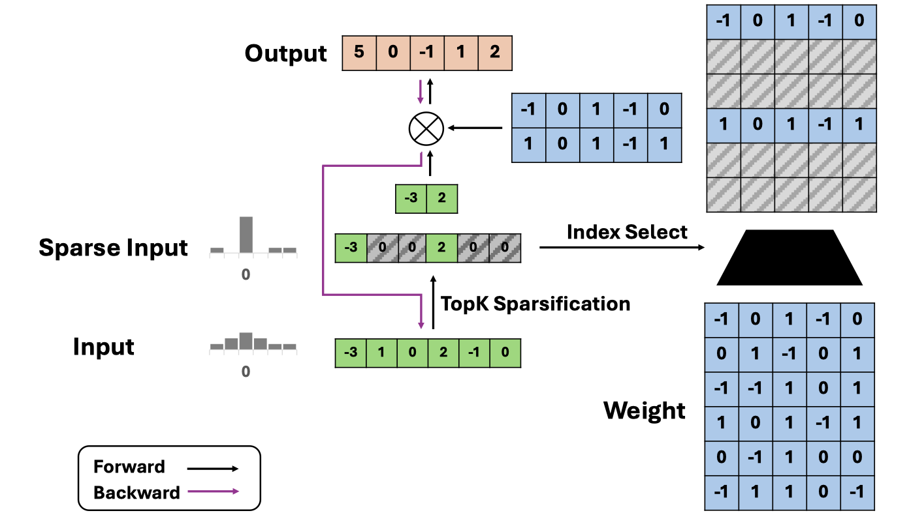

# Q-Sparse: All Large Language Models can be Fully Sparsely-Activated

## 一句话总结

Q-Sparse 通过对激活向量进行 Top-K 稀疏化并结合直通估计器（STE）训练，实现了大型语言模型的完全稀疏激活，在保持与密集基线相当性能的同时大幅降低推理时的计算量和内存带宽需求，并提出了适用于稀疏激活 LLM 的推理最优缩放定律。

## 摘要翻译

本文提出了 Q-Sparse，一种简单而有效的训练稀疏激活大语言模型（LLM）的方法。Q-Sparse 能够实现 LLM 激活的完全稀疏化，从而在推理阶段带来显著的效率提升。其核心技术是通过 Top-K 稀疏化对激活进行处理，并使用直通估计器（Straight-Through Estimator, STE）来解决训练中的梯度问题。本文的主要成果包括：（1）Q-Sparse 在推理时更加高效，同时能够达到与基线 LLM 相当的性能；（2）提出了适用于稀疏激活 LLM 的推理最优缩放定律（inference-optimal scaling law）；（3）Q-Sparse 在多种设置下均有效，包括从头训练（training-from-scratch）、对现有 LLM 的继续训练（continue-training）以及微调（finetuning）；（4）Q-Sparse 适用于全精度和 1-bit LLM（如 BitNet b1.58）。特别是 BitNet b1.58 与 Q-Sparse 的协同作用（可结合 MoE）为未来 LLM 的效率革命（包括成本和能耗）提供了基石和清晰路径。

## 研究动机

大型语言模型（LLM）在自然语言处理任务上取得了卓越性能，但其部署面临高计算成本和高内存占用的挑战，尤其是推理阶段。现有加速方法包括量化、剪枝、蒸馏和更好的解码策略等，但它们各有局限：

1. **权重剪枝的局限性**：非结构化权重稀疏难以在 GPU 上高效并行，而结构化权重稀疏对模型精度影响较大。
2. **激活稀疏的局限性**：现有方法如 MoE、修改激活函数、预测稀疏位置等，无法实现激活的完全稀疏化，限制了推理阶段的效率提升。
3. **稀疏 LLM 缺乏缩放定律**：与密集模型相比，稀疏激活 LLM 的缩放规律尚未被充分研究，缺少指导模型设计的理论基础。

因此，本文提出 Q-Sparse，旨在探索 LLM 中稀疏性的全部潜力，通过完全激活稀疏化和推理最优缩放定律来指导模型训练和部署。

## 方法（技术细节）

### 1. Top-K 稀疏化

Q-Sparse 在 Transformer 架构中的线性投影（矩阵乘法）上引入 Top-K 稀疏化函数。原始线性投影为：

$$Y = X \cdot W^T$$

Q-Sparse 修改为：

$$Y = (X \odot M) \cdot W^T$$

其中 $M = \text{Topk}(|X|)$ 是掩码张量，保留输入张量 X 中绝对值最大的 K 个元素。稀疏化后，通过 L2 范数重新缩放张量以减少零值附近的间隔。

### 2. 量化 Top-K 稀疏化

Q-Sparse 还引入量化版本，兼容 1-bit LLM（如 BitNet b1.58）。量化公式为：

$$Q(X) = \text{RoundClip}\left(\frac{X}{\gamma + \epsilon}, -128, 127\right)$$

其中 $\gamma = \max(|X|)$。对于 1-bit 模型，权重也会被量化为 1.58-bit 表示。

### 3. Squared ReLU 激活函数

为进一步提高激活的稀疏性，Q-Sparse 在前馈层（FFN）中使用 Squared ReLU 函数：$\text{ReLU}(X)^2$。结合 GLU 机制定义为：

$$\text{ReLU2GLU}(X) = XW_{\text{up}}^T \odot \text{ReLU}^2(XW_{\text{gate}}^T)$$

### 4. 直通估计器（STE）

传统反向传播在稀疏函数中会将非激活元素的梯度置零，导致梯度消失问题（尤其在高稀疏率时）。Q-Sparse 使用直通估计器（Straight-Through Estimator）来解决此问题：

- **标准反向传播**：$\frac{\partial Y}{\partial X} = \frac{\partial Y}{\partial (X \odot M)} \odot M$（梯度被截断）
- **STE**：$\frac{\partial Y}{\partial X} = \frac{\partial Y}{\partial (X \odot M)}$（梯度直接传递，不被截断）

实验表明，STE 显著缓解了梯度消失问题，特别是在模型底部层。

### 5. 推理最优缩放定律

论文推导了稀疏激活 LLM 的缩放定律，其形式为：

$$L(N, S) = E + A(S) \cdot N^{-\alpha}$$

其中 $A(S) = B + C \exp\left(\frac{\beta}{1-S}\right)$。由此得到推理最优缩放定律，表明在相同推理计算预算下，稀疏模型性能优于密集基线。对于全精度模型，最优稀疏率为 45.58%（1.84 倍激活参数）；对于 1.58-bit 模型，最优稀疏率为 61.25%（2.58 倍激活参数）。

## 实验结果

### 1. 从头训练（Training-from-Scratch）

- 在 Redpajama 数据集上训练 50B tokens，模型规模从 300M 到 7B。
- Q-Sparse 以 40% 稀疏率达到了与密集基线相当的性能。
- BitNet b1.58 + Q-Sparse 组合在相同推理计算预算下优于纯 BitNet 基线。

### 2. 继续训练（Continue-Training）

- 在 Mistral 7B 上继续训练 40B tokens（FineWeb-Edu 数据集）。
- 与 ReLUfication 和 dReLU Sparsification 方法对比：
  - **Q-Sparse (2.9B 激活参数)**：平均得分 61.7，超过 ReLUfication (60.8) 和 dReLU (61.0)
  - **Q-Sparse (3.8B 激活参数)**：平均得分 63.7，接近密集基线 7B (64.6)
  - Q-Sparse 整体稀疏率达到 58.2%（2.9B 激活）和 45.7%（3.8B 激活），远高于 ReLUfication (28.3%) 和 dReLU (23.0%)。

### 3. 监督微调（Supervised Finetuning）

- 在 Open-Orca 数据集上微调 Mistral 7B 和 Qwen1.5 7B。
- Q-Sparse (3.6B 激活参数) 显著优于 Qwen1.5-4B (3.2B 激活)，接近 Qwen1.5-7B。
- Q-Sparse (3.8B 激活参数) 与 Mistral-7B 性能接近（65.9 vs 66.8）。

### 4. 消融实验

- Top-K + STE 显著优于 Top-K 无 STE 和 ReLU 替代方案。
- 无 STE 时梯度严重消失，ReLU 方案的稀疏率随训练下降。

## 优势

1. **完全激活稀疏化**：Q-Sparse 实现了 LLM 激活的完全稀疏化，而非仅部分稀疏，从而最大化推理效率。
2. **推理最优缩放定律**：首次提出适用于稀疏激活 LLM 的推理最优缩放定律，为模型设计提供理论指导。
3. **广泛的适用性**：Q-Sparse 在从头训练、继续训练和微调三种设置下均有效，且兼容全精度和 1-bit 模型。
4. **与 BitNet b1.58 的协同**：Q-Sparse 与 1-bit 量化模型（BitNet b1.58）的结合可进一步降低推理成本和能耗。
5. **与 MoE 正交**：Q-Sparse 可与 Mixture-of-Experts（MoE）无缝集成，实现更高效的稀疏激活。
6. **STE 解决梯度消失**：通过直通估计器有效缓解了高稀疏率下的梯度消失问题。
7. **可扩展性**：缩放定律表明，随着模型规模增大，稀疏模型与密集基线的性能差距逐渐缩小。

## 局限

1. **缺乏真实加速实验**：论文未报告实际的推理加速比和系统层面的性能提升（如实际推理时间、吞吐量等）。
2. **批量模式兼容性差**：当前 Q-Sparse 实现不友好于批量训练和推理，作者指出正在改进。
3. **硬件实现未验证**：虽然理论上 Top-K 稀疏化可降低计算量，但未在实际硬件（如 GPU、专用加速器）上验证加速效果。
4. **数据集和模型规模有限**：实验主要在 300M-7B 规模的模型上进行，缺乏更大规模模型（如 70B+）的验证。
5. **缺乏代码开源**：论文中未提供开源代码，限制了社区的复现和进一步研究。
6. **训练成本增加**：虽然推理效率提升，但训练过程中 Top-K 操作和 STE 可能引入额外的计算开销。

## 与 EfficientPaper 相关的研究方向

Q-Sparse 与 EfficientPaper 项目中关注的高效 AI 研究方向高度相关，主要涉及以下领域：

1. **量化（Quantization）**：Q-Sparse 与 BitNet b1.58 的结合是量化领域的重要进展，展示了 1-bit 量化与激活稀疏化的协同效应。
2. **稀疏剪枝（Sparse Pruning）**：Q-Sparse 的 Top-K 激活稀疏化是一种新型稀疏化方法，与传统权重剪枝形成互补。
3. **激活稀疏（Activation Sparsity）**：Q-Sparse 是激活稀疏领域的代表性工作，与 ReLUfication、dReLU Sparsification、Deja Vu 等方法构成该领域的研究谱系。
4. **缩放定律（Scaling Laws）**：Q-Sparse 提出的推理最优缩放定律为稀疏 LLM 的设计提供了理论基础，是 LLM 缩放研究的重要延伸。
5. **Mixture-of-Experts（MoE）**：Q-Sparse 可与 MoE 结合，进一步提升稀疏激活 LLM 的效率。
6. **1-bit LLM**：Q-Sparse 与 BitNet b1.58 的协同为 1-bit LLM 的实际应用提供了新的可能性。

## AI 生成声明

> **声明**：本笔记由 AI Agent 自动生成，内容基于对论文 Q-Sparse 的 PDF 文本提取和分析。笔记中的摘要翻译、研究动机、方法描述、实验结果和优劣势分析均由 AI 整理而成，可能存在遗漏或不完全准确之处，请以原始论文为准。本笔记仅供学习和参考使用，不构成对论文内容的权威解读。

*生成时间：2026-06-05*
*模型：AI Agent (Hermes Agent)*
*基于论文：Q-Sparse: All Large Language Models can be Fully Sparsely-Activated (arXiv:2407.10969v1, 2024)*
