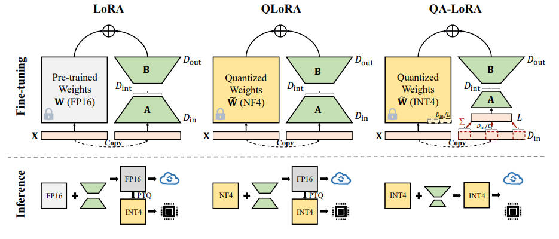

# QA-LoRA: Quantization-Aware Low-Rank Adaptation of Large Language Models



> **生成声明**：本 note 由 AI Agent 自动生成（Hermes Agent），基于 arXiv 论文 PDF 全文阅读与分析，生成时间：2026-06-05。

---

## 一句话总结

QA-LoRA 通过分组量化与低秩适配的平衡设计，实现了大语言模型在微调和推理阶段同时兼顾量化效率与适配精度的统一，无需后训练量化即可直接部署量化模型。

---

## 摘要翻译

近年来，大语言模型（LLM）发展迅速。尽管在多种语言理解任务中表现出色，但沉重的计算负担极大地限制了 LLM 的应用，尤其是在边缘设备上部署时。本文提出了一种量化感知低秩适配（QA-LoRA）算法。其动机在于量化和适配之间的自由度不平衡，解决方案是使用分组操作：增加量化自由度的同时减少适配自由度。QA-LoRA 仅需几行代码即可实现，它赋予原始 LoRA 两方面的能力：（1）微调时，LLM 权重被量化（如 INT4）以减少时间和内存使用；（2）微调后，LLM 和辅助权重自然融合为量化模型，无精度损失。作者在 LLaMA 和 LLaMA2 模型家族上验证了 QA-LoRA 在不同微调数据集和下游场景中的有效性。

---

## 研究动机

大语言模型的部署面临两大挑战：

1. **参数高效微调（PEFT）**：LoRA 等方法通过低秩矩阵补充预训练权重，实现参数高效微调，但在大模型（如 LLaMA-65B）上内存开销仍然较大。
2. **参数量化**：将权重压缩为低比特整数/浮点数，但低位宽下精度损失严重。

将 PEFT 与量化结合时，存在一个核心矛盾：**量化自由度与适配自由度的不平衡**。具体来说，预训练权重矩阵的每一列仅有一对缩放/零点参数（量化参数），但 LoRA 的适配参数远多于此。这种不平衡导致：
- 量化误差大（影响精度）
- 微调后的辅助权重难以融合回量化模型

QLoRA 虽然在微调阶段实现了量化，但微调后必须将辅助权重融合回 FP16，无法保持量化状态，导致推理效率低下且需要后训练量化（PTQ），精度进一步损失。

---

## 方法（技术细节）

### 核心思想：分组量化 + 低秩适配的平衡

QA-LoRA 的核心在于通过**分组操作**同时调整量化和适配的自由度：

1. **量化侧**：将每列权重划分为 L 个组，每组独立使用缩放因子 α 和零点 β（量化参数从 D_out 增加到 L × D_out），提升量化自由度。
2. **适配侧**：LoRA 的矩阵 A 从 D_in × D_int 变为 L × D_int（因为输入向量 x 先经 AvgPool1d 降维到 L 维），减少适配自由度。

### 数学形式

- **标准量化**：$\tilde{W} = \alpha \cdot \lfloor \frac{W - \beta}{\alpha} \rceil + \beta$，每列一组 (α, β)。
- **分组量化**：每列的 D_in 个元素分为 L 组，每组 D_in/L 个元素使用独立的 (α, β)。
- **LoRA 适配**：输入 x 先通过 AvgPool1d(D_in/L) 降维，然后与 A (L × D_int) 相乘，降低 A 的参数量。

### 关键公式（微调时）

```
result = x @ W_tilde + (QA(x) * (D_in//L)) @ lora_A^T @ lora_B^T * s
```

其中 QA 是 AvgPool1d 操作（分组求均值）。

### 融合方式

微调完成后，辅助权重可直接融合到量化权重中（更新 β）：

```
beta_new = beta - s * (lora_B @ lora_A)^T / alpha
```

这保证融合后的权重仍保持 INT4 量化形式，无需 PTQ。

### 与 QLoRA 的对比

| 方法 | 微调权重精度 | 推理权重精度 | PTQ 需求 | 推理速度 |
|------|-------------|-------------|---------|---------|
| LoRA | FP16 | FP16 | 无 | 慢 |
| QLoRA | NF4 + FP16 | FP16 | 需要 | 慢 |
| QA-LoRA | INT4 | INT4 | 不需要 | 快 |

---

## 实验结果

### 数据集与设置
- **模型**：LLaMA（7B/13B/33B/65B）和 LLaMA2（7B/13B）
- **评测基准**：MMLU（5-shot/0-shot）、Commonsense QA（HellaSwag, PIQA, WinoGrande, ARC, BoolQ, OBQA）
- **微调数据集**：Alpaca（52K）、FLAN v2（320K 子集）
- **量化方式**：GPTQ（group-wise asymmetric，group size 32）
- **硬件**：Tesla V100 GPU

### 主要结果（MMLU 5-shot 平均准确率）

**LLaMA-7B + Alpaca**：
| 方法 | INT4 | INT3 | INT2 |
|------|------|------|------|
| QLoRA (4+16) | 38.4 | — | — |
| QLoRA w/ GPTQ | 36.0 | 34.0 | 25.8 |
| QA-LoRA | **39.4** | **37.4** | **27.5** |

**LLaMA-33B + FLAN v2**：
| 方法 | INT4 | INT3 | INT2 |
|------|------|------|------|
| QLoRA (4+16) | 60.0 | — | — |
| QLoRA w/ GPTQ | 59.8 | 58.5 | 46.1 |
| QA-LoRA | **60.6** | **58.9** | **52.4** |

**LLaMA-65B + FLAN v2**：
| 方法 | INT4 | INT3 | INT2 |
|------|------|------|------|
| QLoRA (4+16) | 63.9 | — | — |
| QLoRA w/ GPTQ | 63.5 | 63.0 | 54.3 |
| QA-LoRA | **62.1** | **63.6** | **58.0** |

### 关键发现
1. **QA-LoRA 在所有比特宽度和模型规模上均优于 QLoRA w/ GPTQ**，优势在低比特（2-bit/3-bit）和小模型上更显著。
2. **QA-LoRA 与原始 QLoRA（FP16）精度相当**，但推理速度快 50% 以上（因为推理权重为 INT4 而非 FP16）。
3. **训练效率**：QA-LoRA 的可学习参数量约为 QLoRA 的 55%（如 LLaMA-7B：89M vs 160M），训练时间约为 50%（21.5h vs 40.0h）。
4. **Commonsense QA**：2-bit QA-LoRA 在 LLaMA-7B 上比 2-bit QLoRA w/ GPTQ 高 15.0%（53.7 vs 38.7）。
5. **分组大小影响**：group size 32（即 L=128/32）通常精度最佳，尤其在低比特下优势明显。
6. **LLaMA2 验证**：QA-LoRA 在 LLaMA2-7B/13B 上同样有效，用 FLAN v2 微调的 INT4 模型甚至优于 FP16 原始模型。

---

## 优势

1. **双向效率提升**：微调阶段使用 INT4 量化，推理阶段权重仍为 INT4，无需 PTQ，避免精度损失。
2. **实现简单**：仅需在 LoRA 基础上插入/修改几行代码（AvgPool1d + 参数维度调整）。
3. **参数更少**：可学习参数量约为 QLoRA 的 55%，训练时间约为 50%。
4. **推理更快**：推理速度比 QLoRA（FP16）快 50% 以上。
5. **广泛适用**：适用于 LLaMA/LLaMA2 系列，支持 2-bit/3-bit/4-bit 量化。
6. **低比特优势显著**：在 2-bit 量化下优势最为突出（如 Commonsense QA 提升 15%）。
7. **无需 PTQ**：微调后直接部署，避免 PTQ 带来的精度损失。

---

## 局限

1. **仅支持权重量化**：论文未涉及激活值量化，实际部署中可能存在激活值精度瓶颈。
2. **分组大小需调优**：group size（L 的选择）对精度有影响，需要额外超参数搜索。
3. **仅验证 LLaMA 系列**：未在其他模型架构（如 GPT、OPT、BLOOM 等）上验证，泛化能力有待进一步确认。
4. **低比特下的精度损失**：虽然优于 QLoRA w/ GPTQ，但 2-bit 量化仍存在显著精度损失（如 MMLU 0-shot 约 25-30%）。
5. **训练依赖 INT4 算子**：需要 CUDA 优化的 INT4 运算支持，可能在某些硬件上不可用。
6. **未考虑多模态场景**：仅在语言模型上验证，视觉-语言模型等场景未涉及。

---

## 与 EfficientPaper 相关的研究方向

1. **量化感知训练（QAT）**：QA-LoRA 可视为一种量化感知微调方法，与 QAT（如 LLM-QAT）形成互补。
2. **低秩适配（LoRA）家族**：QA-LoRA 是 LoRA 与量化的结合，与 QLoRA、LoRA、Adapter 等方法形成完整的技术谱系。
3. **模型压缩与部署**：在边缘设备部署大模型时，QA-LoRA 提供了微调+量化+推理的统一方案，可与剪枝、蒸馏等方法结合。
4. **参数高效微调（PEFT）**：QA-LoRA 是 PEFT 的一种变体，与其他 PEFT 方法（Prefix-Tuning、Adapter 等）可进行对比分析。
5. **分组量化技术**：分组量化在 AWQ、GPTQ 等方法中有广泛应用，QA-LoRA 将其引入适配阶段，可能启发后续研究。
6. **INT4/INT2 量化**：低比特量化（2-bit/3-bit）是当前研究热点，QA-LoRA 在低比特下的优势表明量化感知适配的重要性。
7. **LLM 推理优化**：QA-LoRA 的推理效率优势可与 TensorRT、vLLM 等推理框架结合，进一步加速部署。
8. **多模型家族验证**：QA-LoRA 在 LLaMA/LLaMA2 上验证有效，可扩展到其他模型（如 Mistral、Phi 等）。
9. **量化与适配的平衡**：QA-LoRA 的核心思想——量化自由度与适配自由度的平衡——可能启发更多联合优化方法。
10. **开源生态**：QA-LoRA 提供了开源代码（GitHub: yuhuixu1993/qa-lora），可作为 EfficientPaper 的实践案例。
