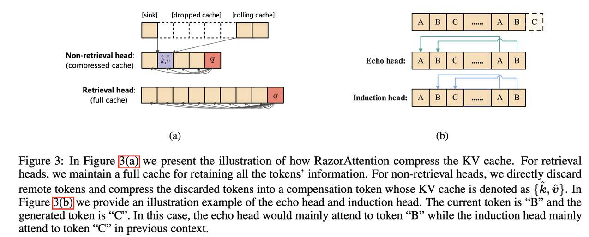

# RazorAttention: Efficient KV Cache Compression Through Retrieval Heads

> Hanlin Tang, Yang Lin, Jing Lin, Qingsen Han, Shikuan Hong, Yiwu Yao, Gongyi Wang
> 华为技术有限公司 (Huawei Technologies Co., Ltd)



## 一句话总结

RazorAttention 是一种无需训练的 KV 缓存压缩算法，通过区分"检索头"和"非检索头"对注意力头进行差异化缓存管理，并引入补偿令牌（compensation token）进一步恢复被丢弃令牌的信息，在实现 70% 以上 KV 缓存压缩的同时，几乎不损失模型性能，且与 FlashAttention 完全兼容。

## 摘要翻译

KV 缓存的内存和计算需求给长上下文语言模型的部署带来了重大挑战。以往的方法试图通过选择性丢弃令牌来缓解这一问题，但这些方法不可逆地擦除了未来查询可能需要的关键信息。本文提出了一种新颖的 KV 缓存压缩技术，能够保留所有令牌信息。研究发现：(i) 大多数注意力头主要关注局部上下文；(ii) 只有少数被称为"检索头"的注意力头能够实质性地关注所有输入令牌。这些关键发现促使我们为不同的注意力头采用不同的缓存策略。因此，我们提出了 RazorAttention——一种无需训练的 KV 缓存压缩算法，它为重要的检索头维护完整的缓存，同时丢弃非检索头中的远端令牌。此外，我们引入了一种"补偿令牌"机制来进一步恢复被丢弃令牌的信息。在多种大型语言模型上的广泛评估表明，RazorAttention 能够将 KV 缓存大小减少 70% 以上，且对性能无明显影响。此外，RazorAttention 与 FlashAttention 兼容，使其成为一种高效的即插即用解决方案，无需开销或重新训练即可提升 LLM 推理效率。

## 研究动机

随着长上下文大语言模型（LLM）的发展，KV 缓存的内存消耗随输入长度增长而急剧膨胀，成为部署的主要瓶颈。现有的 KV 缓存压缩方法（如量化、token 丢弃、局部注意力等）存在明显的局限性：

1. **重要性丢弃方法的根本缺陷**：H2O、SnapKV 等方法基于重要性评分丢弃不重要的令牌，但这种方法隐含地假设"不重要的令牌在未来的查询中也不会被需要"。在实际场景中，用户可能查询与文本主题不直接相关的信息，或者在多轮对话中查询上下文的不同部分。在这种情况下，重要性丢弃方法会导致严重性能下降。

2. **与 FlashAttention 不兼容**：之前的重要性 token 丢弃方法依赖注意力权重来计算重要性分数，无法与 FlashAttention 结合使用，使其在实际实现中不切实际。

3. **关键科学问题**：作者提出了一个核心问题——"我们能否找到一种方法，在不丢失语义信息的情况下减少 KV 缓存大小？"

4. **"检索与处理"机制的发现**：研究发现 LLM 在处理长上下文时存在"检索与处理"（retrieve and process）机制——少数"检索头"能有效地从整个输入中检索信息，而其余头主要关注局部上下文。这一发现为设计差异化的缓存策略提供了理论基础。

## 方法（技术细节）

RazorAttention 的核心思想是对不同的注意力头采用不同的 KV 缓存管理策略。具体方法如下：

### 1. ALiBi 模型的 RazorAttention

对于使用 ALiBi 位置编码的模型，注意力头 h 的注意力分数计算为：

```
S_{m→n}(q; k) = q_m k_n^T - l_h (m - n)
```

其中 l_h 是头特定的斜率。当位置偏差 l_h(m-n) 显著主导注意力分数时，远端令牌的注意力权重衰减为零。

**定理 1**：对于使用 ALiBi 编码的注意力头，当 q_m 与 k_n 之间的距离超过 C_0 时，注意力权重不超过 ε（如 0.1%）。有效注意力范围 L_h 可通过公式计算：

```
L_h = 2 ||W_Q^h W_K^h||_2 (||γ||_2 + ||b||_2) * (-log(ε)) / l_h
```

因此，对于 ALiBi 模型，检索头是具有较大 L_h 的头，而非检索头的 L_h 较小。

### 2. RoPE 模型的 RazorAttention

对于使用 RoPE 位置编码的模型，注意力分数为：

```
S_{m→n}(q; k) = q_m k_n^T, q_m = R_m q, k_n = R_n k
```

尽管 RoPE 编码本身并不暗示长距离注意力衰减，但实验发现：
- 大多数注意力头保持有限的注意力范围
- 约 15% 的头（检索头）能够有效利用长距离信息
- 保护检索头的 KV 缓存可保留大部分性能（准确率下降仅 1.5%）
- 丢弃非检索头的远端令牌仅导致约 1.5% 的性能下降

### 3. 补偿令牌（Compensation Token）

为了进一步恢复被丢弃令牌的信息，设计了轻量级的补偿令牌：

```
k̂ = (1/N_d) Σ_{m∈{D}} k_m
v̂ = (1/N_d) Σ_{m∈{D}} v_m
```

其中 {D} 是被丢弃令牌的索引集合，N_d 是被丢弃令牌的数量。补偿令牌将被丢弃的 KV 缓存压缩为一个令牌。使用补偿令牌的注意力输出计算为：

```
Attn(q_m, {K, k̂}, {V, v̂}) = [N_d exp(q_m k̂^T) v̂ + Σ_{n∉{D}} exp(q_m k_n^T) v_n] / [N_d exp(q_m k̂^T) + Σ_{n∉{D}} exp(q_m k_n^T)]
```

### 4. 检索头的识别方法

对于 RoPE 模型，需要识别两类关键的检索头：
- **Echo 头（回声头）**：倾向于关注与当前令牌相同的前一个令牌（回声令牌）
- **Induction 头（归纳头）**：倾向于关注在前文语境中紧随当前令牌出现的前一个令牌

识别方法：生成 K 个随机令牌（如 K=2500），重复 4 次作为模型输入，计算每个头的 echo score 和 induction score。选择 top-14% 的归纳头和 top-1% 的回声头作为检索头。

### 5. 算法流程（Algorithm 1）

输入：非检索头集合 {H}，原始 KV 缓存，压缩比 C，压缩阈值 S_0，sink token 数量 N_0。

1. 对于每个非检索头 h ∈ {H}：
   - 计算缓冲长度 L_h = max(S_0, N/C)，其中 N 是令牌数量
   - 仅保留输出附近的最近 L_h 个令牌和前 N_0 个 sink token
   - 将丢弃的令牌压缩为补偿令牌
2. 非检索头使用补偿令牌计算注意力，检索头使用原始注意力

### 关键超参数

| 超参数 | 设置 |
|--------|------|
| 缓冲长度 | max(4000, N/5) |
| 归纳头保护比例 | top 14% |
| 回声头保护比例 | top 1% |
| Sink token 数量 | 4 |

在长上下文输入下可实现 3.125 倍的 KV 缓存压缩。

## 实验结果

### LongBench 评估

在 Qwen1.5-7B-Chat、Qwen1.5-72B-Chat、Llama3-8B-Instruct 和 Baichuan2-13B 上进行了全面评估，包含 NrtvQA、Qasper、MF-en、MF-zh、HotpotQA、2WikiMQA、Musique、GovReport、QMSum、MultiNews、VCSUM、TREC、TriviaQA、LSHT、Lcc 等 15 个任务。

**关键结果**：
- **Qwen1.5-7B-Chat**：RazorAttention 平均分数 35.87，接近原始模型 36.03，远超 StreamingLLM (17.00) 和 H2O (34.16)
- **Qwen1.5-72B-Chat**：RazorAttention 平均分数 45.97，接近原始模型 46.15，远超 StreamingLLM (22.29) 和 H2O (44.29)
- **Llama3-8B-Instruct**：RazorAttention 平均分数 34.86，接近原始模型 35.44，远超 StreamingLLM (9.86) 和 H2O (32.89)
- **Baichuan2-13B**：RazorAttention 平均分数 36.45，接近原始模型 36.41，远超 StreamingLLM (16.27) 和 H2O (35.69)

RazorAttention 在所有模型上均显著优于 StreamingLLM 和 H2O，性能接近无压缩基线。

### Needle In A Haystack 评估

使用 Llama2-7B-80K（上下文长度 80K）进行测试：
- RazorAttention 在所有序列长度（4K-64K）上均能准确回忆查询信息
- H2O 在长输入下性能严重退化，且与 FlashAttention 不兼容导致 OOM 错误
- 在 Qwen1.5-7B-Chat 上，RazorAttention 在 80K 上下文中的表现与原始模型相当

### 消融实验

1. **Echo 头的重要性**：仅添加 1% 的回声头即可显著提升检索性能
2. **归纳头数量**：随着保护的归纳头数量增加，准确率持续提升（5%→69.54%，14%→86.59%，基线87.05%）
3. **补偿令牌的必要性**：补偿令牌对于恢复被截断 KV 缓存引入的信息损失至关重要，去除补偿令牌会导致明显的性能下降

## 优势

1. **无需训练（Training-free）**：RazorAttention 是一种无需训练的算法，无需对原始模型进行微调或重新训练，可直接应用于现有模型。

2. **高压缩率与低性能损失**：实现 70% 以上的 KV 缓存压缩，性能损失极小，在多个模型和任务上接近无压缩基线。

3. **与 FlashAttention 兼容**：与之前的重要性 token 丢弃方法不同，RazorAttention 不使用注意力图作为指标，因此与 FlashAttention 完全兼容，压缩开销可忽略不计。

4. **即插即用（Plug-and-play）**：无需额外开销或重新训练，可作为即插即用解决方案增强 LLM 推理效率。

5. **广泛的模型兼容性**：在 Qwen、Llama-2、Llama-3、Baichuan 等多种模型上均有效，支持 RoPE 和 ALiBi 两种位置编码，也支持 GQA 模型。

6. **理论支撑**：方法设计有严格的理论基础，包括注意力范围上界定理和补偿令牌的信息恢复证明。

7. **保留所有语义信息**：与重要性丢弃方法不同，RazorAttention 通过保留检索头的完整 KV 缓存，确保所有语义信息不丢失，解决了"查询不相关主题信息"时的失败问题。

## 局限

1. **理解机制不足**：尚不清楚为什么注意力头的行为如此不同，以及检索头在长上下文中如何运作。

2. **压缩率可进一步提升**：虽然已实现 70% 的 KV 缓存减少，但作者认为这一数字还可以进一步提高。

3. **模型特定配置**：不同模型的最优配置可能不同，需要调整检索头的数量，这意味着需要更多或更少的检索头。

4. **无法处理所有查询类型**：尽管 RazorAttention 能保留所有语义信息，但在某些极端情况下（如需要精确访问长距离信息的查询），性能仍可能有所下降。

5. **缺乏开源代码**：论文未提供开源代码实现，增加了复现难度。

## 与 EfficientPaper 相关的研究方向

RazorAttention 属于 **KV 缓存稀疏化（kv_cache_sparse）** 研究方向，与 EfficientPaper 项目中的以下研究方向密切相关：

1. **KV 缓存压缩**：与 H2O（Heavy-Hitter Oracle）、StreamingLLM 等 token 丢弃方法形成对比，提供了基于注意力头分析的新范式。
2. **LLM 推理效率优化**：通过减少内存占用和计算量提升推理速度，与量化（如 KIVI、KVQuant）等方法互补。
3. **长上下文处理**：与 LongBench 基准和 Needle In A Haystack 测试密切相关，属于长上下文 LLM 优化的重要方向。
4. **注意力机制可解释性**：基于注意力头的行为分析（回声头、归纳头），揭示了 LLM 处理长上下文的"检索与处理"机制。
5. **无训练优化**：与需要微调的方法不同，RazorAttention 提供了一种无需训练的轻量级解决方案，适合快速部署。
6. **FlashAttention 集成**：作为与 FlashAttention 兼容的压缩方法，可与现有推理框架无缝集成。

## 参考信息

- **论文链接**：[arXiv:2407.15891](http://arxiv.org/abs/2407.15891v1)
- **作者**：Hanlin Tang, Yang Lin, Jing Lin, Qingsen Han, Shikuan Hong, Yiwu Yao, Gongyi Wang
- **机构**：Huawei Technologies Co., Ltd
- **年份**：2024
- **关键词**：kv_cache_sparse
- **基线方法**：StreamingLLM, H2O

---

**AI 生成声明**：本笔记由 AI Agent（Hermes Agent）自动生成，基于论文 PDF 文本提取和元数据分析。内容可能包含不准确或简化之处，建议读者参考原始论文以获取完整和准确的信息。
