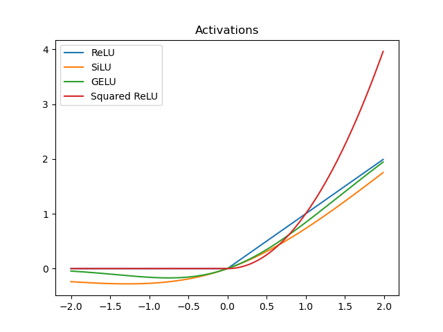

# $ReLU^2$ Wins: Discovering Efficient Activation Functions for Sparse LLMs

> **⚠️ 本 note 由 AI Agent 自动生成（Hermes Agent），生成时间：2026-06-05。内容基于论文原文提取与中文整理，仅供参考。**

---

## 一句话总结

本文提出了一套系统性框架，从稀疏-性能权衡、可预测性和硬件亲和性三个维度评估不同激活函数在稀疏 LLM 推理中的表现，发现 **ReLU²** 在三个维度上均表现最优，是稀疏 LLM 最高效的激活函数。

---

## 摘要翻译

稀疏计算为低资源场景下大语言模型（LLM）的推理提供了一种有效的解决方案，通过动态跳过不活跃神经元的计算来提升效率。虽然传统方法主要关注基于 ReLU 的 LLM（利用激活值中的零），但本文将稀疏 LLM 的范围扩展到零激活值之外。我们引入了一种通用方法，通过神经元输出幅度和自定义的幅度阈值来定义神经元激活状态，证明非 ReLU 的 LLM 同样表现出稀疏激活的特性。为找到稀疏计算最高效的激活函数，我们提出了一个系统性框架，从三个方面考察 LLM 的稀疏性：稀疏与性能之间的权衡、稀疏的可预测性以及硬件亲和性。我们在使用不同激活函数（包括 ReLU、SwiGLU、ReGLU 和 ReLU²）的 LLM 上进行了全面实验。结果表明，使用 ReLU² 的模型在所有三个评估方面均表现最优，突显了其作为稀疏 LLM 高效激活函数的潜力。

---

## 研究动机

### 1. LLM 推理的资源瓶颈
大语言模型在推理阶段需要大量的计算和存储资源，导致在低资源场景（如消费级 GPU）中难以部署。**稀疏计算**（sparse computation）是解决这一问题的重要方向——通过观察到 LLM 中存在稀疏激活现象（某些神经元对给定输入的贡献极弱），可以跳过这些不活跃神经元的计算来降低开销。

### 2. 已有研究的局限
- 传统稀疏激活研究**仅聚焦于 ReLU 激活函数**，利用激活值为零的特性进行稀疏化（如 LLM in a Flash、PowerInfer 等）。
- 对于非 ReLU 激活函数（如 LLaMA 使用的 SwiGLU/SiLU、Falcon 使用的 GELU），由于激活值不严格为零，**尚不清楚是否也存在稀疏激活现象**。
- 不同 ReLU 变体（ReLU、ReGLU、ReLU²）之间的稀疏特性差异也未被系统比较。

### 3. 核心问题
在多种激活函数中，**哪种激活函数最适合构建稀疏 LLM？** 作者认为，不仅需要考虑模型性能，还需要将**稀疏计算的效率**纳入考量，从而在保持性能的同时实现高效推理。

---

## 方法

### 1. 更通用的激活稀疏定义

传统方法仅关注激活值是否为零来定义"不活跃"神经元。本文提出基于**神经元输出幅度（output magnitude）**和**幅度阈值**的更通用定义：

- 对于 FFN 中的第 i 个神经元，其输出表示为 $n_i(x)$，幅度用 L2 范数衡量：$||n_i(x)||_2$
- 如果神经元的输出幅度小于阈值 $\epsilon$，则认为该神经元不活跃
- 引入**尾部截断累积误差（CETT）**来量化长尾神经元对 FFN 计算的影响：
  $$CETT(x) = \frac{||\sum_{i \in D} n_i(x)||_2}{||FFN(x)||_2}, \quad D = \{i \mid ||n_i(x)||_2 < \epsilon\}$$

**关键发现**：非 ReLU 的 LLM（如 LLaMA-2 使用 SiLU）同样存在稀疏激活——虽然激活值不为零，但神经元输出幅度呈长尾分布，大量神经元的输出幅度极小，可以安全跳过。CEET 实验表明，截断约 70% 的尾部神经元（稀疏率 0.7）仅导致 0.2 的累积误差。

### 2. 评估框架：三个关键因素

#### (1) 稀疏-性能权衡（Sparsity-Performance Trade-off）
- 通过调整幅度阈值控制稀疏率
- 在不同稀疏率下评估模型性能，找到最佳权衡
- **CETT 是一个良好的性能指标**：不同激活函数的性能曲线在 CETT=0.2 处出现拐点，低于此阈值时性能相对稳定，高于此阈值时性能显著下降

#### (2) 可预测性（Predictivity）
- 定义：在 FFN 计算之前，预测哪些神经元是活跃/不活跃的能力
- 使用轻量级两层神经网络预测器（大小约为 FFN 的 6%）
- 两个指标：
  - **召回率（Recall）**：正确预测的活跃神经元占总活跃神经元的比例
  - **预测稀疏率（Prediction Sparsity）**：预测的不活跃神经元占总神经元的比例
- 两种预测策略：
  - **Top-k 策略**：预测得分最高的 20% 神经元为活跃（预测稀疏率固定为 0.2）
  - **阈值策略**：预测得分大于 0.5 的神经元为活跃（更灵活，适用于低资源场景）

#### (3) 硬件亲和性（Hardware Affinity）
从两个角度分析：
- **Token 间计算关系**：相邻 token 激活神经元的重叠程度（复用率/Reuse Ratio），通过滑动窗口存储前一个 token 的活跃神经元参数实现缓存复用，减少 I/O 开销
- **神经元间计算关系**：高度共激活神经元对的频率差异（Top-average Co-activation Gap），可将高度共激活的神经元对绑定到连续内存地址，加速内存访问

### 3. 实验设置

- **1B 模型**：从头训练的 1.3B 参数模型，使用 SwiGLU、ReLU、ReGLU、ReLU² 四种激活函数
  - 架构类似 LLaMA-2，隐藏大小 2048，24 层，32 头，词表 32000
  - ReLU/ReLU² 中间隐藏维度 8192，ReGLU/SwiGLU 中间隐藏维度 5376（保证参数量相同）
  - 训练数据：SlimPajama + RefinedWeb 混合，共 1000 亿 token
  - 训练框架：llm-foundry，AdamW 优化器，学习率 3e-4，cosine 调度，64 张 A100-80G GPU
- **LLaMA-2 模型**：7B、13B、70B 规模，额外预训练了使用 ReGLU 的 LLaMA 变体
- **评估数据集**（1B 模型）：ARC（easy + challenging）、Winogrande、HellaSwag、TruthfulQA、LAMBADA、PIQA、OpenBookQA

---

## 实验结果

### 1. 训练动态
- ReLU 模型在训练过程中性能始终最差
- SwiGLU 和 ReGLU 的损失和性能轨迹高度相似（GLU 变体的内在一致性）
- ReLU² 在训练中期略落后于 GLU 模型，但在训练后期显著改善，最终性能与 SwiGLU/ReGLU 相当

### 2. 稀疏-性能权衡
- **ReLU² 在所有激活函数中实现最佳性能-稀疏权衡**：在相同稀疏率下，ReLU² 的 CETT 最低；在相同 CETT 下，ReLU² 的稀疏率最高
- 关键数据：**ReLU² 在稀疏率接近 95% 时，CETT 仅为 0.2**，是 ReLU 和 ReGLU 的约一半
- **CETT=0.2 是所有激活函数的通用性能拐点**，可作为经验最优阈值
- 稀疏率 0.95 时性能损失不超过 1%
- 模型规模越大（LLaMA-2 7B→70B），ReGLU 的稀疏率越高（稀疏特性随模型规模提升）

### 3. 可预测性
- **ReLU² 和 ReLU 具有最高的预测可预测性**
- Top-k 策略下：在相同稀疏率下，ReLU² 和 ReLU 的召回率高于 SwiGLU 和 ReGLU
- 阈值策略下：ReLU² 在预测召回率和预测稀疏率上均领先

### 4. 硬件亲和性
- **复用率**：ReLU² 在高激活率区域的复用率高于其他激活函数；扩大滑动窗口（1→5）可将整体复用率提高约 2 倍
- **共激活差距**：ReLU 变体的 top-average co-activation gap 约 0.2，高于 SwiGLU（约 0.1）；ReLU² 在第 8 层之后始终高于 ReLU 和 ReGLU

### 5. 综合对比（Table 1）

| 激活函数 | 高性能 | 高稀疏 | 高可预测性 | 硬件友好 |
|---------|--------|--------|-----------|---------|
| SwiGLU  | ✓      |        |           |         |
| ReGLU   | ✓      | ✓      |           |         |
| ReLU    | ✓      |        | ✓         | ✓       |
| **ReLU²** | **✓** | **✓** | **✓** | **✓** |

**只有 ReLU² 在全部四个维度上均为最优。**

### 6. 量化效率估算
- 1B ReLU² 模型基于预测稀疏率可减少 **56% 的总 FLOPs**，性能损失不到 1%
- FFN 的 I/O 开销可减少 **92%**（利用稀疏率和复用率）

---

## 优势

1. **通用的激活稀疏定义**：基于神经元输出幅度（而非严格零值），将稀疏激活的概念扩展到非 ReLU 激活函数
2. **系统性评估框架**：从稀疏-性能权衡、可预测性、硬件亲和性三个维度进行全面评估，逻辑严密
3. **CETT 作为通用指标**：提供了一种模型无关的、可量化的稀疏性评估工具，CETT=0.2 可作为经验阈值
4. **ReLU² 全面最优**：在性能、稀疏率、可预测性和硬件亲和性四个维度上均表现最优
5. **显著的效率提升**：56% FLOPs 减少 + 92% I/O 开销降低，性能损失不足 1%
6. **实验充分**：覆盖 1B 从头训练模型和 LLaMA-2 7B/13B/70B 规模，验证了结论的鲁棒性
7. **实用性强**：提出的方法可直接应用于现有稀疏推理框架（如 Deja Vu、PowerInfer、LLM in a Flash）

---

## 局限

1. **模型规模限制**：主要实验基于 1B 从头训练模型，7B/70B 规模仅验证了 ReGLU 的缩放行为，缺乏在大模型上对 ReLU² 的系统性缩放实验
2. **ReGLU 的 70B 预训练不充分**：70B ReGLU 模型性能比原始 SwiGLU LLaMA-2 低约 6%，作者承认是预训练数据不足导致的
3. **预测器的开销未深入讨论**：虽然提到预测器大小约为 FFN 的 6%，但对不同规模模型的预测器实际推理开销缺乏详细分析
4. **未与 MoE 方法进行直接对比**：虽然提到了 MoE 的关系，但未与 Mixture-of-Experts 方法进行直接的效率对比
5. **激活函数选择范围有限**：仅比较了 ReLU、SwiGLU、ReGLU、ReLU² 四种激活函数，未涵盖 GELU、SiLU 等当前 LLM 常用的激活函数
6. **1B 模型缺少热激活神经元现象**：1B 模型未观察到显著的热激活神经元，而 7B 模型中存在，原因不明
7. **缺乏推理框架的完整实现**：论文更多是分析框架和原理，未提供端到端的推理加速系统

---

## 与 EfficientPaper 相关的研究方向

### 直接相关
- **稀疏激活与推理加速**：本文是稀疏 LLM 推理的核心研究，直接关联 EfficientPaper 中的 `sparse_pruning` 和 `activation_sparsity` 关键词
- **激活函数设计**：ReLU² 作为一种高效的激活函数，可用于 EfficientPaper 中的 LLM 架构优化方向
- **条件计算（Conditional Computation）**：本文从神经元级别的条件计算角度，与 MoE（Mixture-of-Experts）方法形成互补

### 相关论文/方向
- **PowerInfer**（Song et al., 2023）：利用 ReLU 稀疏激活在消费级 GPU 上实现高效 LLM 推理
- **Deja Vu**（Liu et al., 2023）：利用上下文稀疏性加速 LLM 推理
- **LLM in a Flash**（Alizadeh et al., 2023）：在有限内存中高效推理 LLM
- **ReLU Strikes Back**（Mirzadeh et al., 2023）：利用 ReLU 稀疏激活实现高效部署
- **MoEfication**（Zhang et al., 2022b）：将 Transformer FFN 转换为 MoE 结构
- **Primer**（So et al., 2021）：ReLU² 的原始提出者（搜索高效 Transformer 架构）

### 未来研究方向
1. **大模型规模验证**：在 LLaMA-2 70B/70B+ 规模上系统验证 ReLU² 的稀疏性缩放行为
2. **激活函数与硬件协同优化**：结合 GPU/TPU 的特定硬件特性，设计更高效的稀疏计算内核
3. **动态稀疏率调度**：根据输入复杂度动态调整稀疏率，实现更精细的性能-效率权衡
4. **与 MoE 融合**：将 ReLU² 稀疏激活与 MoE 结合，实现更大规模的条件计算
5. **端到端推理系统**：基于 ReLU² 的特性设计完整的高效推理框架，结合模型卸载（offloading）和参数缓存策略
