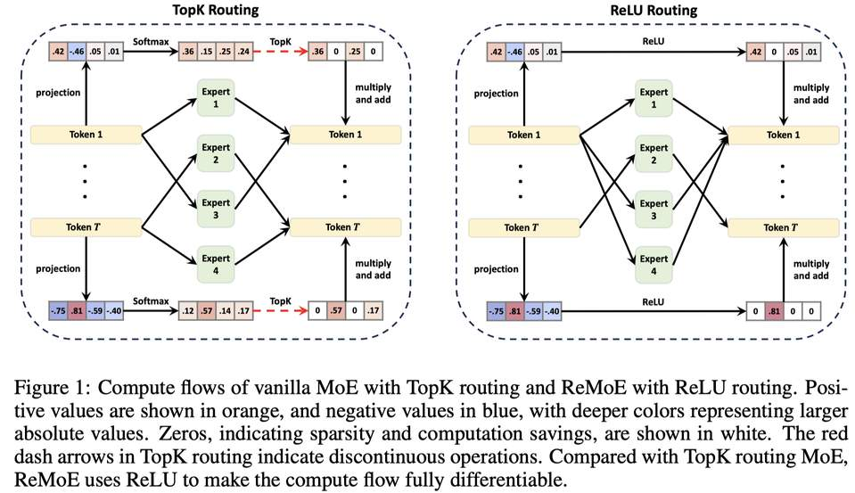

# ReMoE: Fully Differentiable Mixture-of-Experts with ReLU Routing



## 一句话总结

ReMoE 提出用 ReLU 替代传统 TopK+Softmax 路由，实现完全可微分的 MoE 架构，在多种模型规模和专家数量下一致优于传统 TopK 路由，且在专家数量扩展时表现出更优的缩放特性。

## 摘要翻译

稀疏激活的混合专家（MoE）模型被广泛用于在不增加计算预算的情况下扩大模型容量。然而，传统的 TopK 路由器以不连续、不可微的方式训练，限制了其性能和可扩展性。为解决这一问题，我们提出了 ReMoE，一种完全可微分的 MoE 架构，它提供了一种简单但有效的传统 TopK+Softmax 路由的替代方案，使用 ReLU 作为路由器。我们进一步提出了调节路由器稀疏度并平衡专家负载的方法。ReMoE 的连续性特征使得跨 token 和层的计算能够高效动态分配，同时展现出领域专业化能力。实验表明，ReMoE 在不同模型规模、专家数量和粒度级别下持续优于传统 TopK 路由的 MoE。此外，ReMoE 在专家数量扩展方面表现出优越的可扩展性，超越了传统 MoE 架构。基于 Megatron-LM 的实现可在 https://github.com/thu-ml/ReMoE 获取。

## 研究动机

传统的 MoE 路由机制（如 TopK 路由）存在核心问题：

1. **不可微分性**：TopK 路由器在选择专家时引入了跳跃不连续性。例如在 Softmax 后，TopK 会将较小的值置零，这导致路由决策在梯度传播时是不连续的，限制了性能和可扩展性。
2. **已有方法的局限**：虽然有 Soft MoE、SMEAR、Lory 等尝试实现完全可微分的 MoE，但 Soft MoE 和 SMEAR 会破坏 token 因果关系，不适用于自回归模型；Lory 虽适用于自回归模型，但性能不如 TopK 路由的 MoE。
3. **稀疏度控制与负载均衡的困难**：在 MoE 中同时实现高效的稀疏计算和均匀的专家负载是一个挑战。

本文的动机是找到一种简单而有效的路由替代方案，既能保持可微分性，又能维持与 TopK 路由相同的计算成本，同时实现更好的扩展性和专家负载均衡。

## 方法（技术细节）

### 3.1 从 TopK 到 ReLU 的动机

TopK 路由在第 k 个最大值处引入跳跃不连续性：
```
TopK(x, k)_e = x_e · 1{x_e ≥ t(x,k)},  其中 t(x,k) = x[k]
```

ReLU 路由通过将断点设置为 0 来消除这种不连续性：
```
ReLU(x)_e = x_e · 1{x_e ≥ 0}
```

核心思想是 ReLU 对齐所有输入的断点并将其设为 0，确保在专家激活/失活转换处输出连续，从而使训练过程完全可微分。

### 3.2 可微分 ReLU 路由

定义 ReLU 路由函数：
```
R(x^l_t) = ReLU(x^l_t · W^l)
```

其中目标稀疏度为 (1 - k/E)，k 为激活专家数，E 为总专家数。

与 TopK 路由的关键区别：
- **无需 Softmax**：ReLU 路由丢弃了 Softmax，直接依赖 ReLU 的非负输出，输出值代表分配给每个专家的权重（可以为 0）。
- **动态专家分配**：每个 token 可以路由到不同数量的专家（而非固定的 k 个），使得模型可以为更困难的 token 分配更多计算资源。
- **连续可微**：ReLU 路由在路由输出接近零时才改变激活的专家，保持连续性，避免了 TopK 路由中的离散损失函数问题。

### 3.3 通过自适应 L1 正则化控制稀疏度

直接训练 ReLU 路由器往往导致稀疏度低于目标（模型倾向于激活更多专家）。为此，引入正则化损失：
```
L = L_lm + λ_i · L_reg
```

其中 λ_i 是基于训练步数的自适应系数，使用零阶算法更新：
```
λ_{i+1} = λ_i · α · sign((1-k/E) - S_i)
```

S_i 表示所有路由器输出的平均稀疏度。当稀疏度低于目标时，λ_i 增大（α=1.2）；当稀疏度超过目标时，λ_i 减小。

L1 正则化项 L_reg 利用 ReLU 输出非负的特性，鼓励稀疏：
```
L_reg = (1/LT) · Σ_{l,t,e} R(x^l_t)_e
```

通过这种自适应 L1 正则化，ReMoE 能够将稀疏度稳定在目标值附近（如 E=8, k=1 时目标稀疏度 0.875），同时保持与 TopK 路由相同的 FLOPs。

### 3.4 负载均衡整合

为了防止专家负载不均（可能导致路由坍缩），将负载均衡融入 L1 正则化：
```
L_reg,lb = (1/LT) · Σ_{l,t,e} f_{l,e} · R(x^l_t)_e
```

其中 f_{l,e} 是专家 e 在层 l 的平均激活率（相对于期望比率 k/E）。这惩罚接收更多 token 的专家，使其路由器输出更快趋向零。

### 3.5 自然三阶段训练

ReMoE 的训练自然呈现三个阶段：

1. **预热/稠密阶段**（Stage I）：λ_i 较小，L_lm 大且快速下降，每个专家处理超过一半的 token，类似于稠密模型训练。
2. **稀疏化阶段**（Stage II）：正则化项 λ_i·L_reg 变得显著，ReLU 路由器激活更少的专家，迫使专家更加多样化。
3. **稳定/稀疏阶段**（Stage III）：稀疏度 S_i 稳定在预设目标附近，L_lm 在稀疏子空间中继续优化。

Stage I 和 Stage II 引入额外计算成本，但仅需约 100 次迭代（约 0.17% 总步数），开销可忽略。

## 实验结果

### 实验设置
- **代码库**：基于 Megatron-LM，支持数据/张量/管道/专家并行
- **模型架构**：LLaMA 架构（GQA、SwiGLU、RoPE、RMSNorm），上下文长度 1024，批大小 512
- **训练数据**：The Pile（800GB 多样化语料）
- **训练设置**：60k 步（约 30B tokens），AdamW 优化器，学习率 5e-4，8×NVIDIA A100 GPU
- **模型规模**：Small（182M）、Medium（469M）、Large（978M）

### 与其他路由方法的比较（N=182M, E=8, k=1）

| 方法 | ARC-c | ARC-e | BoolQ | HellaSwag | LAMBADA | PIQA | RACE | Avg. |
|------|-------|-------|-------|-----------|---------|------|------|------|
| Dense | 19.45 | 43.35 | 54.40 | 28.61 | 31.09 | 61.97 | 28.52 | 38.20 |
| Hash | 19.28 | 45.45 | 54.95 | 29.68 | 31.44 | 63.06 | 27.66 | 38.79 |
| Lory | 20.31 | 42.97 | 49.54 | 28.75 | 32.35 | 62.24 | 27.75 | 37.70 |
| SparseMixer-v2 | 19.80 | 46.72 | 45.96 | 30.24 | 34.12 | 62.89 | 29.00 | 38.39 |
| EC | 18.86 | 42.97 | 60.21 | 29.14 | 29.26 | 61.92 | 27.37 | 38.53 |
| dMoE | 20.05 | 45.16 | 57.83 | 29.83 | 32.97 | 63.55 | 28.33 | 39.67 |
| **ReMoE** | **20.22** | **46.68** | 54.16 | **30.26** | **35.94** | **63.55** | **29.38** | **40.03** |

**关键发现**：
- ReMoE 在零样本评估中平均准确率最高（40.03%），超越所有其他路由方法
- 所有 MoE 模型均优于稠密模型
- 确定性 Hash 路由性能最差，Lory 在训练中优于 Hash 但在下游任务中不如标准 TopK 路由
- ReMoE 在可微分性的同时，性能超过了主流 TopK 路由

### 可扩展性

1. **参数规模扩展**（E=8, k=1, N=182M→978M）：ReMoE 在所有模型规模下持续优于 MoE，性能差距不随模型规模增加而减小。
2. **专家数量扩展**（N=182M, k=1, E=4→128）：ReMoE 在所有专家配置下均优于 MoE。关键发现是 ReMoE 的性能随 E 增加的斜率更陡，说明 ReMoE 从更大的专家池中获益更多。
3. **粒度扩展**（N=182M, E=8, G=1→64）：细粒度 ReMoE 在所有配置下优于细粒度 MoE。在 G=32 和 G=64 时，ReMoE 达到了理论上限 Dense×8 的性能，而所需 FLOPs 显著更少。

### 讨论

1. **动态专家分配**：ReMoE 能根据 token 频率动态分配专家资源——罕见 token 获得更多专家激活，常见 token（如空格、换行、'the'）获得更少专家激活。这类似 Huffman 编码原理，高效平衡资源使用与模型容量。
2. **负载均衡的作用**：即使不带负载均衡的 ReMoE 也能取得与带负载均衡的 MoE 可比的结果，但一些专家可能保持不活跃，限制了模型容量。加入负载均衡后，专家分配更均匀，性能进一步提升。
3. **领域专业化**：ReMoE 的专家在不同领域表现出明显的专业化特征。例如在 Arxiv、Github、StackExchange 等领域的 token 更多地被路由到特定专家，而 MoE 的专家分布则更均匀。这表明 ReMoE 学会了领域感知的专家分配策略。

## 优势

1. **完全可微分**：ReLU 路由消除了 TopK 路由中的不连续性，使训练过程完全可微分，有利于优化。
2. **简单且即插即用**：ReLU 路由可直接替代传统 TopK+Softmax 路由，无需大幅修改模型架构。
3. **一致优于传统 TopK**：在多种模型规模（182M-978M）、专家数量（4-128）和粒度级别（1-64）下，ReMoE 均优于 TopK 路由的 MoE。
4. **更好的扩展性**：随专家数量增加，ReMoE 的性能提升斜率更陡，说明其在大规模专家场景下更具优势。
5. **动态专家分配**：模型可根据 token 频率动态调整专家激活数量，实现更高效的计算资源分配。
6. **领域专业化**：ReMoE 的专家自然学会在不同领域（如 Arxiv、Github、Wikipedia）进行专业化。
7. **计算成本可控**：通过自适应 L1 正则化，ReMoE 在统计意义上保持与 TopK 路由相同的 FLOPs。
8. **自然三阶段训练**：训练过程自然分为预热、稀疏化、稳定三个阶段，无需手动调整。
9. **兼容性好**：基于 Megatron-LM 实现，支持所有形式的模型并行（数据、张量、管道、专家并行）。

## 局限

1. **初始阶段额外计算开销**：Stage I 和 Stage II（预热和稀疏化阶段）会激活更多专家，带来额外计算成本和内存消耗（虽然开销很小，约 0.17% 总步数）。
2. **内存开销**：预热阶段需要激活更多专家，可能需要临时减小 micro-batch 大小或使用激活检查点技术。
3. **超参数敏感性**：虽然论文证明了自适应系数 λ_0 和 α 的鲁棒性，但仍需选择合适的初始值。
4. **负载均衡非完美**：即使加入负载均衡，专家分配也不完全均匀，可能存在部分专家负载不均的情况。
5. **实验规模有限**：实验主要在 182M-978M 模型规模上进行，未在更大规模（如数B参数）上验证。
6. **仅在语言模型上验证**：实验主要针对语言建模任务（The Pile 数据集），未在其他模态（如视觉、多模态）上验证。
7. **依赖自适应正则化**：稀疏度控制依赖于自适应 L1 正则化，需要额外的正则化损失计算和超参数调整。
8. **与 Soft MoE/SMEAR 相比**：虽然 ReMoE 适用于自回归模型，但在某些场景下可能不如 Soft MoE 等方法在编码器模型上的效果。

## 与 EfficientPaper 相关的研究方向

1. **MoE 架构优化**：ReMoE 属于 MoE 结构设计领域，是当前高效 AI 研究中关于模型架构优化的重要方向。关键词 `structure_design` 与本研究高度相关。
2. **稀疏激活与动态计算**：ReMoE 通过动态专家分配实现了更高效的计算资源利用，这与高效计算的核心理念一致。
3. **可微分路由机制**：可微分 MoE 是近年来的研究热点，ReMoE 提供了一种简洁而有效的方案。
4. **模型扩展与缩放定律**：ReMoE 在不同参数规模和专家数量下的扩展性研究，对理解 MoE 模型的缩放规律有重要参考价值。
5. **领域专业化与专家分化**：ReMoE 的领域专业化特性与 DeepSeekMoE 等工作类似，探索了如何让专家自然分化。
6. **负载均衡与路由稳定性**：ReMoE 的负载均衡方案为 MoE 的稳定性研究提供了新思路。
7. **大语言模型效率**：作为 LLaMA 架构上的 MoE 改进，ReMoE 与当前大语言模型的效率优化方向密切相关。
8. **与 Mixtral/DeepSeekMoE 等工作的对比**：这些工作同样关注 MoE 的扩展性和效率，ReMoE 提供了不同的路由机制。

---

*本笔记由 AI Agent 自动生成，基于 arXiv 论文 2412.14711 的全文内容。内容仅供学术参考，可能存在理解偏差，建议阅读原文获取准确信息。*

*AI 生成声明：本文笔记由 AI Agent（Hermes Agent）自动生成，基于论文原文进行翻译、总结和分析。*
