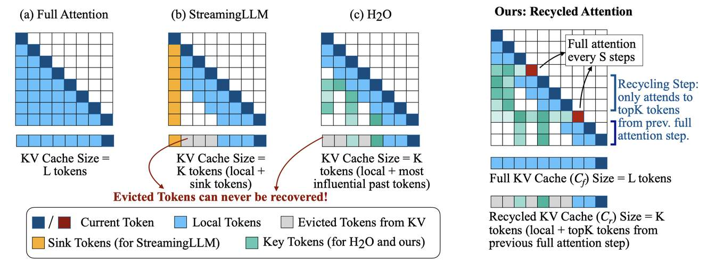

# Recycled Attention: Efficient inference for long-context language models

## 一句话总结

Recycled Attention 是一种推理时加速方法，通过在完整注意力和基于注意力模式的稀疏注意力之间交替执行，在不牺牲长上下文性能的前提下实现与现有 KV 缓存驱逐方法相当的推理加速，同时在 RULER 基准上将性能提升至 2 倍。

## 摘要翻译

生成长序列 token 时，长上下文输入对大语言模型（LLM）施加了沉重的计算负担。其中一个计算瓶颈来自每个生成步骤中对长序列输入的注意力计算。本文提出了 **Recycled Attention**，一种推理时方法，在完整上下文注意力和仅对输入 token 子集的注意力之间交替执行。在执行部分注意力时，我们回收先前进行过完整注意力的 token 的注意力模式，仅关注注意力得分最高的 top K token，从而降低数据移动和注意力计算的开销。与先前提出的仅关注局部上下文或累积注意力得分较高的 token 的推理时加速方法不同，我们的方法可以灵活选择与当前解码步骤相关的 token。我们在 RULER（一套全面评估长上下文能力的任务套件）和长上下文语言建模任务上评估了我们的方法。将该方法应用于现成的 LLM，实现了与仅考虑局部上下文的基线相当的加速，同时将性能提升了 2 倍。我们进一步探索了两个改进性能-效率权衡的思路：（1）基于查询相似度动态决定何时执行回收或完整注意力步骤；（2）使用 Recycled Attention 进行持续预训练。

## 研究动机

### 长上下文推理的计算瓶颈

随着 LLM 处理越来越长的上下文（如 128K tokens），推理时面临两个主要瓶颈：

1. **注意力计算的二次复杂度**：注意力计算的时间复杂度与输入长度 L 成二次关系，导致推理延迟随上下文长度急剧增加。
2. **KV 缓存的数据移动开销**：大 KV 缓存需要从 GPU HBM 移动到计算单元，带来显著延迟（据报道可达推理延迟的 40%）。

例如，Adnan 等人 (2024) 显示，MPT-7B 模型在上下文长度增加 16 倍时，延迟增加了 50 倍。

### 现有方法的局限性

现有方法主要采用 KV 缓存驱逐策略：

- **StreamingLLM**：仅保留 sink token 和最近 token，对非局部上下文信息无法恢复。
- **H2O**：保留累积注意力得分较高的 token，但一旦 token 被驱逐，后续步骤无法恢复访问。

这些方法在需要综合非局部上下文信息的任务（如 needle-in-a-haystack）上表现不佳（< 8% 准确率，而完整注意力为 100%）。

**核心假设**：相邻的生成 token 通常将大部分注意力集中在相似的上下文 token 子集上，这一假设可以通过实验验证来提升推理效率。

## 方法（技术细节）

### 算法框架

Recycled Attention 维护两个 KV 缓存：

- **Cf（Full KV Cache）**：完整的 KV 缓存，大小为 L 个 token，用于完整注意力步骤。
- **Cr（Recycled KV Cache）**：回收的 KV 缓存，大小为 K 个 token（K << L），用于回收注意力步骤。

### 生成过程

1. **Prefilling 阶段**：
   - 使用标准全注意力对输入序列 x1, ..., xL 进行预填充
   - 初始化完整 KV 缓存 Cf
   - 获取最后一个 token xL 的注意力得分 aL（所有层的所有 query head）
   - 基于 aL 为每个层的每个 KV head 选择 top K token，初始化回收 KV 缓存 Cr

2. **回收注意力步骤（Recycling Step）**：
   - 使用回收缓存 Cr 计算注意力，生成下一个 token
   - 将新 token 的 KV 对添加到 Cr
   - 移除 Cr 中注意力得分最低的 token（保持固定大小）
   - 优势：仅需移动较小的 KV 缓存 Cr，减少数据移动和计算开销

3. **完整注意力步骤（Full Attention Step）**：
   - 用回收步骤生成的 token 更新完整缓存 Cf
   - 使用完整缓存 Cf 计算注意力，生成下一个 token
   - 重新初始化回收缓存 Cr：基于当前步骤的注意力得分，选择 top K token

### 调度策略

**固定调度（Fixed Schedule）**：
- 每 S 步执行一次完整注意力，其余 S-1 步执行回收注意力
- 实验发现 S=50 时效果良好

**动态调度（Dynamic Schedule）**：
- 每 S 步检查当前 query 向量与最近一次完整注意力步骤的 query 向量的余弦相似度
- 如果相似度低于阈值 s（如 0.8），则执行完整注意力；否则使用回收缓存
- 允许不同层使用不同调度策略

### 关键直觉：注意力模式的可复用性

实验验证了核心假设：在 8K token 的预填充后，后续 token 的 topK token 恢复率超过 90%（对比 StreamingLLM 的 ~65%）。这表明相邻 token 的注意力模式高度相似，可以有效复用。

### 与 Flash Attention 的兼容性

由于 Recycled Attention 需要注意力得分来选择 topK token，而 Flash Attention 不存储完整的注意力矩阵，因此在完整注意力步骤中需要重新计算注意力得分。但由于完整注意力仅每 S 步执行一次，额外开销不大。

## 实验结果

### 实验设置

- **模型**：Llama-3.1-8B（128K 上下文）、Qwen2-7B（128K 上下文）
- **硬件**：单张 A100 80GB GPU
- **基线**：Vanilla attention、StreamingLLM、StreamingLLM++（带周期性完整注意力）、H2O
- **评估任务**：RULER 基准（13 个子任务）、语言建模（Arxiv、Book、PG19）

### RULER 基准结果（核心结果）

| 方法 | Llama-3.1 32K 准确率 | Llama-3.1 32K 时间(s) | Llama-3.1 64K 准确率 | Llama-3.1 64K 时间(s) |
|------|---------------------|----------------------|---------------------|----------------------|
| Vanilla | 90 | 1.71 | 82 | 2.40 |
| H2O (K=4096) | 21 | 2.15 | 11 | 2.29 |
| StreamingLLM (K=4096) | 22 | 1.23 | 17 | 1.21 |
| Recycled (K=4096, S=50) | **63** | 1.27 | **50** | 1.38 |

**关键发现**：
- Recycled Attention 在 RULER 基准上比 StreamingLLM 和 H2O 提升约 2 倍准确率
- Llama-3.1-8B：63% vs 22%（32K 上下文）
- 推理速度与基线方法相当（1.27s vs 1.23s）
- 在检索类任务（NIAH、QA、VT）上表现尤为突出：单 NIAH 达 98%（32K），远超基线的 8%

### 语言建模结果

**16K 上下文（Arxiv/Book）**：
- Recycled Attention (K=2048, S=10)：PPL 2.36/7.49，时间 7.14s
- StreamingLLM (K=2048)：PPL 2.62/7.94，时间 6.92s
- Vanilla：PPL 2.22/7.07，时间 7.63s

**100K 上下文（PG19）**：
- Recycled Attention (K=2048, S=256)：PPL 9.31，时间 6.10s
- StreamingLLM (K=2048)：PPL 9.53，时间 5.94s

### 动态调度改进

动态调度策略（基于查询相似度）在相似解码时间下进一步提升了困惑度：
- 动态调度（QC=5, s=0.8）：PPL 2.32（Arxiv），时间 7.07s
- 固定调度 S=10：PPL 2.36，时间 7.17s

### 持续预训练改进

使用 Recycled Attention 进行持续预训练：
- Recycled (S=50) + CPT：PPL 2.87（base: 2.96）
- Recycled (S=25) + CPT：PPL 2.81（base: 2.90）
- CPT 使更高步长（50）达到更低困惑度，实现更好的性能-效率权衡

## 优势

1. **显著的性能提升**：在 RULER 基准上比 StreamingLLM 和 H2O 等基线提升约 2 倍准确率，同时保持相当的推理速度。

2. **灵活的注意力模式**：不同于 StreamingLLM 和 H2O 仅关注局部或累积得分高的 token，Recycled Attention 可以灵活选择与当前解码步骤相关的 token，包括局部和非局部 token。

3. **无永久 token 驱逐**：维护完整 KV 缓存，不永久驱逐任何 token，避免了信息丢失问题。

4. **与 Flash Attention 兼容**：通过在完整注意力步骤中重新计算注意力得分实现兼容，额外开销有限。

5. **即插即用**：可应用于任何现成的 LLM，无需重新训练。

6. **可通过持续预训练进一步提升**：使用 Recycled Attention 进行持续预训练可以改善性能-效率权衡。

## 局限

1. **不减少内存需求**：维护完整 KV 缓存（L 个 token），不减少内存占用，可能成为某些用例的瓶颈。

2. **短输出场景收益有限**：在输出长度很短时，效率提升很小。

3. **实验规模有限**：
   - 仅在两个模型（Llama-3.1-8B、Qwen2-7B）和两个评估设置上进行实验
   - 未测试更多语言模型和更多长上下文基准（如 Needle-in-a-haystack、LongBench 等）
   - 由于计算资源限制，未能覆盖所有可能的长上下文基准

4. **对 Qwen2-7B 效果有限**：在 100K 上下文下，Recycled Attention 对 Qwen2-7B 的改进有限，可能与该模型仅持续预训练到 32K 上下文有关。

5. **方法创新性有限**：ICLR 审稿意见认为方法创新性较低（https://openreview.net/forum?id=8qYuxV4lRu）。

6. **未探索其他调度策略**：虽然探索了基于查询相似度的动态调度，但未深入探索其他调度策略（如基于层的自定义步长）。

## 与 EfficientPaper 相关的研究方向

### KV 缓存优化

- **KV 缓存压缩**：通过量化（如 GPTQ、AWQ）减少 KV 缓存的内存占用，可与 Recycled Attention 结合使用。
- **KV 缓存驱逐策略**：H2O、StreamingLLM、TOVA 等方法的进一步改进，或与 Recycled Attention 结合。
- **动态 KV 缓存管理**：基于注意力模式的自适应 KV 缓存管理。

### 稀疏注意力

- **训练时稀疏注意力**：如 BigBird、Longformer 等固定稀疏模式。
- **推理时稀疏注意力**：如 Unlimiformer、InfLLM、MInference、SparQ 等方法。
- **自适应稀疏注意力**：根据输入内容动态选择注意力模式。

### 推理加速

- **Flash Attention 优化**：进一步优化注意力计算。
- **投机解码（Speculative Decoding）**：利用小模型提供草稿，大模型验证。
- **KV 缓存压缩与量化**：结合 KV 缓存压缩和量化。

### 长上下文模型

- **长上下文扩展**：通过持续预训练或位置编码改进扩展上下文窗口。
- **长上下文评估**：RULER、LongBench、Needle-in-a-haystack 等基准的改进。

### 多模态扩展

- **视觉 Transformer**：Recycled Attention 可应用于视觉 Transformer 的推理加速。
- **多模态长上下文**：结合视觉和文本的长上下文推理。

## AI 生成声明

本文档由 AI Agent（Hermes Agent）自动生成，基于对论文 "Recycled Attention: Efficient inference for long-context language models"（arXiv: 2411.05787v1）的分析。AI Agent 使用 PyMuPDF (fitz) 提取论文文本，并基于提取内容生成中文摘要和分析。本文档仅供参考，不构成任何学术建议或论文解读的权威来源。请读者自行验证论文中的具体内容和结论。
