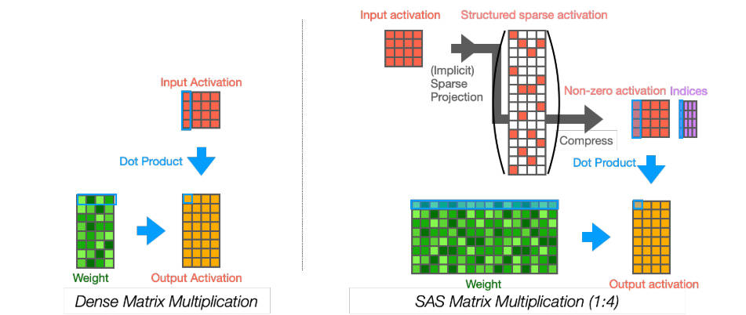

# SAS: Structured Activation Sparsification

> 本文由 AI Agent 自动生成（基于论文全文阅读），生成时间：2025-06-05。所有内容用中文撰写，仅供参考。

## 一句话总结

SAS 提出了一种**结构化激活稀疏化**方法，通过将密集激活映射投影为具有局部稀疏结构的激活图，在不增加计算量的前提下显著提升网络精度，且与 NVIDIA Sparse Tensor Core 兼容，实现了高效的 GPU 推理。

---

## 摘要翻译

宽网络通常比窄网络获得更好的精度，但代价是巨大的矩阵乘法计算量。为了打破这一权衡，我们提出了一种新颖的概念——**结构化激活稀疏化（SAS）**，它利用具有特定结构的投影稀疏激活图来提升精度，而不增加计算量。具体来说，投影后的稀疏激活被允许在每 M 个连续激活中有 N 个非零值。由于稀疏性的局部结构，宽权重与稀疏激活之间的宽矩阵乘法可以等价地执行为窄权重与密集激活之间的窄矩阵乘法，这与 NVIDIA 为 N:M 结构化稀疏权重开发的 Sparse Tensor Core 兼容。在大量实验中，我们证明了增加稀疏性可以单调地提升精度（在 CIFAR10 上最高提升 7%），而不增加乘法次数。此外，我们还表明，在相同的计算预算下，激活的结构化稀疏化比权重的结构化稀疏化具有更好的可扩展性。

---

## 研究动机

现代深度神经网络（DNN）包含大量的矩阵乘法，使其难以部署在资源受限的边缘设备上。缩小激活通道宽度可以减少计算量，但会牺牲精度。现有的加速方法主要集中在：

1. **量化**（降低精度）
2. **知识蒸馏**
3. **高效模型架构设计**（如 MobileNet、ConvNeXt）
4. **结构化权重稀疏化（SWS）**（如通道剪枝、核形状稀疏）

然而，这些方法主要关注权重稀疏化，而**激活稀疏化**（尤其是结构化的激活稀疏化）是一个未被充分探索的领域。激活稀疏化面临的核心挑战是：与权重不同，激活值取决于输入，因此难以控制其具有结构化的稀疏模式。此外，由 ReLU 等激活函数自然产生的稀疏性是无结构的，难以在 GPU 等向量处理器上并行化。

SAS 的核心动机是：在不增加计算量的情况下，通过增加激活的宽度（同时保持结构化稀疏性）来提升网络的表达能力，从而获得更好的精度/速度权衡。

---

## 方法（技术细节）

### 1. 结构化激活稀疏（Structured Sparsity in Activation）

SAS 的核心思想是：将稀疏激活控制为每 M 个连续元素中有 N 个非零值。由于稀疏性具有局部结构，宽权重与稀疏激活之间的矩阵乘法可以等价地转换为窄权重与密集激活之间的矩阵乘法，从而实现向量化执行。

具体来说，对于密集权重 $\tilde{W}$ 和结构化稀疏激活 $\tilde{X}$，矩阵乘法 $O = \tilde{W}\tilde{X}$ 可以简化为窄权重 $W$ 和密集激活 $X$ 的乘法 $O = WX$，且不需要增加计算量。

### 2. 通过稀疏投影实现 SAS（Structured Sparse Projection）

关键问题：如何构造具有结构化稀疏性的激活？SAS 提出了**结构化稀疏投影** $S$：

$$S: X \in \mathbb{R}^{\bar{C}_i \times HW} \rightarrow \tilde{X} \in \mathbb{R}^{M/N \bar{C}_i \times HW}$$

投影规则：源激活 $X$ 中的单个元素被映射到目标稀疏激活 $\tilde{X}$ 中的 M 个连续元素之一。索引 $I$ 的计算方式为：

$$I_{j,u} = \sum_{i=0}^{\log_2 M - 1} (X_{j+i,u} > 0) \cdot 2^i$$

即通过观察相邻 $\log_2 M$ 个激活值的符号位来确定索引。这使得计算开销极小（仅检查符号位），且可以在线计算。

### 3. 硬件实现与速度基准

SAS 矩阵乘法可以在普通 GPU 上通过**局部路由机制**（如 NVIDIA 的 Sparse Tensor Core）实现向量化执行。推理时，不需要显式构造稀疏激活 $\tilde{X}$；而是直接从密集激活 $X$ 计算索引 $I$，然后将 $I$ 和 $X$ 传递给处理器进行并行执行。

作者开发了一个通用矩阵乘法库 **cuSAS**（基于 CuPy 封装的 cuSPARSELt），首次在 GPU 上实现了结构化稀疏激活的向量化矩阵乘法。实验表明，SAS 相对于 SWS 的额外开销（索引计算、重排序、内存传输）不到 1.5%。

### 4. 训练 SAS 网络

SAS 网络的训练过程：
- 将原始非线性激活函数（如 ReLU）替换为 SAS 投影 $S$
- 训练时，SAS 矩阵乘法先将密集/窄激活投影到结构化稀疏/宽空间（显式构建稀疏激活），然后执行常规密集矩阵乘法
- 这等价于推理时使用硬件支持的稀疏矩阵乘法

### 5. Experience-RAdam（ERAdam）优化器

由于 SAS 网络中每个权重元素接收梯度的频率降低（平均为密集网络的 1/M），自适应学习率在训练早期可能不稳定。ERAdam 通过修改 RAdam 的公式，将每个权重元素的步长 $t$ 缩放为与接收的梯度数量成正比：

$$t_i \leftarrow t_i + \sum_u (\nabla \tilde{X}_{\cdot, u} \neq 0) / HW$$

ERAdam 配合 CosineDecay 调度器和 k-decay，在大 M 值时效果尤佳。

---

## 实验结果

### 实验设置
- **数据集**：CIFAR-10、CIFAR-100、ImageNet
- **网络**：ResNet18（CIFAR）、ConvNeXt-B（ImageNet）
- **基线**：密集 ReLU 网络（α× 窄宽度）、结构化权重稀疏化（SWS，Zhou et al., 2021）
- **变量**：稀疏度 M（2/4/8/16）、基线宽度 α（4/8/16）

### 关键发现

1. **精度随稀疏度单调提升**：
   - 在 CIFAR-10 上，SAS 的精度随 M 增大单调提升（最高提升约 7%）
   - 最显著的增益来自基线 ReLU 网络到 M=2 的稀疏网络
   - 精度在 M=8 或 M=16 附近趋于饱和

2. **SAS 优于 SWS**：
   - 在相同计算预算下，SAS 的精度显著优于 SWS
   - SWS 的精度随 M 变化几乎不变，而 SAS 则明显提升

3. **ImageNet 实验**：
   - ConvNeXt-B（α=2）：基线 80.7%，SWS 81.5%，SAS 82.2%
   - SAS 在 ImageNet 上也展示了优于 SWS 的精度提升

4. **表达能力分析**（轨迹长度分析）：
   - SAS 的轨迹长度随 M 增大而增长，表明更强的表达能力
   - SWS 的轨迹长度随 M 变化几乎不变

5. **训练特性**：
   - 高稀疏度（大 M）的 SAS 网络需要更多训练轮次才能达到最佳精度
   - 这可能是因为大 M 时梯度更稀疏

---

## 优势

1. **不增加计算量**：在不增加矩阵乘法次数的前提下提升精度
2. **硬件兼容**：与 NVIDIA Sparse Tensor Core 兼容，可实现实际加速
3. **实现简单**：将现有网络的 ReLU 替换为 SAS 投影即可
4. **精度提升显著**：在 CIFAR-10 上最高提升 7%，ImageNet 上也有明显提升
5. **可扩展性好**：激活的结构化稀疏化比权重的结构化稀疏化具有更好的可扩展性
6. **表达能力增强**：通过增加网络宽度（同时保持稀疏性）提升表达能力

---

## 局限

1. **内存开销增加**：SAS 网络的权重存储随 M 线性增加（×M），而 SWS 的权重存储不变
2. **硬件支持有限**：当前 NVIDIA GPU 仅支持 1:2 稀疏度（TF32 或 float 矩阵），限制了高稀疏度的实际应用
3. **索引计算的局限性**：当前的索引计算方法（基于符号位）在 M>2 时，当邻居元素接近零时可能存在问题
4. **训练收敛较慢**：高稀疏度网络需要更多训练轮次才能达到最佳精度
5. **缺少主流框架集成**：目前仅有基于 CuPy 的库，尚未集成到 PyTorch、TensorFlow 等主流框架
6. **未与 SWS 结合探索**：当前 GPU 不支持双侧稀疏矩阵乘法，SAS 与 SWS 的组合探索受限

---

## 与 EfficientPaper 相关的研究方向

1. **激活稀疏化与权重稀疏化的结合**：未来 GPU 可能支持双侧稀疏矩阵乘法，这将使 SAS 和 SWS 的结合成为可能
2. **低比特量化与 SAS 结合**：SAS 的主要缺点是内存开销增加，结合低比特权重可以缓解这一问题
3. **注意力机制用于索引计算**：当前的索引计算方法较简单，使用注意力机制可能进一步提升精度
4. **硬件协同设计**：针对 SAS 的专用向量处理器设计
5. **端到端可微的索引学习**：探索学习计算索引的方法，而非使用固定的符号位规则
6. **与高效架构的结合**：SAS 可与 MobileNet、ConvNeXt 等高效架构结合，进一步提升效率
7. **SAS 在 Transformer 中的应用**：SAS 的机制也可应用于注意力机制中的矩阵乘法

---

## 参考信息

- **论文链接**：https://openreview.net/forum?id=vZfi5to2Xl
- **代码仓库**：https://github.com/DensoITLab/sas_
- **关键词**：sparse_pruning, activation_sparsity
- **会议**：ICLR 2024
- **作者**：Yusuke Sekikawa, Shingo Yashima
- **机构**：DENSO IT Lab
