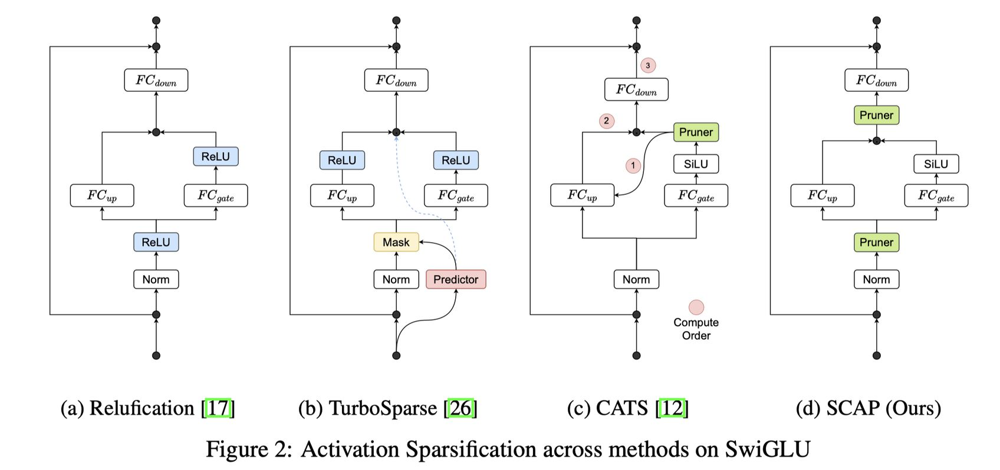

# Post-Training Statistical Calibration for Higher Activation Sparsity

> **⚠️ 生成声明**：本 note 由 AI Agent（Hermes Agent）基于论文原文自动生成，内容仅供参考，不代表人工审校意见。

---

## 一句话总结

SCAP 提出了一种**后训练激活剪枝**框架，通过在全连接层输入端施加稀疏化并引入 Mode-Centering 预校准技术，在无需任何额外训练的情况下，将 LLM 的 FFN 稀疏度提升至 48.5%（vs CATS 的 33.3%），在同等任务质量下实现 **1.5 倍额外的解码加速**。

---

## 摘要翻译

我们提出了 **统计校准激活剪枝（Statistical Calibrated Activation Pruning, SCAP）**，一种后训练激活剪枝框架，它（1）将稀疏化推广到全连接层的**输入激活**上，从而实现跨 Transformer 架构的通用且灵活的应用；（2）采用一种简单的 **Mode-Centering** 技术来预校准激活分布，以最大化后训练稀疏度。我们的结果表明，与先前方法相比，SCAP 具有鲁棒的 Pareto 效率，在相同模型质量下，相比 CATS 可额外获得 **1.5 倍的 LLM 解码加速**。SCAP 的有效性在多种模型上得到了经验验证，包括最新的 Transformer 解码器、MoE、Mamba2、编码器 Transformer 以及预量化模型，突显了其实用性和可扩展性。代码已开源：https://github.com/IntelLabs/SCAP。

---

## 研究动机

### 1. 激活稀疏性的兴起

LLM 推理中存在**激活稀疏性**（Activation Sparsity）现象。研究发现，预训练后的 Transformer 在 ReLU 输出中存在大量接近零的激活值（Lazy Neuron Phenomenon）。更大的模型往往表现出更高的稀疏性。利用这种稀疏性可以跳过无效的计算操作，加速推理。

### 2. 现有方法的局限

- **Relufication 方法**（如 TurboSparse）：通过将激活函数改回 ReLU 来诱导稀疏性，但需要**大量额外训练**（数百亿 token 的 uptraining），需要**数据中心级 GPU**（如 64×A800-80GB），成本高且可扩展性差。
- **CATS 方法**：首次提出后训练激活稀疏化，但仅针对 **post-SiLU 激活**进行剪枝，限制在单一维度优化，且 Up 和 Down 投影共享稀疏通道，无法灵活组合不同稀疏度。

### 3. 核心观察

- 近年来 LLM 已从 ReLU 转向 **SiLU/GELU**（如 Llama、Mistral、Gemma 等），这些激活函数天然输出密集值，直接稀疏化困难。
- 部分 FC 层的输入激活分布**偏离零中心**（Mode 远离零），导致 L1 阈值剪枝效果不佳。

---

## 方法（技术细节）

### 核心思想：泛化激活剪枝到 FC 层输入

SCAP 的核心创新是将剪枝目标从**激活函数的输出**（如 post-SiLU）转移到**全连接层的输入激活**。这带来以下优势：

1. **统一的剪枝和核实现**：对所有 FC 层（包括 Attention 中的 QKV、Up、Gate、Down 投影）使用相同的剪枝算子，无需额外的预测器训练。
2. **灵活的稀疏度组合**：不同 FC 层可以使用不同的稀疏度，从而实现更优的 Pareto 效率。
3. **简化推理流程**：无需在 SiLU 后额外计算 mask 再传递到 Up 投影，避免了 CATS 的计算顺序限制。

### L1 阈值剪枝

给定线性层 Y = XW + b，SCAP 在输入激活 X 上施加 L1 阈值剪枝：

$$\text{Pruner}(X) = \begin{cases} X_{ij} & \text{if } |X_{ij}| > \tau \\ 0 & \text{otherwise} \end{cases}$$

其中 $\tau = \text{Quantile}(|X_{\text{calib}}|, s)$，$s$ 是目标稀疏度。阈值通过校准数据集上的激活分布的分位数确定。

### Mode-Centering 预校准

对于分布峰值远离零的激活（如 GELU 输出到 Down 投影的输入），L1 剪枝效果不佳。SCAP 引入 **Mode-Centering** 技术：

1. **估计分布的 Mode（众数）** $\eta$：可通过均值、中位数或 KDE（核密度估计）获得。
2. **将激活分布的 Mode 平移到零**：$X' = X - \eta$，同时在偏置项中补偿 $\eta W$：
   $$Y = (X - \eta)W + b_{\text{fused}}$$
3. 由于 $\eta$ 是标量，推理开销极小（仅需一次广播和逐元素减法）。

**关键发现**：
- 对于 GLU-FFN（SwiGLU），激活分布已接近零中心，Mode-Centering 效果有限。
- 对于非 GLU FFN（如 Falcon、MPT 使用 GELU），Mode-Centering 显著提升稀疏度：
  - Falcon-7B：从 30.5% 提升至 50.3%（+19.8 个百分点）
  - MPT-7B：从 12.7% 提升至 57.4%（+44.7 个百分点）

### 稀疏核实现

SCAP 实现了通用的 `SCAP_FC` 核函数，适用于所有 FC 层。与 CATS 的 SwiGLU 实现相比：

- **CATS**：需要先计算 Gate 投影 → SiLU → 剪枝 mask，然后才能计算 Up 投影，计算顺序严格。
- **SCAP**：对 Up、Gate、Down 投影的输入分别独立剪枝，可灵活组合，且核函数可复用于 Attention 中的 FC。

---

## 实验结果

### 1. Pareto 效率（vs CATS）

在 Mistral-7B 和 Llama-2-7B 上：
- **Mistral-7B**：在仅 -1.5% 精度偏差下，SCAP 实现 48.5% FFN 稀疏度（CATS 为 33.3%）。
- **Llama-2-7B**：SCAP 同样在 -1% 容差内实现更高 FFN 稀疏度。
- SCAP 提供了在 -1% 容差内**多个可行的稀疏度候选方案**，而 CATS 的稀疏度提升伴随精度快速下降。

### 2. 解码加速

在 Mistral-7B 上（相同任务质量）：
- **CATS**：FFN 稀疏 33.3%，几何平均解码加速 17.7%。
- **SCAP**：FFN 稀疏 48.5%，几何平均解码加速 27.1%。
- **SCAP 相比 CATS 额外加速 1.5 倍**（27.1% / 17.7%）。
- 随着 prompt 长度增加，加速效果递减（attention 开销占比增大）。

### 3. Mode-Centering 消融实验

- Falcon-7B：Down 投影稀疏度从 30.5% → 50.3%（+19.8 pts）
- MPT-7B：Down 投影稀疏度从 12.7% → 57.4%（+44.7 pts）
- 也适用于 Vision Transformer（DeiT-base、DeiT3-large）

### 4. 与 TurboSparse 的对比

- TurboSparse（训练方法）FFN 稀疏 82.2%，SCAP 42.3%。
- 但 TurboSparse 需要 **64×A800-80GB** 的训练基础设施和数百亿 token 的 uptraining。
- 在除 GSM8K 外的任务上，SCAP 优于或接近 TurboSparse，且**仅需 1×A100-80GB**。
- TurboSparse 在 GSM8K 上的高分主要来自精心策划的数学相关训练数据。

### 5. 广泛的模型覆盖

SCAP 在以下模型上验证了有效性（均在 -1% 容差内）：

| 模型 | 任务偏差 | FFN 稀疏度 |
|------|----------|-----------|
| Llama-2-7B | -0.8% | 42% |
| Llama-2-70B | -0.9% | 50% |
| Llama-2-70B (4-bit) | -0.9% | 43% |
| Llama-3.1-8B-Instruct | -0.7% | 43% |
| Mixtral-8x7B (MoE) | -0.8% | 43% |
| Mamba2-2.7B | -0.8% | 40% |
| Falcon-7B* | -0.8% | 38% |
| MPT-7B* | -0.6% | 43% |
| DeiT-base* | -0.9% | 51% |
| DeiT3-large* | -0.9% | 59% |

（* 表示使用了 Mode-Centering）

---

## 优势

1. **后训练方法**：无需任何额外训练，仅需少量校准数据（64 个文本片段 × 256 token），极大降低了计算资源需求。
2. **通用性**：适用于多种 Transformer 架构（Decoder、Encoder、MoE、Mamba2、ViT），以及预量化模型。
3. **灵活的稀疏度控制**：不同 FC 层可以独立设置稀疏度，实现最优的稀疏-精度权衡。
4. **Pareto 效率**：在同等精度下实现比 CATS 更高的稀疏度，带来更大的加速。
5. **低开销的 Mode-Centering**：仅需一个标量偏移，推理开销极小。
6. **可与量化方法结合**：如与 GPTQ/AWQ 等后训练量化方法兼容。
7. **仅需单卡 A100-80GB** 进行校准和剪枝，可扩展性强。

---

## 局限

1. **仅适用于解码阶段**：当前方法主要针对单 token 解码（batch size=1），在 batched 推理（beam search、高吞吐 serving）中，不同 token 的稀疏位置不重叠，加速效果显著下降。
2. **Prefill 阶段未充分利用**：Prefill 阶段的激活包含多个向量，依赖重叠稀疏性会浪费大量稀疏度。
3. **稀疏度提升有限**：相比训练方法（如 TurboSparse 的 82% FFN 稀疏），后训练方法的稀疏度上限约为 48-59%。
4. **精度-稀疏度权衡**：超过 -1% 容差后精度快速下降（如 SCAP 在 sup/gate:40%, sdown:70% 时精度下降 -3.3%）。
5. **校准数据依赖**：校准数据的质量和覆盖度会影响剪枝效果。
6. **Kernel 实现性能**：虽然与 CATS 相当或略快，但在高稀疏度下加速效果仍受 attention 开销限制。

---

## 与 EfficientPaper 相关的研究方向

1. **激活稀疏化与量化的联合优化**：SCAP 已验证了与预量化模型的兼容性（如 Llama-2-70B 4-bit、Mixtral-8x7B 4-bit），未来可探索稀疏化与量化的协同压缩。
2. **后训练方法 vs 训练方法的对比研究**：SCAP 与 TurboSparse/Relufication 的对比揭示了后训练方法在成本效益上的优势，但训练方法在稀疏度上限上仍有优势。
3. **Mamba2/SSM 架构的稀疏性**：SCAP 在 Mamba2-2.7B 上的成功（40% 稀疏度）表明激活稀疏化可扩展到非 Transformer 架构。
4. **Vision Transformer 的稀疏加速**：SCAP 在 DeiT 上的 51-59% 稀疏度表明激活稀疏化在视觉领域也有潜力。
5. **批处理稀疏推理**：论文在 Appendix C 中指出 batched 推理和 prefill 阶段的稀疏加速是重要的未来方向。
6. **细粒度逐层稀疏度搜索**：当前仅使用两组稀疏度（Up/Gate 和 Down），未来可探索逐层自适应稀疏度。
7. **与高效注意力/KV 压缩的结合**：论文指出可将激活稀疏化与 efficient attention 或 KV 压缩方法结合，以进一步提升加速效果。
8. **稀疏感知的内核优化**：SCAP 的通用稀疏核实现为稀疏感知的硬件优化提供了基础。

---

> **论文信息**
> - 标题：Post-Training Statistical Calibration for Higher Activation Sparsity
> - 缩写：SCAP
> - 作者：Vui Seng Chua, Yujie Pan, Nilesh Jain
> - 机构：Intel
> - 会议：ENLSP (NeurIPS Workshop), 2024
> - arXiv：http://arxiv.org/abs/2412.07174v1
> - 代码：https://github.com/IntelLabs/SCAP
> - 关键词：sparse_pruning, activation_sparsity
