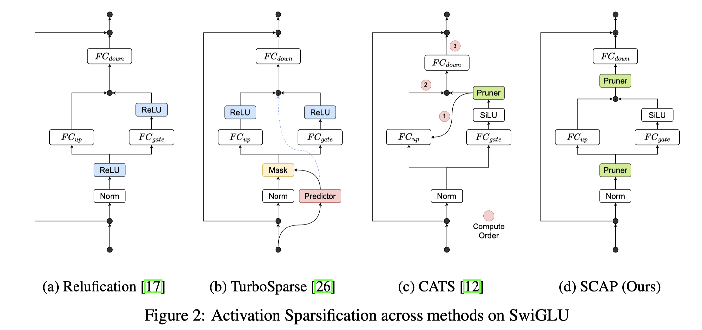

# Post-Training Statistical Calibration for Higher Activation Sparsity

## Abstract

We present Statistical Calibrated Activation Pruning (SCAP), a post-training
activation pruning framework that (1) generalizes sparsification by input
activations of Fully-Connected layers for generic and flexible application
across Transformers, and (2) features a simple Mode-Centering technique to
pre-calibrate activation distributions for maximizing post-training sparsity.
Our results demonstrate robust Pareto efficiency compared to prior methods,
translating to a 1.5x additional LLM decoding speedup against CATS at iso model
quality. SCAP effectiveness is empirically verified across a wide range of
models, including recent Transformer Decoders, MoE, Mamba2, Encoding
Transformer, and pre-quantized models, highlighting its practicality and
scalability. The code is available at: https://github.com/IntelLabs/SCAP.

1. FFN的输入也稀疏了；
2. 之前按照0为中心进行稀疏，根据统计结果找到Model center，并添加偏移后稀疏，从而能提高最后的精度；
   

