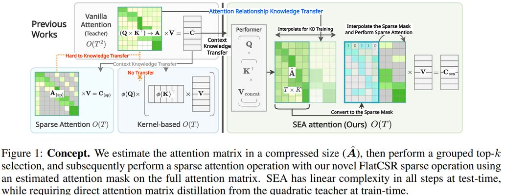

# SEA: Sparse Linear Attention with Estimated Attention Mask

> Heejun Lee, Jina Kim, Jeffrey Willette, Sung Ju Hwang
> Korea Advanced Institute of Science and Technology (KAIST), DeepAuto.ai
> 发表于 ICLR 2024
> 论文链接: http://arxiv.org/abs/2310.01777v2
> 代码: https://github.com/gmlwns2000/sea-attention
> 关键词: sparse_pruning, attention_sparsity

## 一句话总结

SEA 提出了一种基于核函数线性注意力估计注意力矩阵、再通过 top-k 选择生成稀疏注意力掩码的方法，实现了 O(T) 的推理复杂度，在语言建模任务上达到了与二次注意力相当甚至更优的性能，同时将内存消耗降低了约 54%。

## 摘要翻译

Transformer 架构近年来在需要建模序列元素之间成对关系的任务（如自然语言理解）中取得了突破性进展。然而，由于注意力操作的二次复杂度，长序列成为一大难题。此前的研究致力于通过稀疏化或线性近似注意力矩阵来降低复杂度，但这些方法存在以下问题：（1）无法直接从教师模型的注意力矩阵中蒸馏知识，往往需要从头重新训练；（2）由于无法生成完整的注意力矩阵，丧失了可解释性。为解决这些挑战，我们提出了 SEA（Sparse linear attention with Estimated Attention mask）。SEA 通过基于核函数的线性注意力以线性复杂度估计注意力矩阵，然后通过 top-k 选择创建稀疏注意力矩阵，执行稀疏注意力操作。在语言建模任务（Wikitext2）中，此前的线性和稀疏注意力方法的困惑度（perplexity）比二次 OPT-1.3B 基线高出约两倍，而 SEA 在使用约一半内存的情况下取得了比 OPT-1.3B 更好的困惑度，并且提供了可解释的注意力矩阵。我们相信这项工作具有巨大的实际影响，因为它为在资源受限的设备上以更少内存运行大型 Transformer 开辟了可能性。

## 研究动机

### 1. 长序列的挑战
Transformer 的注意力机制具有 O(T²) 的时间和空间复杂度，这使得处理长序列变得不可行，尤其是在对话生成等任务中。

### 2. 现有方法的局限性
- **稀疏注意力方法**（如 Longformer、BigBird）：使用启发式静态注意力模式，难以适应所有任务，且模式是固定的而非数据驱动的。
- **核函数/低秩方法**（如 Performer、Cosformer）：存在近似误差，在不同任务上泛化能力有限。
- **知识蒸馏困难**：现有方法在替换注意力机制后，无法直接从教师模型的完整注意力矩阵中蒸馏知识，需要重新训练注意力关系。
- **可解释性丧失**：现有方法无法生成完整的注意力矩阵，阻碍了对注意力模式的分析和 token 重要性评估。

### 3. SEA 的动机
SEA 旨在解决上述所有问题：通过线性复杂度估计注意力矩阵，同时保留与教师模型的直接注意力蒸馏能力，提供可解释的注意力矩阵。

## 方法（技术细节）

### 整体框架

SEA 包含两个主要阶段：

**阶段 1：注意力估计（基于核函数）**
- 使用 Performer（FAVOR+）将 Q、K、V_cat 输入核函数线性注意力
- V_cat = [V_I; V]，其中 V_I 通过对单位矩阵 I 进行最近邻插值得到
- 生成压缩注意力矩阵 Â ∈ R^{T×K}，其中 K ≪ T
- 通过 CNN 解码器进一步精化估计结果

**阶段 2：稀疏注意力掩码生成与稀疏注意力**
- 对 Â 执行 grouped top-k 选择，生成压缩掩码 M̂ ∈ {0,1}^{T×K}
- 将 M̂ 插值为全尺寸稀疏掩码 M* ∈ {0,1}^{T×T}
- 在 M* 上执行稀疏注意力操作

### CNN 解码器

CNN 解码器将 Performer 输出与原始上下文 V 拼接，通过 MLP 和 CNN 处理：
- 输入：V'_cat = [C_perf; V] ∈ R^{T×3d}
- MLP μ：R^{3d} → R^{d'}，得到中间表示 Z
- MLP ν：R^{d'} → R^{K_ch/cs}
- 转置并重塑为 ˆZ ∈ R^{H_ch×T×K/cs}
- 2D CNN f_dec：将头维度 H 视为通道维度，输出 Â ∈ R^{T×K}
- CNN 使用固定 3 层结构，能够捕捉注意力矩阵的局部模式

### Grouped Top-k 选择

四种 top-k 选择方法：
1. **Per-query**：在每个 query 上选择 top-k，k̂ = k̂
2. **Per-head**：在每个 head 上选择 top-k，k̂ = T × k̂
3. **Per-batch**：在整个 batch 上选择 top-k，k̂ = H × T × k̂
4. **Causal-per-batch**（实验中表现最佳）：对因果注意力，在 R^{H×K} 空间选择，k̂ = H × k̂，避免时间维度信息交换

实验中使用 causal-per-batch（K=128, 5 epochs）在 GLUE-MNLI 上达到 80.55% 准确率（k=7）。

### FlatCSR：改进的压缩稀疏行格式

- 初始尝试使用 COO 格式，但效率不高（COO 存储每个非零点的坐标，无法利用 grouped top-k 选择的结构）
- 最终采用 CSR 格式（FlatCSR），利用预构建的行结构
- FlatCSR 比 COO 快 6.63 倍（延迟从 75.66ms 降至 11.4ms）
- 内存使用减少约 31.5%（从 1194MB 降至 817.5MB）
- 实现在 Triton 上，定义在 `src.models.perlin_attention.ops` 中

### 输出计算

最终输出结合 Performer 和稀疏注意力的结果：
- C = A*V（稀疏注意力上下文）
- C_avg = i^T V（全局平均池化上下文，其中 i 是 Â 每行平均值的插值）
- C_sea = s_mix ⊙ C + (1 - s_mix) ⊙ C^T_avg
- s_mix 由 f_pool(Z) 通过线性变换和 sigmoid 激活得到

### 训练方法

使用知识蒸馏（KD）从预训练的二次注意力教师模型训练 SEA：
- 损失函数 L_sea = Σ(L_approx + L_prob + L_context + L_kd) + L_kd_task + L_task
- L_approx：KL 散度 + MSE，匹配压缩注意力矩阵与教师注意力矩阵
- L_prob：KL 散度 + MSE，匹配学生和教师的注意力概率
- L_context：MSE，匹配上下文特征
- L_kd：MSE，匹配每层输出
- L_kd_task：KL 散度，匹配模型输出 logits
- L_task：下游任务损失

训练方案：将预训练教师的注意力机制替换为 SEA，使用知识蒸馏训练新参数，同时适应原始权重。

### 动态调整 k

- 训练后可以动态调整 k 值，无需额外训练
- 增加 k 值可提高准确率
- 在 Wikitext2 上，所有 SEA 模型在调整 k 后都超越了二次注意力基线（perplexity 29.2）
- 这一特性使模型能够根据实时服务需求和成本约束灵活调整

## 实验结果

### 语言建模（Wikitext2，OPT 变体）

| 方法 | OPT-125M PPL↓ | OPT-125M Mem(MB) | OPT-350M PPL↓ | OPT-1.3B PPL↓ | OPT-1.3B Mem(MB) |
|------|---------------|------------------|---------------|---------------|------------------|
| Vanilla | 29.2 | 408 | 19.3 | 13.9 | 1120 |
| Reformer | 63.9 | 902 | 58.2 | 49.02 | 2406 |
| Performer | 49.8 | 51 | 36.6 | 30.6 | 137 |
| **SEA (Ours)** | **26.0** | **187** | **19.5** | **13.5** | **499** |

- SEA 在 OPT-125M 上 perplexity 26.0，比 vanilla (29.2) 还低
- SEA 在 OPT-1.3B 上 perplexity 13.5，比 vanilla (13.9) 更好，内存减少 55.4%
- 比 Performer 降低 47.7% 的 perplexity（OPT-1.3B: 13.5 vs 30.6）
- 峰值内存使用减少 81.05%（序列长度 2^13 时）
- 收敛速度远快于 Performer 和 Reformer

### 文本分类（GLUE，BERT-base）

- SEA 在所有测试的 GLUE 子集上达到最佳性能
- 在 MNLI 上，SEA 与二次注意力准确率差距仅 0.1%
- 动态调整 k 后可超越二次注意力
- 与 Reformer、Performer、Cosformer、Sinkhorn、Synthesizer 等基线比较

### 效率分析

- 延迟：序列长度 2^13 时，SEA 仅消耗二次注意力 32.72% 的延迟
- 内存：O(T) 复杂度，比 Reformer 少 21.19%
- FlatCSR vs COO：FlatCSR 快 6.63 倍（11.4ms vs 75.66ms）
- 延迟分解：密集运算 47.45%，FlatCSR 稀疏运算 46.28%，其他 6.27%

## 优势

1. **线性复杂度**：O(T) 的推理复杂度，支持长序列处理
2. **直接注意力蒸馏**：可从预训练教师模型直接蒸馏注意力矩阵，无需重新训练注意力关系
3. **可解释性**：能生成完整的注意力矩阵，支持注意力模式分析和 token 重要性评估
4. **性能卓越**：在语言建模和文本分类任务上均达到或超过二次注意力性能
5. **动态调整**：支持训练后动态调整 k 值，无需重新训练
6. **内存高效**：使用约一半内存，适合资源受限设备
7. **FlatCSR 高效**：比 COO 格式快 6.63 倍
8. **快速收敛**：比 Performer 和 Reformer 收敛更快
9. **注意力模式可预测**：CNN 解码器能捕捉动态注意力模式（如对角线、波浪形对角线等）

## 局限

1. **延迟较高**：由于同时使用核函数和稀疏注意力，延迟高于部分基线（如 Performer、Sinkhorn），存在延迟-准确率权衡
2. **插值方法简单**：当前使用均匀插值，可考虑非均匀或可学习插值以提升性能
3. **需要教师模型**：训练需要预训练教师模型的注意力信息，增加了训练流程复杂性
4. **top-k 选择固定**：当前使用固定 top-k 选择，未来可考虑可学习掩码（如 concrete masking）
5. **长序列限制**：在序列长度极大时，插值的像素复制操作可能影响线性复杂度
6. **压缩维度固定**：K 在训练后固定，无法自适应调整
7. **轻量级模型**：当前实验主要在 OPT-125M/350M/1.3B 和 BERT-base 上，对更大模型的效果有待验证

## 与 EfficientPaper 相关的研究方向

1. **注意力稀疏化**：SEA 是注意力稀疏化方法的重要代表，属于 sparse_pruning 和 attention_sparsity 研究方向
2. **线性注意力**：与 Performer、Cosformer、Scatterbrain 等线性注意力方法相关
3. **知识蒸馏**：SEA 使用知识蒸馏将二次注意力的知识转移到线性注意力，与高效模型蒸馏相关
4. **高效 Transformer**：与 FlashAttention、Longformer、BigBird 等高效 Transformer 方法互补
5. **动态计算**：动态调整 k 的特性与动态计算、自适应推理相关
6. **模型压缩**：通过注意力矩阵压缩减少内存和计算成本，与模型压缩领域密切相关
7. **可解释性**：SEA 保留了注意力矩阵的可解释性，与可解释 AI 研究方向相关

## AI 生成声明

本笔记由 AI Agent（Hermes Agent）自动生成，基于论文原文的 PDF 文本提取和结构化分析。笔记内容经过整理和翻译，可能存在翻译不准确或遗漏的情况。建议读者参阅原始论文以获取完整准确的信息。

---
*生成时间: 2026-06-05*
*工具: Hermes Agent + PyMuPDF (fitz)*
*论文版本: arXiv:2310.01777v2 (ICLR 2024)*
