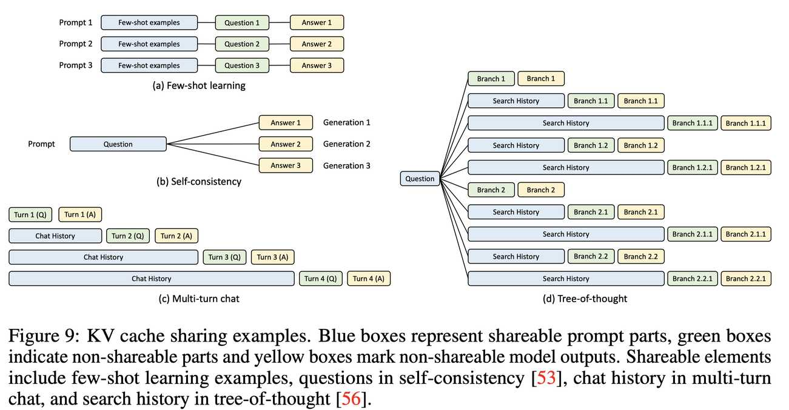

# SGLang: Efficient Execution of Structured Language Model Programs



> 注：以下论文笔记由 AI Agent 自动生成，可能存在理解偏差或遗漏，请以原论文为准。

## Abstract

Large language models (LLMs) are increasingly used for complex tasks that require multiple generation calls, advanced prompting techniques, control flow, and structured inputs/outputs. However, efficient systems are lacking for programming and executing these applications. We introduce SGLang, a system for efficient execution of complex language model programs. SGLang consists of a frontend language and a runtime. The frontend simplifies programming with primitives for generation and parallelism control. The runtime accelerates execution with novel optimizations like RadixAttention for KV cache reuse and compressed finite state machines for faster structured output decoding. Experiments show that SGLang achieves up to 6.4× higher throughput compared to state-of-the-art inference systems on various large language and multi-modal models on tasks including agent control, logical reasoning, few-shot learning benchmarks, JSON decoding, retrieval-augmented generation pipelines, and multi-turn chat. The code is publicly available at https://github.com/sgl-project/sglang.

## 一句话总结

SGLang 提出了一种结构化语言模型程序的高效执行框架，通过前端语言原语简化编程，后端运行时利用 RadixAttention（基于基数树的 KV 缓存复用）和压缩有限状态机（加速结构化输出解码）等创新优化，在多种 LLM 工作负载上实现了最高 6.4 倍的吞吐量提升和 3.7 倍的延迟降低。

## 摘要翻译

大语言模型（LLM）越来越多地用于需要多次生成调用、高级提示技术、控制流和结构化输入/输出的复杂任务。然而，目前缺乏高效的系统来编程和执行这些应用。我们介绍了 SGLang，一个用于高效执行复杂语言模型程序的系统。SGLang 由前端语言和运行时组成。前端通过生成和并行控制原语简化编程。运行时通过新颖的优化加速执行，包括用于 KV 缓存复用的 RadixAttention 和用于更快结构化输出解码的压缩有限状态机。实验表明，SGLang 在各种大型语言模型和多模态模型上，针对智能体控制、逻辑推理、少样本学习基准、JSON 解码、检索增强生成管道和多轮对话等任务，与最先进推理系统相比实现了高达 6.4 倍的吞吐量提升。代码已公开。

## 研究动机

### 问题背景

随着 LLM 能力的不断提升，LLM 正越来越多地被用于复杂的多步骤任务，如智能体（Agent）控制、逻辑推理、少样本学习、工具使用等。这些任务通常需要**多次 LLM 调用**，并伴随着控制流和结构化输入/输出。作者将这些任务称为"语言模型程序"（Language Model Programs，简称 LM Programs）。

### 两大挑战

1. **编程困难**：开发 LM 程序需要大量字符串操作、提示调优、脆弱的输出解析、多模态输入处理和并行化机制，程序可读性极差。
2. **执行效率低下**：现有推理引擎（vLLM、TGI、TensorRT-LLM 等）虽然优化了单次推理的延迟和吞吐量，但缺乏对 LM 程序多调用结构的感知，导致大量冗余计算和内存浪费。具体体现在：
   - **KV 缓存复用缺失**：LM 程序中多个 LLM 调用共享公共前缀，但现有系统在每次请求完成后丢弃 KV 缓存，无法跨调用复用。
   - **结构化解码效率低**：对于 JSON 等结构化输出，现有系统仅逐 token 解码，无法利用约束的结构化特性进行多 token 并行解码。

### 核心洞察

SGLang 的核心思想是**系统性地利用 LM 程序中的多调用结构来提升执行效率**，通过前端语言和后端运行时的协同设计，同时解决编程和执行效率问题。

## 方法（技术细节）

SGLang 由两部分组成：**前端语言**和**后端运行时**。

### 1. 前端语言（SGLang DSL）

SGLang 是一种嵌入在 Python 中的领域特定语言，提供以下核心原语：

- **生成原语**：
  - `gen(name, stop=...)`：生成文本并命名，支持停止条件
  - `select(name, choices=[...])`：选择最高概率的选项
  - `extend(text)`：直接扩展提示
- **并行控制**：
  - `fork(n)`：并行启动 n 个分支
  - `join()`：合并分支结果
- **多模态支持**：`image(path)`、`video(path)` 等原语支持多模态输入
- **Python 兼容**：兼容 Python 的控制流（if/else、for 循环）和库

SGLang 提供**解释器**和**编译器**两种执行方式。解释器管理提示状态流，异步提交原语操作，确保控制流同步和程序内并行。编译器可以追踪程序并进行更多优化。

### 2. 后端运行时优化

#### 2.1 RadixAttention：基于基数树的 KV 缓存复用

**核心思想**：利用基数树（Radix Tree）管理所有请求的 KV 缓存，实现跨调用的自动复用。

**技术细节**：

- **基数树结构**：每个树节点存储 token 序列的哈希和对应的 KV 缓存张量。与传统的字典或哈希表不同，基数树支持前缀匹配，边可以标记变长的 token 序列。
- **KV 缓存布局**：KV 缓存采用非连续的分页布局（paged layout），每页大小等于一个 token。
- **LRU 驱逐策略**：当 GPU 内存不足时，采用 LRU（最近最少使用）策略驱逐最不活跃的叶节点。驱逐叶节点可以保留其公共祖先，直到祖先也变为叶节点。
- **引用计数**：每个节点维护引用计数，表示有多少正在运行的请求在使用该节点。只有引用计数为零的节点才可被驱逐。
- **缓存感知调度**：调度策略优先处理缓存命中率高的请求，最大化缓存利用率。
- **与现有技术兼容**：与连续批处理（Continuous Batching）、Paged Attention、张量并行（Tensor Parallelism）等技术兼容。
- **开销极低**：在无缓存命中的情况下，数据结构管理开销低于 0.3%。

**工作原理**：

- 当新请求到达时，系统在基数树中查找最长匹配前缀。
- 如果找到匹配，直接复用该前缀的 KV 缓存，跳过 prefill 计算。
- 未匹配部分正常计算并存储到树中。
- 调度器根据缓存命中率优先调度高命中请求。

#### 2.2 压缩有限状态机（Compressed Finite State Machine）

**核心思想**：将结构化输出的约束（如 JSON schema）表示为压缩的有限状态机，支持多 token 一次解码。

**技术细节**：

- **约束分析**：分析正则表达式定义的约束，构建有限状态机（FSM）。
- **路径压缩**：将多 token 路径压缩为单步路径，当多个 token 可以连续解码时，一次解码多个 token。
- **批量预处理**：对同一约束的多个请求共享预处理结果，避免重复计算。
- **性能提升**：在 JSON 解码基准上，压缩 FSM 将吞吐量提升 1.6 倍；若不复用预处理结果，吞吐量会降低 2.4 倍。

#### 2.3 API 推测执行（API Speculative Execution）

**核心思想**：针对 API-only 模型（如 GPT-4），通过推测执行优化多调用程序。

**工作原理**：

- 当程序包含多个连续的 `gen` 原语时（如 `gen("name", stop="\n") + gen("job", stop="\n")`），系统在第一次调用时忽略停止条件，继续生成若干额外 token。
- 解释器保存这些额外输出，并与后续原语匹配和复用。
- 在精心设计的提示下，模型能以高准确率匹配模板，节省一次 API 调用的延迟和输入 token 费用。
- 在 Wikipedia 提取任务中，API 推测执行将输入 token 成本降低约 3 倍。

### 3. 系统架构

```
SGLang Client (Frontend)
  └── 语言原语（生成、并行、多模态）
SGLang Runtime (Backend)
  └── 优化：RadixAttention、压缩 FSM、API 推测执行
解释器（Interpreter）
  └── 执行语言原语 + 调度优化
```

前端和后端可以协同工作，也可以独立使用。

## 实验结果

### 实验设置

- **模型**：Llama-2（7B/70B）、Mixtral-8x7B、LLaVA-v1.5-7B（图像）、LLaVA-NeXT-34B（视频）、GPT-3.5（API）
- **硬件**：AWS EC2 G5（NVIDIA A10G 24GB），部分实验使用 A100G（80GB）
- **基线系统**：Guidance v0.1.8、vLLM v0.2.5、LMQL v0.7.3
- **基准任务**：MMLU（5-shot）、HellaSwag（20-shot）、ReAct Agent、Generative Agents、Tree-of-Thought、Skeleton-of-Thought、LLM Judge、JSON 解码、多轮对话（短/长）、DSPy RAG 管道
- **指标**：吞吐量（程序/秒）和延迟（平均延迟）

### 主要结果

1. **吞吐量提升**：SGLang 在所有工作负载上实现了最高 **6.4 倍**吞吐量提升，最高 **3.7 倍**延迟降低。
2. **KV 缓存复用效果**：
   - MMLU：复用 5-shot 示例的 KV 缓存
   - HellaSwag：复用少样本示例和公共问题前缀，实现两级共享
   - ReAct/Generative Agents：复用智能体模板和历史调用
   - Tree-of-Thought/Skeleton-of-Thought：并行化生成调用
   - 多轮对话：复用聊天历史的 KV 缓存
   - DSPy RAG：复用公共上下文示例
   - 缓存命中率范围：50% 到 99%，缓存感知调度达到最优命中率的 96%。
3. **结构化解码加速**：JSON 解码基准上，压缩 FSM 提升吞吐量 1.6 倍。
4. **多模态模型**：LLaVA-v1.5-7B（图像）吞吐量提升 6 倍（0.18→1.15 image/s）；LLaVA-NeXT-34B（视频）吞吐量提升 5 倍（0.02→0.10 frame/s）。
5. **大规模模型**：在 Mixtral-8x7B 和 Llama-70B 上使用张量并行，性能提升趋势与小模型一致。
6. **生产部署**：SGLang 已在 Chatbot Arena 部署，运行一个月后观测到：
   - LLaVA-NeXT-34B：52.4% RadixAttention 缓存命中率
   - Vicuna-33B：74.1% 缓存命中率，首 token 延迟降低 1.7 倍

### 消融实验

- **缓存命中率 vs 性能**：更高的缓存命中率带来更大的批处理大小、更高吞吐量和更低延迟。
- **RadixAttention 组件有效性**：每个组件（树结构、缓存感知调度、前端并行、前端提示）对最佳性能都不可或缺。
- **API 推测执行**：在 Wikipedia 提取任务中，准确率高且输入 token 成本降低约 3 倍。
- **开销**：无缓存复用时，RadixAttention 管理开销低于 0.3%（74.3 秒中仅 0.2 秒用于数据结构管理）。

## 优势

1. **端到端优化**：同时优化编程和执行，前端语言原语和后端运行时协同设计，实现最佳性能。
2. **KV 缓存复用**：RadixAttention 基于基数树的 LRU 缓存，支持多级前缀共享、缓存感知调度和分布式场景，且开销极低。
3. **结构化解码加速**：压缩有限状态机将多 token 路径压缩为单步解码，显著提升 JSON 解码等结构化输出的吞吐量。
4. **多模态支持**：原生支持图像和视频输入，通过图像哈希作为基数树键实现 KV 缓存复用。
5. **广泛的适用性**：支持开源模型和 API 模型，与 vLLM、TGI、TensorRT-LLM 等推理引擎兼容。
6. **生产级部署**：已在 Chatbot Arena 实际部署，验证了在真实场景中的效果。
7. **与现有系统兼容**：SGLang 可以加速 DSPy、LangChain 等框架，支持张量并行和连续批处理等技术。

## 局限

1. **额外输出模态支持不足**：SGLang 目前主要支持文本和多模态输入，对其他输出模态的支持有限。
2. **内存层次限制**：RadixAttention 仅在 GPU 显存内管理 KV 缓存，未扩展到 DRAM 或磁盘等多层次内存。
3. **模糊语义匹配缺失**：RadixAttention 不支持模糊语义匹配，只能进行精确前缀匹配。
4. **高级原语缺失**：缺少更高层次的原语，需要用户自行构建复杂工作流。
5. **缓存感知调度饥饿问题**：缓存感知调度可能导致某些请求饥饿，需与其他公平调度方法集成。
6. **编译器优化有限**：SGLang 编译器尚未实现高级静态优化，如调度和内存规划。
7. **API 推测执行依赖提示工程**：API 推测执行的准确率依赖于精心设计的提示工程。

## 与 EfficientPaper 相关的研究方向

SGLang 的研究与 EfficientPaper 项目中的以下方向密切相关：

1. **KV 缓存管理**：SGLang 的 RadixAttention 是一种创新的 KV 缓存管理方法，与其他 KV 缓存优化工作（如 SnapKV、MiniKV、PagedAttention 等）形成互补。
2. **推理加速**：SGLang 的前端语言和后端运行时协同设计，为推理系统提供了一种新的优化范式。
3. **结构化输出解码**：压缩有限状态机方法与 XGrammar 等结构化生成引擎相关，可加速 JSON 等结构化输出的解码。
4. **LLM 编程框架**：SGLang 的前端语言与 Guidance、LMQL、DSPy 等框架相关，为 LLM 编程提供了新的视角。
5. **多模态推理**：SGLang 对多模态模型的支持与多模态推理优化研究相关。
6. **分布式推理**：SGLang 支持张量并行和分布式 KV 缓存管理，与分布式推理系统（如 DistServe、Splitwise）相关。

## AI 生成声明

> 本论文笔记由 AI Agent 自动生成，基于 SGLang 原文（arXiv:2312.07104v2）的文本提取和分析。笔记中的信息可能存在理解偏差或遗漏，请以原论文为准。
