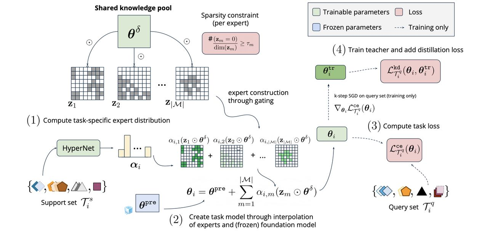

# Unleashing the Power of Meta-tuning for Few-shot Generalization Through Sparse Interpolated Experts

> Shengzhuang Chen, Jihoon Tack, Yunqiao Yang, Yee Whye Teh, Jonathan Richard Schwarz, Ying Wei
>
> ICML 2024 | [arXiv](http://arxiv.org/abs/2403.08477v3) | [Code](https://github.com/szc12153/sparse_interpolated_experts)

---

## 一句话总结

SMAT（Sparse MetA-Tuning）通过元学习稀疏插值专家的组合方式，将预训练视觉基础模型与可学习的稀疏混合专家（MoE）进行插值融合，在少量样本场景下同时提升了分布内（ID）和分布外（OOD）的泛化能力，超越了现有的元调优方法（如PMF）。

---

## 摘要翻译

近期研究表明，参数高效微调（PEFT）已成为视觉领域迁移学习的主流方法，逐渐取代了元学习等传统方法。元调优（meta-tuning）试图结合两者优势，在预训练之后引入额外的元训练阶段，但现有方法效果有限，尤其在分布外（OOD）任务上表现不佳。本文提出 SMAT（Sparse MetA-Tuning），受稀疏混合专家（MoE）启发，通过元学习自动为每个任务隔离预训练参数的子集进行调优。SMAT 成功克服了 OOD 敏感性问题，超越了参数高效微调的迁移能力。在 Meta-Dataset 及额外 OOD 数据集上，SMAT 在零样本和基于梯度的适应设置中均取得了新的最优结果。此外，本文还深入分析了学习到的稀疏模式优于手工设计模式的原因，以及稀疏度在平衡 ID 和 OOD 泛化中的关键作用。

---

## 研究动机

1. **元调优的局限性**：现有的元调优方法（如 PMF）虽然在 ID 任务上表现不错，但在 OOD 任务上性能显著下降，存在元过拟合（meta-overfitting）问题。
2. **任务干扰问题**：当元训练任务多样时，默认更新所有参数的方式会导致任务间干扰，使优化不稳定，降低泛化能力。
3. **融合基础模型与元学习的需要**：作者希望在预训练基础模型的参数高效微调和元学习的显式优化之间找到中间路线，结合两者优势。
4. **稀疏模式的启发**：之前研究发现预训练权重和微调权重之间的插值可以在 ID 和 OOD 性能之间取得平衡，启发了作者设计稀疏插值专家方法。
5. **现有 MoE 方法的不足**：传统的 MoE 方法使用离散的专家-令牌分配，导致训练不稳定；且基于启发式的手工设计稀疏模式存在偏差，不是模型无关的。

---

## 方法（技术细节）

### 核心思想

SMAT 将元调优重新定义为：一个超网络（hypernetwork）通过元学习为每个任务选择一组稀疏专家的组合，然后将这些专家与预训练模型进行插值融合，从而为每个任务定制一个强大的基础模型。

### 具体架构与流程

#### 1. 共享知识池（Shared Knowledge Pool）

- 知识池 M 由 |M| 个稀疏插值专家组成，每个专家共享一组密集参数 θ_δ，但拥有不同的可学习门控掩码 z_m（二值掩码，|z_m| = |θ_δ|）。
- 任务特定模型 θ_i 由预训练模型 θ_pre 和专家加权和组成：θ_i = θ_pre + Σ_{m=1}^{|M|} α_{i,m} (z_m ⊙ θ_δ)
- 其中 ⊙ 为逐元素乘法，α_i 为任务特定的专家合并权重。

#### 2. 稀疏专家（Sparsification of Experts）

- 通过可学习的二值掩码 z_m 实现稀疏化，z_m 由连续分布 q_{ϕ_m} 采样后经过硬校正（hard rectification）得到二值。
- 采用 stretched hard concrete 分布，支持基于重参数化的梯度优化和 CDF 的解析评估。
- 稀疏度通过拉格朗日乘子 λ 控制：1 - L0(z_m)/dim(z_m) ≥ τ_m，其中 τ_m 为目标稀疏度（设为超参数 τ）。
- 使用同时梯度下降和投影梯度上升来优化，当约束满足时重置 λ 以避免过度惩罚。

#### 3. 稀疏插值专家（Sparse Interpolated Experts）

- 不同专家共享密集参数 θ_δ（即 θ_δ_m = θ_δ, ∀m），使不同专家成为同一预训练-元训练模型之间的不同稀疏插值。
- 这种设计促进了专家间的知识转移，且允许多个任务特定的最优点在相同的预训练和元训练模型之间共存。
- 重排公式为：θ_i = θ_pre + α_{i,m}(z_m ⊙ θ_δ)，可视为学习在预训练模型和元训练模型之间的最优插值点。

#### 4. 超网络（Hypernetwork）用于元学习专家选择

- 使用预训练模型 f_{θ_pre} 将每个支持图像编码为嵌入向量。
- 将支持集嵌入聚合为类别原型，拼接后输入单个可训练 Transformer 块，输出 α'_i ∈ R^{|M|}。
- 采用 Gumbel-Sigmoid 技巧采样软激活值 ∈ (0, 1)，归一化后得到 α_i ∈ (0, 1)^{|M|}（避免 top-k 离散选择导致的训练不稳定）。

#### 5. 任务特定密集教师（Task-specific Dense Teachers）

- 在元训练的每个 episode 中，通过从 θ_i 出发对查询损失 L_{ce} 进行 K 步梯度下降（K=1 足够），动态生成教师模型 θ_tr_i。
- 知识蒸馏损失 L_{kd} 使学生模型（稀疏插值专家的混合）模仿教师（密集调制）的行为，隐式促进专家的特化与协作。
- 教师模型不限制容量（无稀疏正则化），使其具有高表达力和任务特异性。
- 梯度不从 θ_tr_i 反向传播到 θ_i，类似于自举（bootstrapping）方法。

#### 6. 推理阶段（Meta-testing）

- **梯度自由优化**：提出无需梯度的专家选择优化，将 α_i 离散化为 {0,1}^{|M|}，在二值空间中优化。
- **梯度微调**：兼容全参数微调和参数高效微调（如 LoRA），以 θ_i 为初始化，在支持集上进一步优化。

---

## 实验结果

### 数据集与设置

- **主要基准**：Meta-Dataset（MD），包含多个跨域数据集（ImageNet, Aircraft, Omniglot, CUB, DTD, Quickdraw, Fungi, VGGFlower 等）。
- **OOD 测试集**：额外引入 TrafficSig, MSCOCO, Cifar10, Cifar100, MNIST, Sketch, Pet, Clipart, Food, Cars 等 OOD 数据集。
- **骨干网络**：主要使用 DINO-ViT-Small，同时在多种 ViT 骨干（DINO Base, Sup21k Small/Base/Large）上进行实验。
- **评估方式**：使用 ProtoNet 分类器进行直接推理（无适应），以及全参数微调（Full）和 LoRA 微调。

### 主要结果（Table 1, DINO-ViT-Small 骨干）

| 设置 | ID 平均准确率 | OOD 平均准确率 |
|------|--------------|---------------|
| PMF (无适应) | 84.23% | 64.10% |
| SMAT (无适应) | **85.36%** | **67.65%** |
| PMF + Full | 84.99% | 72.73% |
| SMAT + Full | **85.84%** | **75.32%** |
| PMF + LoRA | 85.59% | 72.91% |
| SMAT + LoRA | **85.88%** | **75.02%** |

- SMAT 在无适应时 ID 平均提升 0.91%，OOD 平均提升 3.17%（相比 PMF）。
- 全参数微调下 ID 提升 0.82%，OOD 提升 2.48%。
- SMAT 是更好的开箱即用少样本学习器：在 5/8 ID 和 7/10 OOD 数据集上取得最佳无适应性能。
- SMAT 是更好的微调初始化：兼容现有微调技术，且性能最优。

### 不同 ViT 骨干的结果（Table 2）

在 DINO-ViT-Small (21M), DINO-ViT-Base (86M), Sup21k-Small (21M), Sup21k-Base (86M), Sup21k-Large (307M) 上，SMAT 均展示了优秀的性能，且更大模型通常带来更好的整体性能。

### 消融实验（Table 3）

| 组件 | MLS | META | DT | IE | ID | OOD | AVG |
|------|-----|------|----|----|----|-----|-----|
| SMAT | ✓ | ✓ | ✓ | ✓ | 85.14 | 67.27 | **75.21** |
| 无密集教师 | ✓ | ✓ | ✗ | ✓ | 85.07 | 66.44 | 74.74 |
| 无插值专家 | ✓ | ✓ | ✓ | ✗ | 84.77 | 67.02 | 74.90 |
| 无元训练 | ✓ | ✗ | ✓ | ✓ | 82.35 | 63.64 | 71.95 |
| 固定稀疏模式 | ✗ | ✓ | ✓ | ✗ | 85.21 | 66.21 | 74.75 |
| PMF | ✗ | ✗ | ✗ | ✗ | 84.23 | 64.09 | 73.05 |

- 每个组件（元学习稀疏模式 MLS、元训练 META、密集教师 DT、插值专家 IE）均有贡献。
- 学习到的稀疏模式（MLS）优于固定的稀疏模式（index 5），OOD 性能提升约 1%。
- 元训练和密集教师对 OOD 泛化尤为重要。

### 稀疏度与 ID/OOD 权衡（Fig. 3）

- 稀疏度 τ 增加时，OOD 性能提升但 ID 性能下降（稀疏度的正则化效应）。
- 更多的专家数量（|M|）通常提升 ID 和 OOD 性能，但 |M|=8→16 改善趋于饱和。

### 任务多样性的影响（Fig. 6）

- 随着元训练任务多样性的增加，PMF 和 SMAT 的整体泛化性能均提升。
- 但 PMF 在某些设置下 OOD 性能甚至不如预训练模型，而 SMAT 始终优于预训练模型和 PMF。
- SMAT 在低多样性（仅 ImageNet + Omniglot）场景下也能取得接近全 Meta-Dataset 的 OOD 性能。

### 可视化分析（Fig. 5）

- **稀疏模式**：不同层类型的稀疏度差异显著（第5-9层稀疏度低，首层高达 95%）；输入嵌入层、注意力模块的 Value、注意力和前馈模块的线性层保留更多调制参数。
- **专家特化**：不同掩码之间的重叠度较小，表明 SMAT 发现了多样化的稀疏专家。
- **任务关系**：专家选择得分的树状图清晰显示了基于领域视觉相似性的层次聚类；简单任务（如 Omniglot, DTD）的专家选择更稀疏和离散，复杂任务（如 ImageNet）更分散。

---

## 优势

1. **OOD 泛化能力强**：SMAT 有效解决了元调优在 OOD 任务上性能下降的问题，显著超越 PMF 和预训练模型的 OOD 性能。
2. **无需预设稀疏模式**：通过元学习自动学习稀疏模式，避免了手工设计（如仅在 BN 层或 MLP 层添加专家）带来的偏差。
3. **兼容性强**：与全参数微调和参数高效微调（LoRA）完全兼容，可作为更好的微调初始化。
4. **可控制的稀疏度**：通过超参数 τ 精确控制专家稀疏度，实现 ID/OOD 性能的灵活权衡。
5. **学习速度快**：相比 PMF，SMAT 在元训练中展示了显著的学习速度提升（高达 43% 加速，见 Fig. 1）。
6. **可解释性**：专家选择得分可以揭示任务之间的关系（通过树状图），提供对任务关系的可解释视角。
7. **知识共享**：共享密集参数设计促进了专家间的知识转移，同时通过稀疏掩码保持特化。
8. **使用知识蒸馏**：密集教师的引入隐式促进专家特化与协作，避免了显式正则化的优化困难。

---

## 局限

1. **计算开销**：虽然支持梯度自由优化，但元训练阶段涉及多个组件（超网络、稀疏掩码、知识蒸馏等），计算资源需求相对较高。
2. **超参数敏感性**：稀疏度 τ、专家数量 |M|、拉格朗日乘子等超参数需要仔细调优，对不同任务和数据集可能有不同的最优设置。
3. **仅在视觉领域验证**：目前主要在视觉少样本学习任务上验证，尚未扩展到 NLP、时序、生命科学等其他领域。
4. **对骨干网络的依赖**：主要实验基于 ViT 骨干，对 CNN 等其他架构的适用性有待验证。
5. **OOD 任务的定义**：OOD 任务的定义和划分依赖于 Meta-Dataset 的特定设置，是否能泛化到其他 OOD 场景需进一步研究。
6. **模型规模扩展**：虽然在不同规模的 ViT 上进行了实验，但超大规模模型（如 ViT-Large 以上）的扩展性尚未充分探索。
7. **实时性**：梯度自由优化虽然避免了反向传播，但需要在二值空间中搜索最优专家选择，可能影响推理速度。

---

## 与 EfficientPaper 相关的研究方向

1. **激活稀疏（Activation Sparsity）**：SMAT 的稀疏掩码学习本质上是一种激活稀疏方法，与 EfficientPaper 中的 activation_sparsity 关键词直接相关。该方法通过学习二值掩码来实现参数级别的稀疏化，为高效模型压缩和加速提供了新思路。
2. **参数高效微调（PEFT）**：SMAT 与 LoRA 等 PEFT 方法兼容，可作为更好的微调初始化。这与 EfficientPaper 关注的高效迁移学习方向一致。
3. **稀疏混合专家（Sparse MoE）**：SMAT 的核心创新在于将 MoE 思想应用于元学习中的参数分配，提供了轻量级的专家设计，与 EfficientPaper 中的高效模型架构设计方向相关。
4. **少样本学习（Few-shot Learning）**：SMAT 的目标是在少样本场景下提升泛化能力，与 EfficientPaper 关注的高效学习和数据效率方向一致。
5. **元学习与预训练模型的融合**：SMAT 展示了如何将元学习与基础模型结合，为 EfficientPaper 中的基础模型效率优化提供了参考。
6. **知识蒸馏**：SMAT 使用任务特定的密集教师进行知识蒸馏，促进了专家的特化与协作，与 EfficientPaper 中的模型压缩和知识迁移方向相关。
7. **分布外泛化（OOD Generalization）**：SMAT 重点解决 OOD 任务性能下降的问题，这与 EfficientPaper 关注的模型鲁棒性和泛化能力方向一致。
8. **可解释的高效模型**：SMAT 通过专家选择得分揭示任务关系，为高效模型的可解释性提供了新视角。

---

## AI 生成声明

> 本笔记由 AI Agent（Hermes Agent）基于论文 PDF 文本提取和元数据信息自动生成，使用 PyMuPDF (fitz) 提取论文全文，结合论文元数据（prototxt 格式）撰写中文总结。内容可能存在不完全准确之处，请以原始论文为准。

---

*生成时间：2026-06-05 | 笔记生成工具：Hermes Agent*
